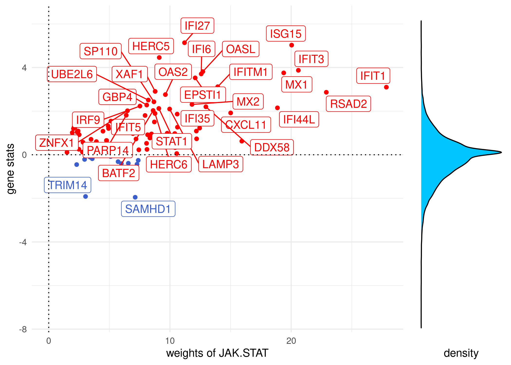
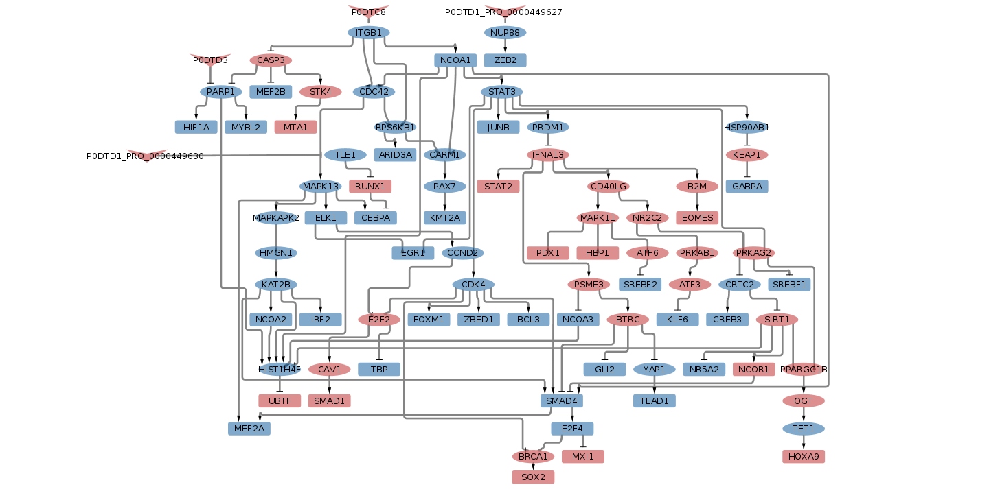
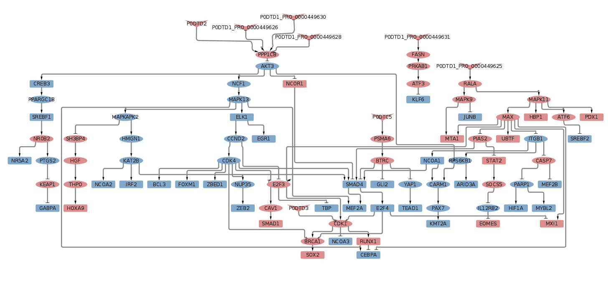

Saez Lab tools on transcriptomics from intestinal organoids treated with
Sars-CoV-2
================
Alberto Valdeolivas: <alberto.valdeolivas@bioquant.uni-heidelberg.de>;
Date:
14/07/2020

### License Info

This program is free software: you can redistribute it and/or modify it
under the terms of the GNU General Public License as published by the
Free Software Foundation, either version 3 of the License, or (at your
option) any later version.

This program is distributed in the hope that it will be useful, but
WITHOUT ANY WARRANTY; without even the implied warranty of
MERCHANTABILITY or FITNESS FOR A PARTICULAR PURPOSE. See the GNU General
Public License for more details.

Please check <http://www.gnu.org/licenses/>.

## Introduction

The present script takes the results of the differential expression
analysis on transcriptomics data from intestinal organoids treated with
Sars-CoV-2 for 60 hours and the following tools: Progeny, Dorothea and
CARNIVAL (see References).

The original transcriptomic dataset is coming from the following
publication: [Lamers et
al. 2020](https://science.sciencemag.org/content/369/6499/50).

The differential expression analysis was conducted by Martina Poletti
(<Martina.Poletti@earlham.ac.uk>)

### Getting Ready

We first load the required libraries and we define a function to export
CARNIVAL results to Cytoscpae.

``` r
library(tibble)
library(dplyr)
library(readr)
library(progeny)
library(dorothea)
library(CARNIVAL)
library(ggplot2)
library(OmnipathR)
library(biomaRt)

## We also define a function to format the CARNIVAL output to cytoscape
OutputCyto <- function(CarnivalResults, outputFile) {
    CarnivalNetwork <- 
        as.data.frame(CarnivalResults$weightedSIF, stringsAsFactors = FALSE) %>%
        dplyr::mutate(Sign = as.numeric(Sign), Weight = as.numeric(Weight)) %>% 
        dplyr::mutate(Weight = Sign * Weight) %>%
        dplyr::select(Node1, Weight, Node2)
        
    CarnivalNetworkNodes <- 
        unique(c(CarnivalNetwork$Node1,CarnivalNetwork$Node2))
    
    CarnivalAttributes <- CarnivalResults$nodesAttributes %>% 
        as.data.frame() %>%
        dplyr::filter(Node %in% CarnivalNetworkNodes) %>%
        dplyr::mutate(NodeType = as.character(NodeType)) %>%
        dplyr::mutate(NodeType=if_else(NodeType =="", "I", NodeType))
            
    nameOutputNetwork <- paste0(outputFile, "Network.sif")
    nameOutputAttributes <-  paste0(outputFile, "Attributes.txt")    
    
    write.table(CarnivalNetwork, file = nameOutputNetwork,
        quote = FALSE, row.names = FALSE, col.names = FALSE, sep = " ")
    
    write.table(CarnivalAttributes, file = nameOutputAttributes,
        quote = FALSE, row.names = FALSE, col.names = TRUE, sep = "\t")
}
```

We also read the results from the differential expression analysis:

``` r
## There are two duplicates Mar-02 and RPL21. I am going to remove them
## in a first approach
all_genes_dea <- read_csv("InputData/Clevers_degs_all.csv") %>% 
    dplyr::filter(!(Gene %in% c("Mar-02","RPL21")))
```

## Results

### Pathway activity estimation using Progeny

We first estimate the pathway activity using the Progeny package. In
particular, we compute the normalised enriched score (NES) of the
different pathways by running Progeny using the statistic from the
differential express analysis.

``` r
all_genes_dea_stat <- all_genes_dea %>% 
    dplyr::select(Gene, stat) %>% 
    dplyr::filter(!is.na(stat)) %>% 
    column_to_rownames(var = "Gene") 

pathways_zscore <- t(progeny(as.matrix(all_genes_dea_stat), 
    scale=TRUE, organism="Human", top = 100, perm = 10000, z_scores = TRUE))
colnames(pathways_zscore) <- "NES"

## I also need to run progeny in such a way to have values between 1 and -1 to
## use as CARNIVAL input
pathways_inputCarnival <- 
  t(progeny(as.matrix(all_genes_dea_stat), 
    scale=TRUE, organism="Human", top = 100, perm = 10000, z_scores = FALSE))
colnames(pathways_inputCarnival) <- "Activity"
```

We now display the normalized enrichment scores (NES) in a bar plot.

``` r
pathways_zscore_df <- as.data.frame(pathways_zscore) %>% 
    rownames_to_column(var = "Pathway") %>%
    dplyr::arrange(NES) %>%
    dplyr::mutate(Pathway = factor(Pathway))

ggplot(pathways_zscore_df,aes(x = reorder(Pathway, NES), y = NES)) + 
    geom_bar(aes(fill = NES), stat = "identity") +
    scale_fill_gradient2(low = "darkblue", high = "indianred", 
        mid = "whitesmoke", midpoint = 0) + 
    theme_minimal() +
    theme(axis.title = element_text(face = "bold", size = 12),
        axis.text.x = 
            element_text(angle = 45, hjust = 1, size =10, face= "bold"),
        axis.text.y = element_text(size =10, face= "bold"),
        panel.grid.major = element_blank(), 
        panel.grid.minor = element_blank()) +
    xlab("Pathways")
```

<!-- -->

### Transcription factor activity with Dorothea and Viper.

Now, we estimate the transcription factor (TF) activity using the
dorothea package. We select Dorothea interactions with confidence level
A, B and C.

``` r
## We load Dorothea Regulons
data(dorothea_hs, package = "dorothea")
regulons <- dorothea_hs %>%
  dplyr::filter(confidence %in% c("A", "B","C"))
```

We run Viper using the statistic from the different expression analysis.
First, we run it considering TF with at least 5 targets and with no
correction for pleiotropic regulation

``` r
all_genes_dea_stat <-  all_genes_dea %>% 
    dplyr::select(Gene, stat) %>% 
    dplyr::filter(!is.na(stat)) %>% 
    column_to_rownames(var = "Gene") %>%
    as.matrix()

tf_activities_stat <- 
    dorothea::run_viper(all_genes_dea_stat, regulons,
    options =  list(minsize = 5, eset.filter = FALSE, 
    cores = 8, verbose = FALSE, nes = TRUE))
```

We now display the top 25 normalized enrichment scores (NES) for the TF
in a bar plot.

``` r
tf_activities_top25 <- tf_activities_stat %>%
    as.data.frame() %>% 
    rownames_to_column(var = "Tf") %>%
    dplyr::rename(NES = "stat") %>%
    dplyr::top_n(25, wt = abs(NES)) %>%
    dplyr::arrange(NES) %>% 
    dplyr::mutate(Tf = factor(Tf))

ggplot(tf_activities_top25,aes(x = reorder(Tf, NES), y = NES)) + 
    geom_bar(aes(fill = NES), stat = "identity") +
    scale_fill_gradient2(low = "darkblue", high = "indianred", 
        mid = "whitesmoke", midpoint = 0) + 
    theme_minimal() +
    theme(axis.title = element_text(face = "bold", size = 12),
        axis.text.x = 
            element_text(angle = 45, hjust = 1, size =10, face= "bold"),
        axis.text.y = element_text(size =10, face= "bold"),
        panel.grid.major = element_blank(), 
        panel.grid.minor = element_blank()) +
    xlab("Transcription Factors")
```

<!-- -->

I run again Viper with a more conservative setup. The TFs need to
regulate at least 15 targets genes and I include the correction for
pleiotropic regulation

``` r
tf_activities_stat_pleitropic <- 
    dorothea::run_viper(all_genes_dea_stat, regulons,
    options =  list(minsize = 15, eset.filter = FALSE, 
    cores = 8, verbose = FALSE, nes = TRUE, pleiotropy= TRUE))

tf_activities_top25_pleitropic <- tf_activities_stat_pleitropic %>%
    as.data.frame() %>% 
    rownames_to_column(var = "Tf") %>%
    dplyr::rename(NES = "stat") %>%
    dplyr::top_n(25, wt = abs(NES)) %>%
    dplyr::arrange(NES) %>% 
    dplyr::mutate(Tf = factor(Tf))

ggplot(tf_activities_top25_pleitropic,aes(x = reorder(Tf, NES), y = NES)) + 
    geom_bar(aes(fill = NES), stat = "identity") +
    scale_fill_gradient2(low = "darkblue", high = "indianred", 
        mid = "whitesmoke", midpoint = 0) + 
    theme_minimal() +
    theme(axis.title = element_text(face = "bold", size = 12),
        axis.text.x = 
            element_text(angle = 45, hjust = 1, size =10, face= "bold"),
        axis.text.y = element_text(size =10, face= "bold"),
        panel.grid.major = element_blank(), 
        panel.grid.minor = element_blank()) +
    xlab("Transcription Factors")
```

<!-- -->

### Running CARNIVAL

We use the OmnipathR package to fetch the Omnipath database and generate
the prior knowledge network. We take the signed and directed
protein-protein interactions.

``` r
ia_omnipath <- import_omnipath_interactions() %>% as_tibble()
```

    ## Downloaded 36684 interactions.

``` r
ia_pwextra <- import_pathwayextra_interactions() %>% as_tibble()
```

    ## Downloaded 44955 interactions.

``` r
ia_kinaseextra <- import_kinaseextra_interactions() %>% as_tibble()
```

    ## Downloaded 22338 interactions.

``` r
## We bind the datasets
interactions <- as_tibble(
    bind_rows(
        ia_omnipath %>% mutate(type = 'ppi'),
        ia_pwextra %>% mutate(type = 'ppi'),
        ia_kinaseextra %>% mutate(type = 'ppi')))

signed_directed_interactions <- 
    dplyr::filter(interactions, consensus_direction==1) %>%
    filter(consensus_stimulation == 1 | consensus_inhibition == 1) %>% 
    dplyr::mutate(sign = if_else(consensus_stimulation==1,1,-1))  %>%
    dplyr::select(source_genesymbol, sign,  target_genesymbol) %>%
    dplyr::rename(source ="source_genesymbol", target ="target_genesymbol")

carnival_pkn <- signed_directed_interactions %>%
    dplyr::distinct(source, target, .keep_all = TRUE)

all_source_nodes <- unique(carnival_pkn$source)
all_target_nodes <- unique(carnival_pkn$target)
all_nodes_network <- unique(c(all_source_nodes,all_target_nodes))
```

We are going to explore the host-virus interactions from IntAct.

``` r
host_viral_interactions <- 
  read_tsv(file = "InputData/sarscov2-human_viral_ppis_Intact_June2020.txt")
```

    ## Parsed with column specification:
    ## cols(
    ##   viral_protein = col_character(),
    ##   human_protein = col_character()
    ## )

``` r
## We translate the human uniprot symbols to hgnc. 
ensembl <- useMart('ensembl', dataset="hsapiens_gene_ensembl")
# listAttributes(ensembl)
uniprot_hgnc <- 
  getBM(attributes=c("uniprotswissprot", "hgnc_symbol"),  
      filters="uniprotswissprot",
      values=unique(host_viral_interactions$human_protein), mart=ensembl)

host_viral_interactions_hgnc <- 
  dplyr::inner_join(host_viral_interactions, uniprot_hgnc, 
                    by = c("human_protein" = "uniprotswissprot"))

## These are the number of interactions: 
nrow(host_viral_interactions_hgnc)
```

    ## [1] 984

``` r
## Are these human proteins sources of any interaction in our prior knowledge
## network? Otherwise it does not make sense to include them as perturbartions 
## of the signaling. We assume that they are inhibitions hampering the regular
## signaling 
host_viral_interactions_hgnc_filter <- host_viral_interactions_hgnc %>% 
  dplyr::filter(hgnc_symbol %in% all_source_nodes) %>% 
  dplyr::select(viral_protein, hgnc_symbol) %>% 
  dplyr::distinct() %>% 
  dplyr::mutate(sign = -1) %>% 
  dplyr::rename(source = "viral_protein", target = "hgnc_symbol") %>%
  dplyr::select(source, sign, target)
```

We finally merge the virus-host interactions with our prior knowledge
network and we define the viral proteins as perturbations. We also
prepare TF activity scores and progeny weights. In particular, we are
going to select the top 50 TFs when running viper with the pleitropic
correction and the TFs should have at least 15 targets.

``` r
## Prior Knowledge Network
carnival_pkn_hostvirus <- 
  bind_rows(carnival_pkn, host_viral_interactions_hgnc_filter)

## Perturbation (Viral proteins are active)
viral_proteins <- unique(host_viral_interactions_hgnc_filter$source)
viral_proteins_perturbation <- 
  data.frame(viral_proteins = viral_proteins, sign = 1) %>% 
  tibble::column_to_rownames(var = "viral_proteins") %>%
  t() %>% as.data.frame()

## Top TFs
tf_top50_pleitropic <- tf_activities_stat_pleitropic %>%
  as.data.frame() %>% 
  rownames_to_column(var = "TF") %>%
  dplyr::filter(TF %in% all_nodes_network) %>% 
  dplyr::rename(NES = "stat") %>%
  dplyr::top_n(50, wt = abs(NES)) %>%
  dplyr::arrange(NES) %>%
  tibble::column_to_rownames(var = "TF")  %>%
  t() %>% as.data.frame()

## Progeny Weigths
progeny_weigths <- pathways_inputCarnival %>% t() 
```

And we run CARNIVAL:

``` r
carnival_results_top50tf_pleitropic_minsize15 <-runCARNIVAL(
    solverPath="/opt/ibm/ILOG/CPLEX_Studio129/cplex/bin/x86-64_linux/cplex",
    netObj=carnival_pkn_hostvirus,
    measObj=tf_top50_pleitropic,
    inputObj = viral_proteins_perturbation,
    # dir_name="Carnival_Results",
    weightObj=progeny_weigths,
    # nodeID = 'gene',
    timelimit = 7200,
    solver = "cplex")
saveRDS(carnival_results_top50tf_pleitropic_minsize15, 
    file = "Carnival_Results/carnival_results_top50tf_pleitropic_minsize15.rds")
OutputCyto(carnival_results_top50tf_pleitropic_minsize15, 
    outputFile="Carnival_Results/carnival_results_top50tf_pleitropic_minsize15")
```

<br><br>

<br><br>

I am also going to run CARNIVAL by assuming that the virus-host protein
interactions are activatory.

``` r
host_viral_interactions_hgnc_filter_viralActivation <- 
  host_viral_interactions_hgnc_filter %>%
  dplyr::mutate(sign = 1) 

## Prior Knowledge Network
carnival_pkn_hostvirus <- 
  bind_rows(carnival_pkn, host_viral_interactions_hgnc_filter_viralActivation)

carnival_results_top50tf_pleitropic_minsize15_activation <-runCARNIVAL(
    solverPath="/opt/ibm/ILOG/CPLEX_Studio129/cplex/bin/x86-64_linux/cplex",
    netObj=carnival_pkn_hostvirus,
    measObj=tf_top50_pleitropic,
    inputObj = viral_proteins_perturbation,
    # dir_name="Carnival_Results",
    weightObj=progeny_weigths,
    # nodeID = 'gene',
    timelimit = 7200,
    solver = "cplex")
saveRDS(carnival_results_top50tf_pleitropic_minsize15_activation, 
    file = "Carnival_Results/carnival_results_top50tf_pleitropic_minsize15_activation.rds")
OutputCyto(carnival_results_top50tf_pleitropic_minsize15_activation, 
    outputFile="Carnival_Results/carnival_results_top50tf_pleitropic_minsize15_activation")
```

<br><br>

<br><br>

## Important References

**Progeny** publication:

> Schubert M, Klinger B, Klünemann M, Sieber A, Uhlitz F, Sauer S,
> Garnett MJ, Blüthgen N, Saez-Rodriguez J. “Perturbation-response genes
> reveal signaling footprints in cancer gene expression.” *Nature
> Communications*:
> [10.1038/s41467-017-02391-6](https://doi.org/10.1038/s41467-017-02391-6)

> Holland CH, Szalai B, Saez-Rodriguez J. “Transfer of regulatory
> knowledge from human to mouse for functional genomics analysis.”
> *Biochimica et Biophysica Acta (BBA) - Gene Regulatory Mechanisms.*
> 2019. DOI:
> [10.1016/j.bbagrm.2019.194431](https://doi.org/10.1016/j.bbagrm.2019.194431).

**Dorothea** publication:

> Garcia-Alonso L, Holland CH, Ibrahim MM, Turei D, Saez-Rodriguez J.
> “Benchmark and integration of resources for the estimation of human
> transcription factor activities.” *Genome Research.* 2019. DOI:
> [10.1101/gr.240663.118](https://doi.org/10.1101/gr.240663.118).

**CARNIVAL** publication:

> Liu A., Trairatphisan P., Gjerga E. et al. [From expression footprints
> to causal pathways: contextualizing large signaling networks with
> CARNIVAL](https://www.nature.com/articles/s41540-019-0118-z) *npj
> Systems Biology and Applications* volume 5, Article number: 40 (2019)
> (equal contributions).

**Organoid Transcriptomics data** related publication:

> MART M. LAMERS, JOEP BEUMER, JELTE VAN DER VAART, KÈVIN KNOOPS, JENS
> PUSCHHOF, TIM I. BREUGEM, RAIMOND B. G. RAVELLI, J. PAUL VAN SCHAYCK,
> ANNA Z. MYKYTYN, HANS Q. DUIMEL, ELLY VAN DONSELAAR, SAMRA RIESEBOSCH,
> HELMA J. H. KUIJPERS, DEBBY SCHIPPER, WILLINE J. VAN DE WETERING,
> MIRANDA DE GRAAF, MARION KOOPMANS, EDWIN CUPPEN, PETER J. PETERS, BART
> L. HAAGMANS, HANS CLEVERS [SARS-CoV-2 productively infects human gut
> enterocytes](https://science.sciencemag.org/content/369/6499/50),
> *Science* July 202.

## Session Info Details

    ## R version 4.0.1 (2020-06-06)
    ## Platform: x86_64-pc-linux-gnu (64-bit)
    ## Running under: Ubuntu 19.10
    ## 
    ## Matrix products: default
    ## BLAS:   /usr/lib/x86_64-linux-gnu/openblas/libblas.so.3
    ## LAPACK: /usr/lib/x86_64-linux-gnu/libopenblasp-r0.3.7.so
    ## 
    ## locale:
    ##  [1] LC_CTYPE=en_GB.UTF-8       LC_NUMERIC=C              
    ##  [3] LC_TIME=en_GB.UTF-8        LC_COLLATE=en_GB.UTF-8    
    ##  [5] LC_MONETARY=en_GB.UTF-8    LC_MESSAGES=en_GB.UTF-8   
    ##  [7] LC_PAPER=en_GB.UTF-8       LC_NAME=C                 
    ##  [9] LC_ADDRESS=C               LC_TELEPHONE=C            
    ## [11] LC_MEASUREMENT=en_GB.UTF-8 LC_IDENTIFICATION=C       
    ## 
    ## attached base packages:
    ## [1] stats     graphics  grDevices utils     datasets  methods   base     
    ## 
    ## other attached packages:
    ##  [1] biomaRt_2.44.0  OmnipathR_1.3.2 jsonlite_1.6.1  igraph_1.2.5   
    ##  [5] ggplot2_3.3.1   CARNIVAL_1.0.1  dorothea_1.0.0  progeny_1.11.1 
    ##  [9] readr_1.3.1     dplyr_1.0.0     tibble_3.0.1   
    ## 
    ## loaded via a namespace (and not attached):
    ##  [1] segmented_1.1-0      Category_2.54.0      bitops_1.0-6        
    ##  [4] bit64_0.9-7          doParallel_1.0.15    progress_1.2.2      
    ##  [7] httr_1.4.1           tools_4.0.1          R6_2.4.1            
    ## [10] KernSmooth_2.23-17   DBI_1.1.0            BiocGenerics_0.34.0 
    ## [13] colorspace_1.4-1     withr_2.2.0          tidyselect_1.1.0    
    ## [16] gridExtra_2.3        prettyunits_1.1.1    bit_1.1-15.2        
    ## [19] curl_4.3             compiler_4.0.1       graph_1.66.0        
    ## [22] Biobase_2.48.0       labeling_0.3         scales_1.1.1        
    ## [25] genefilter_1.70.0    RBGL_1.64.0          askpass_1.1         
    ## [28] rappdirs_0.3.1       stringr_1.4.0        digest_0.6.25       
    ## [31] mixtools_1.2.0       rmarkdown_2.2        pkgconfig_2.0.3     
    ## [34] htmltools_0.4.0      bcellViper_1.24.0    dbplyr_1.4.4        
    ## [37] rlang_0.4.6          RSQLite_2.2.0        generics_0.0.2      
    ## [40] farver_2.0.3         viper_1.22.0         RCurl_1.98-1.2      
    ## [43] magrittr_1.5         Matrix_1.2-18        Rcpp_1.0.4.6        
    ## [46] munsell_0.5.0        S4Vectors_0.26.1     lifecycle_0.2.0     
    ## [49] stringi_1.4.6        yaml_2.2.1           UniProt.ws_2.28.0   
    ## [52] MASS_7.3-51.6        BiocFileCache_1.12.0 grid_4.0.1          
    ## [55] blob_1.2.1           parallel_4.0.1       ggrepel_0.8.2       
    ## [58] crayon_1.3.4         lattice_0.20-41      splines_4.0.1       
    ## [61] annotate_1.66.0      hms_0.5.3            knitr_1.28          
    ## [64] pillar_1.4.4         codetools_0.2-16     lpSolve_5.6.15      
    ## [67] stats4_4.0.1         XML_3.99-0.3         glue_1.4.1          
    ## [70] evaluate_0.14        vctrs_0.3.1          foreach_1.5.0       
    ## [73] gtable_0.3.0         openssl_1.4.1        purrr_0.3.4         
    ## [76] tidyr_1.1.0          kernlab_0.9-29       assertthat_0.2.1    
    ## [79] xfun_0.14            xtable_1.8-4         e1071_1.7-3         
    ## [82] class_7.3-17         survival_3.1-12      iterators_1.0.12    
    ## [85] AnnotationDbi_1.50.0 memoise_1.1.0        IRanges_2.22.2      
    ## [88] ellipsis_0.3.1       GSEABase_1.50.1
