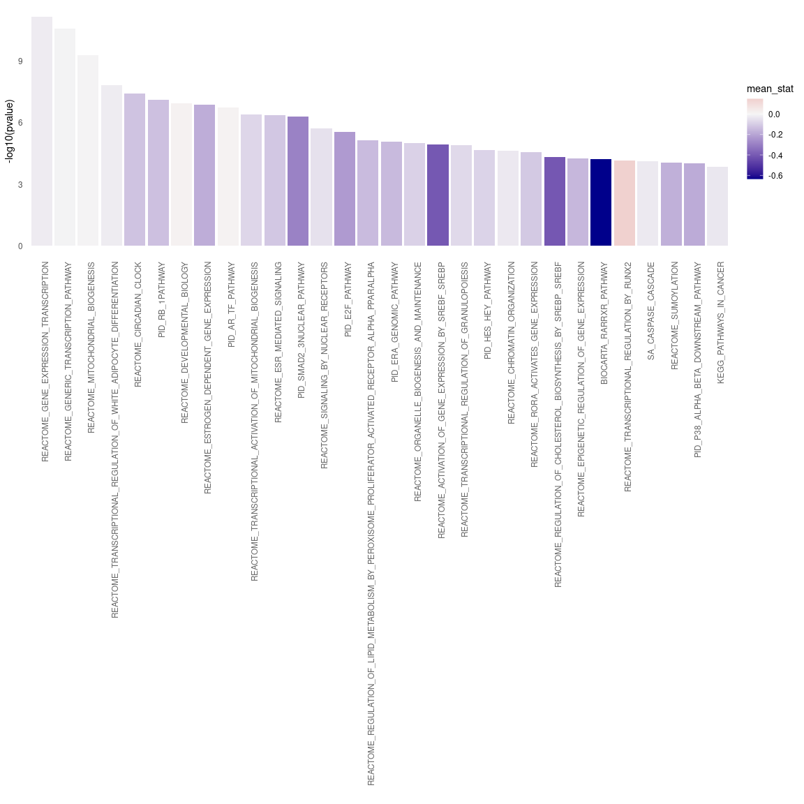

Analysis of CARNIVAL results
================
Alberto Valdeolivas: <alberto.valdeolivas@bioquant.uni-heidelberg.de>;
Date:
16/07/2020

### License Info

This program is free software: you can redistribute it and/or modify it
under the terms of the GNU General Public License as published by the
Free Software Foundation, either version 3 of the License, or (at your
option) any later version.

This program is distributed in the hope that it will be useful, but
WITHOUT ANY WARRANTY; without even the implied warranty of
MERCHANTABILITY or FITNESS FOR A PARTICULAR PURPOSE. See the GNU General
Public License for more details.

Please check <http://www.gnu.org/licenses/>.

## Introduction

The present script takes the CARNIVAL results inferred from
transcriptomics data from intestinal organoids treated with Sars-CoV-2
for 60 hours and makes some enrichment analysis and clustering.

The original transcriptomic dataset is coming from the following
publication: [Lamers et
al. 2020](https://science.sciencemag.org/content/369/6499/50).

The differential expression analysis was conducted by Martina Poletti
(<Martina.Poletti@earlham.ac.uk>)

## Getting Ready

### Libraries and functions

We first load the required libraries and some important functions to
analyse CARNiVAL output.

``` r
library(readr)
library(fgsea)
library(dplyr)
library(ggplot2)
library(piano)
library(tidyr)
library(ggsci)
library(igraph)
library(gprofiler2)
library(plotly)

## Function to extract the nodes that appear in CARNIVAL network and the 
## background genes (all genes present in the prior knowledge network).
## It returns a list with two objects: the success and the background genes.
extractCARNIVALnodes <- function(CarnivalResults){

    CarnivalNetwork <- 
        as.data.frame(CarnivalResults$weightedSIF, stringsAsFactors = FALSE)
    
    colnames(CarnivalNetwork) <- c("source", "sign", "target", "Weight")

    ## We define the set of nodes interesting for our condition
    sucesses <- unique(c(gsub("_.*","",CarnivalNetwork$source), 
        gsub("_.*","",CarnivalNetwork$target)))

    CarnivalAttributes <- as.data.frame(CarnivalResults$nodesAttributes, 
        stringsAsFactors = FALSE)

    ## We define the background as all the genes in our prior knowledge network.
    bg <- unique(gsub("_.*","",CarnivalAttributes$Node))     
    
    return(list(sucesses = sucesses, bg= bg))
}

### Function to print a barplot with the enriched pathways.
BarplotEnrichment <- function(PathwaysSelect, Interesting_pathways){ 
    
    p <- ggplot(PathwaysSelect, aes(x = reorder(pathway, pvalue), 
            y = -log10(pvalue))) + 
        geom_bar(aes(fill = mean_stat), stat = "identity") +
        scale_fill_gradient2(low = "darkblue", high = "indianred", 
            mid = "whitesmoke", midpoint = 0) + 
        theme_minimal() +
        theme(axis.text.x = element_text(angle = 90, hjust = 1, 
            colour = ifelse(levels(reorder(PathwaysSelect$pathway, 
                PathwaysSelect$pvalue)) %in% Interesting_pathways, 
                "red", "grey40"),
            face = ifelse(levels(reorder(PathwaysSelect$pathway, 
                PathwaysSelect$pvalue)) %in% Interesting_pathways, 
                "bold", "plain")),
        panel.grid.major = element_blank(), 
        panel.grid.minor = element_blank()) + 
        xlab("")
    return(p)
}    
```

### Reading CARNIVAL results

We then read the CARNIVAL results generated in the previous script. We
define two different gene sets in order tor conduct the enrichment. The
first set contains the nodes that appear in the CARNIVAL output and are
therefore relevant in the context of our input transcriptomic data. The
second set contains all the genes in our prior knowledge network which
are used as the backgroud.

``` r
carnival_results_inhibition <- 
    readRDS("Carnival_Results/carnival_results_top50tf_pleitropic_minsize15.rds")
nodes_carnival_inhibition <- extractCARNIVALnodes(carnival_results_inhibition)

carnival_results_activation <- 
    readRDS("Carnival_Results/carnival_results_top50tf_pleitropic_minsize15_activation.rds")
nodes_carnival_activation <- extractCARNIVALnodes(carnival_results_activation)

carnival_results_undefined <- 
    readRDS("Carnival_Results/carnival_results_top50tf_pleitropic_minsize15_undefinedEffect.rds")
nodes_carnival_undefined <- extractCARNIVALnodes(carnival_results_undefined)
```

### Reading Pathway data sets from MSigDB

We downloaded from MSigDB <https://www.gsea-msigdb.org/> the following
dataset: c2.cp.v7.0.symbols.gmt. It contains several pathways from
different resources and the genes that are known to be involved in those
pathways.

``` r
Pathway_signatures <- loadGSC("InputData/c2.cp.v7.0.symbols.gmt")
```

### Reading and formatting statistic from DEG

We read the results from the differential expression analysis. The
statistic of the genes will be mapped later on in the different
significant pathways. Maybe, this is not very informative in this
context.

``` r
DEA_results <- read_csv("InputData/Clevers_degs_all.csv") %>%
   dplyr::select(Gene, stat)
```

    ## Parsed with column specification:
    ## cols(
    ##   Gene = col_character(),
    ##   baseMean = col_double(),
    ##   log2FoldChange = col_double(),
    ##   lfcSE = col_double(),
    ##   stat = col_double(),
    ##   pvalue = col_double(),
    ##   padj = col_double()
    ## )

``` r
mean_stat <- unlist(lapply(Pathway_signatures$gsc, function(x, DEA_results) {
    genes_matching <- x[which(x %in% DEA_results$Gene)]
    mean_genes <- dplyr::filter(DEA_results, Gene %in% genes_matching) %>%
        dplyr::pull(stat) %>% mean(na.rm = TRUE)
    return(mean_genes)
}, DEA_results = DEA_results)) %>% 
    as.data.frame() %>% 
    tibble::rownames_to_column(var = "pathway") %>%
    dplyr::rename(mean_stat = ".")

### Trying with Carnival node activity
carnival_avg_node_act <- carnival_results_inhibition$nodesAttributes %>% 
    as.data.frame() %>%
    dplyr::mutate(AvgAct = as.numeric(AvgAct))

mean_stat_carni <- 
    unlist(lapply(Pathway_signatures$gsc, function(x, carnival_avg_node_act) {
    genes_matching <- x[which(x %in% carnival_avg_node_act$Node)]
    mean_genes <- dplyr::filter(carnival_avg_node_act, Node %in% genes_matching) %>%
        dplyr::pull(AvgAct) %>% mean(na.rm = TRUE)
    return(mean_genes)
}, carnival_avg_node_act = carnival_avg_node_act)) %>% 
    as.data.frame() %>% 
    tibble::rownames_to_column(var = "pathway") %>%
    dplyr::rename(mean_stat = ".")
```

### Performing Enrichment Analysis and plotting the Results

Using the Piano R package, we run a gene set analysis (GSA) based on a
list of significant genes (CARNIVAL nodes) and a gene set collection
(background). It uses Fisher’s exact test.

First for CARNIVAL results when we assume that the viral-host proteins
interactions are inhibitory:

``` r
hyper_results_inhibition <- 
    runGSAhyper(genes = nodes_carnival_inhibition$sucesses, 
        # pvalues = rep(0,length(nodes_carnival_inhibition$sucesses)),
        pcutoff = 0.01, 
        universe = nodes_carnival_inhibition$bg, gsc = Pathway_signatures,
        gsSizeLim = c(4,Inf), adjMethod = "fdr")
```

    ## Warning in runGSAhyper(genes = nodes_carnival_inhibition$sucesses, pcutoff
    ## = 0.01, : there are genes in gsc that are not in the universe, these will be
    ## removed before analysis

    ## Analyzing the overrepresentation of 85 genes of interest in 2054 gene sets, using a background of 6811 non-interesting genes.

``` r
enriched_pathways_inhibition <- hyper_results_inhibition$resTab %>% 
    as.data.frame() %>% 
    tibble::rownames_to_column(var = "pathway") %>% 
    as_tibble() %>% 
    dplyr::filter(`Adjusted p-value` <= 0.01) %>% 
    dplyr::inner_join(mean_stat) %>% 
    dplyr::select(pathway, `p-value`, `Adjusted p-value`, mean_stat) %>%
    dplyr::rename(pvalue = `p-value`, AdjPvalu = `Adjusted p-value`) %>% 
    dplyr::mutate(pathway = as.factor(pathway))
```

    ## Joining, by = "pathway"

``` r
interesting_pathways_inhibition <- c()

p_inhibition <- BarplotEnrichment(enriched_pathways_inhibition, 
    interesting_pathways_inhibition)
```

<!-- -->

Then, for CARNIVAL when we assume that the viral-host proteins
interactions are stimulations:

``` r
hyper_results_activation <- 
    runGSAhyper(genes = nodes_carnival_activation$sucesses, 
        # pvalues = rep(0,length(nodes_carnival_activation$sucesses)),
        pcutoff = 0.01, 
        universe = nodes_carnival_activation$bg, gsc = Pathway_signatures,
        gsSizeLim = c(4,Inf), adjMethod = "fdr")
```

    ## Warning in runGSAhyper(genes = nodes_carnival_activation$sucesses, pcutoff
    ## = 0.01, : there are genes in gsc that are not in the universe, these will be
    ## removed before analysis

    ## Analyzing the overrepresentation of 86 genes of interest in 2054 gene sets, using a background of 6810 non-interesting genes.

``` r
enriched_pathways_activation <- hyper_results_activation$resTab %>% 
    as.data.frame() %>% 
    tibble::rownames_to_column(var = "pathway") %>% 
    as_tibble() %>% 
    dplyr::filter(`Adjusted p-value` <= 0.01) %>% 
    dplyr::inner_join(mean_stat) %>% 
    dplyr::select(pathway, `p-value`, `Adjusted p-value`, mean_stat) %>%
    dplyr::rename(pvalue = `p-value`, AdjPvalu = `Adjusted p-value`) %>% 
    dplyr::mutate(pathway = as.factor(pathway))
```

    ## Joining, by = "pathway"

``` r
interesting_pathways_activation <- c()

p_activation <- BarplotEnrichment(enriched_pathways_activation, 
    interesting_pathways_activation)
```

<!-- -->

Then, for CARNIVAL when we assume that the viral-host proteins
interactions are undefined and we let CARNIVAL infer the effect: (Note:
For visualization purposes, we reduce here the significant p-value to
0.0001)

``` r
hyper_results_undefined <- 
    runGSAhyper(genes = nodes_carnival_undefined$sucesses, 
        # pvalues = rep(0,length(nodes_carnival_activation$sucesses)),
        pcutoff = 0.01, 
        universe = nodes_carnival_undefined$bg, gsc = Pathway_signatures,
        gsSizeLim = c(4,Inf), adjMethod = "fdr")
```

    ## Warning in runGSAhyper(genes = nodes_carnival_undefined$sucesses, pcutoff =
    ## 0.01, : there are genes in gsc that are not in the universe, these will be
    ## removed before analysis

    ## Analyzing the overrepresentation of 141 genes of interest in 2054 gene sets, using a background of 6741 non-interesting genes.

``` r
enriched_pathways_undefined <- hyper_results_undefined$resTab %>% 
    as.data.frame() %>% 
    tibble::rownames_to_column(var = "pathway") %>% 
    as_tibble() %>% 
    dplyr::filter(`Adjusted p-value` <= 0.0001) %>% 
    dplyr::inner_join(mean_stat) %>% 
    dplyr::select(pathway, `p-value`, `Adjusted p-value`, mean_stat) %>%
    dplyr::rename(pvalue = `p-value`, AdjPvalu = `Adjusted p-value`) %>% 
    dplyr::mutate(pathway = as.factor(pathway))
```

    ## Joining, by = "pathway"

``` r
interesting_pathways_undefined <- c()

p_undefined <- BarplotEnrichment(enriched_pathways_undefined, 
    interesting_pathways_undefined)
```

<!-- -->

### Comparing Enrichment between activation and inhibition

Now I compare the enriched pathways that change the most between both
assumptions: host-viral interactions are inhibitory or stimulatory.

``` r
results_activation <-   hyper_results_activation$resTab %>% 
    as.data.frame() %>% 
    tibble::rownames_to_column(var = "pathway") %>% 
    as_tibble() %>% 
    dplyr::mutate(LogpValue_activation = -log(`p-value`), 
        p_value_activation = `p-value`) %>% 
    dplyr::select(pathway, p_value_activation, LogpValue_activation) 

results_inhibition <-   hyper_results_inhibition$resTab %>% 
    as.data.frame() %>% 
    tibble::rownames_to_column(var = "pathway") %>% 
    as_tibble() %>% 
    dplyr::mutate(LogpValue_inhibition = -log(`p-value`), 
        p_value_inhibition = `p-value`) %>% 
    dplyr::select(pathway, p_value_inhibition, LogpValue_inhibition) 

results_join <- 
    dplyr::inner_join(results_activation, results_inhibition) %>% 
    dplyr::filter(p_value_activation < 0.05 | p_value_inhibition < 0.05) %>% 
    dplyr::mutate(diff = LogpValue_activation - LogpValue_inhibition) %>% 
    dplyr::top_n(15, wt = abs(diff)) %>% 
    dplyr::arrange(desc(abs(diff)))
```

    ## Joining, by = "pathway"

``` r
results_join_longer <- results_join %>% 
    dplyr::select(pathway, diff, LogpValue_activation, LogpValue_inhibition) %>% 
    dplyr::rename(activation = "LogpValue_activation", 
        inhibition = "LogpValue_inhibition") %>% 
    pivot_longer(-c(pathway,diff), values_to = "LogPvalue", 
        names_to = "Interaction")  
    
point_plot_activation_vs_inhibtion <- 
    ggplot(results_join_longer, aes(reorder(pathway, abs(diff)), LogPvalue)) + 
    geom_point(aes(color = Interaction), size = 3) + 
    coord_flip() + 
    theme_minimal() + 
    theme(legend.position = "bottom",  legend.justification = "center") +
    scale_color_lancet() +
    theme(axis.text.x = element_text(hjust = 1, size =8.5),
        axis.text.y = element_text(size = 7),
        panel.grid.minor = element_blank()) + 
    xlab("Pathways") + ylab("-Log (p-value)") +
    geom_hline(yintercept = -log(0.05), linetype="dashed", 
                color = "#2F4F4F", size=0.5)
```

``` r
point_plot_activation_vs_inhibtion
```

<!-- -->

### Clustering of CARNIVAL solution and enrichment.

For the clustering part, we are going to take our CARNIVAL results when
the effect of the viral proteins on the host proteins is undefined. We
first convert our CARNIVAL output network into an igraph object. Then,
we perform different types of clustering and select the one with the
largest modularity for further analysis.

``` r
carnival_results_igraph <- carnival_results_undefined$weightedSIF %>%
    as.data.frame() %>% dplyr::select(-Sign) %>% 
    dplyr::rename(weight = "Weight") %>% 
    igraph::graph_from_data_frame(directed = FALSE)

c_edgeBetweeness <- 
    cluster_edge_betweenness(carnival_results_igraph)

c_FastGreedy <- 
    cluster_fast_greedy(carnival_results_igraph, 
    merges = TRUE, 
    modularity = TRUE, 
    membership = TRUE, 
    weights = E(carnival_results_igraph)$weight)

c_Infomap <- 
    cluster_infomap(carnival_results_igraph, 
    e.weights =  E(carnival_results_igraph)$weight, 
    v.weights = NULL, nb.trials = 10, modularity = TRUE)

c_labelProp <- 
    cluster_label_prop(carnival_results_igraph, 
    weights = E(carnival_results_igraph)$weight)

c_leadingEig <- 
    cluster_leading_eigen(carnival_results_igraph, 
    weights = E(carnival_results_igraph)$weight)

c_Louvain<- 
    cluster_louvain(carnival_results_igraph, 
    weights = E(carnival_results_igraph)$weight)

c_walktrap <- 
    cluster_walktrap(carnival_results_igraph, 
    weights = E(carnival_results_igraph)$weight, 
    steps = 4, merges = TRUE, modularity = TRUE, membership = TRUE)

modularity_df <- data.frame(method = c("EdgeBetweeness", "FastGreedy", 
    "Infomap","LabelPropagation","LeadingEigenvector", "Louvain","Walktrap"), 
    modularity = c(max(c_edgeBetweeness$modularity), 
                   max(c_FastGreedy$modularity), 
                   max(c_Infomap$modularity), 
                   max(c_labelProp$modularity),
                   max(c_leadingEig$modularity),
                   max(c_Louvain$modularity),
                   max(c_walktrap$modularity))) %>% 
    dplyr::arrange(desc(modularity))
modularity_df
```

    ##               method modularity
    ## 1         FastGreedy  0.6792753
    ## 2            Louvain  0.6736467
    ## 3            Infomap  0.6503754
    ## 4   LabelPropagation  0.6467196
    ## 5 LeadingEigenvector  0.6427823
    ## 6     EdgeBetweeness  0.6185302
    ## 7           Walktrap  0.6021636

We then selected the communities generated by the Fast Greedy method. We
will perform enrichment analysis on them.

``` r
## Number of genes in the different communities. 
table(c_FastGreedy$membership)
```

    ## 
    ##  1  2  3  4  5  6  7  8  9 10 11 12 13 
    ## 16 16 26 15 14 15 13  5  6  5  4  3  3

``` r
## We perform an Enrichment Analysis for each Community: 
n <- length(unique(c_FastGreedy$membership))
gene_communities <- 
    data.frame(Gene = c_FastGreedy$names, Community = c_FastGreedy$membership)
p <- list()

for (i in seq_len(n)){
    current_genes <- dplyr::filter(gene_communities, Community==i) %>%
        dplyr::pull(Gene)
    current_result <- gost(current_genes, user_threshold = 0.01, 
        correction_method = "fdr", custom_bg = nodes_carnival_undefined$bg,
        sources = c("GO","KEGG","REAC","WP")) 
    if (!is.null(current_result)){
        #currentfile <- 
        #    paste0("02_analysis_carnival_results_files/figure-gfm/enrichment_cluster_", i, ".png")
        p[[i]] <- gostplot(current_result, capped = FALSE, interactive = TRUE)

    }
}
```

We finally show the enrichment results for the different clusters. One
can find in the following link the CARNIVAL output network with the
different clusters grouped along with the most significantly enriched
processes:

<https://github.com/saezlab/Covid_IntestinalOrganoids/blob/master/Carnival_Results/carnival_results_top50tf_pleitropic_minsize15_undefinedEffectNetwork_Clusters.pdf>

Some of the most interesting results are the following:

  - Cluster 2 is enriched in the signaling of the TGF beta pathway.
    Potential treatments blocking this pathway have been proposed
    againts Covid-19.

  - Cluster 3 is enriched in the hedgehog signaling pathway.The majority
    of the proteins in this cluster are unactive.

  - Cluster 5 is enriched in cell cycle arrest. Some studies have
    suggested the arrest of the cell cycle after SARS-CoV-2 infection.

  - Cluster 6 is enriched in the androgen receptor signaling pathway.
    There are some studies suggesting that high levels of androgens
    might increase the risk of severe infection and death from COVID-19.

  - Cluster 10 is enriched in interteron signaling.

Enrichment Cluster 1:

``` r
dplyr::filter(gene_communities, Community == 1) %>% dplyr::pull(Gene)
```

    ##  [1] "STAT3"  "PAX7"   "CARM1"  "ELK1"   "TOPBP1" "EGR1"   "CCND2"  "PRPF4B"
    ##  [9] "ATR"    "CCNA2"  "JUNB"   "RBPJ"   "KMT2A"  "GTF2A2" "CRTC2"  "CDKN2D"

``` r
p[[1]] 
```

<!--html_preserve-->

<div id="htmlwidget-5f718b78c6fe8ab30e55" class="plotly html-widget" style="width:800px;height:700px;">

</div>

<script type="application/json" data-for="htmlwidget-5f718b78c6fe8ab30e55">{"x":{"data":[{"x":[84.8391602123727,83.0799681242932,97.4968481539667,160.045506883247,162.664827094875,116.925832804808,144.708325157597,117.067417681113,117.095734656373,124.51832179662,75.7883469946278,118.897402207344,77.6785050932886,103.68410724846,138.03967748367,155.879371897997,103.669948760829,81.1154779655727,81.936670248137,103.701805357998,89.500842264688,91.8476115894298,124.281167128811,85.069235636367,155.886451141812,83.9896509545476,97.4862292882439,84.255122597618,112.862346854878,76.4856525104259],"y":[3.1832393873805,3.1832393873805,3.1832393873805,3.1832393873805,3.1832393873805,3.1832393873805,3.1832393873805,3.1832393873805,3.1832393873805,3.07111204373181,2.91129821791,2.80866001532303,2.77445251026465,2.64330677820115,2.64330677820115,2.64330677820115,2.51004367934065,2.47383626826576,2.32619435506543,2.32619435506543,2.28973682112337,2.28696089927652,2.27201991001505,2.23964509754291,2.20706674656918,2.16750823968406,2.10915456283768,2.06612260002331,2.04686631493466,2.03681503289931],"text":["GO:0010557 (1297) <br> positive regulation of macromolecule biosynthetic process <br> 6.558e-04","GO:0009891 (1376) <br> positive regulation of biosynthetic process <br> 6.558e-04","GO:0031328 (1361) <br> positive regulation of cellular biosynthetic process <br> 6.558e-04","GO:1902680 (1125) <br> positive regulation of RNA biosynthetic process <br> 6.558e-04","GO:1903508 (1125) <br> positive regulation of nucleic acid-templated transcription <br> 6.558e-04","GO:0045893 (1066) <br> positive regulation of transcription, DNA-templated <br> 6.558e-04","GO:0090304 (2544) <br> nucleic acid metabolic process <br> 6.558e-04","GO:0045935 (1274) <br> positive regulation of nucleobase-containing compound metabolic process <br> 6.558e-04","GO:0045944 (854) <br> positive regulation of transcription by RNA polymerase II <br> 6.558e-04","GO:0051254 (1166) <br> positive regulation of RNA metabolic process <br> 8.490e-04","GO:0006139 (2737) <br> nucleobase-containing compound metabolic process <br> 1.227e-03","GO:0046483 (2799) <br> heterocycle metabolic process <br> 1.554e-03","GO:0006725 (2830) <br> cellular aromatic compound metabolic process <br> 1.681e-03","GO:0034645 (2439) <br> cellular macromolecule biosynthetic process <br> 2.273e-03","GO:0071480 (25) <br> cellular response to gamma radiation <br> 2.273e-03","GO:1901360 (2928) <br> organic cyclic compound metabolic process <br> 2.273e-03","GO:0034641 (3008) <br> cellular nitrogen compound metabolic process <br> 3.090e-03","GO:0009059 (2536) <br> macromolecule biosynthetic process <br> 3.359e-03","GO:0009314 (334) <br> response to radiation <br> 4.719e-03","GO:0034654 (2192) <br> nucleobase-containing compound biosynthetic process <br> 4.719e-03","GO:0018130 (2218) <br> heterocycle biosynthetic process <br> 5.132e-03","GO:0019438 (2228) <br> aromatic compound biosynthetic process <br> 5.165e-03","GO:0051173 (2243) <br> positive regulation of nitrogen compound metabolic process <br> 5.345e-03","GO:0010628 (1543) <br> positive regulation of gene expression <br> 5.759e-03","GO:1901362 (2288) <br> organic cyclic compound biosynthetic process <br> 6.208e-03","GO:0010212 (117) <br> response to ionizing radiation <br> 6.800e-03","GO:0031325 (2348) <br> positive regulation of cellular metabolic process <br> 7.778e-03","GO:0010332 (48) <br> response to gamma radiation <br> 8.588e-03","GO:0043970 (9) <br> histone H3-K9 acetylation <br> 8.977e-03","GO:0006357 (1342) <br> regulation of transcription by RNA polymerase II <br> 9.187e-03"],"key":["GO:0010557","GO:0009891","GO:0031328","GO:1902680","GO:1903508","GO:0045893","GO:0090304","GO:0045935","GO:0045944","GO:0051254","GO:0006139","GO:0046483","GO:0006725","GO:0034645","GO:0071480","GO:1901360","GO:0034641","GO:0009059","GO:0009314","GO:0034654","GO:0018130","GO:0019438","GO:0051173","GO:0010628","GO:1901362","GO:0010212","GO:0031325","GO:0010332","GO:0043970","GO:0006357"],"type":"scatter","mode":"markers","marker":{"autocolorscale":false,"color":"rgba(255,153,0,1)","opacity":0.8,"size":[20.7068014629645,20.804864876514,20.7867284372464,20.468480313945,20.468480313945,20.3773488198828,21.7925397911632,20.6770143666883,19.9968438759036,20.5287623573468,21.9064788037527,21.9412378917256,21.9583053808901,21.7265360845896,11.7897102577694,22.0109554298436,22.0525371343049,21.7876160500409,18.2756253431611,21.5582380363178,21.5769021423239,21.5840172928129,21.5946250823031,20.9932560431121,21.6259909957049,16.0705060081392,21.6667834098705,13.8242429235768,6.35489471173554,20.7634381470791],"symbol":"circle","line":{"width":1.88976377952756,"color":"rgba(255,153,0,1)"}},"hoveron":"points","set":"SharedDataaf4c73bb","name":"GO:BP","legendgroup":"GO:BP","showlegend":true,"xaxis":"x","yaxis":"y","hoverinfo":"text","_isNestedKey":false,"frame":null},{"x":[53.9363497880095,49.8827046012936,53.9151079791708,58.4502341662304,56.3543756941466,50.0101554543257,49.8225194762506,48.9339038064989,48.873718681456,60.1637400792177,62.9039334194083,49.9216479174978,49.1179994831009,58.1563891439619,62.9959812577092,56.3472950912004],"y":[5.10951860707798,4.65974021966175,4.55170794647977,4.55170794647977,4.55170794647977,3.7234350623261,3.67650542778388,3.05154301728479,2.90134910906494,2.71663601075986,2.34339147096771,2.34339147096771,2.34339147096771,2.26023221871803,2.14715270283019,2.06682469482014],"text":["GO:0031981 (2469) <br> nuclear lumen <br> 7.771e-06","GO:0005654 (2202) <br> nucleoplasm <br> 2.189e-05","GO:0031974 (2957) <br> membrane-enclosed lumen <br> 2.807e-05","GO:0070013 (2957) <br> intracellular organelle lumen <br> 2.807e-05","GO:0043233 (2957) <br> organelle lumen <br> 2.807e-05","GO:0005694 (969) <br> chromosome <br> 1.890e-04","GO:0005634 (3424) <br> nucleus <br> 2.106e-04","GO:0000307 (35) <br> cyclin-dependent protein kinase holoenzyme complex <br> 8.881e-04","GO:0000228 (743) <br> nuclear chromosome <br> 1.255e-03","GO:0090575 (128) <br> RNA polymerase II transcription regulator complex <br> 1.920e-03","GO:1902554 (71) <br> serine/threonine protein kinase complex <br> 4.535e-03","GO:0005667 (308) <br> transcription regulator complex <br> 4.535e-03","GO:0000785 (697) <br> chromatin <br> 4.535e-03","GO:0061695 (184) <br> transferase complex, transferring phosphorus-containing groups <br> 5.492e-03","GO:1902911 (87) <br> protein kinase complex <br> 7.126e-03","GO:0043231 (4543) <br> intracellular membrane-bounded organelle <br> 8.574e-03"],"key":["GO:0031981","GO:0005654","GO:0031974","GO:0070013","GO:0043233","GO:0005694","GO:0005634","GO:0000307","GO:0000228","GO:0090575","GO:1902554","GO:0005667","GO:0000785","GO:0061695","GO:1902911","GO:0043231"],"type":"scatter","mode":"markers","marker":{"autocolorscale":false,"color":"rgba(16,150,24,1)","opacity":0.8,"size":[21.7457048319668,21.5654449278455,22.0261696168921,22.0261696168921,22.0261696168921,20.2147138266707,22.2510491514205,12.8960080342356,19.753282162607,16.274649728523,14.8674034156898,18.1173556720626,19.6402319945444,17.0672571812337,15.3719836272542,22.6771653543307],"symbol":"circle","line":{"width":1.88976377952756,"color":"rgba(16,150,24,1)"}},"hoveron":"points","set":"SharedDataaf4c73bb","name":"GO:CC","legendgroup":"GO:CC","showlegend":true,"xaxis":"x","yaxis":"y","hoverinfo":"text","_isNestedKey":false,"frame":null},{"x":[2.73627771650032,43.6457083395492,14.792825324193,2.46371336952664,43.5536736249867,37.3448701887292,37.2634548643085,3.51149319685402,3.44069726257514,2.87786958505807,2.84601141463258,26.4210575294985,9.11145159831317],"y":[2.770018348036,2.52651351868546,2.52651351868546,2.31602680613844,2.31602680613844,2.31602680613844,2.31602680613844,2.31602680613844,2.31602680613844,2.31602680613844,2.31602680613844,2.23925645202914,2.23293569641311],"text":["GO:0001103 (21) <br> RNA polymerase II repressing transcription factor binding <br> 1.698e-03","GO:0140110 (922) <br> transcription regulator activity <br> 2.975e-03","GO:0016538 (36) <br> cyclin-dependent protein serine/threonine kinase regulator activity <br> 2.975e-03","GO:0000981 (577) <br> DNA-binding transcription factor activity, RNA polymerase II-specific <br> 4.830e-03","GO:0140033 (13) <br> acetylation-dependent protein binding <br> 4.830e-03","GO:0070577 (13) <br> lysine-acetylated histone binding <br> 4.830e-03","GO:0070491 (52) <br> repressing transcription factor binding <br> 4.830e-03","GO:0003700 (644) <br> DNA-binding transcription factor activity <br> 4.830e-03","GO:0003677 (1144) <br> DNA binding <br> 4.830e-03","GO:0001228 (294) <br> DNA-binding transcription activator activity, RNA polymerase II-specific <br> 4.830e-03","GO:0001216 (296) <br> DNA-binding transcription activator activity <br> 4.830e-03","GO:0043565 (700) <br> sequence-specific DNA binding <br> 5.764e-03","GO:0008134 (499) <br> transcription factor binding <br> 5.849e-03"],"key":["GO:0001103","GO:0140110","GO:0016538","GO:0000981","GO:0140033","GO:0070577","GO:0070491","GO:0003700","GO:0003677","GO:0001228","GO:0001216","GO:0043565","GO:0008134"],"type":"scatter","mode":"markers","marker":{"autocolorscale":false,"color":"rgba(220,57,18,1)","opacity":0.8,"size":[11.1514310314636,20.1293160656453,12.9826006863355,19.301199857038,9.00825366990644,9.00825366990644,14.0461538675005,19.4992117507562,20.4967114632956,18.0257099387724,18.0391027768008,19.647854438847,19.0354730624125],"symbol":"circle","line":{"width":1.88976377952756,"color":"rgba(220,57,18,1)"}},"hoveron":"points","set":"SharedDataaf4c73bb","name":"GO:MF","legendgroup":"GO:MF","showlegend":true,"xaxis":"x","yaxis":"y","hoverinfo":"text","_isNestedKey":false,"frame":null},{"x":[181.724749582054,181.749572267174,181.093544160443,181.7460261693,181.735387875677],"y":[3.75221700512567,3.22061963993459,2.49486361120635,2.16330004549934,2.12082214021966],"text":["KEGG:05166 (190) <br> Human T-cell leukemia virus 1 infection <br> 1.769e-04","KEGG:05203 (152) <br> Viral carcinogenesis <br> 6.017e-04","KEGG:04110 (121) <br> Cell cycle <br> 3.200e-03","KEGG:05202 (159) <br> Transcriptional misregulation in cancer <br> 6.866e-03","KEGG:05169 (173) <br> Epstein-Barr virus infection <br> 7.571e-03"],"key":["KEGG:05166","KEGG:05203","KEGG:04110","KEGG:05202","KEGG:05169"],"type":"scatter","mode":"markers","marker":{"autocolorscale":false,"color":"rgba(221,68,119,1)","opacity":0.8,"size":[17.1350767147713,16.6560639555827,16.1472737694387,16.7541385992423,16.935989678088],"symbol":"circle","line":{"width":1.88976377952756,"color":"rgba(221,68,119,1)"}},"hoveron":"points","set":"SharedDataaf4c73bb","name":"KEGG","legendgroup":"KEGG","showlegend":true,"xaxis":"x","yaxis":"y","hoverinfo":"text","_isNestedKey":false,"frame":null},{"x":[191.649225830222,188.972254468742,188.979336403561],"y":[2.41176102987975,2.36109089546021,2.1933241665589],"text":["REAC:R-HSA-73857 (790) <br> RNA Polymerase II Transcription <br> 3.875e-03","REAC:R-HSA-74160 (872) <br> Gene expression (Transcription) <br> 4.354e-03","REAC:R-HSA-212436 (727) <br> Generic Transcription Pathway <br> 6.407e-03"],"key":["REAC:R-HSA-73857","REAC:R-HSA-74160","REAC:R-HSA-212436"],"type":"scatter","mode":"markers","marker":{"autocolorscale":false,"color":"rgba(51,102,204,1)","opacity":0.8,"size":[19.8610323646816,20.0330164951244,19.7148645019814],"symbol":"circle","line":{"width":1.88976377952756,"color":"rgba(51,102,204,1)"}},"hoveron":"points","set":"SharedDataaf4c73bb","name":"REAC","legendgroup":"REAC","showlegend":true,"xaxis":"x","yaxis":"y","hoverinfo":"text","_isNestedKey":false,"frame":null},{"x":[198.496826827916,198.064311658972,198.227391148902,199.04278859855],"y":[2.12386982721913,2.12386982721913,2.12386982721913,2.12386982721913],"text":["WP:WP3875 (8) <br> ATR Signaling <br> 7.518e-03","WP:WP1991 (10) <br> SRF and miRs in Smooth Muscle Differentiation and Proliferation <br> 7.518e-03","WP:WP3611 (50) <br> Photodynamic therapy-induced AP-1 survival signaling. <br> 7.518e-03","WP:WP179 (117) <br> Cell Cycle <br> 7.518e-03"],"key":["WP:WP3875","WP:WP1991","WP:WP3611","WP:WP179"],"type":"scatter","mode":"markers","marker":{"autocolorscale":false,"color":"rgba(0,153,198,1)","opacity":0.8,"size":[3.77952755905512,7.324312979874,13.938023824461,16.0705060081392],"symbol":"circle","line":{"width":1.88976377952756,"color":"rgba(0,153,198,1)"}},"hoveron":"points","set":"SharedDataaf4c73bb","name":"WP","legendgroup":"WP","showlegend":true,"xaxis":"x","yaxis":"y","hoverinfo":"text","_isNestedKey":false,"frame":null},{"x":[2,45.1890597068287],"y":[-1,-1],"text":"","type":"scatter","mode":"lines","line":{"width":11.3385826771654,"color":"rgba(220,57,18,1)","dash":"solid"},"hoveron":"points","showlegend":false,"xaxis":"x","yaxis":"y","hoverinfo":"text","frame":null},{"x":[48.7285663210583,64.4935287808366],"y":[-1,-1],"text":"","type":"scatter","mode":"lines","line":{"width":11.3385826771654,"color":"rgba(16,150,24,1)","dash":"solid"},"hoveron":"points","showlegend":false,"xaxis":"x","yaxis":"y","hoverinfo":"text","frame":null},{"x":[68.0330353950662,176.699427958527],"y":[-1,-1],"text":"","type":"scatter","mode":"lines","line":{"width":11.3385826771654,"color":"rgba(255,153,0,1)","dash":"solid"},"hoveron":"points","showlegend":false,"xaxis":"x","yaxis":"y","hoverinfo":"text","frame":null},{"x":[180.238934572757,182.143189131212],"y":[-1,-1],"text":"","type":"scatter","mode":"lines","line":{"width":11.3385826771654,"color":"rgba(221,68,119,1)","dash":"solid"},"hoveron":"points","showlegend":false,"xaxis":"x","yaxis":"y","hoverinfo":"text","frame":null},{"x":[185.682695745442,194.262459778334],"y":[-1,-1],"text":"","type":"scatter","mode":"lines","line":{"width":11.3385826771654,"color":"rgba(51,102,204,1)","dash":"solid"},"hoveron":"points","showlegend":false,"xaxis":"x","yaxis":"y","hoverinfo":"text","frame":null},{"x":[197.801966392563,200.003539506614],"y":[-1,-1],"text":"","type":"scatter","mode":"lines","line":{"width":11.3385826771654,"color":"rgba(0,153,198,1)","dash":"solid"},"hoveron":"points","showlegend":false,"xaxis":"x","yaxis":"y","hoverinfo":"text","frame":null}],"layout":{"margin":{"t":29.2835201328352,"r":6.6417600664176,"b":55.8781661388202,"l":66.8825238688253},"plot_bgcolor":"rgba(255,255,255,1)","paper_bgcolor":"rgba(255,255,255,1)","font":{"color":"rgba(0,0,0,1)","family":"","size":14.6118721461187},"xaxis":{"domain":[0,1],"automargin":true,"type":"linear","autorange":false,"range":[0,210],"tickmode":"array","ticktext":["GO:MF","GO:CC","GO:BP","KEGG","REAC","WP"],"tickvals":[23.5945298534144,56.6110475509474,122.366231676797,181.191061851984,189.972577761888,198.902752949589],"categoryorder":"array","categoryarray":["GO:MF","GO:CC","GO:BP","KEGG","REAC","WP"],"nticks":null,"ticks":"","tickcolor":null,"ticklen":3.65296803652968,"tickwidth":0,"showticklabels":true,"tickfont":{"color":"rgba(77,77,77,1)","family":"","size":10.6268161062682},"tickangle":-45,"showline":true,"linecolor":"rgba(190,190,190,1)","linewidth":0.132835201328352,"showgrid":false,"gridcolor":null,"gridwidth":0,"zeroline":false,"anchor":"y","title":"","hoverformat":".2f"},"yaxis":{"domain":[0,1],"automargin":true,"type":"linear","autorange":false,"range":[-1,11],"tickmode":"array","ticktext":["0.0","2.5","5.0","7.5","10.0"],"tickvals":[0,2.5,5,7.5,10],"categoryorder":"array","categoryarray":["0.0","2.5","5.0","7.5","10.0"],"nticks":null,"ticks":"outside","tickcolor":"rgba(190,190,190,1)","ticklen":3.65296803652968,"tickwidth":0.66417600664176,"showticklabels":true,"tickfont":{"color":"rgba(77,77,77,1)","family":"","size":11.689497716895},"tickangle":-0,"showline":true,"linecolor":"rgba(190,190,190,1)","linewidth":0.66417600664176,"showgrid":false,"gridcolor":null,"gridwidth":0,"zeroline":false,"anchor":"x","title":"","hoverformat":".2f"},"annotations":[{"text":"-log10(p-adj)","x":-0.0375822807329657,"y":0.5,"showarrow":false,"ax":0,"ay":0,"font":{"color":"rgba(0,0,0,1)","family":"","size":13.2835201328352},"xref":"paper","yref":"paper","textangle":-90,"xanchor":"right","yanchor":"center","annotationType":"axis"},{"text":"query_1","x":0.5,"y":1,"showarrow":false,"ax":0,"ay":0,"font":{"color":"rgba(169,169,169,1)","family":"","size":13.2835201328352},"xref":"paper","yref":"paper","textangle":-0,"xanchor":"center","yanchor":"bottom"}],"shapes":[{"type":"rect","fillcolor":null,"line":{"color":null,"width":0,"linetype":[]},"yref":"paper","xref":"paper","x0":0,"x1":1,"y0":0,"y1":1},{"type":"rect","fillcolor":null,"line":{"color":null,"width":0,"linetype":[]},"yref":"paper","xref":"paper","x0":0,"x1":1,"y0":0,"y1":24.9730178497302,"yanchor":1,"ysizemode":"pixel"}],"showlegend":false,"legend":{"bgcolor":"rgba(255,255,255,1)","bordercolor":"transparent","borderwidth":1.88976377952756,"font":{"color":"rgba(0,0,0,1)","family":"","size":11.689497716895}},"hovermode":"closest","barmode":"relative","dragmode":"zoom"},"config":{"doubleClick":"reset","showSendToCloud":false},"source":"A","attrs":{"164366d840ef2":{"colour":{},"size":{},"alpha":{},"key":{},"x":{},"y":{},"text":{},"type":"scatter"},"1643610aa3f87":{"x":{},"xend":{},"y":{},"yend":{}},"164363e96b36f":{"x":{},"xend":{},"y":{},"yend":{}},"164365842d1b3":{"x":{},"xend":{},"y":{},"yend":{}},"16436243373b4":{"x":{},"xend":{},"y":{},"yend":{}},"1643658302df3":{"x":{},"xend":{},"y":{},"yend":{}},"164366a160b66":{"x":{},"xend":{},"y":{},"yend":{}}},"cur_data":"164366d840ef2","visdat":{"164366d840ef2":["function (y) ","x"],"1643610aa3f87":["function (y) ","x"],"164363e96b36f":["function (y) ","x"],"164365842d1b3":["function (y) ","x"],"16436243373b4":["function (y) ","x"],"1643658302df3":["function (y) ","x"],"164366a160b66":["function (y) ","x"]},"highlight":{"on":"plotly_click","off":"plotly_doubleclick","persistent":false,"dynamic":false,"color":null,"selectize":false,"defaultValues":null,"opacityDim":0.2,"selected":{"opacity":1},"debounce":0,"ctGroups":["SharedDataaf4c73bb"]},"shinyEvents":["plotly_hover","plotly_click","plotly_selected","plotly_relayout","plotly_brushed","plotly_brushing","plotly_clickannotation","plotly_doubleclick","plotly_deselect","plotly_afterplot","plotly_sunburstclick"],"base_url":"https://plot.ly"},"evals":[],"jsHooks":[]}</script>

<!--/html_preserve-->

Enrichment Cluster 2:

``` r
dplyr::filter(gene_communities, Community == 2) %>% dplyr::pull(Gene)
```

    ##  [1] "CSNK2B"       "E2F3"         "CCNB1"        "TFDP1"        "SMAD9"       
    ##  [6] "CREBBP_EP300" "SNIP1"        "ZRANB2"       "MYOM2"        "STUB1"       
    ## [11] "E2F2"         "BAG2"         "CDK9"         "BRD4"         "SMAD1"       
    ## [16] "TBP"

``` r
p[[2]] 
```

<!--html_preserve-->

<div id="htmlwidget-fc4738f99ff27db19a36" class="plotly html-widget" style="width:800px;height:700px;">

</div>

<script type="application/json" data-for="htmlwidget-fc4738f99ff27db19a36">{"x":{"data":[{"x":[76.5139694856867,76.4679544008879],"y":[2.1761664099023,2.13149357519636],"text":["GO:0006367 (147) <br> transcription initiation from RNA polymerase II promoter <br> 6.666e-03","GO:0006352 (173) <br> DNA-templated transcription, initiation <br> 7.388e-03"],"key":["GO:0006367","GO:0006352"],"type":"scatter","mode":"markers","marker":{"autocolorscale":false,"color":"rgba(255,153,0,1)","opacity":0.8,"size":[17.7322614501894,18.0643537096876],"symbol":"circle","line":{"width":1.88976377952756,"color":"rgba(255,153,0,1)"}},"hoveron":"points","set":"SharedData28c3bd2b","name":"GO:BP","legendgroup":"GO:BP","showlegend":true,"xaxis":"x","yaxis":"y","hoverinfo":"text","_isNestedKey":false,"frame":null},{"x":[48.873718681456,50.0101554543257,49.9216479174978,59.4981634022722,56.3508353926735,56.3366741867811,49.8827046012936,60.1637400792177,49.1357009904664,49.1179994831009,53.9363497880095,62.3127030733981],"y":[3.56373993899442,3.06958014792814,3.06958014792814,2.84488648760624,2.84488648760624,2.84488648760624,2.84488648760624,2.84488648760624,2.84488648760624,2.68158326794312,2.68158326794312,2.34183234265083],"text":["GO:0000228 (743) <br> nuclear chromosome <br> 2.731e-04","GO:0005694 (969) <br> chromosome <br> 8.520e-04","GO:0005667 (308) <br> transcription regulator complex <br> 8.520e-04","GO:0071141 (8) <br> SMAD protein complex <br> 1.429e-03","GO:0043232 (2338) <br> intracellular non-membrane-bounded organelle <br> 1.429e-03","GO:0043228 (2344) <br> non-membrane-bounded organelle <br> 1.429e-03","GO:0005654 (2202) <br> nucleoplasm <br> 1.429e-03","GO:0090575 (128) <br> RNA polymerase II transcription regulator complex <br> 1.429e-03","GO:0000790 (605) <br> nuclear chromatin <br> 1.429e-03","GO:0000785 (697) <br> chromatin <br> 2.082e-03","GO:0031981 (2469) <br> nuclear lumen <br> 2.082e-03","GO:0101031 (16) <br> chaperone complex <br> 4.552e-03"],"key":["GO:0000228","GO:0005694","GO:0005667","GO:0071141","GO:0043232","GO:0043228","GO:0005654","GO:0090575","GO:0000790","GO:0000785","GO:0031981","GO:0101031"],"type":"scatter","mode":"markers","marker":{"autocolorscale":false,"color":"rgba(16,150,24,1)","opacity":0.8,"size":[20.749326754604,21.1940505211767,19.1830681573219,8.98173509369831,22.5939259679814,22.5978475257776,22.5019955724064,17.4436971957755,20.3970843487456,20.6405503470613,22.6771653543307,11.9633289612393],"symbol":"circle","line":{"width":1.88976377952756,"color":"rgba(16,150,24,1)"}},"hoveron":"points","set":"SharedData28c3bd2b","name":"GO:CC","legendgroup":"GO:CC","showlegend":true,"xaxis":"x","yaxis":"y","hoverinfo":"text","_isNestedKey":false,"frame":null},{"x":[43.6457083395492,2.47787255638242,19.5609314978754,3.51149319685402,2.45309397938481,9.5256078138446,2.64070320522383,2.44955418267087,45.0191494645594],"y":[2.30514902826193,2.30514902826193,2.30514902826193,2.30514902826193,2.06301669328142,2.04545338580231,2.04545338580231,2.04545338580231,2.02999118424017],"text":["GO:0140110 (922) <br> transcription regulator activity <br> 4.953e-03","GO:0000987 (439) <br> cis-regulatory region sequence-specific DNA binding <br> 4.953e-03","GO:0030618 (5) <br> obsolete transforming growth factor beta receptor, pathway-specific cytoplasmic mediator activity <br> 4.953e-03","GO:0003700 (644) <br> DNA-binding transcription factor activity <br> 4.953e-03","GO:0000977 (517) <br> RNA polymerase II transcription regulatory region sequence-specific DNA binding <br> 8.649e-03","GO:0008353 (17) <br> RNA polymerase II CTD heptapeptide repeat kinase activity <br> 9.006e-03","GO:0001067 (554) <br> regulatory region nucleic acid binding <br> 9.006e-03","GO:0000976 (553) <br> transcription regulatory region sequence-specific DNA binding <br> 9.006e-03","GO:1990837 (584) <br> sequence-specific double-stranded DNA binding <br> 9.333e-03"],"key":["GO:0140110","GO:0000987","GO:0030618","GO:0003700","GO:0000977","GO:0008353","GO:0001067","GO:0000976","GO:1990837"],"type":"scatter","mode":"markers","marker":{"autocolorscale":false,"color":"rgba(220,57,18,1)","opacity":0.8,"size":[21.1116581637847,19.8318018522025,3.77952755905512,20.504964838775,20.1224892297236,12.1738941827141,20.243805642359,20.2406460895843,20.3357658407865],"symbol":"circle","line":{"width":1.88976377952756,"color":"rgba(220,57,18,1)"}},"hoveron":"points","set":"SharedData28c3bd2b","name":"GO:MF","legendgroup":"GO:MF","showlegend":true,"xaxis":"x","yaxis":"y","hoverinfo":"text","_isNestedKey":false,"frame":null},{"x":[181.093544160443],"y":[2.50235663416912],"text":"KEGG:04110 (121) <br> Cell cycle <br> 3.145e-03","key":["KEGG:04110"],"type":"scatter","mode":"markers","marker":{"autocolorscale":false,"color":"rgba(221,68,119,1)","opacity":0.8,"size":17.3246827970509,"symbol":"circle","line":{"width":1.88976377952756,"color":"rgba(221,68,119,1)"}},"hoveron":"points","set":"SharedData28c3bd2b","name":"KEGG","legendgroup":"KEGG","showlegend":true,"xaxis":"x","yaxis":"y","hoverinfo":"text","_isSimpleKey":true,"_isNestedKey":false,"frame":null},{"x":[192.83544991236,190.863131065343,188.834156739777,187.035345295819,186.564396630374,190.360313693213,190.912704609074,192.828367977541,193.33826728449,188.249897117231],"y":[3.90801279614914,2.89043117024785,2.52393052753736,2.52393052753736,2.48770792200179,2.45119419186931,2.37678923600405,2.19206682492525,2.01048475552771,2.00844123537761],"text":["REAC:R-HSA-9006936 (95) <br> Signaling by TGFB family members <br> 1.236e-04","REAC:R-HSA-2559585 (26) <br> Oncogene Induced Senescence <br> 1.287e-03","REAC:R-HSA-69236 (43) <br> G1 Phase <br> 2.993e-03","REAC:R-HSA-69231 (43) <br> Cyclin D associated events in G1 <br> 2.993e-03","REAC:R-HSA-68689 (8) <br> CDC6 association with the ORC:origin complex <br> 3.253e-03","REAC:R-HSA-453279 (140) <br> Mitotic G1 phase and G1/S transition <br> 3.538e-03","REAC:R-HSA-2559580 (58) <br> Oxidative Stress Induced Senescence <br> 4.200e-03","REAC:R-HSA-170834 (70) <br> Signaling by TGF-beta Receptor Complex <br> 6.426e-03","REAC:R-HSA-6804114 (18) <br> TP53 Regulates Transcription of Genes Involved in G2 Cell Cycle Arrest <br> 9.761e-03","REAC:R-HSA-113510 (19) <br> E2F mediated regulation of DNA replication <br> 9.808e-03"],"key":["REAC:R-HSA-9006936","REAC:R-HSA-2559585","REAC:R-HSA-69236","REAC:R-HSA-69231","REAC:R-HSA-68689","REAC:R-HSA-453279","REAC:R-HSA-2559580","REAC:R-HSA-170834","REAC:R-HSA-6804114","REAC:R-HSA-113510"],"type":"scatter","mode":"markers","marker":{"autocolorscale":false,"color":"rgba(51,102,204,1)","opacity":0.8,"size":[16.8003479181946,13.5227459581938,14.9105281385651,14.9105281385651,8.98173509369831,17.6312216565416,15.659328820113,16.1066434915613,12.3676933260549,12.547069950615],"symbol":"circle","line":{"width":1.88976377952756,"color":"rgba(51,102,204,1)"}},"hoveron":"points","set":"SharedData28c3bd2b","name":"REAC","legendgroup":"REAC","showlegend":true,"xaxis":"x","yaxis":"y","hoverinfo":"text","_isNestedKey":false,"frame":null},{"x":[198.957703647283,199.152689993938,199.04278859855,198.01113356443,199.103057105698],"y":[3.65214767433686,3.39693394604588,3.00518544635761,2.49960341196015,2.25863421495164],"text":["WP:WP45 (61) <br> G1 to S cell cycle control <br> 2.228e-04","WP:WP2446 (84) <br> Retinoblastoma Gene in Cancer <br> 4.009e-04","WP:WP179 (117) <br> Cell Cycle <br> 9.881e-04","WP:WP3876 (13) <br> BMP2-WNT4-FOXO1 Pathway in Human Primary Endometrial Stromal Cell Differentiation <br> 3.165e-03","WP:WP2895 (19) <br> Differentiation of white and brown adipocyte    <br> 5.513e-03"],"key":["WP:WP45","WP:WP2446","WP:WP179","WP:WP3876","WP:WP2895"],"type":"scatter","mode":"markers","marker":{"autocolorscale":false,"color":"rgba(0,153,198,1)","opacity":0.8,"size":[15.7809234406246,16.5253473559155,17.2530413894624,11.1969841727753,12.547069950615],"symbol":"circle","line":{"width":1.88976377952756,"color":"rgba(0,153,198,1)"}},"hoveron":"points","set":"SharedData28c3bd2b","name":"WP","legendgroup":"WP","showlegend":true,"xaxis":"x","yaxis":"y","hoverinfo":"text","_isNestedKey":false,"frame":null},{"x":[2,45.1890597068287],"y":[-1,-1],"text":"","type":"scatter","mode":"lines","line":{"width":11.3385826771654,"color":"rgba(220,57,18,1)","dash":"solid"},"hoveron":"points","showlegend":false,"xaxis":"x","yaxis":"y","hoverinfo":"text","frame":null},{"x":[48.7285663210583,64.4935287808366],"y":[-1,-1],"text":"","type":"scatter","mode":"lines","line":{"width":11.3385826771654,"color":"rgba(16,150,24,1)","dash":"solid"},"hoveron":"points","showlegend":false,"xaxis":"x","yaxis":"y","hoverinfo":"text","frame":null},{"x":[68.0330353950662,176.699427958527],"y":[-1,-1],"text":"","type":"scatter","mode":"lines","line":{"width":11.3385826771654,"color":"rgba(255,153,0,1)","dash":"solid"},"hoveron":"points","showlegend":false,"xaxis":"x","yaxis":"y","hoverinfo":"text","frame":null},{"x":[180.238934572757,182.143189131212],"y":[-1,-1],"text":"","type":"scatter","mode":"lines","line":{"width":11.3385826771654,"color":"rgba(221,68,119,1)","dash":"solid"},"hoveron":"points","showlegend":false,"xaxis":"x","yaxis":"y","hoverinfo":"text","frame":null},{"x":[185.682695745442,194.262459778334],"y":[-1,-1],"text":"","type":"scatter","mode":"lines","line":{"width":11.3385826771654,"color":"rgba(51,102,204,1)","dash":"solid"},"hoveron":"points","showlegend":false,"xaxis":"x","yaxis":"y","hoverinfo":"text","frame":null},{"x":[197.801966392563,200.003539506614],"y":[-1,-1],"text":"","type":"scatter","mode":"lines","line":{"width":11.3385826771654,"color":"rgba(0,153,198,1)","dash":"solid"},"hoveron":"points","showlegend":false,"xaxis":"x","yaxis":"y","hoverinfo":"text","frame":null}],"layout":{"margin":{"t":29.2835201328352,"r":6.6417600664176,"b":55.8781661388202,"l":61.0377750103778},"plot_bgcolor":"rgba(255,255,255,1)","paper_bgcolor":"rgba(255,255,255,1)","font":{"color":"rgba(0,0,0,1)","family":"","size":14.6118721461187},"xaxis":{"domain":[0,1],"automargin":true,"type":"linear","autorange":false,"range":[0,210],"tickmode":"array","ticktext":["GO:MF","GO:CC","GO:BP","KEGG","REAC","WP"],"tickvals":[23.5945298534144,56.6110475509474,122.366231676797,181.191061851984,189.972577761888,198.902752949589],"categoryorder":"array","categoryarray":["GO:MF","GO:CC","GO:BP","KEGG","REAC","WP"],"nticks":null,"ticks":"","tickcolor":null,"ticklen":3.65296803652968,"tickwidth":0,"showticklabels":true,"tickfont":{"color":"rgba(77,77,77,1)","family":"","size":10.6268161062682},"tickangle":-45,"showline":true,"linecolor":"rgba(190,190,190,1)","linewidth":0.132835201328352,"showgrid":false,"gridcolor":null,"gridwidth":0,"zeroline":false,"anchor":"y","title":"","hoverformat":".2f"},"yaxis":{"domain":[0,1],"automargin":true,"type":"linear","autorange":false,"range":[-1,9],"tickmode":"array","ticktext":["0.0","2.5","5.0","7.5"],"tickvals":[0,2.5,5,7.5],"categoryorder":"array","categoryarray":["0.0","2.5","5.0","7.5"],"nticks":null,"ticks":"outside","tickcolor":"rgba(190,190,190,1)","ticklen":3.65296803652968,"tickwidth":0.66417600664176,"showticklabels":true,"tickfont":{"color":"rgba(77,77,77,1)","family":"","size":11.689497716895},"tickangle":-0,"showline":true,"linecolor":"rgba(190,190,190,1)","linewidth":0.66417600664176,"showgrid":false,"gridcolor":null,"gridwidth":0,"zeroline":false,"anchor":"x","title":"","hoverformat":".2f"},"annotations":[{"text":"-log10(p-adj)","x":-0.031059123524877,"y":0.5,"showarrow":false,"ax":0,"ay":0,"font":{"color":"rgba(0,0,0,1)","family":"","size":13.2835201328352},"xref":"paper","yref":"paper","textangle":-90,"xanchor":"right","yanchor":"center","annotationType":"axis"},{"text":"query_1","x":0.5,"y":1,"showarrow":false,"ax":0,"ay":0,"font":{"color":"rgba(169,169,169,1)","family":"","size":13.2835201328352},"xref":"paper","yref":"paper","textangle":-0,"xanchor":"center","yanchor":"bottom"}],"shapes":[{"type":"rect","fillcolor":null,"line":{"color":null,"width":0,"linetype":[]},"yref":"paper","xref":"paper","x0":0,"x1":1,"y0":0,"y1":1},{"type":"rect","fillcolor":null,"line":{"color":null,"width":0,"linetype":[]},"yref":"paper","xref":"paper","x0":0,"x1":1,"y0":0,"y1":24.9730178497302,"yanchor":1,"ysizemode":"pixel"}],"showlegend":false,"legend":{"bgcolor":"rgba(255,255,255,1)","bordercolor":"transparent","borderwidth":1.88976377952756,"font":{"color":"rgba(0,0,0,1)","family":"","size":11.689497716895}},"hovermode":"closest","barmode":"relative","dragmode":"zoom"},"config":{"doubleClick":"reset","showSendToCloud":false},"source":"A","attrs":{"1643662774909":{"colour":{},"size":{},"alpha":{},"key":{},"x":{},"y":{},"text":{},"type":"scatter"},"1643612efcdf6":{"x":{},"xend":{},"y":{},"yend":{}},"1643612edb683":{"x":{},"xend":{},"y":{},"yend":{}},"16436b41b3dd":{"x":{},"xend":{},"y":{},"yend":{}},"164364a954308":{"x":{},"xend":{},"y":{},"yend":{}},"1643678defc58":{"x":{},"xend":{},"y":{},"yend":{}},"16436733bcf5a":{"x":{},"xend":{},"y":{},"yend":{}}},"cur_data":"1643662774909","visdat":{"1643662774909":["function (y) ","x"],"1643612efcdf6":["function (y) ","x"],"1643612edb683":["function (y) ","x"],"16436b41b3dd":["function (y) ","x"],"164364a954308":["function (y) ","x"],"1643678defc58":["function (y) ","x"],"16436733bcf5a":["function (y) ","x"]},"highlight":{"on":"plotly_click","off":"plotly_doubleclick","persistent":false,"dynamic":false,"color":null,"selectize":false,"defaultValues":null,"opacityDim":0.2,"selected":{"opacity":1},"debounce":0,"ctGroups":["SharedData28c3bd2b"]},"shinyEvents":["plotly_hover","plotly_click","plotly_selected","plotly_relayout","plotly_brushed","plotly_brushing","plotly_clickannotation","plotly_doubleclick","plotly_deselect","plotly_afterplot","plotly_sunburstclick"],"base_url":"https://plot.ly"},"evals":[],"jsHooks":[]}</script>

<!--/html_preserve-->

Enrichment Cluster 3:

``` r
dplyr::filter(gene_communities, Community == 3) %>% dplyr::pull(Gene)
```

    ##  [1] "PRKACA"  "GTF2F2"  "SMO"     "PRKAR2B" "HMGN1"   "CREM"    "RPS6KB1"
    ##  [8] "NUP210"  "NUP98"   "NUP214"  "PRKAA2"  "NUP88"   "PRKACB"  "RAE1"   
    ## [15] "PRKAR2A" "GLI3"    "PSMD11"  "SKP1"    "SHH"     "PPP2R1A" "ARRB2"  
    ## [22] "PSMD1"   "CREB3"   "ZEB2"    "GLI2"    "ARID3A"

``` r
p[[3]] 
```

<!--html_preserve-->

<div id="htmlwidget-5eabb32974b782589e00" class="plotly html-widget" style="width:800px;height:700px;">

</div>

<script type="application/json" data-for="htmlwidget-5eabb32974b782589e00">{"x":{"data":[{"x":[94.5625015925625,93.2634603524716,123.870570987529,137.89101336355,80.9738930892685,76.6449354962681,131.204667580085,145.837464546123,83.2286322444126,93.1962075362272,75.6963168250301,124.274087884995,84.630322519824,124.26700864118,79.805817859759,94.6828487374211,94.6014374335462,93.1891282924119,78.248384220413,112.16504133908,142.942053825702,143.062400970561,79.2005425135586,167.90346751813,102.820439503004,119.626564320311,97.4791500444287,94.6793091155135,94.5837393240081,77.7776145067016,114.426859738039,159.755257886824,162.905521384592,75.6467621183236,117.378904408982,75.8697582985027,81.5437722163929,81.5225344849472,81.3703307429202,119.945130291995,153.072451725266,75.7918866165354,79.8907687855415,81.3597118771974,129.240177421365,70.6629744724163,103.581458213139,84.6267828979164,94.6899279812363,133.470025600952,75.6361432526008,137.703413402447,116.876278098102,112.154422473357,91.1290683421861,121.329122457868,77.2749881958217,113.432225982003,94.6757694936059,81.8269419690012,88.2124198903199,88.9557404909169,151.330957746725,131.664818428074,92.8387057235591,85.0727752582746,77.2926863053597,128.932230315403,131.671897671889,112.055313059944,103.524824262617,137.87685487592,91.1396872079089,76.6343166305453,74.0256152846407,102.314273570217,75.6113658992476,89.0229933071613,124.270548263088,121.994571376498,124.263469019273,84.9913639543997,78.3581124995487,82.0039230643814,88.2230387560427,137.101677678154,125.77488757382,137.873315254012,151.210610601866,131.678976915704,94.6545317621602,94.6332940307146,117.389523274705,134.468198978897,100.218817400915,84.3860886081993,76.6307770086377,93.2705395962869,91.0193400630503,104.445125958595,73.7141285567715,75.6927772031225,88.7646009079062,104.441586336687,172.820002347792,103.669948760829,123.859952121806,83.0835077462008,75.7883469946278,91.0087211973275,160.257884197704,119.672579405109,96.9871425992717,71.1974573804646,125.781966817635,88.6548726287705,71.1868385147418,73.0592985038647,130.277286640293,111.591622590048,118.897402207344,68.4613296458863,143.129653786805,97.065014281239,94.1094299883891,79.2111613792814,77.6785050932886,146.407343673247,94.1129696102967,123.435197492893,79.2076217573738,83.2817265730267,70.8045593487205,77.9298182487286,121.998110998406,79.7137876901613,85.0019828201225,68.1887787590007,122.783907061894,88.6867292259389,122.780367439986,79.5686631919495,124.465227468006,119.679658648925,93.2776188401021,99.2772779734918,132.967399290072,95.5181995076158,75.2397055989491,71.1832988928342,155.879371897997,114.610920077235,81.4234250715343,93.2280641333956,121.46008846845,87.9504878691572,81.802164615648,156.580217035703,114.44101822567,157.94297147013,92.6935812253473,83.0905869900161,76.6236977648225,113.382671275296,94.7359430660351,88.7858386393519,85.1400280745191,75.8626790546875,160.084442724231,95.3305995465127,124.281167128811,68.1215259427563,156.707643424376,172.812923103977,78.6377426302495,110.143917229838,157.932352604407,114.433938981855,93.1855886705043,69.8913368965586,114.986119999441,121.520262040879,125.739491354744,141.020039129873,113.379131653389,83.225092622505,101.960311379456,123.449355980524,156.704103802469,130.69496202539,68.1250655646639,130.312682859369,93.224524511488,94.1766828046336,69.2825219284506,161.234819844203,93.2103660238576,78.1634332946305,168.646788118727,89.7521554201279,136.170757116454,97.7658594189447,97.4862292882439,117.067417681113,174.441149181475,79.33150852414,109.722702222833,173.867730432443,80.3898554745138,68.1179863208487,102.310733948309,110.614686943549,100.208198535192,77.8908824077449,81.3136967923986,77.7634560190712,77.8802635420221,123.208661690806,114.989659621349,84.8391602123727,93.2032867800424,121.417613005559,80.4004743402366,129.820675414212,121.456548846542,138.683888670854,69.7709897517,109.676687138034,130.34099983463,130.333920590815,74.1848982704829,137.880394497827,75.6396828745084,73.7566040196628,121.527341284694,166.183211271034,128.465000223599,84.9878243324921,84.863937565726,109.082030657557,110.147456851746,93.2209848895804,100.990454976772,130.114464032543,128.372970054002,95.525278751431,108.94398540316,69.9798274442487,97.4968481539667,121.559197881863,73.3212305250274,83.0799681242932,84.6869564703457,73.3141512812122,96.6402596523264,91.1326079640937,124.284706750718,113.478241066801,93.1997471581348,130.404713028967,146.888732252681,124.511242552805,89.7096799572366,97.4897689101515,111.237660399288,121.764495952504,103.241654510009,125.548351771733,131.806403304378,105.340650301219,114.887010586028,111.938505536993,69.788687861238,80.6517874956765,155.143130541215,103.602695944585,95.0474297939044,81.1048590998499,82.7861795059621,88.265514218934,104.30354108229,136.330040102297,113.736633466057,83.072888880478,122.437024114949,119.895575585289,139.954612935684,79.7668820187753,130.663105428222,121.431771493189,72.8186042141476,109.673147516127,121.700782758167,139.671443183075,116.596647967401,139.628967720184,172.281979817836,162.65774785106,176.087073368511,166.176132027219,139.660824317353,130.309143237461,94.4456940696116,83.0870473681085,120.968081023293,125.544812149825,86.403673095534,132.903686095735,139.451986624804,70.4541367798677,122.075982680373,83.4197718274233,131.947988180682,147.462151001713,100.947979513881,88.2690538408416,95.8509239669306,95.0545090377196,95.0580486596272,90.941468381083,160.045506883247,86.4001334736264,94.0775733912207,122.440563736856,162.664827094875],"y":[7.05597733266226,6.02877728657654,5.10092366289091,5.10092366289091,5.10092366289091,5.10092366289091,5.10092366289091,4.94625736760987,4.94625736760987,4.77718051396709,4.70472336170975,4.68359002275052,4.68359002275052,4.68359002275052,4.68359002275052,4.68359002275052,4.68359002275052,4.68359002275052,4.68359002275052,4.68359002275052,4.5775221390871,4.5775221390871,4.53917448979385,4.52209627269956,4.4986986527112,4.48516783737493,4.48241530178343,4.48241530178343,4.48241530178343,4.48241530178343,4.48241530178343,4.48241530178343,4.48241530178343,4.48241530178343,4.43397924040185,4.38668606813184,4.37434416043322,4.37434416043322,4.37434416043322,4.37434416043322,4.35653354679117,4.33879767048206,4.32167528721184,4.30356854690601,4.26853139961582,4.23345129435499,4.19897286120389,4.18507772756601,4.14522618843527,4.14522618843527,4.05953609642792,4.03696097962376,4.03696097962376,4.02894664098776,4.02894664098776,4.02894664098776,4.02091673576088,4.02091673576088,4.01407555790656,3.95679688843241,3.9077988109805,3.90081788762938,3.88823243828183,3.88823243828183,3.88823243828183,3.88146114243935,3.84163533767857,3.81796885094752,3.81796885094752,3.79151302652301,3.78564791306764,3.78564791306764,3.78564791306764,3.78564791306764,3.77525658644907,3.77525658644907,3.77525658644907,3.77525658644907,3.77124048823765,3.72071146930027,3.72071146930027,3.69110072751575,3.68926346286824,3.66407319836848,3.65739115385058,3.65739115385058,3.65739115385058,3.65739115385058,3.65347249247825,3.64223944265612,3.61719869035169,3.61719869035169,3.61719869035169,3.5693001355316,3.55337803032072,3.54364885252228,3.54364885252228,3.53611660766242,3.53611660766242,3.53165616564756,3.51349858506437,3.48527581938953,3.45088783670632,3.45088783670632,3.39575717065148,3.39467817361653,3.37003619313856,3.36859901518322,3.36197574003066,3.36197574003066,3.36197574003066,3.34872887277515,3.34872887277515,3.33043399541245,3.31910345287735,3.31755200222658,3.29820523679871,3.2805027507607,3.27726922014259,3.24473186708721,3.22961368331065,3.2173251852353,3.19370229646308,3.18401341061187,3.167967798615,3.167967798615,3.167967798615,3.167967798615,3.167967798615,3.167967798615,3.167967798615,3.1592191735838,3.14737858910182,3.14737858910182,3.14737858910182,3.14236866707987,3.09995663583196,3.09995663583196,3.099101612803,3.099101612803,3.099101612803,3.0952195585437,3.05614071519876,3.05614071519876,3.05614071519876,3.03275285639973,3.02620638833665,3.01307455277033,3.01307455277033,3.01307455277033,2.97703562658923,2.95251630140575,2.94893937827823,2.94893937827823,2.94893937827823,2.9482188852008,2.90966029057369,2.90966029057369,2.90136089538536,2.90136089538536,2.89441121052696,2.87591107126607,2.86883700234357,2.86704766422534,2.84241982943037,2.82938412506847,2.78147302057892,2.77746537667721,2.77638323644949,2.77638323644949,2.77057175552841,2.7685334561125,2.7685334561125,2.76662778372668,2.7626440707828,2.74822808345325,2.7404464802706,2.7404464802706,2.73496489890237,2.73496489890237,2.72406295296367,2.72077256923423,2.71425530133166,2.70206548690679,2.70206548690679,2.67221968086485,2.65131414827635,2.64739818308757,2.64543867496284,2.64543867496284,2.64543867496284,2.64543867496284,2.64543867496284,2.64543867496284,2.64543867496284,2.61635129621421,2.61635129621421,2.61303785628004,2.60625667212142,2.5862137608312,2.58128899660964,2.57336682985546,2.559984381914,2.559984381914,2.5544244594005,2.55358641688228,2.53451715400212,2.53368604763059,2.53368604763059,2.53368604763059,2.53368604763059,2.53321789221981,2.53321789221981,2.53256031870789,2.53256031870789,2.52649102518827,2.52649102518827,2.5201383835551,2.51970794187962,2.51448839746505,2.51448839746505,2.51448839746505,2.51170929564674,2.50767750090298,2.50315745733436,2.49519623862587,2.47443357853369,2.45580311621237,2.45184066162758,2.45184066162758,2.45184066162758,2.45184066162758,2.45045638255103,2.44782837824008,2.41713216695653,2.40433085659891,2.40123889653507,2.39520769395918,2.37653680689194,2.37653680689194,2.37471943225039,2.3656054488729,2.3656054488729,2.3656054488729,2.3633293246044,2.3633293246044,2.36285629991258,2.36285629991258,2.35085846004823,2.34105424436532,2.3252648272549,2.31275589232923,2.31275589232923,2.31275589232923,2.31275589232923,2.30805022183865,2.30654534778551,2.29830607314374,2.2972861873748,2.2972861873748,2.29626021235697,2.29622657760125,2.29004332183388,2.27339148265364,2.26361051948421,2.23550240178439,2.23550240178439,2.23550240178439,2.23550240178439,2.23550240178439,2.23550240178439,2.23550240178439,2.23550240178439,2.23550240178439,2.23550240178439,2.22663155283565,2.22449057368659,2.22449057368659,2.22410274453847,2.22326556969323,2.22326556969323,2.21787339038291,2.21071851695346,2.20819164431316,2.18707567519998,2.18536093595728,2.18042440949037,2.18042440949037,2.18042440949037,2.18039331820151,2.14181514730784,2.13893008159177,2.13893008159177,2.13893008159177,2.13541724477987,2.11813543832242,2.10209428988166,2.08388203485998,2.08015684570843,2.07930764459209,2.07930764459209,2.06623244812114,2.06623244812114,2.06623244812114,2.06623244812114,2.06623244812114,2.04772510719575,2.04772510719575,2.04772510719575,2.04772510719575,2.04025797030725,2.03655682656386,2.03309421642578,2.03309421642578,2.03309421642578,2.03069160678611,2.02042867630009,2.01738211916009,2.01738211916009,2.01185372638395,2.00465705789437,2.00465705789437,2.00465705789437,2.00465705789437,2.00465705789437],"text":["GO:0021904 (19) <br> dorsal/ventral neural tube patterning <br> 8.791e-08","GO:0021532 (30) <br> neural tube patterning <br> 9.359e-07","GO:0051031 (25) <br> tRNA transport <br> 7.926e-06","GO:0071431 (24) <br> tRNA-containing ribonucleoprotein complex export from nucleus <br> 7.926e-06","GO:0008589 (51) <br> regulation of smoothened signaling pathway <br> 7.926e-06","GO:0006409 (24) <br> tRNA export from nucleus <br> 7.926e-06","GO:0060831 (9) <br> smoothened signaling pathway involved in dorsal/ventral neural tube patterning <br> 7.926e-06","GO:0097064 (28) <br> ncRNA export from nucleus <br> 1.132e-05","GO:0009953 (56) <br> dorsal/ventral pattern formation <br> 1.132e-05","GO:0021513 (12) <br> spinal cord dorsal/ventral patterning <br> 1.670e-05","GO:0006110 (64) <br> regulation of glycolytic process <br> 1.974e-05","GO:0051171 (3305) <br> regulation of nitrogen compound metabolic process <br> 2.072e-05","GO:0010468 (2652) <br> regulation of gene expression <br> 2.072e-05","GO:0051169 (247) <br> nuclear transport <br> 2.072e-05","GO:0007418 (4) <br> ventral midline development <br> 2.072e-05","GO:0021938 (4) <br> smoothened signaling pathway involved in regulation of cerebellar granule cell precursor cell proliferation <br> 2.072e-05","GO:0021915 (119) <br> neural tube development <br> 2.072e-05","GO:0021511 (14) <br> spinal cord patterning <br> 2.072e-05","GO:0006913 (244) <br> nucleocytoplasmic transport <br> 2.072e-05","GO:0043470 (71) <br> regulation of carbohydrate catabolic process <br> 2.072e-05","GO:0075733 (39) <br> intracellular transport of virus <br> 2.645e-05","GO:0080090 (3398) <br> regulation of primary metabolic process <br> 2.645e-05","GO:0007224 (77) <br> smoothened signaling pathway <br> 2.890e-05","GO:1905114 (462) <br> cell surface receptor signaling pathway involved in cell-cell signaling <br> 3.005e-05","GO:0034199 (17) <br> activation of protein kinase A activity <br> 3.172e-05","GO:0046794 (42) <br> transport of virus <br> 3.272e-05","GO:0031323 (3484) <br> regulation of cellular metabolic process <br> 3.293e-05","GO:0021937 (5) <br> cerebellar Purkinje cell-granule cell precursor cell signaling involved in regulation of granule cell precursor cell proliferation <br> 3.293e-05","GO:0021910 (5) <br> smoothened signaling pathway involved in ventral spinal cord patterning <br> 3.293e-05","GO:0006757 (84) <br> ATP generation from ADP <br> 3.293e-05","GO:0044766 (44) <br> multi-organism transport <br> 3.293e-05","GO:1902579 (44) <br> multi-organism localization <br> 3.293e-05","GO:1903578 (84) <br> regulation of ATP metabolic process <br> 3.293e-05","GO:0006096 (84) <br> glycolytic process <br> 3.293e-05","GO:0046031 (86) <br> ADP metabolic process <br> 3.681e-05","GO:0006165 (88) <br> nucleoside diphosphate phosphorylation <br> 4.105e-05","GO:0009185 (90) <br> ribonucleoside diphosphate metabolic process <br> 4.223e-05","GO:0009179 (90) <br> purine ribonucleoside diphosphate metabolic process <br> 4.223e-05","GO:0009135 (90) <br> purine nucleoside diphosphate metabolic process <br> 4.223e-05","GO:0046939 (89) <br> nucleotide phosphorylation <br> 4.223e-05","GO:1900542 (91) <br> regulation of purine nucleotide metabolic process <br> 4.400e-05","GO:0006140 (92) <br> regulation of nucleotide metabolic process <br> 4.584e-05","GO:0007442 (6) <br> hindgut morphogenesis <br> 4.768e-05","GO:0009132 (94) <br> nucleoside diphosphate metabolic process <br> 4.971e-05","GO:0060255 (3605) <br> regulation of macromolecule metabolic process <br> 5.389e-05","GO:0002009 (415) <br> morphogenesis of an epithelium <br> 5.842e-05","GO:0034605 (99) <br> cellular response to heat <br> 6.325e-05","GO:0010467 (2929) <br> gene expression <br> 6.530e-05","GO:0021940 (7) <br> positive regulation of cerebellar granule cell precursor proliferation <br> 7.158e-05","GO:0061525 (7) <br> hindgut development <br> 7.158e-05","GO:0006090 (106) <br> pyruvate metabolic process <br> 8.719e-05","GO:0071377 (26) <br> cellular response to glucagon stimulus <br> 9.184e-05","GO:0045879 (26) <br> negative regulation of smoothened signaling pathway <br> 9.184e-05","GO:0043467 (109) <br> regulation of generation of precursor metabolites and energy <br> 9.355e-05","GO:0019219 (2170) <br> regulation of nucleobase-containing compound metabolic process <br> 9.355e-05","GO:0048519 (3336) <br> negative regulation of biological process <br> 9.355e-05","GO:0006606 (110) <br> protein import into nucleus <br> 9.530e-05","GO:0044260 (4208) <br> cellular macromolecule metabolic process <br> 9.530e-05","GO:0021936 (8) <br> regulation of cerebellar granule cell precursor proliferation <br> 9.681e-05","GO:0009266 (179) <br> response to temperature stimulus <br> 1.105e-04","GO:0016052 (116) <br> carbohydrate catabolic process <br> 1.237e-04","GO:0016925 (65) <br> protein sumoylation <br> 1.257e-04","GO:1900034 (66) <br> regulation of cellular response to heat <br> 1.294e-04","GO:0060964 (66) <br> regulation of gene silencing by miRNA <br> 1.294e-04","GO:0019752 (469) <br> carboxylic acid metabolic process <br> 1.294e-04","GO:0010629 (1376) <br> negative regulation of gene expression <br> 1.314e-04","GO:0006611 (121) <br> protein export from nucleus <br> 1.440e-04","GO:0060147 (69) <br> regulation of posttranscriptional gene silencing <br> 1.521e-04","GO:0060966 (69) <br> regulation of gene silencing by RNA <br> 1.521e-04","GO:0043436 (486) <br> oxoacid metabolic process <br> 1.616e-04","GO:0034504 (196) <br> protein localization to nucleus <br> 1.638e-04","GO:0071427 (71) <br> mRNA-containing ribonucleoprotein complex export from nucleus <br> 1.638e-04","GO:0019222 (3853) <br> regulation of metabolic process <br> 1.638e-04","GO:0006406 (71) <br> mRNA export from nucleus <br> 1.638e-04","GO:0003091 (33) <br> renal water homeostasis <br> 1.678e-04","GO:0033762 (33) <br> response to glucagon <br> 1.678e-04","GO:0006082 (493) <br> organic acid metabolic process <br> 1.678e-04","GO:0017038 (127) <br> protein import <br> 1.678e-04","GO:0051170 (128) <br> import into nucleus <br> 1.693e-04","GO:0048729 (503) <br> tissue morphogenesis <br> 1.902e-04","GO:0051168 (131) <br> nuclear export <br> 1.902e-04","GO:0010605 (1854) <br> negative regulation of macromolecule metabolic process <br> 2.037e-04","GO:0006950 (2586) <br> response to stress <br> 2.045e-04","GO:0009408 (135) <br> response to heat <br> 2.167e-04","GO:0016055 (401) <br> Wnt signaling pathway <br> 2.201e-04","GO:0071166 (78) <br> ribonucleoprotein complex localization <br> 2.201e-04","GO:0051716 (4415) <br> cellular response to stimulus <br> 2.201e-04","GO:0071426 (78) <br> ribonucleoprotein complex export from nucleus <br> 2.201e-04","GO:0198738 (402) <br> cell-cell signaling by wnt <br> 2.221e-04","GO:0060968 (79) <br> regulation of gene silencing <br> 2.279e-04","GO:0021930 (12) <br> cerebellar granule cell precursor proliferation <br> 2.414e-04","GO:0021924 (12) <br> cell proliferation in external granule layer <br> 2.414e-04","GO:0046034 (140) <br> ATP metabolic process <br> 2.414e-04","GO:0062012 (310) <br> regulation of small molecule metabolic process <br> 2.696e-04","GO:0032787 (312) <br> monocarboxylic acid metabolic process <br> 2.797e-04","GO:0010389 (145) <br> regulation of G2/M transition of mitotic cell cycle <br> 2.860e-04","GO:0006405 (84) <br> RNA export from nucleus <br> 2.860e-04","GO:0021534 (13) <br> cell proliferation in hindbrain <br> 2.910e-04","GO:0019083 (146) <br> viral transcription <br> 2.910e-04","GO:0035195 (85) <br> gene silencing by miRNA <br> 2.940e-04","GO:0003002 (226) <br> regionalization <br> 3.066e-04","GO:0006109 (150) <br> regulation of carbohydrate metabolic process <br> 3.271e-04","GO:0016441 (89) <br> posttranscriptional gene silencing <br> 3.541e-04","GO:0035194 (89) <br> post-transcriptional gene silencing by RNA <br> 3.541e-04","GO:2000179 (44) <br> positive regulation of neural precursor cell proliferation <br> 4.020e-04","GO:0034641 (3008) <br> cellular nitrogen compound metabolic process <br> 4.030e-04","GO:0051028 (93) <br> mRNA transport <br> 4.265e-04","GO:0009892 (1982) <br> negative regulation of metabolic process <br> 4.280e-04","GO:0006139 (2737) <br> nucleobase-containing compound metabolic process <br> 4.345e-04","GO:0019080 (160) <br> viral gene expression <br> 4.345e-04","GO:1902749 (160) <br> regulation of cell cycle G2/M phase transition <br> 4.345e-04","GO:0046822 (95) <br> regulation of nucleocytoplasmic transport <br> 4.480e-04","GO:0031047 (95) <br> gene silencing by RNA <br> 4.480e-04","GO:0002223 (96) <br> stimulatory C-type lectin receptor signaling pathway <br> 4.673e-04","GO:0051726 (866) <br> regulation of cell cycle <br> 4.796e-04","GO:0016310 (1786) <br> phosphorylation <br> 4.813e-04","GO:0002220 (98) <br> innate immune response activating cell surface receptor signaling pathway <br> 5.033e-04","GO:0002758 (99) <br> innate immune response-activating signal transduction <br> 5.242e-04","GO:0060562 (252) <br> epithelial tube morphogenesis <br> 5.281e-04","GO:0043170 (4635) <br> macromolecule metabolic process <br> 5.692e-04","GO:0046483 (2799) <br> heterocycle metabolic process <br> 5.894e-04","GO:0000278 (740) <br> mitotic cell cycle <br> 6.063e-04","GO:0080134 (1060) <br> regulation of response to stress <br> 6.402e-04","GO:0031069 (18) <br> hair follicle morphogenesis <br> 6.546e-04","GO:0021775 (3) <br> smoothened signaling pathway involved in ventral spinal cord interneuron specification <br> 6.793e-04","GO:0007228 (3) <br> positive regulation of hh target transcription factor activity <br> 6.793e-04","GO:0006725 (2830) <br> cellular aromatic compound metabolic process <br> 6.793e-04","GO:0097338 (3) <br> response to clozapine <br> 6.793e-04","GO:0021776 (3) <br> smoothened signaling pathway involved in spinal cord motor neuron cell fate specification <br> 6.793e-04","GO:0050891 (53) <br> multicellular organismal water homeostasis <br> 6.793e-04","GO:0007227 (3) <br> signal transduction downstream of smoothened <br> 6.793e-04","GO:0009968 (910) <br> negative regulation of signal transduction <br> 6.931e-04","GO:0002052 (19) <br> positive regulation of neuroblast proliferation <br> 7.122e-04","GO:0006807 (4694) <br> nitrogen compound metabolic process <br> 7.122e-04","GO:0048730 (19) <br> epidermis morphogenesis <br> 7.122e-04","GO:0007389 (270) <br> pattern specification process <br> 7.205e-04","GO:0010608 (379) <br> posttranscriptional regulation of gene expression <br> 7.944e-04","GO:0000086 (185) <br> G2/M transition of mitotic cell cycle <br> 7.944e-04","GO:0050658 (112) <br> RNA transport <br> 7.960e-04","GO:0016331 (112) <br> morphogenesis of embryonic epithelium <br> 7.960e-04","GO:0050657 (112) <br> nucleic acid transport <br> 7.960e-04","GO:0007346 (500) <br> regulation of mitotic cell cycle <br> 8.031e-04","GO:0051236 (115) <br> establishment of RNA localization <br> 8.787e-04","GO:0046824 (58) <br> positive regulation of nucleocytoplasmic transport <br> 8.787e-04","GO:0021536 (58) <br> diencephalon development <br> 8.787e-04","GO:0032446 (511) <br> protein modification by small protein conjugation <br> 9.274e-04","GO:0061351 (117) <br> neural precursor cell proliferation <br> 9.414e-04","GO:0030104 (60) <br> water homeostasis <br> 9.703e-04","GO:0005975 (287) <br> carbohydrate metabolic process <br> 9.703e-04","GO:0002218 (118) <br> activation of innate immune response <br> 9.703e-04","GO:1901360 (2928) <br> organic cyclic compound metabolic process <br> 1.054e-03","GO:0044839 (200) <br> cell cycle G2/M phase transition <br> 1.116e-03","GO:0009150 (201) <br> purine ribonucleotide metabolic process <br> 1.125e-03","GO:0021522 (23) <br> spinal cord motor neuron differentiation <br> 1.125e-03","GO:0048566 (23) <br> embryonic digestive tract development <br> 1.125e-03","GO:0015931 (123) <br> nucleobase-containing compound transport <br> 1.127e-03","GO:0009259 (205) <br> ribonucleotide metabolic process <br> 1.231e-03","GO:1901575 (1152) <br> organic substance catabolic process <br> 1.231e-03","GO:0044772 (413) <br> mitotic cell cycle phase transition <br> 1.255e-03","GO:1901990 (302) <br> regulation of mitotic cell cycle phase transition <br> 1.255e-03","GO:0019693 (207) <br> ribose phosphate metabolic process <br> 1.275e-03","GO:0009894 (680) <br> regulation of catabolic process <br> 1.331e-03","GO:0006403 (129) <br> RNA localization <br> 1.353e-03","GO:0044238 (4850) <br> primary metabolic process <br> 1.358e-03","GO:0021953 (131) <br> central nervous system neuron differentiation <br> 1.437e-03","GO:0016458 (132) <br> gene silencing <br> 1.481e-03","GO:0010648 (1016) <br> negative regulation of cell communication <br> 1.654e-03","GO:0006163 (219) <br> purine nucleotide metabolic process <br> 1.669e-03","GO:1902692 (27) <br> regulation of neuroblast proliferation <br> 1.673e-03","GO:0023057 (1019) <br> negative regulation of signaling <br> 1.673e-03","GO:0051173 (2243) <br> positive regulation of nitrogen compound metabolic process <br> 1.696e-03","GO:0000055 (5) <br> ribosomal large subunit export from nucleus <br> 1.704e-03","GO:1901621 (5) <br> negative regulation of smoothened signaling pathway involved in dorsal/ventral neural tube patterning <br> 1.704e-03","GO:2000177 (72) <br> regulation of neural precursor cell proliferation <br> 1.711e-03","GO:0007049 (1201) <br> cell cycle <br> 1.727e-03","GO:0042475 (73) <br> odontogenesis of dentin-containing tooth <br> 1.786e-03","GO:1901987 (326) <br> regulation of cell cycle phase transition <br> 1.818e-03","GO:0044770 (442) <br> cell cycle phase transition <br> 1.818e-03","GO:0021510 (74) <br> spinal cord development <br> 1.841e-03","GO:0001708 (74) <br> cell fate specification <br> 1.841e-03","GO:0045088 (227) <br> regulation of innate immune response <br> 1.888e-03","GO:0048583 (2781) <br> regulation of response to stimulus <br> 1.902e-03","GO:0051704 (578) <br> multi-organism process <br> 1.931e-03","GO:0072521 (230) <br> purine-containing compound metabolic process <br> 1.986e-03","GO:0044237 (4944) <br> cellular metabolic process <br> 1.986e-03","GO:0009952 (146) <br> anterior/posterior pattern specification <br> 2.127e-03","GO:0033554 (1428) <br> cellular response to stress <br> 2.232e-03","GO:0050896 (4971) <br> response to stimulus <br> 2.252e-03","GO:1901620 (6) <br> regulation of smoothened signaling pathway involved in dorsal/ventral neural tube patterning <br> 2.262e-03","GO:0060684 (6) <br> epithelial-mesenchymal cell signaling <br> 2.262e-03","GO:0000056 (6) <br> ribosomal small subunit export from nucleus <br> 2.262e-03","GO:0060573 (6) <br> cell fate specification involved in pattern specification <br> 2.262e-03","GO:0021521 (6) <br> ventral spinal cord interneuron specification <br> 2.262e-03","GO:0021794 (6) <br> thalamus development <br> 2.262e-03","GO:0000972 (6) <br> transcription-dependent tethering of RNA polymerase II gene DNA at nuclear periphery <br> 2.262e-03","GO:1903047 (601) <br> mitotic cell cycle process <br> 2.419e-03","GO:0021517 (32) <br> ventral spinal cord development <br> 2.419e-03","GO:0006886 (602) <br> intracellular protein transport <br> 2.438e-03","GO:1905330 (153) <br> regulation of morphogenesis of an epithelium <br> 2.476e-03","GO:0018205 (245) <br> peptidyl-lysine modification <br> 2.593e-03","GO:0070647 (609) <br> protein modification by small protein conjugation or removal <br> 2.622e-03","GO:0031503 (156) <br> protein-containing complex localization <br> 2.671e-03","GO:0031325 (2348) <br> positive regulation of cellular metabolic process <br> 2.754e-03","GO:0045935 (1274) <br> positive regulation of nucleobase-containing compound metabolic process <br> 2.754e-03","GO:2000648 (34) <br> positive regulation of stem cell proliferation <br> 2.790e-03","GO:0007267 (1277) <br> cell-cell signaling <br> 2.795e-03","GO:0042325 (1283) <br> regulation of phosphorylation <br> 2.921e-03","GO:2000480 (7) <br> negative regulation of cAMP-dependent protein kinase activity <br> 2.926e-03","GO:0007596 (253) <br> blood coagulation <br> 2.926e-03","GO:0000054 (7) <br> ribosomal subunit export from nucleus <br> 2.926e-03","GO:0033750 (7) <br> ribosome localization <br> 2.926e-03","GO:0042733 (35) <br> embryonic digit morphogenesis <br> 2.929e-03","GO:0032784 (35) <br> regulation of DNA-templated transcription, elongation <br> 2.929e-03","GO:0006796 (2128) <br> phosphate-containing compound metabolic process <br> 2.934e-03","GO:0009117 (254) <br> nucleotide metabolic process <br> 2.934e-03","GO:0006753 (255) <br> nucleoside phosphate metabolic process <br> 2.975e-03","GO:0006793 (2132) <br> phosphorus metabolic process <br> 2.975e-03","GO:0050817 (256) <br> coagulation <br> 3.019e-03","GO:0045089 (163) <br> positive regulation of innate immune response <br> 3.022e-03","GO:0010557 (1297) <br> positive regulation of macromolecule biosynthetic process <br> 3.059e-03","GO:0021515 (36) <br> cell differentiation in spinal cord <br> 3.059e-03","GO:0048546 (36) <br> digestive tract morphogenesis <br> 3.059e-03","GO:0007599 (258) <br> hemostasis <br> 3.078e-03","GO:0060429 (782) <br> epithelium development <br> 3.107e-03","GO:0048565 (90) <br> digestive tract development <br> 3.139e-03","GO:0071704 (5074) <br> organic substance metabolic process <br> 3.197e-03","GO:0001649 (168) <br> osteoblast differentiation <br> 3.354e-03","GO:0042307 (38) <br> positive regulation of protein import into nucleus <br> 3.501e-03","GO:0060581 (8) <br> cell fate commitment involved in pattern specification <br> 3.533e-03","GO:0060579 (8) <br> ventral spinal cord interneuron fate commitment <br> 3.533e-03","GO:0003140 (8) <br> determination of left/right asymmetry in lateral mesoderm <br> 3.533e-03","GO:0071428 (8) <br> rRNA-containing ribonucleoprotein complex export from nucleus <br> 3.533e-03","GO:0006091 (267) <br> generation of precursor metabolites and energy <br> 3.544e-03","GO:0003014 (94) <br> renal system process <br> 3.566e-03","GO:0048585 (1147) <br> negative regulation of response to stimulus <br> 3.827e-03","GO:1904591 (40) <br> positive regulation of protein import <br> 3.942e-03","GO:0055123 (97) <br> digestive system development <br> 3.970e-03","GO:0010604 (2438) <br> positive regulation of macromolecule metabolic process <br> 4.025e-03","GO:0010564 (521) <br> regulation of cell cycle process <br> 4.202e-03","GO:0042060 (392) <br> wound healing <br> 4.202e-03","GO:0042476 (99) <br> odontogenesis <br> 4.220e-03","GO:0021520 (9) <br> spinal cord motor neuron cell fate specification <br> 4.309e-03","GO:0033089 (9) <br> positive regulation of T cell differentiation in thymus <br> 4.309e-03","GO:0060513 (9) <br> prostatic bud formation <br> 4.309e-03","GO:0055086 (280) <br> nucleobase-containing small molecule metabolic process <br> 4.332e-03","GO:0030111 (280) <br> regulation of Wnt signaling pathway <br> 4.332e-03","GO:0040029 (181) <br> regulation of gene expression, epigenetic <br> 4.337e-03","GO:0001755 (42) <br> neural crest cell migration <br> 4.337e-03","GO:0031328 (1361) <br> positive regulation of cellular biosynthetic process <br> 4.458e-03","GO:0048598 (400) <br> embryonic morphogenesis <br> 4.560e-03","GO:0002833 (185) <br> positive regulation of response to biotic stimulus <br> 4.729e-03","GO:0009891 (1376) <br> positive regulation of biosynthetic process <br> 4.867e-03","GO:0010498 (288) <br> proteasomal protein catabolic process <br> 4.867e-03","GO:0002831 (288) <br> regulation of response to biotic stimulus <br> 4.867e-03","GO:0030850 (44) <br> prostate gland development <br> 4.867e-03","GO:0019220 (1378) <br> regulation of phosphate metabolic process <br> 4.920e-03","GO:0051174 (1379) <br> regulation of phosphorus metabolic process <br> 4.937e-03","GO:0044281 (844) <br> small molecule metabolic process <br> 5.031e-03","GO:0021514 (10) <br> ventral spinal cord interneuron differentiation <br> 5.043e-03","GO:0060601 (10) <br> lateral sprouting from an epithelium <br> 5.043e-03","GO:0097711 (45) <br> ciliary basal body-plasma membrane docking <br> 5.055e-03","GO:0051252 (2018) <br> regulation of RNA metabolic process <br> 5.056e-03","GO:0018193 (848) <br> peptidyl-amino acid modification <br> 5.128e-03","GO:0031326 (2261) <br> regulation of cellular biosynthetic process <br> 5.329e-03","GO:0043009 (416) <br> chordate embryonic development <br> 5.450e-03","GO:0048663 (48) <br> neuron fate commitment <br> 5.814e-03","GO:0034380 (11) <br> high-density lipoprotein particle assembly <br> 5.814e-03","GO:0051641 (1822) <br> cellular localization <br> 5.814e-03","GO:0061005 (48) <br> cell differentiation involved in kidney development <br> 5.814e-03","GO:0035556 (2047) <br> intracellular signal transduction <br> 5.814e-03","GO:0045060 (11) <br> negative thymic T cell selection <br> 5.814e-03","GO:0043383 (11) <br> negative T cell selection <br> 5.814e-03","GO:0001658 (48) <br> branching involved in ureteric bud morphogenesis <br> 5.814e-03","GO:0008152 (5230) <br> metabolic process <br> 5.814e-03","GO:1901135 (422) <br> carbohydrate derivative metabolic process <br> 5.814e-03","GO:0034613 (1040) <br> cellular protein localization <br> 5.934e-03","GO:0022402 (870) <br> cell cycle process <br> 5.964e-03","GO:0009056 (1416) <br> catabolic process <br> 5.964e-03","GO:0009792 (426) <br> embryo development ending in birth or egg hatching <br> 5.969e-03","GO:0016070 (2292) <br> RNA metabolic process <br> 5.980e-03","GO:0035148 (113) <br> tube formation <br> 5.980e-03","GO:0070727 (1045) <br> cellular macromolecule localization <br> 6.055e-03","GO:0044419 (1423) <br> interspecies interaction between organisms <br> 6.156e-03","GO:0009889 (2300) <br> regulation of biosynthetic process <br> 6.192e-03","GO:0048863 (204) <br> stem cell differentiation <br> 6.500e-03","GO:0046907 (883) <br> intracellular transport <br> 6.526e-03","GO:0072171 (51) <br> mesonephric tubule morphogenesis <br> 6.600e-03","GO:0007405 (51) <br> neuroblast proliferation <br> 6.600e-03","GO:0060675 (51) <br> ureteric bud morphogenesis <br> 6.600e-03","GO:0048557 (12) <br> embryonic digestive tract morphogenesis <br> 6.601e-03","GO:0002684 (733) <br> positive regulation of immune system process <br> 7.214e-03","GO:0042306 (53) <br> regulation of protein import into nucleus <br> 7.262e-03","GO:0048645 (53) <br> animal organ formation <br> 7.262e-03","GO:0072091 (53) <br> regulation of stem cell proliferation <br> 7.262e-03","GO:0045786 (445) <br> negative regulation of cell cycle <br> 7.321e-03","GO:0072078 (54) <br> nephron tubule morphogenesis <br> 7.618e-03","GO:2000027 (215) <br> regulation of animal organ morphogenesis <br> 7.905e-03","GO:1903506 (1896) <br> regulation of nucleic acid-templated transcription <br> 8.244e-03","GO:2001141 (1898) <br> regulation of RNA biosynthetic process <br> 8.315e-03","GO:1904589 (56) <br> regulation of protein import <br> 8.331e-03","GO:0072088 (56) <br> nephron epithelium morphogenesis <br> 8.331e-03","GO:0060572 (14) <br> morphogenesis of an epithelial bud <br> 8.586e-03","GO:0021871 (14) <br> forebrain regionalization <br> 8.586e-03","GO:0009893 (2620) <br> positive regulation of metabolic process <br> 8.586e-03","GO:0048368 (14) <br> lateral mesoderm development <br> 8.586e-03","GO:0051640 (332) <br> organelle localization <br> 8.586e-03","GO:0014032 (58) <br> neural crest cell development <br> 8.959e-03","GO:0061333 (58) <br> renal tubule morphogenesis <br> 8.959e-03","GO:0072028 (58) <br> nephron morphogenesis <br> 8.959e-03","GO:0001942 (58) <br> hair follicle development <br> 8.959e-03","GO:0048754 (130) <br> branching morphogenesis of an epithelial tube <br> 9.115e-03","GO:0010033 (2389) <br> response to organic substance <br> 9.193e-03","GO:0061053 (59) <br> somite development <br> 9.266e-03","GO:0098773 (59) <br> skin epidermis development <br> 9.266e-03","GO:0033077 (59) <br> T cell differentiation in thymus <br> 9.266e-03","GO:0016071 (469) <br> mRNA metabolic process <br> 9.318e-03","GO:0030318 (15) <br> melanocyte differentiation <br> 9.541e-03","GO:0022404 (60) <br> molting cycle process <br> 9.608e-03","GO:0022405 (60) <br> hair cycle process <br> 9.608e-03","GO:0019058 (229) <br> viral life cycle <br> 9.731e-03","GO:1902680 (1125) <br> positive regulation of RNA biosynthetic process <br> 9.893e-03","GO:0014031 (61) <br> mesenchymal cell development <br> 9.893e-03","GO:0021766 (61) <br> hippocampus development <br> 9.893e-03","GO:0048864 (61) <br> stem cell development <br> 9.893e-03","GO:1903508 (1125) <br> positive regulation of nucleic acid-templated transcription <br> 9.893e-03"],"key":["GO:0021904","GO:0021532","GO:0051031","GO:0071431","GO:0008589","GO:0006409","GO:0060831","GO:0097064","GO:0009953","GO:0021513","GO:0006110","GO:0051171","GO:0010468","GO:0051169","GO:0007418","GO:0021938","GO:0021915","GO:0021511","GO:0006913","GO:0043470","GO:0075733","GO:0080090","GO:0007224","GO:1905114","GO:0034199","GO:0046794","GO:0031323","GO:0021937","GO:0021910","GO:0006757","GO:0044766","GO:1902579","GO:1903578","GO:0006096","GO:0046031","GO:0006165","GO:0009185","GO:0009179","GO:0009135","GO:0046939","GO:1900542","GO:0006140","GO:0007442","GO:0009132","GO:0060255","GO:0002009","GO:0034605","GO:0010467","GO:0021940","GO:0061525","GO:0006090","GO:0071377","GO:0045879","GO:0043467","GO:0019219","GO:0048519","GO:0006606","GO:0044260","GO:0021936","GO:0009266","GO:0016052","GO:0016925","GO:1900034","GO:0060964","GO:0019752","GO:0010629","GO:0006611","GO:0060147","GO:0060966","GO:0043436","GO:0034504","GO:0071427","GO:0019222","GO:0006406","GO:0003091","GO:0033762","GO:0006082","GO:0017038","GO:0051170","GO:0048729","GO:0051168","GO:0010605","GO:0006950","GO:0009408","GO:0016055","GO:0071166","GO:0051716","GO:0071426","GO:0198738","GO:0060968","GO:0021930","GO:0021924","GO:0046034","GO:0062012","GO:0032787","GO:0010389","GO:0006405","GO:0021534","GO:0019083","GO:0035195","GO:0003002","GO:0006109","GO:0016441","GO:0035194","GO:2000179","GO:0034641","GO:0051028","GO:0009892","GO:0006139","GO:0019080","GO:1902749","GO:0046822","GO:0031047","GO:0002223","GO:0051726","GO:0016310","GO:0002220","GO:0002758","GO:0060562","GO:0043170","GO:0046483","GO:0000278","GO:0080134","GO:0031069","GO:0021775","GO:0007228","GO:0006725","GO:0097338","GO:0021776","GO:0050891","GO:0007227","GO:0009968","GO:0002052","GO:0006807","GO:0048730","GO:0007389","GO:0010608","GO:0000086","GO:0050658","GO:0016331","GO:0050657","GO:0007346","GO:0051236","GO:0046824","GO:0021536","GO:0032446","GO:0061351","GO:0030104","GO:0005975","GO:0002218","GO:1901360","GO:0044839","GO:0009150","GO:0021522","GO:0048566","GO:0015931","GO:0009259","GO:1901575","GO:0044772","GO:1901990","GO:0019693","GO:0009894","GO:0006403","GO:0044238","GO:0021953","GO:0016458","GO:0010648","GO:0006163","GO:1902692","GO:0023057","GO:0051173","GO:0000055","GO:1901621","GO:2000177","GO:0007049","GO:0042475","GO:1901987","GO:0044770","GO:0021510","GO:0001708","GO:0045088","GO:0048583","GO:0051704","GO:0072521","GO:0044237","GO:0009952","GO:0033554","GO:0050896","GO:1901620","GO:0060684","GO:0000056","GO:0060573","GO:0021521","GO:0021794","GO:0000972","GO:1903047","GO:0021517","GO:0006886","GO:1905330","GO:0018205","GO:0070647","GO:0031503","GO:0031325","GO:0045935","GO:2000648","GO:0007267","GO:0042325","GO:2000480","GO:0007596","GO:0000054","GO:0033750","GO:0042733","GO:0032784","GO:0006796","GO:0009117","GO:0006753","GO:0006793","GO:0050817","GO:0045089","GO:0010557","GO:0021515","GO:0048546","GO:0007599","GO:0060429","GO:0048565","GO:0071704","GO:0001649","GO:0042307","GO:0060581","GO:0060579","GO:0003140","GO:0071428","GO:0006091","GO:0003014","GO:0048585","GO:1904591","GO:0055123","GO:0010604","GO:0010564","GO:0042060","GO:0042476","GO:0021520","GO:0033089","GO:0060513","GO:0055086","GO:0030111","GO:0040029","GO:0001755","GO:0031328","GO:0048598","GO:0002833","GO:0009891","GO:0010498","GO:0002831","GO:0030850","GO:0019220","GO:0051174","GO:0044281","GO:0021514","GO:0060601","GO:0097711","GO:0051252","GO:0018193","GO:0031326","GO:0043009","GO:0048663","GO:0034380","GO:0051641","GO:0061005","GO:0035556","GO:0045060","GO:0043383","GO:0001658","GO:0008152","GO:1901135","GO:0034613","GO:0022402","GO:0009056","GO:0009792","GO:0016070","GO:0035148","GO:0070727","GO:0044419","GO:0009889","GO:0048863","GO:0046907","GO:0072171","GO:0007405","GO:0060675","GO:0048557","GO:0002684","GO:0042306","GO:0048645","GO:0072091","GO:0045786","GO:0072078","GO:2000027","GO:1903506","GO:2001141","GO:1904589","GO:0072088","GO:0060572","GO:0021871","GO:0009893","GO:0048368","GO:0051640","GO:0014032","GO:0061333","GO:0072028","GO:0001942","GO:0048754","GO:0010033","GO:0061053","GO:0098773","GO:0033077","GO:0016071","GO:0030318","GO:0022404","GO:0022405","GO:0019058","GO:1902680","GO:0014031","GO:0021766","GO:0048864","GO:1903508"],"type":"scatter","mode":"markers","marker":{"autocolorscale":false,"color":"rgba(255,153,0,1)","opacity":0.8,"size":[13.1774127257201,14.2759794024928,13.8518494276524,13.7544156304721,15.4227799714557,13.7544156304721,11.0298429604973,14.1175296941576,15.6133950090684,11.9239895645039,15.8803420214872,22.0868869200462,21.796931793824,18.3070708086145,7.4896741785041,7.4896741785041,17.0500721419295,12.3648730655729,18.2869324785723,16.0838456298999,14.8578517672554,22.1231158687816,16.2405864196142,19.3040627220095,12.8898652760929,15.0167527898082,22.1556849920333,8.72344272844429,8.72344272844429,16.4065367681186,15.1153622913076,15.1153622913076,16.4065367681186,16.4065367681186,16.4510414075481,16.4943724167811,16.536587358319,16.536587358319,16.536587358319,16.5156159614671,16.5572931716018,16.5777397352693,9.53853187222412,16.6178793606735,22.2000798765106,19.1378376245076,16.7140949874434,21.9283697046747,10.1467896698202,10.1467896698202,16.8398497439875,13.9445816425662,13.9445816425662,16.8908742616404,21.5285852897909,22.0990832838005,16.9075277502628,22.3998736088354,10.6301712234788,17.7667409565357,17.0039602674472,15.9109563481184,15.9410279524372,15.9410279524372,19.3272197861665,20.9035395284782,17.0800857750803,16.028162053136,16.028162053136,19.3819127728825,17.9210758601768,16.0838456298999,22.2862865936462,16.0838456298999,14.4910149039168,14.4910149039168,19.4038254901451,17.1668557531391,17.1808648555082,19.4345438041286,17.2221594802967,21.3151642560762,21.7634366053871,17.2755831851737,19.0842870407814,16.2653354200265,22.461470566505,16.2653354200265,19.0881799321706,16.2897211085587,11.9239895645039,11.9239895645039,17.3398984525038,18.6765054445666,18.6868297730472,17.4016687168577,16.4065367681186,12.1558151521125,17.4137340801264,16.4289395588671,18.1600005686962,17.4610798073971,16.5156159614671,16.5156159614671,15.1153622913076,21.9634196170721,16.5979331635054,21.4060125767255,21.8387745116732,17.5734737166132,17.5734737166132,16.6375840307124,16.6375840307124,16.6570526860155,20.2438961444293,21.2641092242917,16.695303094185,16.7140949874434,18.3400369933491,22.523641150082,21.8684246759665,20.0138113329528,20.535049540654,13.0387502099848,3.77952755905512,3.77952755905512,21.8829865517333,3.77952755905512,3.77952755905512,15.5015531901113,3.77952755905512,20.3157543158091,13.1774127257201,22.539778798014,13.1774127257201,18.4529609726221,18.9958278391435,17.8230210095196,16.9403234887693,16.9403234887693,16.9403234887693,19.4253992127958,16.9882876890486,15.6841270810756,15.6841270810756,19.4586396827596,17.019480001658,15.7520641315908,18.5521812371327,17.0348497117732,21.9279195615831,17.9552130755273,17.9636280522762,13.6518106561507,13.6518106561507,17.1095414339629,17.9968257238736,20.6534716200648,19.1303104348831,18.6344572038355,18.0131539553737,19.8887179787592,17.1947504775847,22.5814256094745,17.2221594802967,17.2356868364021,20.4744054625743,18.1075605782979,14.0330219312572,20.4786300889837,21.573128138272,8.72344272844429,8.72344272844429,16.1110102540796,20.7124281138945,16.1377417010791,18.7571086570533,19.235712446005,16.1640529173332,16.1640529173332,18.1673438101548,21.859889754299,19.6455198298351,18.1891588815701,22.6058355610724,17.4137340801264,20.955286299345,22.6127554081691,9.53853187222412,9.53853187222412,9.53853187222412,9.53853187222412,9.53853187222412,9.53853187222412,9.53853187222412,19.7042509345724,14.4220639097145,19.7067483907045,17.4956640471213,18.2936757468499,19.7241044655947,17.5294922361077,21.6345346625398,20.7955942295832,14.5574858071455,20.7989008090926,20.8054888125271,10.1467896698202,18.3465428569235,10.1467896698202,10.1467896698202,14.6216397799137,14.6216397799137,21.502221161603,18.3530201691062,18.3594691694107,21.5047560513775,18.3658900943963,17.6056551755649,20.820732004941,14.6836247146471,14.6836247146471,18.3786486501667,20.0949629184677,16.536587358319,22.6387897749049,17.6578376955549,14.8016133999892,10.6301712234788,10.6301712234788,10.6301712234788,10.6301712234788,18.4347321367621,16.6178793606735,20.6473033434001,14.9123928344195,16.6762906558269,21.6848637062439,19.4881839210502,19.0487619547954,16.7140949874434,11.0298429604973,11.0298429604973,11.0298429604973,18.5121372887326,18.5121372887326,17.7857331602776,15.0167527898082,20.888218816191,19.0803834351497,17.8230210095196,20.9035395284782,18.5578132111829,18.5578132111829,15.1153622913076,20.9055686321179,20.9065819898129,20.2064619235906,11.3695491585775,11.3695491585775,15.1626924986884,21.4304276028015,20.2133465799503,21.5838717635538,19.1415862504253,15.2975361853931,11.6642525205704,21.2913943371294,15.2975361853931,21.449756611437,11.6642525205704,11.6642525205704,15.2975361853931,22.6771653543307,19.163871611944,20.5078295404431,20.2505910894586,20.9435276799747,19.1785355559361,21.6021608123206,16.9564723226153,20.5146874736618,20.9503999059417,21.6068373996455,17.9885946676682,20.2721205604936,15.4227799714557,15.4227799714557,15.4227799714557,11.9239895645039,19.9997986192723,15.5015531901113,15.5015531901113,15.5015531901113,19.2461793756753,15.539641398635,18.0767476789231,21.3456998257651,21.347135669473,15.6133950090684,15.6133950090684,12.3648730655729,12.3648730655729,21.7808048734761,12.3648730655729,18.7862120297259,15.6841270810756,15.6841270810756,15.6841270810756,15.6841270810756,17.2085146818136,21.6577149499368,15.7184318091628,15.7184318091628,15.7184318091628,19.3272197861665,12.5550258709749,15.7520641315908,15.7520641315908,18.1819226319492,20.6198121554599,15.7850486281564,15.7850486281564,15.7850486281564,20.6198121554599],"symbol":"circle","line":{"width":1.88976377952756,"color":"rgba(255,153,0,1)"}},"hoveron":"points","set":"SharedDatae6981780","name":"GO:BP","legendgroup":"GO:BP","showlegend":true,"xaxis":"x","yaxis":"y","hoverinfo":"text","_isNestedKey":false,"frame":null},{"x":[60.9072033885717,50.8173441901958,52.0847721175707,56.5455519736948,49.8508418880355,50.7465381607335,60.3018118366692,50.7429978592604,60.8930421826793,57.264233172737,50.4491528369919,54.322242648579,57.4270870405003,61.7958190583235,49.8225194762506,61.5232158448936,49.8827046012936,56.333133885308,53.9363497880095,56.3402144882542,62.2560582498283,51.7555240805711],"y":[8.26029968244081,5.96387237694701,4.51007269383686,4.51007269383686,4.29385085642334,3.61396859115665,3.61396859115665,3.28272115718335,3.01188167953488,2.7919222981279,2.64337909600435,2.48266511594335,2.48266511594335,2.48266511594335,2.48266511594335,2.44483619093695,2.27407322150257,2.25842531163086,2.25842531163086,2.25842531163086,2.25842531163086,2.08869594967556],"text":["GO:0097546 (18) <br> ciliary base <br> 5.492e-09","GO:0005952 (8) <br> cAMP-dependent protein kinase complex <br> 1.087e-06","GO:0018995 (46) <br> host cellular component <br> 3.090e-05","GO:0043657 (46) <br> host cell <br> 3.090e-05","GO:0005643 (53) <br> nuclear pore <br> 5.083e-05","GO:0005930 (35) <br> axoneme <br> 2.432e-04","GO:0097014 (36) <br> ciliary plasm <br> 2.432e-04","GO:0005929 (240) <br> cilium <br> 5.215e-04","GO:0097542 (19) <br> ciliary tip <br> 9.730e-04","GO:0044614 (4) <br> nuclear pore cytoplasmic filaments <br> 1.615e-03","GO:0005829 (2742) <br> cytosol <br> 2.273e-03","GO:0032838 (81) <br> plasma membrane bounded cell projection cytoplasm <br> 3.291e-03","GO:0045121 (247) <br> membrane raft <br> 3.291e-03","GO:0098857 (247) <br> membrane microdomain <br> 3.291e-03","GO:0005634 (3424) <br> nucleus <br> 3.291e-03","GO:0098589 (254) <br> membrane region <br> 3.591e-03","GO:0005654 (2202) <br> nucleoplasm <br> 5.320e-03","GO:0043227 (5177) <br> membrane-bounded organelle <br> 5.515e-03","GO:0031981 (2469) <br> nuclear lumen <br> 5.515e-03","GO:0043229 (5166) <br> intracellular organelle <br> 5.515e-03","GO:0099568 (105) <br> cytoplasmic region <br> 5.515e-03","GO:0015630 (576) <br> microtubule cytoskeleton <br> 8.153e-03"],"key":["GO:0097546","GO:0005952","GO:0018995","GO:0043657","GO:0005643","GO:0005930","GO:0097014","GO:0005929","GO:0097542","GO:0044614","GO:0005829","GO:0032838","GO:0045121","GO:0098857","GO:0005634","GO:0098589","GO:0005654","GO:0043227","GO:0031981","GO:0043229","GO:0099568","GO:0015630"],"type":"scatter","mode":"markers","marker":{"autocolorscale":false,"color":"rgba(16,150,24,1)","opacity":0.8,"size":[13.0387502099848,10.6301712234788,15.2087928122679,15.2087928122679,15.5015531901113,14.6216397799137,14.6836247146471,18.259648184896,13.1774127257201,7.4896741785041,21.8411922509393,16.3374422052521,18.3070708086145,18.3070708086145,22.1330546046919,18.3530201691062,21.5483063572531,22.6642661137673,21.7017383138457,22.6615712570317,16.8224747271641,19.6402922787963],"symbol":"circle","line":{"width":1.88976377952756,"color":"rgba(16,150,24,1)"}},"hoveron":"points","set":"SharedDatae6981780","name":"GO:CC","legendgroup":"GO:CC","showlegend":true,"xaxis":"x","yaxis":"y","hoverinfo":"text","_isNestedKey":false,"frame":null},{"x":[34.4174583062976,6.48846223328079,16.0742317346407,27.2422903671335,7.77694823715634,7.06544909765363,20.1910153129574,10.1415324420708,6.52032040370628,6.57695715112938,23.114887398675,6.51678060699234],"y":[3.37326758159152,3.37326758159152,2.72299560624096,2.13257000482127,2.13257000482127,2.13257000482127,2.13257000482127,2.11778333794121,2.11778333794121,2.03868223721681,2.03868223721681,2.03868223721681],"text":["GO:0051018 (31) <br> protein kinase A binding <br> 4.234e-04","GO:0004679 (9) <br> AMP-activated protein kinase activity <br> 4.234e-04","GO:0017056 (17) <br> structural constituent of nuclear pore <br> 1.892e-03","GO:0044389 (249) <br> ubiquitin-like protein ligase binding <br> 7.369e-03","GO:0005113 (7) <br> patched binding <br> 7.369e-03","GO:0004862 (6) <br> cAMP-dependent protein kinase inhibitor activity <br> 7.369e-03","GO:0031625 (238) <br> ubiquitin protein ligase binding <br> 7.369e-03","GO:0008603 (8) <br> cAMP-dependent protein kinase regulator activity <br> 7.625e-03","GO:0004691 (8) <br> cAMP-dependent protein kinase activity <br> 7.625e-03","GO:0004712 (43) <br> protein serine/threonine/tyrosine kinase activity <br> 9.148e-03","GO:0034237 (10) <br> protein kinase A regulatory subunit binding <br> 9.148e-03","GO:0004690 (10) <br> cyclic nucleotide-dependent protein kinase activity <br> 9.148e-03"],"key":["GO:0051018","GO:0004679","GO:0017056","GO:0044389","GO:0005113","GO:0004862","GO:0031625","GO:0008603","GO:0004691","GO:0004712","GO:0034237","GO:0004690"],"type":"scatter","mode":"markers","marker":{"autocolorscale":false,"color":"rgba(220,57,18,1)","opacity":0.8,"size":[14.3504522499141,11.0298429604973,12.8898652760929,18.3203456538001,10.1467896698202,9.53853187222412,18.2458154106484,10.6301712234788,10.6301712234788,15.0667385756637,11.3695491585775,11.3695491585775],"symbol":"circle","line":{"width":1.88976377952756,"color":"rgba(220,57,18,1)"}},"hoveron":"points","set":"SharedDatae6981780","name":"GO:MF","legendgroup":"GO:MF","showlegend":true,"xaxis":"x","yaxis":"y","hoverinfo":"text","_isNestedKey":false,"frame":null},{"x":[181.224749781789,181.448153947865,181.17510441155,181.419785164871,181.182196607299,181.387870284003,181.78857934379,180.958792441223,181.207019292418,181.554536884092,181.42687736062,181.742480071425,181.490707122356,181.511983709601,181.621912743702,181.168012215802,181.10772855194,181.756664462922,181.277941249903,181.139643432808,180.238934572757,181.504891513853,181.508437611727,181.476522730859,181.246026369035,181.625458841576],"y":[7.43976350979348,3.40594945090689,3.21017442528033,2.90739742902602,2.90739742902602,2.90739742902602,2.90739742902602,2.90739742902602,2.89404411916389,2.49357030742027,2.42479064382103,2.40851158057852,2.40851158057852,2.35667339968346,2.33548876167038,2.29585985966275,2.29585985966275,2.29585985966275,2.20679228994911,2.17583644787749,2.1689909584546,2.1689909584546,2.1689909584546,2.16243115385048,2.16243115385048,2.13819111226381],"text":["KEGG:04340 (48) <br> Hedgehog signaling pathway <br> 3.633e-08","KEGG:04910 (129) <br> Insulin signaling pathway <br> 3.927e-04","KEGG:04211 (87) <br> Longevity regulating pathway <br> 6.163e-04","KEGG:04728 (121) <br> Dopaminergic synapse <br> 1.238e-03","KEGG:04213 (59) <br> Longevity regulating pathway - multiple species <br> 1.238e-03","KEGG:04714 (120) <br> Thermogenesis <br> 1.238e-03","KEGG:05217 (63) <br> Basal cell carcinoma <br> 1.238e-03","KEGG:03013 (107) <br> RNA transport <br> 1.238e-03","KEGG:04261 (127) <br> Adrenergic signaling in cardiomyocytes <br> 1.276e-03","KEGG:04962 (34) <br> Vasopressin-regulated water reabsorption <br> 3.209e-03","KEGG:04740 (37) <br> Olfactory transduction <br> 3.760e-03","KEGG:05200 (508) <br> Pathways in cancer <br> 3.904e-03","KEGG:04922 (96) <br> Glucagon signaling pathway <br> 3.904e-03","KEGG:04928 (101) <br> Parathyroid hormone synthesis, secretion and action <br> 4.399e-03","KEGG:05030 (44) <br> Cocaine addiction <br> 4.619e-03","KEGG:04152 (112) <br> AMPK signaling pathway <br> 5.060e-03","KEGG:04114 (111) <br> Oocyte meiosis <br> 5.060e-03","KEGG:05205 (194) <br> Proteoglycans in cancer <br> 5.060e-03","KEGG:04530 (120) <br> Tight junction <br> 6.212e-03","KEGG:04140 (124) <br> Autophagy - animal <br> 6.671e-03","KEGG:00000 (4449) <br> KEGG root term <br> 6.777e-03","KEGG:04926 (127) <br> Relaxin signaling pathway <br> 6.777e-03","KEGG:04927 (58) <br> Cortisol synthesis and secretion <br> 6.777e-03","KEGG:04918 (60) <br> Thyroid hormone synthesis <br> 6.880e-03","KEGG:04371 (132) <br> Apelin signaling pathway <br> 6.880e-03","KEGG:05031 (62) <br> Amphetamine addiction <br> 7.275e-03"],"key":["KEGG:04340","KEGG:04910","KEGG:04211","KEGG:04728","KEGG:04213","KEGG:04714","KEGG:05217","KEGG:03013","KEGG:04261","KEGG:04962","KEGG:04740","KEGG:05200","KEGG:04922","KEGG:04928","KEGG:05030","KEGG:04152","KEGG:04114","KEGG:05205","KEGG:04530","KEGG:04140","KEGG:00000","KEGG:04926","KEGG:04927","KEGG:04918","KEGG:04371","KEGG:05031"],"type":"scatter","mode":"markers","marker":{"autocolorscale":false,"color":"rgba(221,68,119,1)","opacity":0.8,"size":[15.2975361853931,17.1947504775847,16.4728499185078,17.0800857750803,15.7184318091628,17.065149962985,15.8491660634994,16.8570388520888,17.1668557531391,14.5574858071455,14.74357506309,19.4496525596514,16.6570526860155,16.7510362880209,15.1153622913076,16.9403234887693,16.9240097128382,17.9037135197876,17.065149962985,17.1240661489806,22.4712922165909,17.1668557531391,15.6841270810756,15.7520641315908,17.2356868364021,15.8174085810171],"symbol":"circle","line":{"width":1.88976377952756,"color":"rgba(221,68,119,1)"}},"hoveron":"points","set":"SharedDatae6981780","name":"KEGG","legendgroup":"KEGG","showlegend":true,"xaxis":"x","yaxis":"y","hoverinfo":"text","_isNestedKey":false,"frame":null},{"x":[192.679647346348,189.202417350351,189.082024458432,189.007664142836,189.20595831776,187.081377872141,188.890812218327,188.002029398576,186.613970174105,189.949561473727,189.266154763719,193.961477548538,190.169101453108,189.167007676257,186.734363066023,191.029556533583,191.026015566174,188.972254468742,191.033097500993,187.92412811557,190.477165617722,193.763183373613,191.914798385925,189.528186352012,188.48360096625,193.809215949935,194.018133027088,190.802934619384,192.445943497329,192.244108354996,193.805674982526,186.727281131204,189.563596026106,190.795852684565,188.161372931997,187.998488431167,189.556514091287,191.705881308772,194.244754941287,192.467189301786,190.37801853026,190.576312705185,193.752560471385,192.44240252992,193.759642406204,191.319915861151,188.989959305789,186.663543717836,189.124516067345,194.237673006468,186.649379848198,185.976596040419,192.438861562511,192.059978049709,186.63875694597,190.788770749746,188.076389714173,188.993500273198,187.070754969913,192.449484464739,188.862484479052,190.200970159792,194.219968169422,190.363854660623,193.9473136789,193.67111822097,190.870213000162,193.756101438795,186.228004726484,189.832709549218,186.004923779694,192.360960279505,189.421957329731,191.04726137063,190.158478550879,193.749019503976,189.715857624709,188.827074804958,188.965172533923,189.170548643666,191.918339353334,190.151396616061,189.43258023196,188.887271250917,191.9431261252,192.431779627692,189.383006688228,193.664036286151,186.203217954618,186.532527923689,189.117434132526,189.42903926455,191.036638468402,192.067059984527,189.120975099935,193.802134015116,191.401358111567,186.773313707526,187.053050132866,190.884376869799,188.14720906236,188.979336403561,190.721492368969,189.981430180411,189.135138969573,188.005570365985,192.55571348702,189.963725343364,186.854755957942,189.921233734452,189.93185663668,191.649225830222,185.806629604769,186.787477577164,191.854601939965,193.734855634338,192.810663140494,186.167808280525,188.628780630034,191.851060972556,194.021673994497,188.504846770706,190.661295923009,189.234286057035,188.841238674596,192.311386735774,189.230745089626,191.815651298462,189.577759895743,190.501952389588,189.209499285169,193.823379819573,187.159279155147,192.307845768364,191.259719415192,192.414074790645,192.676106378938,192.428238660283,190.360313693213,190.707328499331,185.9695141056,190.877294934981,191.334079730789,191.967912897065,192.846072814588,186.546691793327,193.826920786982,191.897093548878,192.725679922669,192.077682886755,188.207405508319,187.038886263228,192.757548629354],"y":[11.4201670823401,9.45960964081906,7.41551101974371,7.04012313652964,5.96875640099587,5.71609797819919,5.41958730956067,5.41958730956067,5.41354412834531,5.33016208119277,5.29901629413346,5.29901629413346,5.20772380465344,5.20772380465344,5.01332867035633,5.01332867035633,5.01332867035633,4.87422677366703,4.85204659594827,4.6625204616216,4.6625204616216,4.6625204616216,4.6625204616216,4.61686849146158,4.61686849146158,4.58801537416545,4.58801537416545,4.58801537416545,4.5713967270098,4.5713967270098,4.5713967270098,4.5713967270098,4.53887425931214,4.53887425931214,4.53887425931214,4.52097695198755,4.50512824782012,4.50512824782012,4.46250379577503,4.46250379577503,4.43698633539347,4.42034527923872,4.37951094538266,4.37951094538266,4.33038305287658,4.29292121039397,4.2373809466332,4.21960584092841,4.21960584092841,4.21960584092841,4.21960584092841,4.18551428198178,4.18551428198178,4.18551428198178,4.15858533359874,4.15858533359874,4.15574142687401,4.04689039552427,4.04689039552427,4.04689039552427,4.0114073889789,3.98680013322764,3.98680013322764,3.98680013322764,3.95780873753147,3.95780873753147,3.94205040504726,3.89553806725769,3.89553806725769,3.87403186911132,3.87403186911132,3.79878602093905,3.66870411159689,3.66867031435002,3.65788154027515,3.65788154027515,3.65788154027515,3.65788154027515,3.65177098285316,3.65177098285316,3.65177098285316,3.65177098285316,3.65177098285316,3.65177098285316,3.6299232485609,3.60332074156762,3.5772673507719,3.55794100884286,3.49734709728507,3.42543518641528,3.39457023021854,3.38423846363446,3.18592324567183,3.18592324567183,3.18592324567183,3.18423558553373,3.18423558553373,3.17606259627048,3.14424451052237,3.14156232081143,3.11174277521289,3.11174277521289,3.097665066291,3.06851966147361,3.05871446760915,3.05562649799941,3.05085035090444,2.92494845275874,2.87052254210251,2.85994233331283,2.85994233331283,2.85234486394547,2.77423779892131,2.77423779892131,2.77423779892131,2.65079145839127,2.64392556196654,2.63362281726371,2.57686740872162,2.45971046726325,2.45971046726325,2.44612554128074,2.44612554128074,2.44612554128074,2.41606737533412,2.406060526458,2.38666597489309,2.36984209622632,2.35267026671313,2.33084811988191,2.32604630953681,2.32604630953681,2.32604630953681,2.32604630953681,2.32604630953681,2.31434644435081,2.26188965392148,2.26188965392148,2.25354718796433,2.20641813559399,2.20641813559399,2.19097544691213,2.17742067029632,2.17742067029632,2.1738535414818,2.11627223860519,2.11627223860519,2.03851016749973,2.03275137223016,2.02860909614394,2.0188449777519,2.0188449777519,2.00638514933245],"text":["REAC:R-HSA-5358351 (129) <br> Signaling by Hedgehog <br> 3.800e-12","REAC:R-HSA-5610787 (103) <br> Hedgehog 'off' state <br> 3.470e-10","REAC:R-HSA-70171 (47) <br> Glycolysis <br> 3.841e-08","REAC:R-HSA-70326 (55) <br> Glucose metabolism <br> 9.118e-08","REAC:R-HSA-5632684 (80) <br> Hedgehog 'on' state <br> 1.075e-06","REAC:R-HSA-180024 (25) <br> DARPP-32 events <br> 1.923e-06","REAC:R-HSA-5610785 (60) <br> GLI3 is processed to GLI3R by the proteasome <br> 3.806e-06","REAC:R-HSA-5610783 (60) <br> Degradation of GLI2 by the proteasome <br> 3.806e-06","REAC:R-HSA-442720 (12) <br> CREB1 phosphorylation through the activation of Adenylate Cyclase <br> 3.859e-06","REAC:R-HSA-68886 (236) <br> M Phase <br> 4.676e-06","REAC:R-HSA-162909 (113) <br> Host Interactions of HIV factors <br> 5.023e-06","REAC:R-HSA-168325 (34) <br> Viral Messenger RNA Synthesis <br> 5.023e-06","REAC:R-HSA-71387 (119) <br> Metabolism of carbohydrates <br> 6.198e-06","REAC:R-HSA-162906 (180) <br> HIV Infection <br> 6.198e-06","REAC:R-HSA-69278 (359) <br> Cell Cycle, Mitotic <br> 9.698e-06","REAC:R-HSA-164378 (17) <br> PKA activation in glucagon signalling <br> 9.698e-06","REAC:R-HSA-163615 (17) <br> PKA activation <br> 9.698e-06","REAC:R-HSA-74160 (872) <br> Gene expression (Transcription) <br> 1.336e-05","REAC:R-HSA-111931 (19) <br> PKA-mediated phosphorylation of CREB <br> 1.406e-05","REAC:R-HSA-5619107 (22) <br> Defective TPR may confer susceptibility towards thyroid papillary carcinoma (TPC) <br> 2.175e-05","REAC:R-HSA-168333 (22) <br> NEP/NS2 Interacts with the Cellular Export Machinery <br> 2.175e-05","REAC:R-HSA-168271 (22) <br> Transport of Ribonucleoproteins into the Host Nucleus <br> 2.175e-05","REAC:R-HSA-170822 (22) <br> Regulation of Glucokinase by Glucokinase Regulatory Protein <br> 2.175e-05","REAC:R-HSA-163685 (98) <br> Integration of energy metabolism <br> 2.416e-05","REAC:R-HSA-168274 (23) <br> Export of Viral Ribonucleoproteins from Nucleus <br> 2.416e-05","REAC:R-HSA-159227 (24) <br> Transport of the SLBP independent Mature mRNA <br> 2.582e-05","REAC:R-HSA-180910 (24) <br> Vpr-mediated nuclear import of PICs <br> 2.582e-05","REAC:R-HSA-180746 (24) <br> Nuclear import of Rev protein <br> 2.582e-05","REAC:R-HSA-4085377 (25) <br> SUMOylation of SUMOylation proteins <br> 2.683e-05","REAC:R-HSA-165054 (25) <br> Rev-mediated nuclear export of HIV RNA <br> 2.683e-05","REAC:R-HSA-159230 (25) <br> Transport of the SLBP Dependant Mature mRNA <br> 2.683e-05","REAC:R-HSA-1640170 (434) <br> Cell Cycle <br> 2.683e-05","REAC:R-HSA-176033 (26) <br> Interactions of Vpr with host cellular proteins <br> 2.892e-05","REAC:R-HSA-3301854 (26) <br> Nuclear Pore Complex (NPC) Disassembly <br> 2.892e-05","REAC:R-HSA-5619115 (107) <br> Disorders of transmembrane transporters <br> 2.892e-05","REAC:R-HSA-5610780 (60) <br> Degradation of GLI1 by the proteasome <br> 3.013e-05","REAC:R-HSA-177243 (27) <br> Interactions of Rev with host cellular proteins <br> 3.125e-05","REAC:R-HSA-9010642 (8) <br> ROBO receptors bind AKAP5 <br> 3.125e-05","REAC:R-HSA-6784531 (28) <br> tRNA processing in the nucleus <br> 3.447e-05","REAC:R-HSA-3232142 (28) <br> SUMOylation of ubiquitinylation proteins <br> 3.447e-05","REAC:R-HSA-68875 (64) <br> Mitotic Prophase <br> 3.656e-05","REAC:R-HSA-168276 (29) <br> NS1 Mediated Effects on Host Pathways <br> 3.799e-05","REAC:R-HSA-159231 (30) <br> Transport of Mature mRNA Derived from an Intronless Transcript <br> 4.173e-05","REAC:R-HSA-4570464 (30) <br> SUMOylation of RNA binding proteins <br> 4.173e-05","REAC:R-HSA-159234 (31) <br> Transport of Mature mRNAs Derived from Intronless Transcripts <br> 4.673e-05","REAC:R-HSA-438064 (70) <br> Post NMDA receptor activation events <br> 5.094e-05","REAC:R-HSA-163359 (33) <br> Glucagon signaling in metabolic regulation <br> 5.789e-05","REAC:R-HSA-111933 (34) <br> Calmodulin induced events <br> 6.031e-05","REAC:R-HSA-9610379 (34) <br> HCMV Late Events <br> 6.031e-05","REAC:R-HSA-72306 (34) <br> tRNA processing <br> 6.031e-05","REAC:R-HSA-111997 (34) <br> CaM pathway <br> 6.031e-05","REAC:R-HSA-442755 (76) <br> Activation of NMDA receptors and postsynaptic events <br> 6.524e-05","REAC:R-HSA-4615885 (35) <br> SUMOylation of DNA replication proteins <br> 6.524e-05","REAC:R-HSA-9634600 (11) <br> Regulation of glycolysis by fructose 2,6-bisphosphate metabolism <br> 6.524e-05","REAC:R-HSA-111996 (36) <br> Ca-dependent events <br> 6.941e-05","REAC:R-HSA-2980766 (36) <br> Nuclear Envelope Breakdown <br> 6.941e-05","REAC:R-HSA-1643685 (782) <br> Disease <br> 6.986e-05","REAC:R-HSA-381676 (39) <br> Glucagon-like Peptide-1 (GLP1) regulates insulin secretion <br> 8.977e-05","REAC:R-HSA-1489509 (39) <br> DAG and IP3 signaling <br> 8.977e-05","REAC:R-HSA-4551638 (39) <br> SUMOylation of chromatin organization proteins <br> 8.977e-05","REAC:R-HSA-69275 (146) <br> G2/M Transition <br> 9.741e-05","REAC:R-HSA-194441 (41) <br> Metabolism of non-coding RNA <br> 1.031e-04","REAC:R-HSA-191859 (41) <br> snRNP Assembly <br> 1.031e-04","REAC:R-HSA-453274 (148) <br> Mitotic G2-G2/M phases <br> 1.031e-04","REAC:R-HSA-432040 (42) <br> Vasopressin regulates renal water homeostasis via Aquaporins <br> 1.102e-04","REAC:R-HSA-5578749 (42) <br> Transcriptional regulation by small RNAs <br> 1.102e-04","REAC:R-HSA-111885 (89) <br> Opioid Signalling <br> 1.143e-04","REAC:R-HSA-159236 (44) <br> Transport of Mature mRNA derived from an Intron-Containing Transcript <br> 1.272e-04","REAC:R-HSA-445717 (44) <br> Aquaporin-mediated transport <br> 1.272e-04","REAC:R-HSA-162599 (93) <br> Late Phase of HIV Life Cycle <br> 1.336e-04","REAC:R-HSA-5635838 (15) <br> Activation of SMO <br> 1.336e-04","REAC:R-HSA-5619102 (47) <br> SLC transporter disorders <br> 1.589e-04","REAC:R-HSA-5663205 (360) <br> Infectious disease <br> 2.144e-04","REAC:R-HSA-112043 (51) <br> PLC beta mediated events <br> 2.145e-04","REAC:R-HSA-8953854 (363) <br> Metabolism of RNA <br> 2.198e-04","REAC:R-HSA-72202 (52) <br> Transport of Mature Transcript to Cytoplasm <br> 2.198e-04","REAC:R-HSA-9006925 (262) <br> Intracellular signaling by second messengers <br> 2.198e-04","REAC:R-HSA-112040 (52) <br> G-protein mediated events <br> 2.198e-04","REAC:R-HSA-211000 (53) <br> Gene Silencing by RNA <br> 2.230e-04","REAC:R-HSA-162587 (106) <br> HIV Life Cycle <br> 2.230e-04","REAC:R-HSA-3371453 (53) <br> Regulation of HSF1-mediated heat shock response <br> 2.230e-04","REAC:R-HSA-1430728 (908) <br> Metabolism <br> 2.230e-04","REAC:R-HSA-168273 (107) <br> Influenza Viral RNA Transcription and Replication <br> 2.230e-04","REAC:R-HSA-5635851 (3) <br> GLI proteins bind promoters of Hh responsive genes to promote transcription <br> 2.230e-04","REAC:R-HSA-2565942 (54) <br> Regulation of PLK1 Activity at G2/M Transition <br> 2.345e-04","REAC:R-HSA-3108214 (55) <br> SUMOylation of DNA damage response and repair proteins <br> 2.493e-04","REAC:R-HSA-1169408 (56) <br> ISG15 antiviral mechanism <br> 2.647e-04","REAC:R-HSA-8878166 (113) <br> Transcriptional regulation by RUNX2 <br> 2.767e-04","REAC:R-HSA-1169410 (59) <br> Antiviral mechanism by IFN-stimulated genes <br> 3.182e-04","REAC:R-HSA-5621481 (121) <br> C-type lectin receptors (CLRs) <br> 3.755e-04","REAC:R-HSA-9609690 (63) <br> HCMV Early Events <br> 4.031e-04","REAC:R-HSA-168255 (124) <br> Influenza Infection <br> 4.128e-04","REAC:R-HSA-163358 (5) <br> PKA-mediated phosphorylation of key metabolic factors <br> 6.517e-04","REAC:R-HSA-422356 (72) <br> Regulation of insulin secretion <br> 6.517e-04","REAC:R-HSA-9609646 (72) <br> HCMV Infection <br> 6.517e-04","REAC:R-HSA-382551 (323) <br> Transport of small molecules <br> 6.543e-04","REAC:R-HSA-72203 (138) <br> Processing of Capped Intron-Containing Pre-mRNA <br> 6.543e-04","REAC:R-HSA-3371556 (73) <br> Cellular response to heat stress <br> 6.667e-04","REAC:R-HSA-1280215 (718) <br> Cytokine Signaling in Immune system <br> 7.174e-04","REAC:R-HSA-1852241 (142) <br> Organelle biogenesis and maintenance <br> 7.218e-04","REAC:R-HSA-5663202 (334) <br> Diseases of signal transduction by growth factor receptors and second messengers <br> 7.731e-04","REAC:R-HSA-212436 (727) <br> Generic Transcription Pathway <br> 7.731e-04","REAC:R-HSA-112314 (146) <br> Neurotransmitter receptors and postsynaptic signal transmission <br> 7.986e-04","REAC:R-HSA-5687128 (79) <br> MAPK6/MAPK4 signaling <br> 8.540e-04","REAC:R-HSA-8963896 (6) <br> HDL assembly <br> 8.735e-04","REAC:R-HSA-195253 (80) <br> Degradation of beta-catenin by the destruction complex <br> 8.798e-04","REAC:R-HSA-162582 (1854) <br> Signal Transduction <br> 8.895e-04","REAC:R-HSA-5683057 (253) <br> MAPK family signaling cascades <br> 1.189e-03","REAC:R-HSA-5617833 (90) <br> Cilium Assembly <br> 1.347e-03","REAC:R-HSA-380259 (37) <br> Loss of Nlp from mitotic centrosomes <br> 1.381e-03","REAC:R-HSA-380284 (37) <br> Loss of proteins required for interphase microtubule organization from the centrosome <br> 1.381e-03","REAC:R-HSA-73857 (790) <br> RNA Polymerase II Transcription <br> 1.405e-03","REAC:R-HSA-8854518 (40) <br> AURKA Activation by TPX2 <br> 1.682e-03","REAC:R-HSA-380287 (40) <br> Centrosome maturation <br> 1.682e-03","REAC:R-HSA-380270 (40) <br> Recruitment of mitotic centrosome proteins and complexes <br> 1.682e-03","REAC:R-HSA-112315 (187) <br> Transmission across Chemical Synapses <br> 2.235e-03","REAC:R-HSA-376176 (188) <br> Signaling by ROBO receptors <br> 2.270e-03","REAC:R-HSA-5620912 (45) <br> Anchoring of the basal body to the plasma membrane <br> 2.325e-03","REAC:R-HSA-983231 (110) <br> Factors involved in megakaryocyte development and platelet production <br> 2.649e-03","REAC:R-HSA-380320 (52) <br> Recruitment of NuMA to mitotic centrosomes <br> 3.470e-03","REAC:R-HSA-180534 (52) <br> Vpu mediated degradation of CD4 <br> 3.470e-03","REAC:R-HSA-8854050 (53) <br> FBXL7 down-regulates AURKA during mitotic entry and in early mitosis <br> 3.580e-03","REAC:R-HSA-9604323 (53) <br> Negative regulation of NOTCH4 signaling <br> 3.580e-03","REAC:R-HSA-5362768 (53) <br> Hh mutants that don't undergo autocatalytic processing are degraded by ERAD <br> 3.580e-03","REAC:R-HSA-69206 (123) <br> G1/S Transition <br> 3.836e-03","REAC:R-HSA-174113 (55) <br> SCF-beta-TrCP mediated degradation of Emi1 <br> 3.926e-03","REAC:R-HSA-5387390 (56) <br> Hh mutants abrogate ligand secretion <br> 4.105e-03","REAC:R-HSA-392517 (14) <br> Rap1 signalling <br> 4.267e-03","REAC:R-HSA-913531 (129) <br> Interferon Signaling <br> 4.439e-03","REAC:R-HSA-5676590 (59) <br> NIK-->noncanonical NF-kB signaling <br> 4.668e-03","REAC:R-HSA-5358346 (60) <br> Hedgehog ligand biogenesis <br> 4.720e-03","REAC:R-HSA-163560 (15) <br> Triglyceride catabolism <br> 4.720e-03","REAC:R-HSA-5607761 (60) <br> Dectin-1 mediated noncanonical NF-kB signaling <br> 4.720e-03","REAC:R-HSA-187577 (60) <br> SCF(Skp2)-mediated degradation of p27/p21 <br> 4.720e-03","REAC:R-HSA-8963898 (15) <br> Plasma lipoprotein assembly <br> 4.720e-03","REAC:R-HSA-3108232 (134) <br> SUMO E3 ligases SUMOylate target proteins <br> 4.849e-03","REAC:R-HSA-372790 (632) <br> Signaling by GPCR <br> 5.472e-03","REAC:R-HSA-2990846 (139) <br> SUMOylation <br> 5.472e-03","REAC:R-HSA-453279 (140) <br> Mitotic G1 phase and G1/S transition <br> 5.578e-03","REAC:R-HSA-112316 (245) <br> Neuronal System <br> 6.217e-03","REAC:R-HSA-1169091 (67) <br> Activation of NF-kappaB in B cells <br> 6.217e-03","REAC:R-HSA-68949 (68) <br> Orc1 removal from chromatin <br> 6.442e-03","REAC:R-HSA-597592 (656) <br> Post-translational protein modification <br> 6.646e-03","REAC:R-HSA-8939902 (69) <br> Regulation of RUNX2 expression and activity <br> 6.646e-03","REAC:R-HSA-195721 (251) <br> Signaling by WNT <br> 6.701e-03","REAC:R-HSA-5621575 (20) <br> CD209 (DC-SIGN) signaling <br> 7.651e-03","REAC:R-HSA-8979227 (20) <br> Triglyceride metabolism <br> 7.651e-03","REAC:R-HSA-176408 (78) <br> Regulation of APC/C activators between G1/S and early anaphase <br> 9.151e-03","REAC:R-HSA-157118 (164) <br> Signaling by NOTCH <br> 9.274e-03","REAC:R-HSA-450531 (79) <br> Regulation of mRNA stability by proteins that bind AU-rich elements <br> 9.362e-03","REAC:R-HSA-1168372 (80) <br> Downstream signaling events of B Cell Receptor (BCR) <br> 9.575e-03","REAC:R-HSA-69202 (80) <br> Cyclin E associated events during G1/S transition  <br> 9.575e-03","REAC:R-HSA-9013694 (81) <br> Signaling by NOTCH4 <br> 9.854e-03"],"key":["REAC:R-HSA-5358351","REAC:R-HSA-5610787","REAC:R-HSA-70171","REAC:R-HSA-70326","REAC:R-HSA-5632684","REAC:R-HSA-180024","REAC:R-HSA-5610785","REAC:R-HSA-5610783","REAC:R-HSA-442720","REAC:R-HSA-68886","REAC:R-HSA-162909","REAC:R-HSA-168325","REAC:R-HSA-71387","REAC:R-HSA-162906","REAC:R-HSA-69278","REAC:R-HSA-164378","REAC:R-HSA-163615","REAC:R-HSA-74160","REAC:R-HSA-111931","REAC:R-HSA-5619107","REAC:R-HSA-168333","REAC:R-HSA-168271","REAC:R-HSA-170822","REAC:R-HSA-163685","REAC:R-HSA-168274","REAC:R-HSA-159227","REAC:R-HSA-180910","REAC:R-HSA-180746","REAC:R-HSA-4085377","REAC:R-HSA-165054","REAC:R-HSA-159230","REAC:R-HSA-1640170","REAC:R-HSA-176033","REAC:R-HSA-3301854","REAC:R-HSA-5619115","REAC:R-HSA-5610780","REAC:R-HSA-177243","REAC:R-HSA-9010642","REAC:R-HSA-6784531","REAC:R-HSA-3232142","REAC:R-HSA-68875","REAC:R-HSA-168276","REAC:R-HSA-159231","REAC:R-HSA-4570464","REAC:R-HSA-159234","REAC:R-HSA-438064","REAC:R-HSA-163359","REAC:R-HSA-111933","REAC:R-HSA-9610379","REAC:R-HSA-72306","REAC:R-HSA-111997","REAC:R-HSA-442755","REAC:R-HSA-4615885","REAC:R-HSA-9634600","REAC:R-HSA-111996","REAC:R-HSA-2980766","REAC:R-HSA-1643685","REAC:R-HSA-381676","REAC:R-HSA-1489509","REAC:R-HSA-4551638","REAC:R-HSA-69275","REAC:R-HSA-194441","REAC:R-HSA-191859","REAC:R-HSA-453274","REAC:R-HSA-432040","REAC:R-HSA-5578749","REAC:R-HSA-111885","REAC:R-HSA-159236","REAC:R-HSA-445717","REAC:R-HSA-162599","REAC:R-HSA-5635838","REAC:R-HSA-5619102","REAC:R-HSA-5663205","REAC:R-HSA-112043","REAC:R-HSA-8953854","REAC:R-HSA-72202","REAC:R-HSA-9006925","REAC:R-HSA-112040","REAC:R-HSA-211000","REAC:R-HSA-162587","REAC:R-HSA-3371453","REAC:R-HSA-1430728","REAC:R-HSA-168273","REAC:R-HSA-5635851","REAC:R-HSA-2565942","REAC:R-HSA-3108214","REAC:R-HSA-1169408","REAC:R-HSA-8878166","REAC:R-HSA-1169410","REAC:R-HSA-5621481","REAC:R-HSA-9609690","REAC:R-HSA-168255","REAC:R-HSA-163358","REAC:R-HSA-422356","REAC:R-HSA-9609646","REAC:R-HSA-382551","REAC:R-HSA-72203","REAC:R-HSA-3371556","REAC:R-HSA-1280215","REAC:R-HSA-1852241","REAC:R-HSA-5663202","REAC:R-HSA-212436","REAC:R-HSA-112314","REAC:R-HSA-5687128","REAC:R-HSA-8963896","REAC:R-HSA-195253","REAC:R-HSA-162582","REAC:R-HSA-5683057","REAC:R-HSA-5617833","REAC:R-HSA-380259","REAC:R-HSA-380284","REAC:R-HSA-73857","REAC:R-HSA-8854518","REAC:R-HSA-380287","REAC:R-HSA-380270","REAC:R-HSA-112315","REAC:R-HSA-376176","REAC:R-HSA-5620912","REAC:R-HSA-983231","REAC:R-HSA-380320","REAC:R-HSA-180534","REAC:R-HSA-8854050","REAC:R-HSA-9604323","REAC:R-HSA-5362768","REAC:R-HSA-69206","REAC:R-HSA-174113","REAC:R-HSA-5387390","REAC:R-HSA-392517","REAC:R-HSA-913531","REAC:R-HSA-5676590","REAC:R-HSA-5358346","REAC:R-HSA-163560","REAC:R-HSA-5607761","REAC:R-HSA-187577","REAC:R-HSA-8963898","REAC:R-HSA-3108232","REAC:R-HSA-372790","REAC:R-HSA-2990846","REAC:R-HSA-453279","REAC:R-HSA-112316","REAC:R-HSA-1169091","REAC:R-HSA-68949","REAC:R-HSA-597592","REAC:R-HSA-8939902","REAC:R-HSA-195721","REAC:R-HSA-5621575","REAC:R-HSA-8979227","REAC:R-HSA-176408","REAC:R-HSA-157118","REAC:R-HSA-450531","REAC:R-HSA-1168372","REAC:R-HSA-69202","REAC:R-HSA-9013694"],"type":"scatter","mode":"markers","marker":{"autocolorscale":false,"color":"rgba(51,102,204,1)","opacity":0.8,"size":[17.1947504775847,16.7871513562763,15.2537223588229,15.5769110969947,16.3137534991965,13.8518494276524,15.7520641315908,15.7520641315908,11.9239895645039,18.2318524949067,16.9564723226153,14.5574858071455,17.0500721419295,17.7762666578986,18.9103483670839,12.8898652760929,12.8898652760929,20.2539260121911,13.1774127257201,13.543492859989,13.543492859989,13.543492859989,13.543492859989,16.695303094185,13.6518106561507,13.7544156304721,13.7544156304721,13.7544156304721,13.8518494276524,13.8518494276524,13.8518494276524,19.2074139893633,13.9445816425662,13.9445816425662,16.8570388520888,15.7520641315908,14.0330219312572,10.6301712234788,14.1175296941576,14.1175296941576,15.8803420214872,14.1984218910172,14.2759794024928,14.2759794024928,14.3504522499141,16.0562342871964,14.4910149039168,14.5574858071455,14.5574858071455,14.5574858071455,14.5574858071455,16.2154636703424,14.6216397799137,11.6642525205704,14.6836247146471,14.6836247146471,20.0949629184677,14.8578517672554,14.8578517672554,14.8578517672554,17.4137340801264,14.9653309045839,14.9653309045839,17.4375874150131,15.0167527898082,15.0167527898082,16.5156159614671,15.1153622913076,15.1153622913076,16.5979331635054,12.5550258709749,15.2537223588229,18.9147459611857,15.4227799714557,18.9278582353463,15.462611706651,18.40383894965,15.462611706651,15.5015531901113,16.8398497439875,15.5015531901113,20.3125707705636,16.8570388520888,3.77952755905512,15.539641398635,15.5769110969947,15.6133950090684,16.9564723226153,15.7184318091628,17.0800857750803,15.8491660634994,17.1240661489806,8.72344272844429,16.1110102540796,16.1110102540796,18.7423338581653,17.3144888685191,16.1377417010791,19.9692733570525,17.3649010860368,18.7957840405731,19.9876710304031,17.4137340801264,16.2897211085587,9.53853187222412,16.3137534991965,21.3151642560762,18.3465428569235,16.536587358319,14.74357506309,14.74357506309,20.1098810135168,14.9123928344195,14.9123928344195,14.9123928344195,17.8413273890062,17.8503984511221,15.1626924986884,16.9075277502628,15.462611706651,15.462611706651,15.5015531901113,15.5015531901113,15.5015531901113,17.1095414339629,15.5769110969947,15.6133950090684,12.3648730655729,17.1947504775847,15.7184318091628,15.7520641315908,12.5550258709749,15.7520641315908,15.7520641315908,12.5550258709749,17.262396840499,19.7796317675701,17.3272453186767,17.3398984525038,18.2936757468499,15.9705748225762,15.9996140839812,19.835265449331,16.028162053136,18.3335023358669,13.3070959036179,13.3070959036179,16.2653354200265,17.6162344592912,16.2897211085587,16.3137534991965,16.3137534991965,16.3374422052521],"symbol":"circle","line":{"width":1.88976377952756,"color":"rgba(51,102,204,1)"}},"hoveron":"points","set":"SharedDatae6981780","name":"REAC","legendgroup":"REAC","showlegend":true,"xaxis":"x","yaxis":"y","hoverinfo":"text","_isNestedKey":false,"frame":null},{"x":[199.259046183022,199.478848973797,199.138509168726,198.365654194712,199.730558621297,199.415035260346,197.830328042986,199.142054375029,198.557095335064,197.993407532916,198.184848673268,199.585205162882,198.883254314923,199.705742177177,199.907818936438,198.939977615768,198.206119911085],"y":[7.91445124439808,5.7610732198476,4.98914231540964,3.58264547004254,3.55171397718411,3.24052988520601,2.89605918145265,2.84711664990652,2.84610996083544,2.7697649996879,2.64396695706892,2.64133667979953,2.49616288363557,2.3692861109941,2.16676210565564,2.14643816266077,2.06145672114367],"text":["WP:WP4249 (42) <br> Hedgehog Signaling Pathway <br> 1.218e-08","WP:WP3965 (26) <br> Lipid Metabolism Pathway <br> 1.734e-06","WP:WP47 (16) <br> Hedgehog Signaling Pathway Netpath <br> 1.025e-05","WP:WP289 (138) <br> Myometrial Relaxation and Contraction Pathways <br> 2.614e-04","WP:WP4540 (84) <br> Pathways Regulating Hippo Signaling <br> 2.807e-04","WP:WP4321 (101) <br> Thermogenesis <br> 5.747e-04","WP:WP536 (123) <br> Calcium Regulation in the Cardiac Cell <br> 1.270e-03","WP:WP3869 (25) <br> Cannabinoid receptor signaling <br> 1.422e-03","WP:WP4204 (26) <br> Tumor suppressor activity of SMARCB1 <br> 1.425e-03","WP:WP706 (141) <br> Sudden Infant Death Syndrome (SIDS) Susceptibility Pathways <br> 1.699e-03","WP:WP35 (82) <br> G Protein Signaling Pathways <br> 2.270e-03","WP:WP4746 (84) <br> Thyroid hormones production and their peripheral downstream signalling effects regarding congenital hypothyroidism <br> 2.284e-03","WP:WP3674 (8) <br> Tgif disruption of Shh signaling <br> 3.190e-03","WP:WP4541 (103) <br> Hippo-Merlin Signaling Dysregulation <br> 4.273e-03","WP:WP4803 (52) <br> Ciliopathies <br> 6.811e-03","WP:WP2436 (13) <br> Dopamine metabolism <br> 7.138e-03","WP:WP366 (131) <br> TGF-beta Signaling Pathway <br> 8.680e-03"],"key":["WP:WP4249","WP:WP3965","WP:WP47","WP:WP289","WP:WP4540","WP:WP4321","WP:WP536","WP:WP3869","WP:WP4204","WP:WP706","WP:WP35","WP:WP4746","WP:WP3674","WP:WP4541","WP:WP4803","WP:WP2436","WP:WP366"],"type":"scatter","mode":"markers","marker":{"autocolorscale":false,"color":"rgba(0,153,198,1)","opacity":0.8,"size":[15.0167527898082,13.9445816425662,12.7292453923729,17.3144888685191,16.4065367681186,16.7510362880209,17.1095414339629,13.8518494276524,13.9445816425662,17.3524498576395,16.3607964602408,16.4065367681186,10.6301712234788,16.7871513562763,15.462611706651,12.1558151521125,17.2221594802967],"symbol":"circle","line":{"width":1.88976377952756,"color":"rgba(0,153,198,1)"}},"hoveron":"points","set":"SharedDatae6981780","name":"WP","legendgroup":"WP","showlegend":true,"xaxis":"x","yaxis":"y","hoverinfo":"text","_isNestedKey":false,"frame":null},{"x":[2,45.1890597068287],"y":[-1,-1],"text":"","type":"scatter","mode":"lines","line":{"width":11.3385826771654,"color":"rgba(220,57,18,1)","dash":"solid"},"hoveron":"points","showlegend":false,"xaxis":"x","yaxis":"y","hoverinfo":"text","frame":null},{"x":[48.7285663210583,64.4935287808366],"y":[-1,-1],"text":"","type":"scatter","mode":"lines","line":{"width":11.3385826771654,"color":"rgba(16,150,24,1)","dash":"solid"},"hoveron":"points","showlegend":false,"xaxis":"x","yaxis":"y","hoverinfo":"text","frame":null},{"x":[68.0330353950662,176.699427958527],"y":[-1,-1],"text":"","type":"scatter","mode":"lines","line":{"width":11.3385826771654,"color":"rgba(255,153,0,1)","dash":"solid"},"hoveron":"points","showlegend":false,"xaxis":"x","yaxis":"y","hoverinfo":"text","frame":null},{"x":[180.238934572757,182.143189131212],"y":[-1,-1],"text":"","type":"scatter","mode":"lines","line":{"width":11.3385826771654,"color":"rgba(221,68,119,1)","dash":"solid"},"hoveron":"points","showlegend":false,"xaxis":"x","yaxis":"y","hoverinfo":"text","frame":null},{"x":[185.682695745442,194.262459778334],"y":[-1,-1],"text":"","type":"scatter","mode":"lines","line":{"width":11.3385826771654,"color":"rgba(51,102,204,1)","dash":"solid"},"hoveron":"points","showlegend":false,"xaxis":"x","yaxis":"y","hoverinfo":"text","frame":null},{"x":[197.801966392563,200.003539506614],"y":[-1,-1],"text":"","type":"scatter","mode":"lines","line":{"width":11.3385826771654,"color":"rgba(0,153,198,1)","dash":"solid"},"hoveron":"points","showlegend":false,"xaxis":"x","yaxis":"y","hoverinfo":"text","frame":null}],"layout":{"margin":{"t":29.2835201328352,"r":6.6417600664176,"b":55.8781661388202,"l":55.1930261519303},"plot_bgcolor":"rgba(255,255,255,1)","paper_bgcolor":"rgba(255,255,255,1)","font":{"color":"rgba(0,0,0,1)","family":"","size":14.6118721461187},"xaxis":{"domain":[0,1],"automargin":true,"type":"linear","autorange":false,"range":[0,210],"tickmode":"array","ticktext":["GO:MF","GO:CC","GO:BP","KEGG","REAC","WP"],"tickvals":[23.5945298534144,56.6110475509474,122.366231676797,181.191061851984,189.972577761888,198.902752949589],"categoryorder":"array","categoryarray":["GO:MF","GO:CC","GO:BP","KEGG","REAC","WP"],"nticks":null,"ticks":"","tickcolor":null,"ticklen":3.65296803652968,"tickwidth":0,"showticklabels":true,"tickfont":{"color":"rgba(77,77,77,1)","family":"","size":10.6268161062682},"tickangle":-45,"showline":true,"linecolor":"rgba(190,190,190,1)","linewidth":0.132835201328352,"showgrid":false,"gridcolor":null,"gridwidth":0,"zeroline":false,"anchor":"y","title":"","hoverformat":".2f"},"yaxis":{"domain":[0,1],"automargin":true,"type":"linear","autorange":false,"range":[-1,17],"tickmode":"array","ticktext":["0","5","10","15"],"tickvals":[0,5,10,15],"categoryorder":"array","categoryarray":["0","5","10","15"],"nticks":null,"ticks":"outside","tickcolor":"rgba(190,190,190,1)","ticklen":3.65296803652968,"tickwidth":0.66417600664176,"showticklabels":true,"tickfont":{"color":"rgba(77,77,77,1)","family":"","size":11.689497716895},"tickangle":-0,"showline":true,"linecolor":"rgba(190,190,190,1)","linewidth":0.66417600664176,"showgrid":false,"gridcolor":null,"gridwidth":0,"zeroline":false,"anchor":"x","title":"","hoverformat":".2f"},"annotations":[{"text":"-log10(p-adj)","x":-0.0245359663167882,"y":0.5,"showarrow":false,"ax":0,"ay":0,"font":{"color":"rgba(0,0,0,1)","family":"","size":13.2835201328352},"xref":"paper","yref":"paper","textangle":-90,"xanchor":"right","yanchor":"center","annotationType":"axis"},{"text":"query_1","x":0.5,"y":1,"showarrow":false,"ax":0,"ay":0,"font":{"color":"rgba(169,169,169,1)","family":"","size":13.2835201328352},"xref":"paper","yref":"paper","textangle":-0,"xanchor":"center","yanchor":"bottom"}],"shapes":[{"type":"rect","fillcolor":null,"line":{"color":null,"width":0,"linetype":[]},"yref":"paper","xref":"paper","x0":0,"x1":1,"y0":0,"y1":1},{"type":"rect","fillcolor":null,"line":{"color":null,"width":0,"linetype":[]},"yref":"paper","xref":"paper","x0":0,"x1":1,"y0":0,"y1":24.9730178497302,"yanchor":1,"ysizemode":"pixel"}],"showlegend":false,"legend":{"bgcolor":"rgba(255,255,255,1)","bordercolor":"transparent","borderwidth":1.88976377952756,"font":{"color":"rgba(0,0,0,1)","family":"","size":11.689497716895}},"hovermode":"closest","barmode":"relative","dragmode":"zoom"},"config":{"doubleClick":"reset","showSendToCloud":false},"source":"A","attrs":{"16436f343e1b":{"colour":{},"size":{},"alpha":{},"key":{},"x":{},"y":{},"text":{},"type":"scatter"},"1643623459da7":{"x":{},"xend":{},"y":{},"yend":{}},"16436482582b0":{"x":{},"xend":{},"y":{},"yend":{}},"164364dcaf18b":{"x":{},"xend":{},"y":{},"yend":{}},"164367b886f5b":{"x":{},"xend":{},"y":{},"yend":{}},"164366c58f664":{"x":{},"xend":{},"y":{},"yend":{}},"1643625fb1f7e":{"x":{},"xend":{},"y":{},"yend":{}}},"cur_data":"16436f343e1b","visdat":{"16436f343e1b":["function (y) ","x"],"1643623459da7":["function (y) ","x"],"16436482582b0":["function (y) ","x"],"164364dcaf18b":["function (y) ","x"],"164367b886f5b":["function (y) ","x"],"164366c58f664":["function (y) ","x"],"1643625fb1f7e":["function (y) ","x"]},"highlight":{"on":"plotly_click","off":"plotly_doubleclick","persistent":false,"dynamic":false,"color":null,"selectize":false,"defaultValues":null,"opacityDim":0.2,"selected":{"opacity":1},"debounce":0,"ctGroups":["SharedDatae6981780"]},"shinyEvents":["plotly_hover","plotly_click","plotly_selected","plotly_relayout","plotly_brushed","plotly_brushing","plotly_clickannotation","plotly_doubleclick","plotly_deselect","plotly_afterplot","plotly_sunburstclick"],"base_url":"https://plot.ly"},"evals":[],"jsHooks":[]}</script>

<!--/html_preserve-->

Enrichment Cluster 4:

``` r
dplyr::filter(gene_communities, Community == 4) %>% dplyr::pull(Gene)
```

    ##  [1] "MAPK11"  "SRPK1"   "TLE1"    "RALA"    "RUNX1"   "ATF6"    "MAPK9"  
    ##  [8] "GNB1"    "MAX"     "CSNK2A2" "HBP1"    "MTA1"    "PDX1"    "CEBPA"  
    ## [15] "SREBF2"

``` r
p[[4]] 
```

<!--html_preserve-->

<div id="htmlwidget-030f29783f88a4bc365b" class="plotly html-widget" style="width:800px;height:700px;">

</div>

<script type="application/json" data-for="htmlwidget-030f29783f88a4bc365b">{"x":{"data":[{"x":[49.1179994831009,50.0101554543257,49.1357009904664,49.8827046012936,48.873718681456,53.9363497880095,60.1637400792177,49.9216479174978,53.9151079791708,58.4502341662304,56.3543756941466],"y":[4.55463089737168,3.5038698399818,3.2312729330023,3.18787851768444,2.79423765381306,2.76153480205757,2.57040175816833,2.19652480234053,2.09374740488973,2.09374740488973,2.09374740488973],"text":["GO:0000785 (697) <br> chromatin <br> 2.788e-05","GO:0005694 (969) <br> chromosome <br> 3.134e-04","GO:0000790 (605) <br> nuclear chromatin <br> 5.871e-04","GO:0005654 (2202) <br> nucleoplasm <br> 6.488e-04","GO:0000228 (743) <br> nuclear chromosome <br> 1.606e-03","GO:0031981 (2469) <br> nuclear lumen <br> 1.732e-03","GO:0090575 (128) <br> RNA polymerase II transcription regulator complex <br> 2.689e-03","GO:0005667 (308) <br> transcription regulator complex <br> 6.360e-03","GO:0031974 (2957) <br> membrane-enclosed lumen <br> 8.058e-03","GO:0070013 (2957) <br> intracellular organelle lumen <br> 8.058e-03","GO:0043233 (2957) <br> organelle lumen <br> 8.058e-03"],"key":["GO:0000785","GO:0005694","GO:0000790","GO:0005654","GO:0000228","GO:0031981","GO:0090575","GO:0005667","GO:0031974","GO:0070013","GO:0043233"],"type":"scatter","mode":"markers","marker":{"autocolorscale":false,"color":"rgba(16,150,24,1)","opacity":0.8,"size":[19.9259462937102,20.5928637980194,19.6307977260881,22.1494026306015,20.0574476050219,22.3560647507094,15.9302498324245,18.1399272638836,22.6771653543307,22.6771653543307,22.6771653543307],"symbol":"circle","line":{"width":1.88976377952756,"color":"rgba(16,150,24,1)"}},"hoveron":"points","set":"SharedDatac8010d7e","name":"GO:CC","legendgroup":"GO:CC","showlegend":true,"xaxis":"x","yaxis":"y","hoverinfo":"text","_isNestedKey":false,"frame":null},{"x":[2.45663377609875,2.47787255638242,2.45309397938481,2.44955418267087,2.64070320522383,45.0191494645594,3.48317482314247,43.6457083395492,26.4210575294985,2.46371336952664,3.51149319685402,44.0138471977994,38.7360102973091,6.56279796427361,3.44069726257514,3.53981157056557],"y":[4.25035367224901,4.25035367224901,3.88641090824459,3.88199873532857,3.88199873532857,3.78942061354121,3.60060245037506,3.40239229798304,3.38173299910659,2.99673392465189,2.7341828706734,2.63432220842843,2.58947711239918,2.53621549906341,2.08529246825737,2.00958532703588],"text":["GO:0000978 (419) <br> RNA polymerase II cis-regulatory region sequence-specific DNA binding <br> 5.619e-05","GO:0000987 (439) <br> cis-regulatory region sequence-specific DNA binding <br> 5.619e-05","GO:0000977 (517) <br> RNA polymerase II transcription regulatory region sequence-specific DNA binding <br> 1.299e-04","GO:0000976 (553) <br> transcription regulatory region sequence-specific DNA binding <br> 1.312e-04","GO:0001067 (554) <br> regulatory region nucleic acid binding <br> 1.312e-04","GO:1990837 (584) <br> sequence-specific double-stranded DNA binding <br> 1.624e-04","GO:0003690 (632) <br> double-stranded DNA binding <br> 2.508e-04","GO:0140110 (922) <br> transcription regulator activity <br> 3.959e-04","GO:0043565 (700) <br> sequence-specific DNA binding <br> 4.152e-04","GO:0000981 (577) <br> DNA-binding transcription factor activity, RNA polymerase II-specific <br> 1.008e-03","GO:0003700 (644) <br> DNA-binding transcription factor activity <br> 1.844e-03","GO:1901363 (2756) <br> heterocyclic compound binding <br> 2.321e-03","GO:0097159 (2799) <br> organic cyclic compound binding <br> 2.573e-03","GO:0004707 (14) <br> MAP kinase activity <br> 2.909e-03","GO:0003677 (1144) <br> DNA binding <br> 8.217e-03","GO:0003712 (423) <br> transcription coregulator activity <br> 9.782e-03"],"key":["GO:0000978","GO:0000987","GO:0000977","GO:0000976","GO:0001067","GO:1990837","GO:0003690","GO:0140110","GO:0043565","GO:0000981","GO:0003700","GO:1901363","GO:0097159","GO:0004707","GO:0003677","GO:0003712"],"type":"scatter","mode":"markers","marker":{"autocolorscale":false,"color":"rgba(220,57,18,1)","opacity":0.8,"size":[18.8378889700253,18.9408303139567,19.2964866272458,19.4405299200141,19.4443776774042,19.5562784431071,19.7224142514868,20.493928876116,19.9348169981445,19.5307612467437,19.7617212116625,22.5524940163174,22.5799837410623,3.77952755905512,20.9190876783049,18.8589218305155],"symbol":"circle","line":{"width":1.88976377952756,"color":"rgba(220,57,18,1)"}},"hoveron":"points","set":"SharedDatac8010d7e","name":"GO:MF","legendgroup":"GO:MF","showlegend":true,"xaxis":"x","yaxis":"y","hoverinfo":"text","_isNestedKey":false,"frame":null},{"x":[2,45.1890597068287],"y":[-1,-1],"text":"","type":"scatter","mode":"lines","line":{"width":11.3385826771654,"color":"rgba(220,57,18,1)","dash":"solid"},"hoveron":"points","showlegend":false,"xaxis":"x","yaxis":"y","hoverinfo":"text","frame":null},{"x":[48.7285663210583,64.4935287808366],"y":[-1,-1],"text":"","type":"scatter","mode":"lines","line":{"width":11.3385826771654,"color":"rgba(16,150,24,1)","dash":"solid"},"hoveron":"points","showlegend":false,"xaxis":"x","yaxis":"y","hoverinfo":"text","frame":null},{"x":[68.0330353950662,176.699427958527],"y":[-1,-1],"text":"","type":"scatter","mode":"lines","line":{"width":11.3385826771654,"color":"rgba(255,153,0,1)","dash":"solid"},"hoveron":"points","showlegend":false,"xaxis":"x","yaxis":"y","hoverinfo":"text","frame":null},{"x":[180.238934572757,182.143189131212],"y":[-1,-1],"text":"","type":"scatter","mode":"lines","line":{"width":11.3385826771654,"color":"rgba(221,68,119,1)","dash":"solid"},"hoveron":"points","showlegend":false,"xaxis":"x","yaxis":"y","hoverinfo":"text","frame":null},{"x":[185.682695745442,194.262459778334],"y":[-1,-1],"text":"","type":"scatter","mode":"lines","line":{"width":11.3385826771654,"color":"rgba(51,102,204,1)","dash":"solid"},"hoveron":"points","showlegend":false,"xaxis":"x","yaxis":"y","hoverinfo":"text","frame":null},{"x":[197.801966392563,200.003539506614],"y":[-1,-1],"text":"","type":"scatter","mode":"lines","line":{"width":11.3385826771654,"color":"rgba(0,153,198,1)","dash":"solid"},"hoveron":"points","showlegend":false,"xaxis":"x","yaxis":"y","hoverinfo":"text","frame":null}],"layout":{"margin":{"t":29.2835201328352,"r":6.6417600664176,"b":55.8781661388202,"l":66.8825238688253},"plot_bgcolor":"rgba(255,255,255,1)","paper_bgcolor":"rgba(255,255,255,1)","font":{"color":"rgba(0,0,0,1)","family":"","size":14.6118721461187},"xaxis":{"domain":[0,1],"automargin":true,"type":"linear","autorange":false,"range":[0,210],"tickmode":"array","ticktext":["GO:MF","GO:CC","GO:BP","KEGG","REAC","WP"],"tickvals":[23.5945298534144,56.6110475509474,122.366231676797,181.191061851984,189.972577761888,198.902752949589],"categoryorder":"array","categoryarray":["GO:MF","GO:CC","GO:BP","KEGG","REAC","WP"],"nticks":null,"ticks":"","tickcolor":null,"ticklen":3.65296803652968,"tickwidth":0,"showticklabels":true,"tickfont":{"color":"rgba(77,77,77,1)","family":"","size":10.6268161062682},"tickangle":-45,"showline":true,"linecolor":"rgba(190,190,190,1)","linewidth":0.132835201328352,"showgrid":false,"gridcolor":null,"gridwidth":0,"zeroline":false,"anchor":"y","title":"","hoverformat":".2f"},"yaxis":{"domain":[0,1],"automargin":true,"type":"linear","autorange":false,"range":[-1,10],"tickmode":"array","ticktext":["0.0","2.5","5.0","7.5","10.0"],"tickvals":[0,2.5,5,7.5,10],"categoryorder":"array","categoryarray":["0.0","2.5","5.0","7.5","10.0"],"nticks":null,"ticks":"outside","tickcolor":"rgba(190,190,190,1)","ticklen":3.65296803652968,"tickwidth":0.66417600664176,"showticklabels":true,"tickfont":{"color":"rgba(77,77,77,1)","family":"","size":11.689497716895},"tickangle":-0,"showline":true,"linecolor":"rgba(190,190,190,1)","linewidth":0.66417600664176,"showgrid":false,"gridcolor":null,"gridwidth":0,"zeroline":false,"anchor":"x","title":"","hoverformat":".2f"},"annotations":[{"text":"-log10(p-adj)","x":-0.0375822807329657,"y":0.5,"showarrow":false,"ax":0,"ay":0,"font":{"color":"rgba(0,0,0,1)","family":"","size":13.2835201328352},"xref":"paper","yref":"paper","textangle":-90,"xanchor":"right","yanchor":"center","annotationType":"axis"},{"text":"query_1","x":0.5,"y":1,"showarrow":false,"ax":0,"ay":0,"font":{"color":"rgba(169,169,169,1)","family":"","size":13.2835201328352},"xref":"paper","yref":"paper","textangle":-0,"xanchor":"center","yanchor":"bottom"}],"shapes":[{"type":"rect","fillcolor":null,"line":{"color":null,"width":0,"linetype":[]},"yref":"paper","xref":"paper","x0":0,"x1":1,"y0":0,"y1":1},{"type":"rect","fillcolor":null,"line":{"color":null,"width":0,"linetype":[]},"yref":"paper","xref":"paper","x0":0,"x1":1,"y0":0,"y1":24.9730178497302,"yanchor":1,"ysizemode":"pixel"}],"showlegend":false,"legend":{"bgcolor":"rgba(255,255,255,1)","bordercolor":"transparent","borderwidth":1.88976377952756,"font":{"color":"rgba(0,0,0,1)","family":"","size":11.689497716895}},"hovermode":"closest","barmode":"relative","dragmode":"zoom"},"config":{"doubleClick":"reset","showSendToCloud":false},"source":"A","attrs":{"1643621ec51cb":{"colour":{},"size":{},"alpha":{},"key":{},"x":{},"y":{},"text":{},"type":"scatter"},"16436329f79ea":{"x":{},"xend":{},"y":{},"yend":{}},"164361ee5f4a0":{"x":{},"xend":{},"y":{},"yend":{}},"1643634da084e":{"x":{},"xend":{},"y":{},"yend":{}},"164363de12dc7":{"x":{},"xend":{},"y":{},"yend":{}},"16436697b37a8":{"x":{},"xend":{},"y":{},"yend":{}},"164362db904a7":{"x":{},"xend":{},"y":{},"yend":{}}},"cur_data":"1643621ec51cb","visdat":{"1643621ec51cb":["function (y) ","x"],"16436329f79ea":["function (y) ","x"],"164361ee5f4a0":["function (y) ","x"],"1643634da084e":["function (y) ","x"],"164363de12dc7":["function (y) ","x"],"16436697b37a8":["function (y) ","x"],"164362db904a7":["function (y) ","x"]},"highlight":{"on":"plotly_click","off":"plotly_doubleclick","persistent":false,"dynamic":false,"color":null,"selectize":false,"defaultValues":null,"opacityDim":0.2,"selected":{"opacity":1},"debounce":0,"ctGroups":["SharedDatac8010d7e"]},"shinyEvents":["plotly_hover","plotly_click","plotly_selected","plotly_relayout","plotly_brushed","plotly_brushing","plotly_clickannotation","plotly_doubleclick","plotly_deselect","plotly_afterplot","plotly_sunburstclick"],"base_url":"https://plot.ly"},"evals":[],"jsHooks":[]}</script>

<!--/html_preserve-->

Enrichment Cluster 5:

``` r
dplyr::filter(gene_communities, Community == 5) %>% dplyr::pull(Gene)
```

    ##  [1] "BRCA1"  "CDK4"   "RBX1"   "E2F4"   "BCL3"   "CDKN1C" "CRTC3"  "CALM1" 
    ##  [9] "NFATC2" "CDKN2A" "SOX2"   "MXI1"   "FOXM1"  "ZBED1"

``` r
p[[5]] 
```

<!--html_preserve-->

<div id="htmlwidget-b669463db400f9895a69" class="plotly html-widget" style="width:800px;height:700px;">

</div>

<script type="application/json" data-for="htmlwidget-b669463db400f9895a69">{"x":{"data":[{"x":[78.6412822521571,76.5104298637791,76.4644147789803,146.817939814529,100.186960803746,172.582847679983,116.596647967401,84.8356205904651,103.701805357998,91.8476115894298,89.500842264688,97.4897689101515,88.265514218934,84.8391602123727,83.072888880478,155.886451141812,76.4856525104259,97.4968481539667,83.0799681242932,76.4785732666107,103.68410724846,116.925832804808,113.457003335356,116.922293182901,176.087073368511,162.65774785106,162.664827094875,162.661287472967,160.045506883247,144.708325157597,81.1154779655727,117.049719571574,160.04196726134,117.095734656373,124.51832179662,85.069235636367,124.511242552805,124.514782174713,84.630322519824,172.58638730189,75.7883469946278,117.063878059205,117.067417681113,118.897402207344,84.8426998342803,91.1290683421861,77.6785050932886,97.4933085320591,157.946511092038,83.0764285023856,124.281167128811,137.083979568616,113.407448628649,155.879371897997,84.6267828979164,68.1887787590007,157.935892226315,95.8933994298219,156.58375665761,81.1119383436651,103.669948760829,114.610920077235,97.4862292882439,84.9878243324921,110.713796356962,125.781966817635,95.0474297939044,114.44101822567,86.1134240991104,109.248392887214,124.274087884995,83.0870473681085,114.433938981855,143.062400970561,84.3860886081993,97.4791500444287,157.94297147013,68.4613296458863,79.5686631919495,85.0727752582746,160.257884197704,84.863937565726,80.7792138843503,115.039214328055,129.240177421365,157.932352604407,124.277627506903,78.4395238034236,68.1675410275551,121.343280945499,164.335528635264,78.4289049377008,110.720875600777,161.234819844203,147.104649189045,83.0835077462008,172.66071936195,78.6377426302495,160.449023780714,91.1396872079089,97.4826896663363,140.50679395327,164.339068257172,116.419666872021],"y":[4.90370083098813,4.69355111301487,4.69355111301487,4.69355111301487,4.69355111301487,4.475294312261,4.38431147269958,4.38431147269958,4.38431147269958,4.37924072171582,4.37924072171582,4.36192585814516,4.36192585814516,4.36192585814516,4.36192585814516,4.36192585814516,4.28936946539559,4.2494495265962,4.22248694481922,4.14350237033939,4.14350237033939,4.14350237033939,4.12524345223403,4.12524345223403,4.11056009062121,4.11056009062121,4.105641786259,4.105641786259,4.105641786259,4.105641786259,4.105641786259,4.105641786259,4.105641786259,4.0079599035007,3.98386536466805,3.97478910432299,3.95283585662855,3.94932227685756,3.94291507557233,3.84749547210779,3.78611979560832,3.72545235331887,3.70914143089276,3.69004832043672,3.68020135818831,3.68020135818831,3.65637455444534,3.61247170465005,3.57736113023376,3.56779093308501,3.56659979401966,3.56659979401966,3.53793079480425,3.53793079480425,3.53793079480425,3.53793079480425,3.50414183887772,3.48774860376146,3.48774860376146,3.43239505295372,3.42450801941122,3.42124041090983,3.41974390757759,3.23779680895233,3.16567049072977,3.13219371662844,3.12390003241981,3.05304933968038,3.00854457953405,2.99680410278891,2.9578046197629,2.92890500893424,2.91747156123754,2.81882192987124,2.75811902695477,2.68904509158612,2.65690679120396,2.65478709351128,2.65184838056725,2.64581771670743,2.62570626603857,2.56869395727418,2.55549115013384,2.5481793949861,2.5481793949861,2.5481793949861,2.38535022099871,2.35919539824925,2.3522772831504,2.3522772831504,2.32890875745065,2.32890875745065,2.32566552721266,2.28626996354773,2.2855579372236,2.2855579372236,2.27331925188615,2.2709247486296,2.26705177236628,2.23892699028244,2.23356027916206,2.22597263557925,2.01618205458108,2.01618205458108],"text":["GO:0007050 (180) <br> cell cycle arrest <br> 1.248e-05","GO:0006366 (1427) <br> transcription by RNA polymerase II <br> 2.025e-05","GO:0006351 (1951) <br> transcription, DNA-templated <br> 2.025e-05","GO:0097659 (1980) <br> nucleic acid-templated transcription <br> 2.025e-05","GO:0032774 (1984) <br> RNA biosynthetic process <br> 2.025e-05","GO:2000112 (2091) <br> regulation of cellular macromolecule biosynthetic process <br> 3.347e-05","GO:0045786 (445) <br> negative regulation of cell cycle <br> 4.128e-05","GO:0010556 (2182) <br> regulation of macromolecule biosynthetic process <br> 4.128e-05","GO:0034654 (2192) <br> nucleobase-containing compound biosynthetic process <br> 4.128e-05","GO:0019438 (2228) <br> aromatic compound biosynthetic process <br> 4.176e-05","GO:0018130 (2218) <br> heterocycle biosynthetic process <br> 4.176e-05","GO:0031326 (2261) <br> regulation of cellular biosynthetic process <br> 4.346e-05","GO:0016070 (2292) <br> RNA metabolic process <br> 4.346e-05","GO:0010557 (1297) <br> positive regulation of macromolecule biosynthetic process <br> 4.346e-05","GO:0009889 (2300) <br> regulation of biosynthetic process <br> 4.346e-05","GO:1901362 (2288) <br> organic cyclic compound biosynthetic process <br> 4.346e-05","GO:0006357 (1342) <br> regulation of transcription by RNA polymerase II <br> 5.136e-05","GO:0031328 (1361) <br> positive regulation of cellular biosynthetic process <br> 5.631e-05","GO:0009891 (1376) <br> positive regulation of biosynthetic process <br> 5.991e-05","GO:0006355 (1859) <br> regulation of transcription, DNA-templated <br> 7.186e-05","GO:0034645 (2439) <br> cellular macromolecule biosynthetic process <br> 7.186e-05","GO:0045893 (1066) <br> positive regulation of transcription, DNA-templated <br> 7.186e-05","GO:0044271 (2474) <br> cellular nitrogen compound biosynthetic process <br> 7.495e-05","GO:0045892 (792) <br> negative regulation of transcription, DNA-templated <br> 7.495e-05","GO:2001141 (1898) <br> regulation of RNA biosynthetic process <br> 7.752e-05","GO:1903506 (1896) <br> regulation of nucleic acid-templated transcription <br> 7.752e-05","GO:1903508 (1125) <br> positive regulation of nucleic acid-templated transcription <br> 7.841e-05","GO:1903507 (823) <br> negative regulation of nucleic acid-templated transcription <br> 7.841e-05","GO:1902680 (1125) <br> positive regulation of RNA biosynthetic process <br> 7.841e-05","GO:0090304 (2544) <br> nucleic acid metabolic process <br> 7.841e-05","GO:0009059 (2536) <br> macromolecule biosynthetic process <br> 7.841e-05","GO:0045930 (235) <br> negative regulation of mitotic cell cycle <br> 7.841e-05","GO:1902679 (823) <br> negative regulation of RNA biosynthetic process <br> 7.841e-05","GO:0045944 (854) <br> positive regulation of transcription by RNA polymerase II <br> 9.818e-05","GO:0051254 (1166) <br> positive regulation of RNA metabolic process <br> 1.038e-04","GO:0010628 (1543) <br> positive regulation of gene expression <br> 1.060e-04","GO:0051252 (2018) <br> regulation of RNA metabolic process <br> 1.115e-04","GO:0051253 (879) <br> negative regulation of RNA metabolic process <br> 1.124e-04","GO:0010468 (2652) <br> regulation of gene expression <br> 1.140e-04","GO:2000113 (909) <br> negative regulation of cellular macromolecule biosynthetic process <br> 1.421e-04","GO:0006139 (2737) <br> nucleobase-containing compound metabolic process <br> 1.636e-04","GO:0045934 (945) <br> negative regulation of nucleobase-containing compound metabolic process <br> 1.882e-04","GO:0045935 (1274) <br> positive regulation of nucleobase-containing compound metabolic process <br> 1.954e-04","GO:0046483 (2799) <br> heterocycle metabolic process <br> 2.042e-04","GO:0010558 (965) <br> negative regulation of macromolecule biosynthetic process <br> 2.088e-04","GO:0019219 (2170) <br> regulation of nucleobase-containing compound metabolic process <br> 2.088e-04","GO:0006725 (2830) <br> cellular aromatic compound metabolic process <br> 2.206e-04","GO:0031327 (990) <br> negative regulation of cellular biosynthetic process <br> 2.441e-04","GO:1901991 (177) <br> negative regulation of mitotic cell cycle phase transition <br> 2.646e-04","GO:0009890 (1007) <br> negative regulation of biosynthetic process <br> 2.705e-04","GO:0051173 (2243) <br> positive regulation of nitrogen compound metabolic process <br> 2.713e-04","GO:0071156 (82) <br> regulation of cell cycle arrest <br> 2.713e-04","GO:0044249 (2926) <br> cellular biosynthetic process <br> 2.898e-04","GO:1901360 (2928) <br> organic cyclic compound metabolic process <br> 2.898e-04","GO:0010467 (2929) <br> gene expression <br> 2.898e-04","GO:0000086 (185) <br> G2/M transition of mitotic cell cycle <br> 2.898e-04","GO:1901988 (189) <br> negative regulation of cell cycle phase transition <br> 3.132e-04","GO:0030330 (89) <br> DNA damage response, signal transduction by p53 class mediator <br> 3.253e-04","GO:1901576 (2966) <br> organic substance biosynthetic process <br> 3.253e-04","GO:0009058 (3000) <br> biosynthetic process <br> 3.695e-04","GO:0034641 (3008) <br> cellular nitrogen compound metabolic process <br> 3.763e-04","GO:0044839 (200) <br> cell cycle G2/M phase transition <br> 3.791e-04","GO:0031325 (2348) <br> positive regulation of cellular metabolic process <br> 3.804e-04","GO:0010604 (2438) <br> positive regulation of macromolecule metabolic process <br> 5.784e-04","GO:0042770 (110) <br> signal transduction in response to DNA damage <br> 6.829e-04","GO:0051726 (866) <br> regulation of cell cycle <br> 7.376e-04","GO:0022402 (870) <br> cell cycle process <br> 7.518e-04","GO:0044772 (413) <br> mitotic cell cycle phase transition <br> 8.850e-04","GO:0010948 (249) <br> negative regulation of cell cycle process <br> 9.805e-04","GO:0042127 (1227) <br> regulation of cell population proliferation <br> 1.007e-03","GO:0051171 (3305) <br> regulation of nitrogen compound metabolic process <br> 1.102e-03","GO:0009893 (2620) <br> positive regulation of metabolic process <br> 1.178e-03","GO:0044770 (442) <br> cell cycle phase transition <br> 1.209e-03","GO:0080090 (3398) <br> regulation of primary metabolic process <br> 1.518e-03","GO:0010389 (145) <br> regulation of G2/M transition of mitotic cell cycle <br> 1.745e-03","GO:0031323 (3484) <br> regulation of cellular metabolic process <br> 2.046e-03","GO:1901990 (302) <br> regulation of mitotic cell cycle phase transition <br> 2.203e-03","GO:0000278 (740) <br> mitotic cell cycle <br> 2.214e-03","GO:0007346 (500) <br> regulation of mitotic cell cycle <br> 2.229e-03","GO:0010629 (1376) <br> negative regulation of gene expression <br> 2.260e-03","GO:1902749 (160) <br> regulation of cell cycle G2/M phase transition <br> 2.368e-03","GO:0010564 (521) <br> regulation of cell cycle process <br> 2.700e-03","GO:0008283 (1418) <br> cell population proliferation <br> 2.783e-03","GO:0045116 (12) <br> protein neddylation <br> 2.830e-03","GO:0060255 (3605) <br> regulation of macromolecule metabolic process <br> 2.830e-03","GO:1901987 (326) <br> regulation of cell cycle phase transition <br> 2.830e-03","GO:0051172 (1497) <br> negative regulation of nitrogen compound metabolic process <br> 4.118e-03","GO:0006978 (15) <br> DNA damage response, signal transduction by p53 class mediator resulting in transcription of p21 class mediator <br> 4.373e-03","GO:0000079 (77) <br> regulation of cyclin-dependent protein serine/threonine kinase activity <br> 4.443e-03","GO:0048523 (2999) <br> negative regulation of cellular process <br> 4.443e-03","GO:1904029 (79) <br> regulation of cyclin-dependent protein kinase activity <br> 4.689e-03","GO:0006974 (588) <br> cellular response to DNA damage stimulus <br> 4.689e-03","GO:0042772 (16) <br> DNA damage response, signal transduction resulting in transcription <br> 4.724e-03","GO:1903047 (601) <br> mitotic cell cycle process <br> 5.173e-03","GO:0098534 (17) <br> centriole assembly <br> 5.181e-03","GO:0009892 (1982) <br> negative regulation of metabolic process <br> 5.181e-03","GO:2000134 (84) <br> negative regulation of G1/S transition of mitotic cell cycle <br> 5.329e-03","GO:0007049 (1201) <br> cell cycle <br> 5.359e-03","GO:1902807 (85) <br> negative regulation of cell cycle G1/S phase transition <br> 5.407e-03","GO:0019222 (3853) <br> regulation of metabolic process <br> 5.769e-03","GO:0031324 (1593) <br> negative regulation of cellular metabolic process <br> 5.840e-03","GO:0072331 (216) <br> signal transduction by p53 class mediator <br> 5.943e-03","GO:1904030 (24) <br> negative regulation of cyclin-dependent protein kinase activity <br> 9.634e-03","GO:0045736 (24) <br> negative regulation of cyclin-dependent protein serine/threonine kinase activity <br> 9.634e-03"],"key":["GO:0007050","GO:0006366","GO:0006351","GO:0097659","GO:0032774","GO:2000112","GO:0045786","GO:0010556","GO:0034654","GO:0019438","GO:0018130","GO:0031326","GO:0016070","GO:0010557","GO:0009889","GO:1901362","GO:0006357","GO:0031328","GO:0009891","GO:0006355","GO:0034645","GO:0045893","GO:0044271","GO:0045892","GO:2001141","GO:1903506","GO:1903508","GO:1903507","GO:1902680","GO:0090304","GO:0009059","GO:0045930","GO:1902679","GO:0045944","GO:0051254","GO:0010628","GO:0051252","GO:0051253","GO:0010468","GO:2000113","GO:0006139","GO:0045934","GO:0045935","GO:0046483","GO:0010558","GO:0019219","GO:0006725","GO:0031327","GO:1901991","GO:0009890","GO:0051173","GO:0071156","GO:0044249","GO:1901360","GO:0010467","GO:0000086","GO:1901988","GO:0030330","GO:1901576","GO:0009058","GO:0034641","GO:0044839","GO:0031325","GO:0010604","GO:0042770","GO:0051726","GO:0022402","GO:0044772","GO:0010948","GO:0042127","GO:0051171","GO:0009893","GO:0044770","GO:0080090","GO:0010389","GO:0031323","GO:1901990","GO:0000278","GO:0007346","GO:0010629","GO:1902749","GO:0010564","GO:0008283","GO:0045116","GO:0060255","GO:1901987","GO:0051172","GO:0006978","GO:0000079","GO:0048523","GO:1904029","GO:0006974","GO:0042772","GO:1903047","GO:0098534","GO:0009892","GO:2000134","GO:0007049","GO:1902807","GO:0019222","GO:0031324","GO:0072331","GO:1904030","GO:0045736"],"type":"scatter","mode":"markers","marker":{"autocolorscale":false,"color":"rgba(255,153,0,1)","opacity":0.8,"size":[18.3557279802735,21.3926345530752,21.8069888303183,21.8263009622683,21.828940875676,21.8975154647849,19.7545758345584,21.9529390948356,21.9588780367538,21.9800203997043,21.9741844401014,21.9990818599513,22.0167185618293,21.2641319270623,22.021228508663,22.0144572621531,21.3101240136874,21.3290465003698,21.3437854921936,21.7436206563796,22.0970130578473,20.9972597772424,22.1153674395181,20.5849408699966,21.7708852348523,21.7695017322259,21.0709660807696,20.6387917208408,21.0709660807696,22.1512566947019,22.1472088954687,18.7813578493196,20.6387917208408,20.6904891153834,21.1197701548121,21.497081385342,21.8511523083614,20.7307220287283,22.2046063397734,20.7773977673233,22.2449854087954,20.8312569632738,21.2399563749363,22.2736015992601,20.8602283847464,21.9457737492579,22.2876566289203,20.895543207194,18.3284809265665,20.9190111790757,21.9887219329515,17.0212105641129,22.3301600934855,22.3310296602068,22.3314642055814,18.4000372816471,18.4345377385042,17.1664620509289,22.347431893059,22.3619183645057,22.3653014557881,18.5253873789861,22.0479402306712,22.0964845125932,17.5349833443911,20.7099577790873,20.7163825133268,19.6439074851463,18.8721486662693,21.1890574770452,22.4845256827669,22.1890449453439,19.7445761206345,22.5195179763815,18.0012118207714,22.5509785872574,19.1710443689107,20.4892666877065,19.925873757016,21.3437854921936,18.1636961729615,19.9859175753828,21.3841520344275,12.9773942955374,22.5938673379846,19.2878949357182,21.4567072472768,13.5333384869875,16.9085638222258,22.3614948005263,16.9545926841347,20.1612000318453,13.6883173841933,20.1926846144195,13.8317215008388,21.8276216332122,17.0641040579101,21.1599897247961,17.0851186905371,22.6771653543307,21.5395239524957,18.6480923487944,14.611369096932,14.611369096932],"symbol":"circle","line":{"width":1.88976377952756,"color":"rgba(255,153,0,1)"}},"hoveron":"points","set":"SharedDataf31c5626","name":"GO:BP","legendgroup":"GO:BP","showlegend":true,"xaxis":"x","yaxis":"y","hoverinfo":"text","_isNestedKey":false,"frame":null},{"x":[49.1179994831009,49.8827046012936,50.0101554543257,53.9363497880095,49.8225194762506,49.9216479174978,48.873718681456,56.3543756941466,58.4502341662304,53.9151079791708,49.1357009904664],"y":[3.53083967630526,3.53083967630526,3.53083967630526,3.08049210503173,2.715579752424,2.68523722501561,2.68523722501561,2.581101901504,2.581101901504,2.581101901504,2.4489230929483],"text":["GO:0000785 (697) <br> chromatin <br> 2.946e-04","GO:0005654 (2202) <br> nucleoplasm <br> 2.946e-04","GO:0005694 (969) <br> chromosome <br> 2.946e-04","GO:0031981 (2469) <br> nuclear lumen <br> 8.308e-04","GO:0005634 (3424) <br> nucleus <br> 1.925e-03","GO:0005667 (308) <br> transcription regulator complex <br> 2.064e-03","GO:0000228 (743) <br> nuclear chromosome <br> 2.064e-03","GO:0043233 (2957) <br> organelle lumen <br> 2.624e-03","GO:0070013 (2957) <br> intracellular organelle lumen <br> 2.624e-03","GO:0031974 (2957) <br> membrane-enclosed lumen <br> 2.624e-03","GO:0000790 (605) <br> nuclear chromatin <br> 3.557e-03"],"key":["GO:0000785","GO:0005654","GO:0005694","GO:0031981","GO:0005634","GO:0005667","GO:0000228","GO:0043233","GO:0070013","GO:0031974","GO:0000790"],"type":"scatter","mode":"markers","marker":{"autocolorscale":false,"color":"rgba(16,150,24,1)","opacity":0.8,"size":[20.4044718251172,21.9647880202087,20.8659447544172,22.1127624612586,22.5291181185081,19.2011899337417,20.4949818856935,22.3435675298921,22.3435675298921,22.3435675298921,20.2022233429434],"symbol":"circle","line":{"width":1.88976377952756,"color":"rgba(16,150,24,1)"}},"hoveron":"points","set":"SharedDataf31c5626","name":"GO:CC","legendgroup":"GO:CC","showlegend":true,"xaxis":"x","yaxis":"y","hoverinfo":"text","_isNestedKey":false,"frame":null},{"x":[14.792825324193,9.11145159831317,45.0191494645594,3.44069726257514,2.44955418267087,2.64070320522383,3.51149319685402,3.48317482314247,43.6457083395492,26.4210575294985,7.06190930093969,2.45309397938481,2.46371336952664,18.3043036644253,18.3113832578532,19.1078375184906,3.4371574658612,2.87786958505807,18.4565149231249,2.84601141463258],"y":[3.18847438513715,3.18847438513715,3.18847438513715,3.18847438513715,3.18847438513715,3.18847438513715,3.08709885672455,3.08709885672455,3.08709885672455,2.93910393600329,2.84296232377382,2.77383077425365,2.54524290749613,2.46301967204158,2.44987651598697,2.15440709233204,2.14981611518922,2.00885285032167,2.00885285032167,2.00885285032167],"text":["GO:0016538 (36) <br> cyclin-dependent protein serine/threonine kinase regulator activity <br> 6.479e-04","GO:0008134 (499) <br> transcription factor binding <br> 6.479e-04","GO:1990837 (584) <br> sequence-specific double-stranded DNA binding <br> 6.479e-04","GO:0003677 (1144) <br> DNA binding <br> 6.479e-04","GO:0000976 (553) <br> transcription regulatory region sequence-specific DNA binding <br> 6.479e-04","GO:0001067 (554) <br> regulatory region nucleic acid binding <br> 6.479e-04","GO:0003700 (644) <br> DNA-binding transcription factor activity <br> 8.183e-04","GO:0003690 (632) <br> double-stranded DNA binding <br> 8.183e-04","GO:0140110 (922) <br> transcription regulator activity <br> 8.183e-04","GO:0043565 (700) <br> sequence-specific DNA binding <br> 1.151e-03","GO:0004861 (10) <br> cyclin-dependent protein serine/threonine kinase inhibitor activity <br> 1.436e-03","GO:0000977 (517) <br> RNA polymerase II transcription regulatory region sequence-specific DNA binding <br> 1.683e-03","GO:0000981 (577) <br> DNA-binding transcription factor activity, RNA polymerase II-specific <br> 2.849e-03","GO:0019787 (206) <br> ubiquitin-like protein transferase activity <br> 3.443e-03","GO:0019789 (18) <br> SUMO transferase activity <br> 3.549e-03","GO:0030291 (26) <br> protein serine/threonine kinase inhibitor activity <br> 7.008e-03","GO:0003676 (1754) <br> nucleic acid binding <br> 7.082e-03","GO:0001228 (294) <br> DNA-binding transcription activator activity, RNA polymerase II-specific <br> 9.798e-03","GO:0019887 (135) <br> protein kinase regulator activity <br> 9.798e-03","GO:0001216 (296) <br> DNA-binding transcription activator activity <br> 9.798e-03"],"key":["GO:0016538","GO:0008134","GO:1990837","GO:0003677","GO:0000976","GO:0001067","GO:0003700","GO:0003690","GO:0140110","GO:0043565","GO:0004861","GO:0000977","GO:0000981","GO:0019787","GO:0019789","GO:0030291","GO:0003676","GO:0001228","GO:0019887","GO:0001216"],"type":"scatter","mode":"markers","marker":{"autocolorscale":false,"color":"rgba(220,57,18,1)","opacity":0.8,"size":[15.4617134163589,19.9229462746549,20.1513599026529,21.0938171106751,20.072518730167,20.0751363785364,20.2917826793253,20.2648682242901,20.7971088545144,20.4105697236734,12.4968753389099,19.9746864434363,20.1339619104865,18.5726356621487,13.9650775100887,14.7844416400813,21.6670505192677,19.1298094589482,17.8820895753291,19.1402328824519],"symbol":"circle","line":{"width":1.88976377952756,"color":"rgba(220,57,18,1)"}},"hoveron":"points","set":"SharedDataf31c5626","name":"GO:MF","legendgroup":"GO:MF","showlegend":true,"xaxis":"x","yaxis":"y","hoverinfo":"text","_isNestedKey":false,"frame":null},{"x":[181.19992709667,181.093544160443,181.724749582054],"y":[3.98008778859597,3.98008778859597,2.18345147182374],"text":["KEGG:04218 (139) <br> Cellular senescence <br> 1.047e-04","KEGG:04110 (121) <br> Cell cycle <br> 1.047e-04","KEGG:05166 (190) <br> Human T-cell leukemia virus 1 infection <br> 6.555e-03"],"key":["KEGG:04218","KEGG:04110","KEGG:05166"],"type":"scatter","mode":"markers","marker":{"autocolorscale":false,"color":"rgba(221,68,119,1)","opacity":0.8,"size":[17.9308857842113,17.697601581534,18.4430362777476],"symbol":"circle","line":{"width":1.88976377952756,"color":"rgba(221,68,119,1)"}},"hoveron":"points","set":"SharedDataf31c5626","name":"KEGG","legendgroup":"KEGG","showlegend":true,"xaxis":"x","yaxis":"y","hoverinfo":"text","_isNestedKey":false,"frame":null},{"x":[187.035345295819,188.834156739777,188.465896129203,188.451732259565,186.727281131204,188.108258420857,188.455273226975,188.462355161793,188.476519031431,188.469437096612,188.125963257904,186.734363066023,190.360313693213,188.979336403561,191.649225830222,188.972254468742],"y":[4.0600986330363,4.0600986330363,3.79876889872713,3.79876889872713,3.76144228627377,3.76144228627377,3.76144228627377,3.76144228627377,3.76144228627377,3.76144228627377,3.76144228627377,3.41277349734878,2.82313240350593,2.72503966589985,2.52417167693457,2.2808601543367],"text":["REAC:R-HSA-69231 (43) <br> Cyclin D associated events in G1 <br> 8.708e-05","REAC:R-HSA-69236 (43) <br> G1 Phase <br> 8.708e-05","REAC:R-HSA-9632697 (2) <br> Evasion of Oxidative Stress Induced Senescence Due to Defective p16INK4A binding to CDK4 <br> 1.589e-04","REAC:R-HSA-9630791 (2) <br> Evasion of Oncogene Induced Senescence Due to Defective p16INK4A binding to CDK4 <br> 1.589e-04","REAC:R-HSA-1640170 (434) <br> Cell Cycle <br> 1.732e-04","REAC:R-HSA-9630747 (3) <br> Diseases of Cellular Senescence <br> 1.732e-04","REAC:R-HSA-9630794 (3) <br> Evasion of Oncogene Induced Senescence Due to Defective p16INK4A binding to CDK4 and CDK6 <br> 1.732e-04","REAC:R-HSA-9630750 (3) <br> Evasion of Oncogene Induced Senescence Due to p16INK4A Defects <br> 1.732e-04","REAC:R-HSA-9632693 (3) <br> Evasion of Oxidative Stress Induced Senescence Due to p16INK4A Defects <br> 1.732e-04","REAC:R-HSA-9632700 (3) <br> Evasion of Oxidative Stress Induced Senescence Due to Defective p16INK4A binding to CDK4 and CDK6 <br> 1.732e-04","REAC:R-HSA-9675132 (3) <br> Diseases of cellular response to stress <br> 1.732e-04","REAC:R-HSA-69278 (359) <br> Cell Cycle, Mitotic <br> 3.866e-04","REAC:R-HSA-453279 (140) <br> Mitotic G1 phase and G1/S transition <br> 1.503e-03","REAC:R-HSA-212436 (727) <br> Generic Transcription Pathway <br> 1.883e-03","REAC:R-HSA-73857 (790) <br> RNA Polymerase II Transcription <br> 2.991e-03","REAC:R-HSA-74160 (872) <br> Gene expression (Transcription) <br> 5.238e-03"],"key":["REAC:R-HSA-69231","REAC:R-HSA-69236","REAC:R-HSA-9632697","REAC:R-HSA-9630791","REAC:R-HSA-1640170","REAC:R-HSA-9630747","REAC:R-HSA-9630794","REAC:R-HSA-9630750","REAC:R-HSA-9632693","REAC:R-HSA-9632700","REAC:R-HSA-9675132","REAC:R-HSA-69278","REAC:R-HSA-453279","REAC:R-HSA-212436","REAC:R-HSA-73857","REAC:R-HSA-74160"],"type":"scatter","mode":"markers","marker":{"autocolorscale":false,"color":"rgba(51,102,204,1)","opacity":0.8,"size":[15.815430671987,15.815430671987,3.77952755905512,3.77952755905512,19.7175433806095,8.15499042633135,8.15499042633135,8.15499042633135,8.15499042633135,8.15499042633135,8.15499042633135,19.4339939394367,17.9428397128689,20.464207024286,20.5813885263592,20.7195829022231],"symbol":"circle","line":{"width":1.88976377952756,"color":"rgba(51,102,204,1)"}},"hoveron":"points","set":"SharedDataf31c5626","name":"REAC","legendgroup":"REAC","showlegend":true,"xaxis":"x","yaxis":"y","hoverinfo":"text","_isNestedKey":false,"frame":null},{"x":[199.04278859855,198.957703647283],"y":[3.92492862758347,2.15103899575001],"text":["WP:WP179 (117) <br> Cell Cycle <br> 1.189e-04","WP:WP45 (61) <br> G1 to S cell cycle control <br> 7.063e-03"],"key":["WP:WP179","WP:WP45"],"type":"scatter","mode":"markers","marker":{"autocolorscale":false,"color":"rgba(0,153,198,1)","opacity":0.8,"size":[17.6404627055805,16.4828090999872],"symbol":"circle","line":{"width":1.88976377952756,"color":"rgba(0,153,198,1)"}},"hoveron":"points","set":"SharedDataf31c5626","name":"WP","legendgroup":"WP","showlegend":true,"xaxis":"x","yaxis":"y","hoverinfo":"text","_isNestedKey":false,"frame":null},{"x":[2,45.1890597068287],"y":[-1,-1],"text":"","type":"scatter","mode":"lines","line":{"width":11.3385826771654,"color":"rgba(220,57,18,1)","dash":"solid"},"hoveron":"points","showlegend":false,"xaxis":"x","yaxis":"y","hoverinfo":"text","frame":null},{"x":[48.7285663210583,64.4935287808366],"y":[-1,-1],"text":"","type":"scatter","mode":"lines","line":{"width":11.3385826771654,"color":"rgba(16,150,24,1)","dash":"solid"},"hoveron":"points","showlegend":false,"xaxis":"x","yaxis":"y","hoverinfo":"text","frame":null},{"x":[68.0330353950662,176.699427958527],"y":[-1,-1],"text":"","type":"scatter","mode":"lines","line":{"width":11.3385826771654,"color":"rgba(255,153,0,1)","dash":"solid"},"hoveron":"points","showlegend":false,"xaxis":"x","yaxis":"y","hoverinfo":"text","frame":null},{"x":[180.238934572757,182.143189131212],"y":[-1,-1],"text":"","type":"scatter","mode":"lines","line":{"width":11.3385826771654,"color":"rgba(221,68,119,1)","dash":"solid"},"hoveron":"points","showlegend":false,"xaxis":"x","yaxis":"y","hoverinfo":"text","frame":null},{"x":[185.682695745442,194.262459778334],"y":[-1,-1],"text":"","type":"scatter","mode":"lines","line":{"width":11.3385826771654,"color":"rgba(51,102,204,1)","dash":"solid"},"hoveron":"points","showlegend":false,"xaxis":"x","yaxis":"y","hoverinfo":"text","frame":null},{"x":[197.801966392563,200.003539506614],"y":[-1,-1],"text":"","type":"scatter","mode":"lines","line":{"width":11.3385826771654,"color":"rgba(0,153,198,1)","dash":"solid"},"hoveron":"points","showlegend":false,"xaxis":"x","yaxis":"y","hoverinfo":"text","frame":null}],"layout":{"margin":{"t":29.2835201328352,"r":6.6417600664176,"b":55.8781661388202,"l":66.8825238688253},"plot_bgcolor":"rgba(255,255,255,1)","paper_bgcolor":"rgba(255,255,255,1)","font":{"color":"rgba(0,0,0,1)","family":"","size":14.6118721461187},"xaxis":{"domain":[0,1],"automargin":true,"type":"linear","autorange":false,"range":[0,210],"tickmode":"array","ticktext":["GO:MF","GO:CC","GO:BP","KEGG","REAC","WP"],"tickvals":[23.5945298534144,56.6110475509474,122.366231676797,181.191061851984,189.972577761888,198.902752949589],"categoryorder":"array","categoryarray":["GO:MF","GO:CC","GO:BP","KEGG","REAC","WP"],"nticks":null,"ticks":"","tickcolor":null,"ticklen":3.65296803652968,"tickwidth":0,"showticklabels":true,"tickfont":{"color":"rgba(77,77,77,1)","family":"","size":10.6268161062682},"tickangle":-45,"showline":true,"linecolor":"rgba(190,190,190,1)","linewidth":0.132835201328352,"showgrid":false,"gridcolor":null,"gridwidth":0,"zeroline":false,"anchor":"y","title":"","hoverformat":".2f"},"yaxis":{"domain":[0,1],"automargin":true,"type":"linear","autorange":false,"range":[-1,10],"tickmode":"array","ticktext":["0.0","2.5","5.0","7.5","10.0"],"tickvals":[0,2.5,5,7.5,10],"categoryorder":"array","categoryarray":["0.0","2.5","5.0","7.5","10.0"],"nticks":null,"ticks":"outside","tickcolor":"rgba(190,190,190,1)","ticklen":3.65296803652968,"tickwidth":0.66417600664176,"showticklabels":true,"tickfont":{"color":"rgba(77,77,77,1)","family":"","size":11.689497716895},"tickangle":-0,"showline":true,"linecolor":"rgba(190,190,190,1)","linewidth":0.66417600664176,"showgrid":false,"gridcolor":null,"gridwidth":0,"zeroline":false,"anchor":"x","title":"","hoverformat":".2f"},"annotations":[{"text":"-log10(p-adj)","x":-0.0375822807329657,"y":0.5,"showarrow":false,"ax":0,"ay":0,"font":{"color":"rgba(0,0,0,1)","family":"","size":13.2835201328352},"xref":"paper","yref":"paper","textangle":-90,"xanchor":"right","yanchor":"center","annotationType":"axis"},{"text":"query_1","x":0.5,"y":1,"showarrow":false,"ax":0,"ay":0,"font":{"color":"rgba(169,169,169,1)","family":"","size":13.2835201328352},"xref":"paper","yref":"paper","textangle":-0,"xanchor":"center","yanchor":"bottom"}],"shapes":[{"type":"rect","fillcolor":null,"line":{"color":null,"width":0,"linetype":[]},"yref":"paper","xref":"paper","x0":0,"x1":1,"y0":0,"y1":1},{"type":"rect","fillcolor":null,"line":{"color":null,"width":0,"linetype":[]},"yref":"paper","xref":"paper","x0":0,"x1":1,"y0":0,"y1":24.9730178497302,"yanchor":1,"ysizemode":"pixel"}],"showlegend":false,"legend":{"bgcolor":"rgba(255,255,255,1)","bordercolor":"transparent","borderwidth":1.88976377952756,"font":{"color":"rgba(0,0,0,1)","family":"","size":11.689497716895}},"hovermode":"closest","barmode":"relative","dragmode":"zoom"},"config":{"doubleClick":"reset","showSendToCloud":false},"source":"A","attrs":{"164363f878054":{"colour":{},"size":{},"alpha":{},"key":{},"x":{},"y":{},"text":{},"type":"scatter"},"1643622b7bcfc":{"x":{},"xend":{},"y":{},"yend":{}},"164367a2127c1":{"x":{},"xend":{},"y":{},"yend":{}},"164367ad0304":{"x":{},"xend":{},"y":{},"yend":{}},"164367082ae87":{"x":{},"xend":{},"y":{},"yend":{}},"1643675a9971c":{"x":{},"xend":{},"y":{},"yend":{}},"164367405f969":{"x":{},"xend":{},"y":{},"yend":{}}},"cur_data":"164363f878054","visdat":{"164363f878054":["function (y) ","x"],"1643622b7bcfc":["function (y) ","x"],"164367a2127c1":["function (y) ","x"],"164367ad0304":["function (y) ","x"],"164367082ae87":["function (y) ","x"],"1643675a9971c":["function (y) ","x"],"164367405f969":["function (y) ","x"]},"highlight":{"on":"plotly_click","off":"plotly_doubleclick","persistent":false,"dynamic":false,"color":null,"selectize":false,"defaultValues":null,"opacityDim":0.2,"selected":{"opacity":1},"debounce":0,"ctGroups":["SharedDataf31c5626"]},"shinyEvents":["plotly_hover","plotly_click","plotly_selected","plotly_relayout","plotly_brushed","plotly_brushing","plotly_clickannotation","plotly_doubleclick","plotly_deselect","plotly_afterplot","plotly_sunburstclick"],"base_url":"https://plot.ly"},"evals":[],"jsHooks":[]}</script>

<!--/html_preserve-->

Enrichment Cluster 6:

``` r
dplyr::filter(gene_communities, Community == 6) %>% dplyr::pull(Gene)
```

    ##  [1] "SIRT1"    "CDK1"     "HDAC1"    "HIST1H4F" "NCOA3"    "NCOA2"   
    ##  [7] "KAT2B"    "SIRT2"    "MBTPS1"   "SCAP"     "NR0B2"    "SREBF1"  
    ## [13] "UBTF"     "NR5A2"    "IRF2"

``` r
p[[6]] 
```

<!--html_preserve-->

<div id="htmlwidget-949d9c7524a6d2477eaf" class="plotly html-widget" style="width:800px;height:700px;">

</div>

<script type="application/json" data-for="htmlwidget-949d9c7524a6d2477eaf">{"x":{"data":[{"x":[76.5104298637791,85.069235636367,155.886451141812,76.4856525104259,83.072888880478,83.0799681242932,121.300805482608,84.8391602123727,116.925832804808,97.4968481539667,117.095734656373,162.664827094875,160.045506883247,76.4644147789803,80.4818856441115,121.414073383651,124.51832179662,80.6942629585678,146.817939814529,100.186960803746,88.9026461623028,88.8991065403952,117.067417681113,172.582847679983,82.5702625695982,100.381640008664,86.5346391061153,84.8356205904651,103.701805357998,100.548002238322,89.500842264688,91.8476115894298,97.4897689101515,88.9203442718408,155.879371897997,88.265514218934,111.973901756069,123.194503203176,156.58375665761,136.747715487394,76.4785732666107,81.1119383436651,162.65774785106,176.087073368511,83.4197718274233,77.3563994996966,76.8325354573712,84.9878243324921,76.3971619627358,103.68410724846,156.689945314838,147.359501966393,105.446838958447,113.457003335356,76.4679544008879,91.1255287202785,134.468198978897,124.511242552805,82.5490248381526,97.7800179065751,81.1154779655727,144.708325157597,149.111614810657,115.789614172467,82.6764512268263,137.724651133893,80.6978025804754,83.0870473681085,136.5176400634,159.981793688911,88.4318764485914,84.630322519824,144.276491284869,91.1290683421861,96.1765691824302,77.5723164360605,143.062400970561,76.3900827189206,138.092771812284,75.7883469946278,78.4572219129616,124.281167128811,118.897402207344,76.4360978037194,159.985333310818,77.5758560579681,88.435416070499,113.478241066801,68.2560315752452,77.6785050932886,103.907103428639,124.514782174713,97.4862292882439,119.84956050049,100.583398457398,138.114009543729,68.3055862819517,136.645066452073,96.1730295605226,109.503245664561,113.407448628649,84.6267828979164,78.4784596444073,116.37719140913,146.718830401116,103.669948760829,76.5139694856867,117.063878059205,91.1184494764633,156.944798092186,160.845461434366,137.473337978453,136.751255109302,137.809602059675,103.294748838623,124.574955747142,137.770666218692,156.697024558653,91.1219890983709,85.8444128341324,83.0764285023856,102.363828276923,91.1396872079089,130.974592156091,113.485320310617,137.04858334954,116.922293182901,76.4537959132575,85.9718392228062,97.7587801751295,162.661287472967,124.274087884995,160.04196726134,75.5547319487259,76.8183769697407,100.374560764849,85.8408732122248,86.3399599011971,88.9132650280256,130.971052534183,80.7084214461982,76.4183996941814,90.3114156815294,96.1659503167074],"y":[4.67379151243104,4.54025603735263,4.38842622625578,4.38842622625578,4.38842622625578,4.38842622625578,4.38842622625578,4.38842622625578,4.38842622625578,4.38842622625578,4.22398668188101,4.22398668188101,4.22398668188101,4.17166808763655,4.17166808763655,4.17166808763655,4.17166808763655,4.14988572972943,4.14988572972943,4.14988572972943,4.12162942421553,4.05925204583802,3.94024701395226,3.94024701395226,3.90623193373299,3.84950898512985,3.83520828145184,3.77347266679704,3.763654460265,3.71718079263097,3.71718079263097,3.71718079263097,3.65007606939944,3.59951499628473,3.59951499628473,3.59951499628473,3.59951499628473,3.593071512033,3.55345804535574,3.55345804535574,3.55345804535574,3.50653508184291,3.48644458067159,3.48644458067159,3.48395670814089,3.41314845996375,3.41314845996375,3.41314845996375,3.41314845996375,3.41314845996375,3.37867312801546,3.37264875460151,3.37264875460151,3.37264875460151,3.35926868030154,3.33082088120375,3.32860216310251,3.30486363886972,3.29824357942426,3.29257658418562,3.29257658418562,3.29257658418562,3.29257658418562,3.29257658418562,3.24526643819939,3.19700014836665,3.17336929967987,3.16126447562489,3.14718908879378,3.14462067936727,3.14462067936727,3.12029165492296,3.09119364474912,3.05567134088329,3.03722530023817,3.01079947377064,3.01079947377064,3.00163296627496,2.99383498013268,2.99383498013268,2.95505076584716,2.93938400717223,2.90577481541534,2.90577481541534,2.90577481541534,2.90577481541534,2.88860323857909,2.88747478416774,2.88267567010691,2.86853967557281,2.86853967557281,2.77813447920727,2.7726011469938,2.77183515668647,2.77183515668647,2.77183515668647,2.77183515668647,2.76257369484711,2.74728596048938,2.74728596048938,2.73661941153907,2.73539005292831,2.69345614947372,2.69345614947372,2.6662437308103,2.61733972576916,2.61733972576916,2.61733972576916,2.5597270449191,2.55518276577428,2.55119649910909,2.55091610656795,2.5494423752188,2.5494423752188,2.54481578780581,2.54421791978002,2.53104844175177,2.52759198554971,2.51726508601626,2.49387408097924,2.47147702956188,2.45626361210743,2.44877808883336,2.43606763531086,2.34687409127216,2.30391058799663,2.28839440458894,2.26428051050437,2.26047141771807,2.26047141771807,2.20443800159544,2.20443800159544,2.20443800159544,2.18541163701451,2.18290151933785,2.14368929616672,2.14148730728847,2.03533358159168,2.02520245277446,2.02488087530765,2.02488087530765,2.02135357486392,2.0114202729584,2.00160425821335],"text":["GO:0006366 (1427) <br> transcription by RNA polymerase II <br> 2.119e-05","GO:0010628 (1543) <br> positive regulation of gene expression <br> 2.882e-05","GO:1901362 (2288) <br> organic cyclic compound biosynthetic process <br> 4.089e-05","GO:0006357 (1342) <br> regulation of transcription by RNA polymerase II <br> 4.089e-05","GO:0009889 (2300) <br> regulation of biosynthetic process <br> 4.089e-05","GO:0009891 (1376) <br> positive regulation of biosynthetic process <br> 4.089e-05","GO:0048511 (255) <br> rhythmic process <br> 4.089e-05","GO:0010557 (1297) <br> positive regulation of macromolecule biosynthetic process <br> 4.089e-05","GO:0045893 (1066) <br> positive regulation of transcription, DNA-templated <br> 4.089e-05","GO:0031328 (1361) <br> positive regulation of cellular biosynthetic process <br> 4.089e-05","GO:0045944 (854) <br> positive regulation of transcription by RNA polymerase II <br> 5.971e-05","GO:1903508 (1125) <br> positive regulation of nucleic acid-templated transcription <br> 5.971e-05","GO:1902680 (1125) <br> positive regulation of RNA biosynthetic process <br> 5.971e-05","GO:0006351 (1951) <br> transcription, DNA-templated <br> 6.735e-05","GO:0007623 (176) <br> circadian rhythm <br> 6.735e-05","GO:0048545 (299) <br> response to steroid hormone <br> 6.735e-05","GO:0051254 (1166) <br> positive regulation of RNA metabolic process <br> 6.735e-05","GO:0008202 (185) <br> steroid metabolic process <br> 7.081e-05","GO:0097659 (1980) <br> nucleic acid-templated transcription <br> 7.081e-05","GO:0032774 (1984) <br> RNA biosynthetic process <br> 7.081e-05","GO:0016570 (316) <br> histone modification <br> 7.557e-05","GO:0016569 (325) <br> covalent chromatin modification <br> 8.725e-05","GO:0045935 (1274) <br> positive regulation of nucleobase-containing compound metabolic process <br> 1.148e-04","GO:2000112 (2091) <br> regulation of cellular macromolecule biosynthetic process <br> 1.148e-04","GO:0009725 (733) <br> response to hormone <br> 1.241e-04","GO:0032870 (533) <br> cellular response to hormone stimulus <br> 1.414e-04","GO:0014070 (754) <br> response to organic cyclic compound <br> 1.461e-04","GO:0010556 (2182) <br> regulation of macromolecule biosynthetic process <br> 1.685e-04","GO:0034654 (2192) <br> nucleobase-containing compound biosynthetic process <br> 1.723e-04","GO:0032922 (57) <br> circadian regulation of gene expression <br> 1.918e-04","GO:0018130 (2218) <br> heterocycle biosynthetic process <br> 1.918e-04","GO:0019438 (2228) <br> aromatic compound biosynthetic process <br> 1.918e-04","GO:0031326 (2261) <br> regulation of cellular biosynthetic process <br> 2.238e-04","GO:0016575 (63) <br> histone deacetylation <br> 2.515e-04","GO:1901360 (2928) <br> organic cyclic compound metabolic process <br> 2.515e-04","GO:0016070 (2292) <br> RNA metabolic process <br> 2.515e-04","GO:0043401 (142) <br> steroid hormone mediated signaling pathway <br> 2.515e-04","GO:0050810 (64) <br> regulation of steroid biosynthetic process <br> 2.552e-04","GO:1901576 (2966) <br> organic substance biosynthetic process <br> 2.796e-04","GO:0070932 (20) <br> histone H3 deacetylation <br> 2.796e-04","GO:0006355 (1859) <br> regulation of transcription, DNA-templated <br> 2.796e-04","GO:0009058 (3000) <br> biosynthetic process <br> 3.115e-04","GO:1903506 (1896) <br> regulation of nucleic acid-templated transcription <br> 3.263e-04","GO:2001141 (1898) <br> regulation of RNA biosynthetic process <br> 3.263e-04","GO:0010033 (2389) <br> response to organic substance <br> 3.281e-04","GO:0006629 (659) <br> lipid metabolic process <br> 3.862e-04","GO:0006476 (76) <br> protein deacetylation <br> 3.862e-04","GO:0010604 (2438) <br> positive regulation of macromolecule metabolic process <br> 3.862e-04","GO:0006325 (454) <br> chromatin organization <br> 3.862e-04","GO:0034645 (2439) <br> cellular macromolecule biosynthetic process <br> 3.862e-04","GO:1901615 (298) <br> organic hydroxy compound metabolic process <br> 4.181e-04","GO:0098732 (79) <br> macromolecule deacylation <br> 4.240e-04","GO:0035601 (79) <br> protein deacylation <br> 4.240e-04","GO:0044271 (2474) <br> cellular nitrogen compound biosynthetic process <br> 4.240e-04","GO:0006352 (173) <br> DNA-templated transcription, initiation <br> 4.373e-04","GO:0019218 (82) <br> regulation of steroid metabolic process <br> 4.669e-04","GO:0062012 (310) <br> regulation of small molecule metabolic process <br> 4.692e-04","GO:0051252 (2018) <br> regulation of RNA metabolic process <br> 4.956e-04","GO:0009719 (1258) <br> response to endogenous stimulus <br> 5.032e-04","GO:0031507 (28) <br> heterochromatin assembly <br> 5.098e-04","GO:0009059 (2536) <br> macromolecule biosynthetic process <br> 5.098e-04","GO:0090304 (2544) <br> nucleic acid metabolic process <br> 5.098e-04","GO:0106118 (28) <br> regulation of sterol biosynthetic process <br> 5.098e-04","GO:0045540 (28) <br> regulation of cholesterol biosynthetic process <br> 5.098e-04","GO:0009755 (189) <br> hormone-mediated signaling pathway <br> 5.685e-04","GO:0071383 (194) <br> cellular response to steroid hormone stimulus <br> 6.353e-04","GO:0008203 (94) <br> cholesterol metabolic process <br> 6.709e-04","GO:0009893 (2620) <br> positive regulation of metabolic process <br> 6.898e-04","GO:0070828 (32) <br> heterochromatin organization <br> 7.125e-04","GO:1902652 (97) <br> secondary alcohol metabolic process <br> 7.168e-04","GO:0016125 (97) <br> sterol metabolic process <br> 7.168e-04","GO:0010468 (2652) <br> regulation of gene expression <br> 7.581e-04","GO:0090181 (34) <br> regulation of cholesterol metabolic process <br> 8.106e-04","GO:0019219 (2170) <br> regulation of nucleobase-containing compound metabolic process <br> 8.797e-04","GO:0030522 (215) <br> intracellular receptor signaling pathway <br> 9.179e-04","GO:0006694 (107) <br> steroid biosynthetic process <br> 9.754e-04","GO:0080090 (3398) <br> regulation of primary metabolic process <br> 9.754e-04","GO:0006323 (108) <br> DNA packaging <br> 9.962e-04","GO:0071495 (1082) <br> cellular response to endogenous stimulus <br> 1.014e-03","GO:0006139 (2737) <br> nucleobase-containing compound metabolic process <br> 1.014e-03","GO:0006984 (39) <br> ER-nucleus signaling pathway <br> 1.109e-03","GO:0051173 (2243) <br> positive regulation of nitrogen compound metabolic process <br> 1.150e-03","GO:0046483 (2799) <br> heterocycle metabolic process <br> 1.242e-03","GO:0006338 (117) <br> chromatin remodeling <br> 1.242e-03","GO:1902653 (41) <br> secondary alcohol biosynthetic process <br> 1.242e-03","GO:0006695 (41) <br> cholesterol biosynthetic process <br> 1.242e-03","GO:0016126 (42) <br> sterol biosynthetic process <br> 1.292e-03","GO:0044281 (844) <br> small molecule metabolic process <br> 1.296e-03","GO:0000122 (604) <br> negative regulation of transcription by RNA polymerase II <br> 1.310e-03","GO:0006725 (2830) <br> cellular aromatic compound metabolic process <br> 1.354e-03","GO:0034983 (7) <br> peptidyl-lysine deacetylation <br> 1.354e-03","GO:0051253 (879) <br> negative regulation of RNA metabolic process <br> 1.667e-03","GO:0031325 (2348) <br> positive regulation of cellular metabolic process <br> 1.688e-03","GO:0046890 (130) <br> regulation of lipid biosynthetic process <br> 1.691e-03","GO:0032933 (8) <br> SREBP signaling pathway <br> 1.691e-03","GO:0071501 (8) <br> cellular response to sterol depletion <br> 1.691e-03","GO:0000183 (8) <br> rDNA heterochromatin assembly <br> 1.691e-03","GO:0070887 (2364) <br> cellular response to chemical stimulus <br> 1.728e-03","GO:0030521 (49) <br> androgen receptor signaling pathway <br> 1.789e-03","GO:0042221 (2917) <br> response to chemical <br> 1.789e-03","GO:0044249 (2926) <br> cellular biosynthetic process <br> 1.834e-03","GO:0010467 (2929) <br> gene expression <br> 1.839e-03","GO:0006991 (9) <br> response to sterol depletion <br> 2.026e-03","GO:0045722 (9) <br> positive regulation of gluconeogenesis <br> 2.026e-03","GO:0097549 (53) <br> chromatin organization involved in negative regulation of transcription <br> 2.157e-03","GO:0034641 (3008) <br> cellular nitrogen compound metabolic process <br> 2.414e-03","GO:0006367 (147) <br> transcription initiation from RNA polymerase II promoter <br> 2.414e-03","GO:0045934 (945) <br> negative regulation of nucleobase-containing compound metabolic process <br> 2.414e-03","GO:0019216 (293) <br> regulation of lipid metabolic process <br> 2.756e-03","GO:1901700 (1274) <br> response to oxygen-containing compound <br> 2.785e-03","GO:1902930 (59) <br> regulation of alcohol biosynthetic process <br> 2.811e-03","GO:0071310 (2034) <br> cellular response to organic substance <br> 2.812e-03","GO:0070933 (11) <br> histone H4 deacetylation <br> 2.822e-03","GO:0071407 (482) <br> cellular response to organic cyclic compound <br> 2.822e-03","GO:0034401 (60) <br> chromatin organization involved in regulation of transcription <br> 2.852e-03","GO:0051276 (711) <br> chromosome organization <br> 2.856e-03","GO:0071396 (488) <br> cellular response to lipid <br> 2.944e-03","GO:1901617 (159) <br> organic hydroxy compound biosynthetic process <br> 2.968e-03","GO:0019217 (62) <br> regulation of fatty acid metabolic process <br> 3.039e-03","GO:0010870 (12) <br> positive regulation of receptor biosynthetic process <br> 3.207e-03","GO:0009890 (1007) <br> negative regulation of biosynthetic process <br> 3.377e-03","GO:0033993 (740) <br> response to lipid <br> 3.497e-03","GO:0019222 (3853) <br> regulation of metabolic process <br> 3.558e-03","GO:0060766 (13) <br> negative regulation of androgen receptor signaling pathway <br> 3.664e-03","GO:0044283 (335) <br> small molecule biosynthetic process <br> 4.499e-03","GO:0071103 (185) <br> DNA conformation change <br> 4.967e-03","GO:0045892 (792) <br> negative regulation of transcription, DNA-templated <br> 5.148e-03","GO:0006346 (16) <br> DNA methylation-dependent heterochromatin assembly <br> 5.442e-03","GO:0010906 (78) <br> regulation of glucose metabolic process <br> 5.489e-03","GO:0031497 (78) <br> chromatin assembly <br> 5.489e-03","GO:1903507 (823) <br> negative regulation of nucleic acid-templated transcription <br> 6.245e-03","GO:0051171 (3305) <br> regulation of nitrogen compound metabolic process <br> 6.245e-03","GO:1902679 (823) <br> negative regulation of RNA biosynthetic process <br> 6.245e-03","GO:0006066 (202) <br> alcohol metabolic process <br> 6.525e-03","GO:0006471 (18) <br> protein ADP-ribosylation <br> 6.563e-03","GO:0032868 (208) <br> response to insulin <br> 7.183e-03","GO:0010869 (19) <br> regulation of receptor biosynthetic process <br> 7.220e-03","GO:0014013 (95) <br> regulation of gliogenesis <br> 9.219e-03","GO:0016573 (96) <br> histone acetylation <br> 9.436e-03","GO:0060765 (22) <br> regulation of androgen receptor signaling pathway <br> 9.443e-03","GO:0008206 (22) <br> bile acid metabolic process <br> 9.443e-03","GO:0006333 (97) <br> chromatin assembly or disassembly <br> 9.520e-03","GO:0018393 (98) <br> internal peptidyl-lysine acetylation <br> 9.740e-03","GO:0030518 (99) <br> intracellular steroid hormone receptor signaling pathway <br> 9.963e-03"],"key":["GO:0006366","GO:0010628","GO:1901362","GO:0006357","GO:0009889","GO:0009891","GO:0048511","GO:0010557","GO:0045893","GO:0031328","GO:0045944","GO:1903508","GO:1902680","GO:0006351","GO:0007623","GO:0048545","GO:0051254","GO:0008202","GO:0097659","GO:0032774","GO:0016570","GO:0016569","GO:0045935","GO:2000112","GO:0009725","GO:0032870","GO:0014070","GO:0010556","GO:0034654","GO:0032922","GO:0018130","GO:0019438","GO:0031326","GO:0016575","GO:1901360","GO:0016070","GO:0043401","GO:0050810","GO:1901576","GO:0070932","GO:0006355","GO:0009058","GO:1903506","GO:2001141","GO:0010033","GO:0006629","GO:0006476","GO:0010604","GO:0006325","GO:0034645","GO:1901615","GO:0098732","GO:0035601","GO:0044271","GO:0006352","GO:0019218","GO:0062012","GO:0051252","GO:0009719","GO:0031507","GO:0009059","GO:0090304","GO:0106118","GO:0045540","GO:0009755","GO:0071383","GO:0008203","GO:0009893","GO:0070828","GO:1902652","GO:0016125","GO:0010468","GO:0090181","GO:0019219","GO:0030522","GO:0006694","GO:0080090","GO:0006323","GO:0071495","GO:0006139","GO:0006984","GO:0051173","GO:0046483","GO:0006338","GO:1902653","GO:0006695","GO:0016126","GO:0044281","GO:0000122","GO:0006725","GO:0034983","GO:0051253","GO:0031325","GO:0046890","GO:0032933","GO:0071501","GO:0000183","GO:0070887","GO:0030521","GO:0042221","GO:0044249","GO:0010467","GO:0006991","GO:0045722","GO:0097549","GO:0034641","GO:0006367","GO:0045934","GO:0019216","GO:1901700","GO:1902930","GO:0071310","GO:0070933","GO:0071407","GO:0034401","GO:0051276","GO:0071396","GO:1901617","GO:0019217","GO:0010870","GO:0009890","GO:0033993","GO:0019222","GO:0060766","GO:0044283","GO:0071103","GO:0045892","GO:0006346","GO:0010906","GO:0031497","GO:1903507","GO:0051171","GO:1902679","GO:0006066","GO:0006471","GO:0032868","GO:0010869","GO:0014013","GO:0016573","GO:0060765","GO:0008206","GO:0006333","GO:0018393","GO:0030518"],"type":"scatter","mode":"markers","marker":{"autocolorscale":false,"color":"rgba(255,153,0,1)","opacity":0.8,"size":[21.5040515920582,21.5991553701819,22.0710152570906,21.4289598449499,22.0771989769141,21.4595906273833,19.2609587888768,21.3871177910675,21.1445389463033,21.4461779593448,20.8661560923918,21.2114991022946,21.2114991022946,21.8816491617704,18.7340415722858,19.4817465708673,21.255851785304,18.8059902700113,21.8992679269449,21.9016764958152,19.55772449088,19.5961695277071,21.3651279490609,21.9642528921263,20.6716703108089,20.2586998840095,20.7077948019644,22.0148443426281,22.0202663176839,17.0034815387859,22.0342410805103,22.0395695966054,22.0569747102677,17.1661567288507,22.360335899487,22.0730803257214,18.4203264872866,17.1915743745978,22.3753380320876,15.1625660414623,21.823849524371,22.3885888889584,21.8474540194581,21.8487159127724,22.1220165128293,20.5348681609265,17.4658707737385,22.1459389669316,20.04680565353,22.1464218373975,19.4771318835853,17.5269090730748,17.5269090730748,22.163190873517,18.7091582078328,17.5854171589248,19.5314273629534,21.9219427378815,21.349578667881,15.7848140640215,22.1922855785048,22.1959845209805,15.7848140640215,15.7848140640215,18.836745387226,18.8742016757578,17.7977246909943,22.2305194872516,16.0229951977019,17.8461080506222,17.8461080506222,22.2447429794632,16.1296157987206,22.0083029312776,19.020744552655,17.9961569324758,22.532803526796,18.0103007114011,21.1630828109539,22.2816553491808,16.3675774886842,22.0475148066306,22.3078190119708,18.131425316014,16.453204518804,16.453204518804,16.4942580830566,20.851241411927,20.4220031246718,22.3206707622657,12.9537252972169,20.9026369662875,22.1015949822891,18.28932073345,13.2632768119168,13.2632768119168,13.2632768119168,22.1096091851547,16.753802424256,22.355954541948,22.3595405914059,22.3607333370781,13.5281652275055,13.5281652275055,16.8839512007195,22.391683550463,18.4713544186785,20.9938348030169,19.4538029036025,21.3651279490609,17.0597602274973,21.9313542299356,13.9636077589083,20.1261748734577,17.0871018416706,20.632611398007,20.1425337139394,18.5864140371631,17.1402828620881,14.1467339389244,21.0734834293263,20.6838341562271,22.6771653543307,14.3123824823639,19.6375524019843,18.8059902700113,20.7704935645219,14.7304179271883,17.5068543561615,17.5068543561615,20.8192929818293,22.5007741199509,20.8192929818293,18.9319864050902,14.9606024785094,18.9737051508283,15.0646944015379,17.8140405832822,17.8301669756068,15.3422257511191,15.3422257511191,17.8461080506222,17.8618678560904,17.8774503105732],"symbol":"circle","line":{"width":1.88976377952756,"color":"rgba(255,153,0,1)"}},"hoveron":"points","set":"SharedData8b67ea7e","name":"GO:BP","legendgroup":"GO:BP","showlegend":true,"xaxis":"x","yaxis":"y","hoverinfo":"text","_isNestedKey":false,"frame":null},{"x":[48.873718681456,50.0101554543257,49.1357009904664,49.1179994831009,49.9535106307559,56.3543756941466,56.3508353926735,56.3366741867811,53.9151079791708,58.4502341662304,49.1427815934127,53.9363497880095,49.8827046012936,51.6882583525819],"y":[4.9806092307599,4.9806092307599,4.69024232603965,4.28681397056141,3.14073343255984,2.66538376321705,2.66538376321705,2.66538376321705,2.66538376321705,2.66538376321705,2.65185308803819,2.63119706078975,2.26549004955935,2.1884046256298],"text":["GO:0000228 (743) <br> nuclear chromosome <br> 1.046e-05","GO:0005694 (969) <br> chromosome <br> 1.046e-05","GO:0000790 (605) <br> nuclear chromatin <br> 2.041e-05","GO:0000785 (697) <br> chromatin <br> 5.166e-05","GO:0005677 (4) <br> chromatin silencing complex <br> 7.232e-04","GO:0043233 (2957) <br> organelle lumen <br> 2.161e-03","GO:0043232 (2338) <br> intracellular non-membrane-bounded organelle <br> 2.161e-03","GO:0043228 (2344) <br> non-membrane-bounded organelle <br> 2.161e-03","GO:0031974 (2957) <br> membrane-enclosed lumen <br> 2.161e-03","GO:0070013 (2957) <br> intracellular organelle lumen <br> 2.161e-03","GO:0000792 (54) <br> heterochromatin <br> 2.229e-03","GO:0031981 (2469) <br> nuclear lumen <br> 2.338e-03","GO:0005654 (2202) <br> nucleoplasm <br> 5.426e-03","GO:0012507 (18) <br> ER to Golgi transport vesicle membrane <br> 6.480e-03"],"key":["GO:0000228","GO:0005694","GO:0000790","GO:0000785","GO:0005677","GO:0043233","GO:0043232","GO:0043228","GO:0031974","GO:0070013","GO:0000792","GO:0031981","GO:0005654","GO:0012507"],"type":"scatter","mode":"markers","marker":{"autocolorscale":false,"color":"rgba(16,150,24,1)","opacity":0.8,"size":[20.6890093935561,21.0253136652854,20.4241526434062,20.6070724555597,11.5229763983926,22.3718034287271,22.0965565314413,22.0995823479426,22.3718034287271,22.3718034287271,16.9147627891458,22.1608108074721,22.0256620134633,14.9606024785094],"symbol":"circle","line":{"width":1.88976377952756,"color":"rgba(16,150,24,1)"}},"hoveron":"points","set":"SharedData8b67ea7e","name":"GO:CC","legendgroup":"GO:CC","showlegend":true,"xaxis":"x","yaxis":"y","hoverinfo":"text","_isNestedKey":false,"frame":null},{"x":[3.45485644943092,43.6457083395492,2.44955418267087,16.2653807571937,2.64070320522383,24.2724009241346,45.0191494645594,3.48317482314247,5.63183142850638,21.8582595652249,18.1733311860094,26.4210575294985,9.11145159831317,2.45309397938481,15.4689264965563,36.3749658891086,2.46371336952664,24.3998336058366,3.44069726257514,37.2245171004551,14.545039554217,3.53981157056557,3.51149319685402,15.4653866998424,43.723583867256,34.6546246861319,28.2688314141772,15.2671580838615,15.8406051515204,25.9007074125488,38.7360102973091,15.2636182871476,34.5625899715693,2.45663377609875,2.47787255638242,3.54335136727951,2.58052666108679,28.2759110076051,2.81061344749314,5.62829163179243,36.5130179609524],"y":[4.41918990736549,4.0273022484137,4.01819213737731,4.01819213737731,4.01819213737731,4.01819213737731,3.9115905631963,3.74419199560601,3.74419199560601,3.74419199560601,3.61293808690458,3.55492146803686,3.52087437005254,3.45205556999175,3.37665233129142,3.34855201689885,3.22540593851171,3.14706369276749,3.10439879592032,3.04971968385942,3.04971968385942,3.04971968385942,3.04882234148285,3.00843084506171,3.00580074392503,2.8902627170968,2.52152772597534,2.44740740894016,2.38852187307062,2.38852187307062,2.38852187307062,2.3882727948078,2.26394416392374,2.26394416392374,2.19295911225429,2.19295911225429,2.13556759487492,2.04222998789292,2.04222998789292,2.04222998789292,2.04222998789292],"text":["GO:0003682 (389) <br> chromatin binding <br> 3.809e-05","GO:0140110 (922) <br> transcription regulator activity <br> 9.391e-05","GO:0000976 (553) <br> transcription regulatory region sequence-specific DNA binding <br> 9.590e-05","GO:0017136 (15) <br> NAD-dependent histone deacetylase activity <br> 9.590e-05","GO:0001067 (554) <br> regulatory region nucleic acid binding <br> 9.590e-05","GO:0034979 (15) <br> NAD-dependent protein deacetylase activity <br> 9.590e-05","GO:1990837 (584) <br> sequence-specific double-stranded DNA binding <br> 1.226e-04","GO:0003690 (632) <br> double-stranded DNA binding <br> 1.802e-04","GO:0004407 (22) <br> histone deacetylase activity <br> 1.802e-04","GO:0033558 (22) <br> protein deacetylase activity <br> 1.802e-04","GO:0019213 (25) <br> deacetylase activity <br> 2.438e-04","GO:0043565 (700) <br> sequence-specific DNA binding <br> 2.787e-04","GO:0008134 (499) <br> transcription factor binding <br> 3.014e-04","GO:0000977 (517) <br> RNA polymerase II transcription regulatory region sequence-specific DNA binding <br> 3.531e-04","GO:0016811 (33) <br> hydrolase activity, acting on carbon-nitrogen (but not peptide) bonds, in linear amides <br> 4.201e-04","GO:0061629 (210) <br> RNA polymerase II-specific DNA-binding transcription factor binding <br> 4.482e-04","GO:0000981 (577) <br> DNA-binding transcription factor activity, RNA polymerase II-specific <br> 5.951e-04","GO:0035257 (118) <br> nuclear hormone receptor binding <br> 7.127e-04","GO:0003677 (1144) <br> DNA binding <br> 7.863e-04","GO:0070403 (8) <br> NAD+ binding <br> 8.918e-04","GO:0016410 (48) <br> N-acyltransferase activity <br> 8.918e-04","GO:0003712 (423) <br> transcription coregulator activity <br> 8.918e-04","GO:0003700 (644) <br> DNA-binding transcription factor activity <br> 8.937e-04","GO:0016810 (51) <br> hydrolase activity, acting on carbon-nitrogen (but not peptide) bonds <br> 9.808e-04","GO:0140297 (272) <br> DNA-binding transcription factor binding <br> 9.867e-04","GO:0051427 (151) <br> hormone receptor binding <br> 1.287e-03","GO:0046966 (16) <br> thyroid hormone receptor binding <br> 3.009e-03","GO:0016747 (83) <br> transferase activity, transferring acyl groups other than amino-acyl groups <br> 3.569e-03","GO:0016922 (89) <br> nuclear receptor binding <br> 4.088e-03","GO:0042826 (90) <br> histone deacetylase binding <br> 4.088e-03","GO:0097159 (2799) <br> organic cyclic compound binding <br> 4.088e-03","GO:0016746 (91) <br> transferase activity, transferring acyl groups <br> 4.090e-03","GO:0051287 (24) <br> NAD binding <br> 5.446e-03","GO:0000978 (419) <br> RNA polymerase II cis-regulatory region sequence-specific DNA binding <br> 5.446e-03","GO:0000987 (439) <br> cis-regulatory region sequence-specific DNA binding <br> 6.413e-03","GO:0003713 (251) <br> transcription coactivator activity <br> 6.413e-03","GO:0001046 (29) <br> core promoter sequence-specific DNA binding <br> 7.319e-03","GO:0046970 (1) <br> NAD-dependent histone deacetylase activity (H4-K16 specific) <br> 9.073e-03","GO:0001165 (1) <br> RNA polymerase I cis-regulatory region sequence-specific DNA binding <br> 9.073e-03","GO:0004402 (33) <br> histone acetyltransferase activity <br> 9.073e-03","GO:0061733 (34) <br> peptide-lysine-N-acetyltransferase activity <br> 9.073e-03"],"key":["GO:0003682","GO:0140110","GO:0000976","GO:0017136","GO:0001067","GO:0034979","GO:1990837","GO:0003690","GO:0004407","GO:0033558","GO:0019213","GO:0043565","GO:0008134","GO:0000977","GO:0016811","GO:0061629","GO:0000981","GO:0035257","GO:0003677","GO:0070403","GO:0016410","GO:0003712","GO:0003700","GO:0016810","GO:0140297","GO:0051427","GO:0046966","GO:0016747","GO:0016922","GO:0042826","GO:0097159","GO:0016746","GO:0051287","GO:0000978","GO:0000987","GO:0003713","GO:0001046","GO:0046970","GO:0001165","GO:0004402","GO:0061733"],"type":"scatter","mode":"markers","marker":{"autocolorscale":false,"color":"rgba(220,57,18,1)","opacity":0.8,"size":[19.8400698700639,20.9628520251826,20.3069714821457,14.602213610119,20.3093353824563,14.602213610119,20.3781881933979,20.4807849483407,15.3422257511191,15.3422257511191,15.5788974714298,20.6125912848117,20.1719679924629,20.218652851577,16.0772288772855,18.9873195573204,20.362469475077,18.1442440439593,21.232264371477,13.2632768119168,16.7193872202044,19.9525077190912,20.5051233070628,16.8203154094563,19.350853110166,18.5108205445576,14.7304179271883,17.6043917334403,17.713146108884,17.7304774019503,22.3078190119708,17.7475960359191,15.5038385446321,19.9397977291197,20.002077946203,19.238856821025,15.8478621188925,3.77952755905512,3.77952755905512,16.0772288772855,16.1296157987206],"symbol":"circle","line":{"width":1.88976377952756,"color":"rgba(220,57,18,1)"}},"hoveron":"points","set":"SharedData8b67ea7e","name":"GO:MF","legendgroup":"GO:MF","showlegend":true,"xaxis":"x","yaxis":"y","hoverinfo":"text","_isNestedKey":false,"frame":null},{"x":[181.480068828733,180.664466317663],"y":[2.89593579509253,2.33588703259175],"text":["KEGG:04919 (98) <br> Thyroid hormone signaling pathway <br> 1.271e-03","KEGG:00760 (12) <br> Nicotinate and nicotinamide metabolism <br> 4.614e-03"],"key":["KEGG:04919","KEGG:00760"],"type":"scatter","mode":"markers","marker":{"autocolorscale":false,"color":"rgba(221,68,119,1)","opacity":0.8,"size":[17.8618678560904,14.1467339389244],"symbol":"circle","line":{"width":1.88976377952756,"color":"rgba(221,68,119,1)"}},"hoveron":"points","set":"SharedData8b67ea7e","name":"KEGG","legendgroup":"KEGG","showlegend":true,"xaxis":"x","yaxis":"y","hoverinfo":"text","_isNestedKey":false,"frame":null},{"x":[188.4269454877,188.324257432828,188.600452890759,188.384453878787,192.021027408206,192.77879443381,191.631520993175,190.629427216325,191.627980025766,191.617357123538,191.907716451106,186.858296925351,193.618003709829,190.225756931657,191.709422276181,188.972254468742],"y":[4.02327492049865,3.26116134676828,3.26116134676828,3.2158249152633,2.98936728135781,2.98936728135781,2.83771263427538,2.69789809296319,2.65081564708477,2.65081564708477,2.49802138587268,2.43991125850722,2.33320136746285,2.27185164763359,2.26726208609027,2.00576936299497],"text":["REAC:R-HSA-9018519 (85) <br> Estrogen-dependent gene expression <br> 9.478e-05","REAC:R-HSA-8939211 (151) <br> ESR-mediated signaling <br> 5.481e-04","REAC:R-HSA-9614085 (65) <br> FOXO-mediated transcription <br> 5.481e-04","REAC:R-HSA-212165 (75) <br> Epigenetic regulation of gene expression <br> 6.084e-04","REAC:R-HSA-1655829 (31) <br> Regulation of cholesterol biosynthesis by SREBP (SREBF) <br> 1.025e-03","REAC:R-HSA-9006931 (198) <br> Signaling by Nuclear Receptors <br> 1.025e-03","REAC:R-HSA-73762 (37) <br> RNA Polymerase I Transcription Initiation <br> 1.453e-03","REAC:R-HSA-5250941 (43) <br> Negative epigenetic regulation of rRNA expression <br> 2.005e-03","REAC:R-HSA-73864 (48) <br> RNA Polymerase I Transcription <br> 2.235e-03","REAC:R-HSA-73854 (48) <br> RNA Polymerase I Promoter Clearance <br> 2.235e-03","REAC:R-HSA-9617629 (10) <br> Regulation of FOXO transcriptional activity by acetylation <br> 3.177e-03","REAC:R-HSA-400253 (60) <br> Circadian Clock <br> 3.632e-03","REAC:R-HSA-1362300 (13) <br> Transcription of E2F targets under negative control by p107 (RBL1) and p130 (RBL2) in complex with HDAC1 <br> 4.643e-03","REAC:R-HSA-8957322 (72) <br> Metabolism of steroids <br> 5.347e-03","REAC:R-HSA-1368082 (15) <br> RORA activates gene expression <br> 5.404e-03","REAC:R-HSA-74160 (872) <br> Gene expression (Transcription) <br> 9.868e-03"],"key":["REAC:R-HSA-9018519","REAC:R-HSA-8939211","REAC:R-HSA-9614085","REAC:R-HSA-212165","REAC:R-HSA-1655829","REAC:R-HSA-9006931","REAC:R-HSA-73762","REAC:R-HSA-5250941","REAC:R-HSA-73864","REAC:R-HSA-73854","REAC:R-HSA-9617629","REAC:R-HSA-400253","REAC:R-HSA-1362300","REAC:R-HSA-8957322","REAC:R-HSA-1368082","REAC:R-HSA-74160"],"type":"scatter","mode":"markers","marker":{"autocolorscale":false,"color":"rgba(51,102,204,1)","opacity":0.8,"size":[17.6415889039032,18.5108205445576,17.2165509645567,17.4449254136519,15.9667865742647,18.9034134972487,16.276807920767,16.5342180798585,16.7193872202044,16.7193872202044,13.7591600737445,17.0871018416706,14.3123824823639,17.3801685837232,14.602213610119,20.8925357631836],"symbol":"circle","line":{"width":1.88976377952756,"color":"rgba(51,102,204,1)"}},"hoveron":"points","set":"SharedData8b67ea7e","name":"REAC","legendgroup":"REAC","showlegend":true,"xaxis":"x","yaxis":"y","hoverinfo":"text","_isNestedKey":false,"frame":null},{"x":[199.234229738902,198.191939085874,198.071402071578,199.900728523832,199.251955770417,198.869073489712,198.624454254818,199.15623520024,199.454032529677,199.287407833445,198.723720031296],"y":[6.26473801007462,4.25921231171033,4.25509513336874,2.60293301996544,2.45233439371959,2.45233439371959,2.45233439371959,2.39119395748033,2.20908292849894,2.20908292849894,2.20908292849894],"text":["WP:WP138 (84) <br> Androgen receptor signaling pathway <br> 5.436e-07","WP:WP2882 (204) <br> Nuclear Receptors Meta-Pathway <br> 5.505e-05","WP:WP1982 (50) <br> Sterol Regulatory Element-Binding Proteins (SREBP) signalling <br> 5.558e-05","WP:WP4879 (52) <br> The Overlap Between Signal Transduction Pathways that Contribute to a Range of LMNA Laminopathies <br> 2.495e-03","WP:WP3645 (14) <br> NAD+ biosynthetic pathways <br> 3.529e-03","WP:WP3594 (177) <br> Circadian rhythm related genes <br> 3.529e-03","WP:WP3644 (12) <br> NAD+ metabolism <br> 3.529e-03","WP:WP2011 (16) <br> SREBF and miR33 in cholesterol and lipid homeostasis <br> 4.063e-03","WP:WP4320 (23) <br> The effect of progerin on the involved genes in Hutchinson-Gilford Progeria Syndrome <br> 6.179e-03","WP:WP3996 (22) <br> Ethanol effects on histone modifications <br> 6.179e-03","WP:WP2876 (23) <br> Pregnane X Receptor pathway <br> 6.179e-03"],"key":["WP:WP138","WP:WP2882","WP:WP1982","WP:WP4879","WP:WP3645","WP:WP3594","WP:WP3644","WP:WP2011","WP:WP4320","WP:WP3996","WP:WP2876"],"type":"scatter","mode":"markers","marker":{"autocolorscale":false,"color":"rgba(0,153,198,1)","opacity":0.8,"size":[17.6231135201309,18.9460415845854,16.7874340121617,16.8524779820815,14.4634596115632,18.7422327931806,14.1467339389244,14.7304179271883,15.4250695842012,15.3422257511191,15.4250695842012],"symbol":"circle","line":{"width":1.88976377952756,"color":"rgba(0,153,198,1)"}},"hoveron":"points","set":"SharedData8b67ea7e","name":"WP","legendgroup":"WP","showlegend":true,"xaxis":"x","yaxis":"y","hoverinfo":"text","_isNestedKey":false,"frame":null},{"x":[2,45.1890597068287],"y":[-1,-1],"text":"","type":"scatter","mode":"lines","line":{"width":11.3385826771654,"color":"rgba(220,57,18,1)","dash":"solid"},"hoveron":"points","showlegend":false,"xaxis":"x","yaxis":"y","hoverinfo":"text","frame":null},{"x":[48.7285663210583,64.4935287808366],"y":[-1,-1],"text":"","type":"scatter","mode":"lines","line":{"width":11.3385826771654,"color":"rgba(16,150,24,1)","dash":"solid"},"hoveron":"points","showlegend":false,"xaxis":"x","yaxis":"y","hoverinfo":"text","frame":null},{"x":[68.0330353950662,176.699427958527],"y":[-1,-1],"text":"","type":"scatter","mode":"lines","line":{"width":11.3385826771654,"color":"rgba(255,153,0,1)","dash":"solid"},"hoveron":"points","showlegend":false,"xaxis":"x","yaxis":"y","hoverinfo":"text","frame":null},{"x":[180.238934572757,182.143189131212],"y":[-1,-1],"text":"","type":"scatter","mode":"lines","line":{"width":11.3385826771654,"color":"rgba(221,68,119,1)","dash":"solid"},"hoveron":"points","showlegend":false,"xaxis":"x","yaxis":"y","hoverinfo":"text","frame":null},{"x":[185.682695745442,194.262459778334],"y":[-1,-1],"text":"","type":"scatter","mode":"lines","line":{"width":11.3385826771654,"color":"rgba(51,102,204,1)","dash":"solid"},"hoveron":"points","showlegend":false,"xaxis":"x","yaxis":"y","hoverinfo":"text","frame":null},{"x":[197.801966392563,200.003539506614],"y":[-1,-1],"text":"","type":"scatter","mode":"lines","line":{"width":11.3385826771654,"color":"rgba(0,153,198,1)","dash":"solid"},"hoveron":"points","showlegend":false,"xaxis":"x","yaxis":"y","hoverinfo":"text","frame":null}],"layout":{"margin":{"t":29.2835201328352,"r":6.6417600664176,"b":55.8781661388202,"l":55.1930261519303},"plot_bgcolor":"rgba(255,255,255,1)","paper_bgcolor":"rgba(255,255,255,1)","font":{"color":"rgba(0,0,0,1)","family":"","size":14.6118721461187},"xaxis":{"domain":[0,1],"automargin":true,"type":"linear","autorange":false,"range":[0,210],"tickmode":"array","ticktext":["GO:MF","GO:CC","GO:BP","KEGG","REAC","WP"],"tickvals":[23.5945298534144,56.6110475509474,122.366231676797,181.191061851984,189.972577761888,198.902752949589],"categoryorder":"array","categoryarray":["GO:MF","GO:CC","GO:BP","KEGG","REAC","WP"],"nticks":null,"ticks":"","tickcolor":null,"ticklen":3.65296803652968,"tickwidth":0,"showticklabels":true,"tickfont":{"color":"rgba(77,77,77,1)","family":"","size":10.6268161062682},"tickangle":-45,"showline":true,"linecolor":"rgba(190,190,190,1)","linewidth":0.132835201328352,"showgrid":false,"gridcolor":null,"gridwidth":0,"zeroline":false,"anchor":"y","title":"","hoverformat":".2f"},"yaxis":{"domain":[0,1],"automargin":true,"type":"linear","autorange":false,"range":[-1,12],"tickmode":"array","ticktext":["0","3","6","9","12"],"tickvals":[0,3,6,9,12],"categoryorder":"array","categoryarray":["0","3","6","9","12"],"nticks":null,"ticks":"outside","tickcolor":"rgba(190,190,190,1)","ticklen":3.65296803652968,"tickwidth":0.66417600664176,"showticklabels":true,"tickfont":{"color":"rgba(77,77,77,1)","family":"","size":11.689497716895},"tickangle":-0,"showline":true,"linecolor":"rgba(190,190,190,1)","linewidth":0.66417600664176,"showgrid":false,"gridcolor":null,"gridwidth":0,"zeroline":false,"anchor":"x","title":"","hoverformat":".2f"},"annotations":[{"text":"-log10(p-adj)","x":-0.0245359663167882,"y":0.5,"showarrow":false,"ax":0,"ay":0,"font":{"color":"rgba(0,0,0,1)","family":"","size":13.2835201328352},"xref":"paper","yref":"paper","textangle":-90,"xanchor":"right","yanchor":"center","annotationType":"axis"},{"text":"query_1","x":0.5,"y":1,"showarrow":false,"ax":0,"ay":0,"font":{"color":"rgba(169,169,169,1)","family":"","size":13.2835201328352},"xref":"paper","yref":"paper","textangle":-0,"xanchor":"center","yanchor":"bottom"}],"shapes":[{"type":"rect","fillcolor":null,"line":{"color":null,"width":0,"linetype":[]},"yref":"paper","xref":"paper","x0":0,"x1":1,"y0":0,"y1":1},{"type":"rect","fillcolor":null,"line":{"color":null,"width":0,"linetype":[]},"yref":"paper","xref":"paper","x0":0,"x1":1,"y0":0,"y1":24.9730178497302,"yanchor":1,"ysizemode":"pixel"}],"showlegend":false,"legend":{"bgcolor":"rgba(255,255,255,1)","bordercolor":"transparent","borderwidth":1.88976377952756,"font":{"color":"rgba(0,0,0,1)","family":"","size":11.689497716895}},"hovermode":"closest","barmode":"relative","dragmode":"zoom"},"config":{"doubleClick":"reset","showSendToCloud":false},"source":"A","attrs":{"164365cacae12":{"colour":{},"size":{},"alpha":{},"key":{},"x":{},"y":{},"text":{},"type":"scatter"},"164361d789633":{"x":{},"xend":{},"y":{},"yend":{}},"1643659129f05":{"x":{},"xend":{},"y":{},"yend":{}},"164367b92a2b2":{"x":{},"xend":{},"y":{},"yend":{}},"1643652529e81":{"x":{},"xend":{},"y":{},"yend":{}},"1643616f3cccc":{"x":{},"xend":{},"y":{},"yend":{}},"16436650dda5b":{"x":{},"xend":{},"y":{},"yend":{}}},"cur_data":"164365cacae12","visdat":{"164365cacae12":["function (y) ","x"],"164361d789633":["function (y) ","x"],"1643659129f05":["function (y) ","x"],"164367b92a2b2":["function (y) ","x"],"1643652529e81":["function (y) ","x"],"1643616f3cccc":["function (y) ","x"],"16436650dda5b":["function (y) ","x"]},"highlight":{"on":"plotly_click","off":"plotly_doubleclick","persistent":false,"dynamic":false,"color":null,"selectize":false,"defaultValues":null,"opacityDim":0.2,"selected":{"opacity":1},"debounce":0,"ctGroups":["SharedData8b67ea7e"]},"shinyEvents":["plotly_hover","plotly_click","plotly_selected","plotly_relayout","plotly_brushed","plotly_brushing","plotly_clickannotation","plotly_doubleclick","plotly_deselect","plotly_afterplot","plotly_sunburstclick"],"base_url":"https://plot.ly"},"evals":[],"jsHooks":[]}</script>

<!--/html_preserve-->

Enrichment Cluster 7:

``` r
dplyr::filter(gene_communities, Community == 7) %>% dplyr::pull(Gene)
```

    ##  [1] "ITGB1"  "NCOA1"  "SMAD4"  "CASP7"  "NCOR1"  "CASP3"  "GNAS"   "AKT2"  
    ##  [9] "PPP1CB" "AKT3"   "TBK1"   "MEF2A"  "MEF2B"

``` r
p[[7]] 
```

<!--html_preserve-->

<div id="htmlwidget-8dfc1f207bad10199a90" class="plotly html-widget" style="width:800px;height:700px;">

</div>

<script type="application/json" data-for="htmlwidget-8dfc1f207bad10199a90">{"x":{"data":[{"x":[141.575759769367,141.579299391274],"y":[2.08099462209608,2.08099462209608],"text":["GO:0072733 (3) <br> response to staurosporine <br> 8.299e-03","GO:0072734 (3) <br> cellular response to staurosporine <br> 8.299e-03"],"key":["GO:0072733","GO:0072734"],"type":"scatter","mode":"markers","marker":{"autocolorscale":false,"color":"rgba(255,153,0,1)","opacity":0.8,"size":3.77952755905512,"symbol":"circle","line":{"width":1.88976377952756,"color":"rgba(255,153,0,1)"}},"hoveron":"points","set":"SharedData2f4ced44","name":"GO:BP","legendgroup":"GO:BP","showlegend":true,"xaxis":"x","yaxis":"y","hoverinfo":"text","_isNestedKey":false,"frame":null},{"x":[38.7607888743067],"y":[2.44960469769648],"text":"GO:0097200 (4) <br> cysteine-type endopeptidase activity involved in execution phase of apoptosis <br> 3.551e-03","key":["GO:0097200"],"type":"scatter","mode":"markers","marker":{"autocolorscale":false,"color":"rgba(220,57,18,1)","opacity":0.8,"size":7.53053813864993,"symbol":"circle","line":{"width":1.88976377952756,"color":"rgba(220,57,18,1)"}},"hoveron":"points","set":"SharedData2f4ced44","name":"GO:MF","legendgroup":"GO:MF","showlegend":true,"xaxis":"x","yaxis":"y","hoverinfo":"text","_isSimpleKey":true,"_isNestedKey":false,"frame":null},{"x":[181.742480071425,181.2921256414,181.246026369035,181.047444888078,181.731841777803,181.72120348418,181.707019092683,181.756664462922,181.763756658671,181.526168101098,181.806309833161,181.689288603312,181.529714198972,181.714111288432,181.480068828733,180.912693168858,181.465884437236,181.363047598884,181.419785164871,181.671558113941,181.207019292418,181.171558313676,181.710565190557,181.703472994809,181.717657386306,181.49425322023,180.919785364607,181.735387875677,181.660919820318,181.728295679928,181.263756858406,181.770848854419,181.738933973551,181.664465918192,181.799217637413,181.050990985953,181.036806594456,181.657373722444,181.490707122356,181.678650309689,181.522622003224,181.302763935022,181.536806394721,181.575813471337,181.600636156457,181.877231790646,181.139643432808,181.072267573198,181.189288803047,181.504891513853,181.448153947865,181.082905866821,181.285033445651,181.19992709667,181.81340202891,181.816948126784,181.820494224658,181.699926896935,181.65382762457,180.238934572757],"y":[3.94358573887064,3.94358573887064,3.82253472584406,3.76083402676659,3.72623746267067,3.72623746267067,3.72623746267067,3.55183299046919,3.55183299046919,3.55183299046919,3.55183299046919,3.54222852223765,3.54222852223765,3.54222852223765,3.54222852223765,3.54222852223765,3.40910754135814,3.40910754135814,3.30067149567182,3.29502746705342,3.26177387638735,3.25542524657704,3.24137988067032,3.24137988067032,3.17221431865377,3.12805079029951,3.12009115141585,2.86530119935649,2.8517934466973,2.82898280451546,2.78841821360661,2.78841821360661,2.78841821360661,2.78841821360661,2.78841821360661,2.76639398780325,2.69580064476971,2.69139645360935,2.53924811589488,2.50697093050968,2.50697093050968,2.50697093050968,2.33135443928956,2.33135443928956,2.33135443928956,2.30807718644073,2.29700675830263,2.29390598120198,2.29390598120198,2.29390598120198,2.28293694283967,2.28170546267203,2.28039166478579,2.21450014100498,2.16835935425541,2.16835935425541,2.16835935425541,2.14259757614851,2.12564654452988,2.03577050554237],"text":["KEGG:05200 (508) <br> Pathways in cancer <br> 1.139e-04","KEGG:04611 (115) <br> Platelet activation <br> 1.139e-04","KEGG:04371 (132) <br> Apelin signaling pathway <br> 1.505e-04","KEGG:04022 (144) <br> cGMP-PKG signaling pathway <br> 1.734e-04","KEGG:05168 (164) <br> Herpes simplex virus 1 infection <br> 1.878e-04","KEGG:05165 (289) <br> Human papillomavirus infection <br> 1.878e-04","KEGG:05161 (160) <br> Hepatitis B <br> 1.878e-04","KEGG:05205 (194) <br> Proteoglycans in cancer <br> 2.807e-04","KEGG:05210 (85) <br> Colorectal cancer <br> 2.807e-04","KEGG:04932 (87) <br> Non-alcoholic fatty liver disease (NAFLD) <br> 2.807e-04","KEGG:05222 (91) <br> Small cell lung cancer <br> 2.807e-04","KEGG:05145 (97) <br> Toxoplasmosis <br> 2.869e-04","KEGG:04933 (99) <br> AGE-RAGE signaling pathway in diabetic complications <br> 2.869e-04","KEGG:05163 (212) <br> Human cytomegalovirus infection <br> 2.869e-04","KEGG:04919 (98) <br> Thyroid hormone signaling pathway <br> 2.869e-04","KEGG:01522 (94) <br> Endocrine resistance <br> 2.869e-04","KEGG:04915 (111) <br> Estrogen signaling pathway <br> 3.898e-04","KEGG:04668 (112) <br> TNF signaling pathway <br> 3.898e-04","KEGG:04728 (121) <br> Dopaminergic synapse <br> 5.004e-04","KEGG:05135 (123) <br> Yersinia infection <br> 5.070e-04","KEGG:04261 (127) <br> Adrenergic signaling in cardiomyocytes <br> 5.473e-04","KEGG:04210 (129) <br> Apoptosis <br> 5.554e-04","KEGG:05162 (133) <br> Measles <br> 5.736e-04","KEGG:05160 (132) <br> Hepatitis C <br> 5.736e-04","KEGG:05164 (140) <br> Influenza A <br> 6.726e-04","KEGG:04923 (53) <br> Regulation of lipolysis in adipocytes <br> 7.446e-04","KEGG:01524 (54) <br> Platinum drug resistance <br> 7.584e-04","KEGG:05169 (173) <br> Epstein-Barr virus infection <br> 1.364e-03","KEGG:05132 (176) <br> Salmonella infection <br> 1.407e-03","KEGG:05167 (180) <br> Kaposi sarcoma-associated herpesvirus infection <br> 1.483e-03","KEGG:04510 (192) <br> Focal adhesion <br> 1.628e-03","KEGG:05212 (76) <br> Pancreatic cancer <br> 1.628e-03","KEGG:05170 (187) <br> Human immunodeficiency virus 1 infection <br> 1.628e-03","KEGG:05133 (75) <br> Pertussis <br> 1.628e-03","KEGG:05220 (76) <br> Chronic myeloid leukemia <br> 1.628e-03","KEGG:04024 (196) <br> cAMP signaling pathway <br> 1.712e-03","KEGG:04015 (206) <br> Rap1 signaling pathway <br> 2.015e-03","KEGG:05131 (208) <br> Shigellosis <br> 2.035e-03","KEGG:04922 (96) <br> Glucagon signaling pathway <br> 2.889e-03","KEGG:05142 (101) <br> Chagas disease (American trypanosomiasis) <br> 3.112e-03","KEGG:04931 (101) <br> Insulin resistance <br> 3.112e-03","KEGG:04620 (101) <br> Toll-like receptor signaling pathway <br> 3.112e-03","KEGG:04935 (118) <br> Growth hormone synthesis, secretion and action <br> 4.663e-03","KEGG:04973 (28) <br> Carbohydrate digestion and absorption <br> 4.663e-03","KEGG:05010 (271) <br> Alzheimer disease <br> 4.663e-03","KEGG:05418 (122) <br> Fluid shear stress and atherosclerosis <br> 4.920e-03","KEGG:04140 (124) <br> Autophagy - animal <br> 5.047e-03","KEGG:04068 (127) <br> FoxO signaling pathway <br> 5.083e-03","KEGG:04215 (31) <br> Apoptosis - multiple species <br> 5.083e-03","KEGG:04926 (127) <br> Relaxin signaling pathway <br> 5.083e-03","KEGG:04910 (129) <br> Insulin signaling pathway <br> 5.213e-03","KEGG:04072 (130) <br> Phospholipase D signaling pathway <br> 5.228e-03","KEGG:04550 (131) <br> Signaling pathways regulating pluripotency of stem cells <br> 5.243e-03","KEGG:04218 (139) <br> Cellular senescence <br> 6.102e-03","KEGG:05224 (146) <br> Breast cancer <br> 6.786e-03","KEGG:05225 (147) <br> Hepatocellular carcinoma <br> 6.786e-03","KEGG:05226 (147) <br> Gastric cancer <br> 6.786e-03","KEGG:05152 (151) <br> Tuberculosis <br> 7.201e-03","KEGG:05130 (154) <br> Pathogenic Escherichia coli infection <br> 7.488e-03","KEGG:00000 (4449) <br> KEGG root term <br> 9.209e-03"],"key":["KEGG:05200","KEGG:04611","KEGG:04371","KEGG:04022","KEGG:05168","KEGG:05165","KEGG:05161","KEGG:05205","KEGG:05210","KEGG:04932","KEGG:05222","KEGG:05145","KEGG:04933","KEGG:05163","KEGG:04919","KEGG:01522","KEGG:04915","KEGG:04668","KEGG:04728","KEGG:05135","KEGG:04261","KEGG:04210","KEGG:05162","KEGG:05160","KEGG:05164","KEGG:04923","KEGG:01524","KEGG:05169","KEGG:05132","KEGG:05167","KEGG:04510","KEGG:05212","KEGG:05170","KEGG:05133","KEGG:05220","KEGG:04024","KEGG:04015","KEGG:05131","KEGG:04922","KEGG:05142","KEGG:04931","KEGG:04620","KEGG:04935","KEGG:04973","KEGG:05010","KEGG:05418","KEGG:04140","KEGG:04068","KEGG:04215","KEGG:04926","KEGG:04910","KEGG:04072","KEGG:04550","KEGG:04218","KEGG:05224","KEGG:05225","KEGG:05226","KEGG:05152","KEGG:05130","KEGG:00000"],"type":"scatter","mode":"markers","marker":{"autocolorscale":false,"color":"rgba(221,68,119,1)","opacity":0.8,"size":[19.6222450281399,17.1337704159841,17.3838944445713,17.5394108710841,17.7686334605482,18.7262549743834,17.7254017463793,18.0592788468198,16.5682615643962,16.6126555575345,16.6980288778423,16.8183370133574,16.8565577260118,18.2104267080011,16.8375588567884,16.7592823698186,17.0687844751223,17.0852779327636,17.226579576163,17.2563596628901,17.3143052482384,17.3425072082261,17.3974539938389,17.3838944445713,17.4892538587963,15.6306608608715,15.6691685770845,17.8617157872431,17.8915394186009,17.9304282712722,18.0415214283879,16.3524344291162,17.9962055883792,16.3266461060364,16.3524344291162,18.0768324179226,18.1616930377665,18.1781119621547,16.798887154445,16.8939059021092,16.8939059021092,16.8939059021092,17.1808452779132,14.2313935789491,18.620668458195,17.2415388796215,17.2710443547056,17.3143052482384,14.4668815691781,17.3143052482384,17.3425072082261,17.356423012904,17.3702180966881,17.476461361971,17.563902720087,17.5760070324267,17.5760070324267,17.6235119162531,17.6582186749025,22.6771653543307],"symbol":"circle","line":{"width":1.88976377952756,"color":"rgba(221,68,119,1)"}},"hoveron":"points","set":"SharedData2f4ced44","name":"KEGG","legendgroup":"KEGG","showlegend":true,"xaxis":"x","yaxis":"y","hoverinfo":"text","_isNestedKey":false,"frame":null},{"x":[189.722939559527,188.051602942307,185.725187354354,186.015546681922,191.77315968955,190.555066900728,192.371583181733,192.375124149142,192.378665116552,186.713117261567,191.426144883432,188.186159703863,186.206758922028,185.721646386945,186.858296925351,192.074141919346,188.600452890759,185.718105419535,192.55571348702,192.828367977541,187.049509165457,191.989158701521,185.930563464097,192.045814180071,192.77879443381,186.224463759074,186.631675011151,192.814204107903,192.83544991236,191.985617734112,186.557314695555,188.193241638682,190.565689802956,188.430486455109,188.809369967911,186.960984980222,188.182618736454,193.664036286151,193.922526907035,190.441755943629,193.242661164437,191.525291970894,190.562148835547,192.017486440796,185.934104431506,186.553773728145,188.823533837549],"y":[3.21078171158177,2.82483951064643,2.7190216758369,2.5438542572583,2.5438542572583,2.52898378514085,2.52898378514085,2.52898378514085,2.52898378514085,2.43465174570254,2.43465174570254,2.43465174570254,2.43465174570254,2.43465174570254,2.43465174570254,2.43465174570254,2.43465174570254,2.41088706575301,2.41088706575301,2.41088706575301,2.40805170558556,2.40805170558556,2.38415417091915,2.38415417091915,2.34851346313854,2.25679950894064,2.19584553912152,2.19584553912152,2.18122906657228,2.15611429232067,2.15611429232067,2.1308557525244,2.11985783543302,2.11985783543302,2.0966964832023,2.08652973778164,2.08652973778164,2.07887073168329,2.07643053434825,2.05570289231067,2.03585416889917,2.02782447799882,2.02782447799882,2.02782447799882,2.02782447799882,2.02782447799882,2.00959738909862],"text":["REAC:R-HSA-109606 (53) <br> Intrinsic Pathway for Apoptosis <br> 6.155e-04","REAC:R-HSA-1266738 (715) <br> Developmental Biology <br> 1.497e-03","REAC:R-HSA-211163 (4) <br> AKT-mediated inactivation of FOXO1A <br> 1.910e-03","REAC:R-HSA-111459 (6) <br> Activation of caspases through apoptosome-mediated cleavage <br> 2.859e-03","REAC:R-HSA-8941332 (6) <br> RUNX2 regulates genes involved in cell migration <br> 2.859e-03","REAC:R-HSA-9623433 (8) <br> NR1H2 & NR1H3 regulate gene expression to control bile acid homeostasis <br> 2.958e-03","REAC:R-HSA-111463 (8) <br> SMAC (DIABLO) binds to IAPs  <br> 2.958e-03","REAC:R-HSA-111464 (8) <br> SMAC(DIABLO)-mediated dissociation of IAP:caspase complexes  <br> 2.958e-03","REAC:R-HSA-111469 (8) <br> SMAC, XIAP-regulated apoptotic response <br> 2.958e-03","REAC:R-HSA-264870 (12) <br> Caspase-mediated cleavage of cytoskeletal proteins <br> 3.676e-03","REAC:R-HSA-5357801 (168) <br> Programmed Cell Death <br> 3.676e-03","REAC:R-HSA-1358803 (12) <br> Downregulation of ERBB2:ERBB3 signaling <br> 3.676e-03","REAC:R-HSA-109581 (165) <br> Apoptosis <br> 3.676e-03","REAC:R-HSA-198693 (10) <br> AKT phosphorylates targets in the nucleus <br> 3.676e-03","REAC:R-HSA-400253 (60) <br> Circadian Clock <br> 3.676e-03","REAC:R-HSA-9614399 (12) <br> Regulation of localization of FOXO transcription factors <br> 3.676e-03","REAC:R-HSA-9614085 (65) <br> FOXO-mediated transcription <br> 3.676e-03","REAC:R-HSA-198323 (13) <br> AKT phosphorylates targets in the cytosol <br> 3.883e-03","REAC:R-HSA-162582 (1854) <br> Signal Transduction <br> 3.883e-03","REAC:R-HSA-170834 (70) <br> Signaling by TGF-beta Receptor Complex <br> 3.883e-03","REAC:R-HSA-111461 (14) <br> Cytochrome c-mediated apoptotic response <br> 3.908e-03","REAC:R-HSA-6804759 (14) <br> Regulation of TP53 Activity through Association with Co-factors <br> 3.908e-03","REAC:R-HSA-111447 (15) <br> Activation of BAD and translocation to mitochondria  <br> 4.129e-03","REAC:R-HSA-210745 (15) <br> Regulation of gene expression in beta cells <br> 4.129e-03","REAC:R-HSA-9006931 (198) <br> Signaling by Nuclear Receptors <br> 4.482e-03","REAC:R-HSA-111471 (18) <br> Apoptotic factor-mediated response <br> 5.536e-03","REAC:R-HSA-389513 (20) <br> CTLA4 inhibitory signaling <br> 6.370e-03","REAC:R-HSA-9006934 (406) <br> Signaling by Receptor Tyrosine Kinases <br> 6.370e-03","REAC:R-HSA-9006936 (95) <br> Signaling by TGFB family members <br> 6.588e-03","REAC:R-HSA-6804758 (22) <br> Regulation of TP53 Activity through Acetylation <br> 6.980e-03","REAC:R-HSA-389357 (22) <br> CD28 dependent PI3K/Akt signaling <br> 6.980e-03","REAC:R-HSA-2173795 (23) <br> Downregulation of SMAD2/3:SMAD4 transcriptional activity <br> 7.399e-03","REAC:R-HSA-9029569 (24) <br> NR1H3 & NR1H2 regulate gene expression linked to cholesterol transport and efflux <br> 7.588e-03","REAC:R-HSA-9634638 (24) <br> Estrogen-dependent nuclear events downstream of ESR-membrane signaling <br> 7.588e-03","REAC:R-HSA-392451 (25) <br> G beta:gamma signalling through PI3Kgamma <br> 8.004e-03","REAC:R-HSA-5674400 (26) <br> Constitutive Signaling by AKT1 E17K in Cancer <br> 8.194e-03","REAC:R-HSA-8863795 (26) <br> Downregulation of ERBB2 signaling <br> 8.194e-03","REAC:R-HSA-8878166 (113) <br> Transcriptional regulation by RUNX2 <br> 8.339e-03","REAC:R-HSA-5218920 (27) <br> VEGFR2 mediated vascular permeability <br> 8.386e-03","REAC:R-HSA-525793 (28) <br> Myogenesis <br> 8.796e-03","REAC:R-HSA-2173789 (29) <br> TGF-beta receptor signaling activates SMADs <br> 9.208e-03","REAC:R-HSA-8876198 (31) <br> RAB GEFs exchange GTP for GDP on RABs <br> 9.379e-03","REAC:R-HSA-9024446 (31) <br> NR1H2 and NR1H3-mediated signaling <br> 9.379e-03","REAC:R-HSA-186712 (31) <br> Regulation of beta-cell development <br> 9.379e-03","REAC:R-HSA-114452 (30) <br> Activation of BH3-only proteins <br> 9.379e-03","REAC:R-HSA-389356 (31) <br> CD28 co-stimulation <br> 9.379e-03","REAC:R-HSA-397795 (32) <br> G-protein beta:gamma signalling <br> 9.781e-03"],"key":["REAC:R-HSA-109606","REAC:R-HSA-1266738","REAC:R-HSA-211163","REAC:R-HSA-111459","REAC:R-HSA-8941332","REAC:R-HSA-9623433","REAC:R-HSA-111463","REAC:R-HSA-111464","REAC:R-HSA-111469","REAC:R-HSA-264870","REAC:R-HSA-5357801","REAC:R-HSA-1358803","REAC:R-HSA-109581","REAC:R-HSA-198693","REAC:R-HSA-400253","REAC:R-HSA-9614399","REAC:R-HSA-9614085","REAC:R-HSA-198323","REAC:R-HSA-162582","REAC:R-HSA-170834","REAC:R-HSA-111461","REAC:R-HSA-6804759","REAC:R-HSA-111447","REAC:R-HSA-210745","REAC:R-HSA-9006931","REAC:R-HSA-111471","REAC:R-HSA-389513","REAC:R-HSA-9006934","REAC:R-HSA-9006936","REAC:R-HSA-6804758","REAC:R-HSA-389357","REAC:R-HSA-2173795","REAC:R-HSA-9029569","REAC:R-HSA-9634638","REAC:R-HSA-392451","REAC:R-HSA-5674400","REAC:R-HSA-8863795","REAC:R-HSA-8878166","REAC:R-HSA-5218920","REAC:R-HSA-525793","REAC:R-HSA-2173789","REAC:R-HSA-8876198","REAC:R-HSA-9024446","REAC:R-HSA-186712","REAC:R-HSA-114452","REAC:R-HSA-389356","REAC:R-HSA-397795"],"type":"scatter","mode":"markers","marker":{"autocolorscale":false,"color":"rgba(51,102,204,1)","opacity":0.8,"size":[15.6306608608715,20.1413322870192,7.53053813864993,9.60196217481631,9.60196217481631,10.7056249611313,10.7056249611313,10.7056249611313,10.7056249611313,12.0136935586952,17.8106949194006,12.0136935586952,17.7792561479279,11.4531464855734,15.8839309572251,12.0136935586952,16.0445732299822,12.2480724986493,21.5083036741689,16.1914512761508,12.459432998805,12.459432998805,12.6516801679771,12.6516801679771,18.0941865784768,13.1407322996967,13.4120335821123,19.2724269864817,16.7792040692457,13.6510342403839,13.6510342403839,13.7605450605846,13.8642801373013,13.8642801373013,13.9627870809669,14.0565406586254,14.0565406586254,17.1016046316295,14.1459550383168,14.2313935789491,14.3131767313012,14.4668815691781,14.4668815691781,14.4668815691781,14.3915884696801,14.4668815691781,14.539281967622],"symbol":"circle","line":{"width":1.88976377952756,"color":"rgba(51,102,204,1)"}},"hoveron":"points","set":"SharedData2f4ced44","name":"REAC","legendgroup":"REAC","showlegend":true,"xaxis":"x","yaxis":"y","hoverinfo":"text","_isNestedKey":false,"frame":null},{"x":[199.461122942283,199.62065722591,199.641928463727,199.744739446508,198.48973641531,198.808804982564,198.277024037141,198.138760991331,198.064311658972,198.578366572881,199.383128403621,199.829824397776,198.713084412388,198.096218515697,199.322859896473,198.269933624536,199.234229738902,199.088876280487,198.379835019923,198.759172094325,199.354766753198,199.978723062494,198.213210323691,199.59584078179,198.433013114465,198.032404802247,199.861731254501,199.478848973797,198.585456985487,198.741446062811,199.588750369184,199.950361412072,199.510755830522,198.206119911085,199.411490054043,198.691813174571,198.308930893867,199.610021607001],"y":[4.67771318687854,3.38568545776682,3.0697885643652,3.0697885643652,2.82083996472608,2.81479503921208,2.81479503921208,2.78630931554617,2.57972088899924,2.42566698673106,2.42566698673106,2.40862105527599,2.39504436477378,2.39504436477378,2.32677463941901,2.32677463941901,2.32677463941901,2.32677463941901,2.32677463941901,2.32677463941901,2.32677463941901,2.30397407247861,2.24616041415344,2.22445799700816,2.21541518103969,2.21541518103969,2.20624578253168,2.20624578253168,2.20624578253168,2.18663199260815,2.14079825234913,2.1266513733488,2.1266513733488,2.11611055229869,2.11611055229869,2.11611055229869,2.05955653029947,2.00204534792583],"text":["WP:WP4216 (72) <br> Chromosomal and microsatellite instability in colorectal cancer  <br> 2.100e-05","WP:WP4666 (150) <br> Hepatitis B infection <br> 4.114e-04","WP:WP4396 (93) <br> Nonalcoholic fatty liver disease <br> 8.516e-04","WP:WP4658 (94) <br> Small cell lung cancer <br> 8.516e-04","WP:WP236 (115) <br> Adipogenesis <br> 1.511e-03","WP:WP1541 (44) <br> Energy Metabolism <br> 1.532e-03","WP:WP2036 (42) <br> TNF related weak inducer of apoptosis (TWEAK) Signaling Pathway <br> 1.532e-03","WP:WP3646 (47) <br> Hepatitis C and Hepatocellular Carcinoma <br> 1.636e-03","WP:WP1991 (10) <br> SRF and miRs in Smooth Muscle Differentiation and Proliferation <br> 2.632e-03","WP:WP2029 (13) <br> Cell Differentiation - Index <br> 3.753e-03","WP:WP4255 (69) <br> Non-small cell lung cancer <br> 3.753e-03","WP:WP4674 (72) <br> Head and Neck Squamous Cell Carcinoma <br> 3.903e-03","WP:WP3853 (15) <br> ERK Pathway in Huntington's Disease <br> 4.027e-03","WP:WP306 (193) <br> Focal Adhesion <br> 4.027e-03","WP:WP2023 (19) <br> Cell Differentiation - Index expanded <br> 4.712e-03","WP:WP384 (19) <br> Apoptosis Modulation by HSP70 <br> 4.712e-03","WP:WP138 (84) <br> Androgen receptor signaling pathway <br> 4.712e-03","WP:WP231 (90) <br> TNF alpha Signaling Pathway <br> 4.712e-03","WP:WP2507 (20) <br> Nanomaterial induced apoptosis <br> 4.712e-03","WP:WP185 (92) <br> Integrin-mediated Cell Adhesion <br> 4.712e-03","WP:WP4263 (87) <br> Pancreatic adenocarcinoma pathway <br> 4.712e-03","WP:WP4864 (21) <br> Host-pathogen interaction of human corona viruses - apoptosis <br> 4.966e-03","WP:WP75 (102) <br> Toll-like Receptor Signaling Pathway <br> 5.673e-03","WP:WP4483 (24) <br> Relationship between inflammation, COX-2 and EGFR <br> 5.964e-03","WP:WP710 (109) <br> DNA Damage Response (only ATM dependent) <br> 6.090e-03","WP:WP26 (25) <br> Signal Transduction of S1P Receptor <br> 6.090e-03","WP:WP4659 (114) <br> Gastrin Signaling Pathway <br> 6.219e-03","WP:WP3965 (26) <br> Lipid Metabolism Pathway <br> 6.219e-03","WP:WP3931 (114) <br> ESC Pluripotency Pathways <br> 6.219e-03","WP:WP2643 (28) <br> Nanoparticle-mediated activation of receptor signaling <br> 6.507e-03","WP:WP4561 (30) <br> Cell migration and invasion through p75NTR <br> 7.231e-03","WP:WP4838 (31) <br> Regucalcin in proximal tubule epithelial kidney cells <br> 7.470e-03","WP:WP4239 (127) <br> Epithelial to mesenchymal transition in colorectal cancer <br> 7.470e-03","WP:WP366 (131) <br> TGF-beta Signaling Pathway <br> 7.654e-03","WP:WP4481 (33) <br> Resistin as a regulator of inflammation <br> 7.654e-03","WP:WP1449 (132) <br> Regulation of toll-like receptor signaling pathway <br> 7.654e-03","WP:WP2371 (36) <br> Parkinsons Disease Pathway <br> 8.719e-03","WP:WP4564 (39) <br> Neural Crest Cell Migration during Development <br> 9.953e-03"],"key":["WP:WP4216","WP:WP4666","WP:WP4396","WP:WP4658","WP:WP236","WP:WP1541","WP:WP2036","WP:WP3646","WP:WP1991","WP:WP2029","WP:WP4255","WP:WP4674","WP:WP3853","WP:WP306","WP:WP2023","WP:WP384","WP:WP138","WP:WP231","WP:WP2507","WP:WP185","WP:WP4263","WP:WP4864","WP:WP75","WP:WP4483","WP:WP710","WP:WP26","WP:WP4659","WP:WP3965","WP:WP3931","WP:WP2643","WP:WP4561","WP:WP4838","WP:WP4239","WP:WP366","WP:WP4481","WP:WP1449","WP:WP2371","WP:WP4564"],"type":"scatter","mode":"markers","marker":{"autocolorscale":false,"color":"rgba(0,153,198,1)","opacity":0.8,"size":[16.2468305515166,17.6117699183697,16.739116483056,16.7592823698186,17.1337704159841,15.2402164133227,15.1405208160022,15.3801003937354,11.4531464855734,12.2480724986493,16.1630698514379,16.2468305515166,12.6516801679771,18.050425901492,13.2809220595271,13.2809220595271,16.5456120268632,16.6770950084702,13.4120335821123,16.7187006421955,16.6126555575345,13.5351117511772,16.9122645068347,13.8642801373013,17.0352840664454,13.9627870809669,17.1177677596892,14.0565406586254,17.1177677596892,14.2313935789491,14.3915884696801,14.4668815691781,17.3143052482384,17.3702180966881,14.6089923956064,17.3838944445713,14.8037236318318,14.9798696402293],"symbol":"circle","line":{"width":1.88976377952756,"color":"rgba(0,153,198,1)"}},"hoveron":"points","set":"SharedData2f4ced44","name":"WP","legendgroup":"WP","showlegend":true,"xaxis":"x","yaxis":"y","hoverinfo":"text","_isNestedKey":false,"frame":null},{"x":[2,45.1890597068287],"y":[-1,-1],"text":"","type":"scatter","mode":"lines","line":{"width":11.3385826771654,"color":"rgba(220,57,18,1)","dash":"solid"},"hoveron":"points","showlegend":false,"xaxis":"x","yaxis":"y","hoverinfo":"text","frame":null},{"x":[48.7285663210583,64.4935287808366],"y":[-1,-1],"text":"","type":"scatter","mode":"lines","line":{"width":11.3385826771654,"color":"rgba(16,150,24,1)","dash":"solid"},"hoveron":"points","showlegend":false,"xaxis":"x","yaxis":"y","hoverinfo":"text","frame":null},{"x":[68.0330353950662,176.699427958527],"y":[-1,-1],"text":"","type":"scatter","mode":"lines","line":{"width":11.3385826771654,"color":"rgba(255,153,0,1)","dash":"solid"},"hoveron":"points","showlegend":false,"xaxis":"x","yaxis":"y","hoverinfo":"text","frame":null},{"x":[180.238934572757,182.143189131212],"y":[-1,-1],"text":"","type":"scatter","mode":"lines","line":{"width":11.3385826771654,"color":"rgba(221,68,119,1)","dash":"solid"},"hoveron":"points","showlegend":false,"xaxis":"x","yaxis":"y","hoverinfo":"text","frame":null},{"x":[185.682695745442,194.262459778334],"y":[-1,-1],"text":"","type":"scatter","mode":"lines","line":{"width":11.3385826771654,"color":"rgba(51,102,204,1)","dash":"solid"},"hoveron":"points","showlegend":false,"xaxis":"x","yaxis":"y","hoverinfo":"text","frame":null},{"x":[197.801966392563,200.003539506614],"y":[-1,-1],"text":"","type":"scatter","mode":"lines","line":{"width":11.3385826771654,"color":"rgba(0,153,198,1)","dash":"solid"},"hoveron":"points","showlegend":false,"xaxis":"x","yaxis":"y","hoverinfo":"text","frame":null}],"layout":{"margin":{"t":29.2835201328352,"r":6.6417600664176,"b":55.8781661388202,"l":66.8825238688253},"plot_bgcolor":"rgba(255,255,255,1)","paper_bgcolor":"rgba(255,255,255,1)","font":{"color":"rgba(0,0,0,1)","family":"","size":14.6118721461187},"xaxis":{"domain":[0,1],"automargin":true,"type":"linear","autorange":false,"range":[0,210],"tickmode":"array","ticktext":["GO:MF","GO:CC","GO:BP","KEGG","REAC","WP"],"tickvals":[23.5945298534144,56.6110475509474,122.366231676797,181.191061851984,189.972577761888,198.902752949589],"categoryorder":"array","categoryarray":["GO:MF","GO:CC","GO:BP","KEGG","REAC","WP"],"nticks":null,"ticks":"","tickcolor":null,"ticklen":3.65296803652968,"tickwidth":0,"showticklabels":true,"tickfont":{"color":"rgba(77,77,77,1)","family":"","size":10.6268161062682},"tickangle":-45,"showline":true,"linecolor":"rgba(190,190,190,1)","linewidth":0.132835201328352,"showgrid":false,"gridcolor":null,"gridwidth":0,"zeroline":false,"anchor":"y","title":"","hoverformat":".2f"},"yaxis":{"domain":[0,1],"automargin":true,"type":"linear","autorange":false,"range":[-1,10],"tickmode":"array","ticktext":["0.0","2.5","5.0","7.5","10.0"],"tickvals":[0,2.5,5,7.5,10],"categoryorder":"array","categoryarray":["0.0","2.5","5.0","7.5","10.0"],"nticks":null,"ticks":"outside","tickcolor":"rgba(190,190,190,1)","ticklen":3.65296803652968,"tickwidth":0.66417600664176,"showticklabels":true,"tickfont":{"color":"rgba(77,77,77,1)","family":"","size":11.689497716895},"tickangle":-0,"showline":true,"linecolor":"rgba(190,190,190,1)","linewidth":0.66417600664176,"showgrid":false,"gridcolor":null,"gridwidth":0,"zeroline":false,"anchor":"x","title":"","hoverformat":".2f"},"annotations":[{"text":"-log10(p-adj)","x":-0.0375822807329657,"y":0.5,"showarrow":false,"ax":0,"ay":0,"font":{"color":"rgba(0,0,0,1)","family":"","size":13.2835201328352},"xref":"paper","yref":"paper","textangle":-90,"xanchor":"right","yanchor":"center","annotationType":"axis"},{"text":"query_1","x":0.5,"y":1,"showarrow":false,"ax":0,"ay":0,"font":{"color":"rgba(169,169,169,1)","family":"","size":13.2835201328352},"xref":"paper","yref":"paper","textangle":-0,"xanchor":"center","yanchor":"bottom"}],"shapes":[{"type":"rect","fillcolor":null,"line":{"color":null,"width":0,"linetype":[]},"yref":"paper","xref":"paper","x0":0,"x1":1,"y0":0,"y1":1},{"type":"rect","fillcolor":null,"line":{"color":null,"width":0,"linetype":[]},"yref":"paper","xref":"paper","x0":0,"x1":1,"y0":0,"y1":24.9730178497302,"yanchor":1,"ysizemode":"pixel"}],"showlegend":false,"legend":{"bgcolor":"rgba(255,255,255,1)","bordercolor":"transparent","borderwidth":1.88976377952756,"font":{"color":"rgba(0,0,0,1)","family":"","size":11.689497716895}},"hovermode":"closest","barmode":"relative","dragmode":"zoom"},"config":{"doubleClick":"reset","showSendToCloud":false},"source":"A","attrs":{"1643662cf326c":{"colour":{},"size":{},"alpha":{},"key":{},"x":{},"y":{},"text":{},"type":"scatter"},"1643612287e82":{"x":{},"xend":{},"y":{},"yend":{}},"164366e75ae7":{"x":{},"xend":{},"y":{},"yend":{}},"164365cf05a2d":{"x":{},"xend":{},"y":{},"yend":{}},"1643619d58187":{"x":{},"xend":{},"y":{},"yend":{}},"16436776a096e":{"x":{},"xend":{},"y":{},"yend":{}},"164365299f149":{"x":{},"xend":{},"y":{},"yend":{}}},"cur_data":"1643662cf326c","visdat":{"1643662cf326c":["function (y) ","x"],"1643612287e82":["function (y) ","x"],"164366e75ae7":["function (y) ","x"],"164365cf05a2d":["function (y) ","x"],"1643619d58187":["function (y) ","x"],"16436776a096e":["function (y) ","x"],"164365299f149":["function (y) ","x"]},"highlight":{"on":"plotly_click","off":"plotly_doubleclick","persistent":false,"dynamic":false,"color":null,"selectize":false,"defaultValues":null,"opacityDim":0.2,"selected":{"opacity":1},"debounce":0,"ctGroups":["SharedData2f4ced44"]},"shinyEvents":["plotly_hover","plotly_click","plotly_selected","plotly_relayout","plotly_brushed","plotly_brushing","plotly_clickannotation","plotly_doubleclick","plotly_deselect","plotly_afterplot","plotly_sunburstclick"],"base_url":"https://plot.ly"},"evals":[],"jsHooks":[]}</script>

<!--/html_preserve-->

Enrichment Cluster 8:

``` r
dplyr::filter(gene_communities, Community == 8) %>% dplyr::pull(Gene)
```

    ## [1] "PRKAB1" "ATF3"   "FASN"   "ELAVL1" "KLF6"

``` r
p[[8]] 
```

<!--html_preserve-->

<div id="htmlwidget-94214c2467538eeb5f46" class="plotly html-widget" style="width:800px;height:700px;">

</div>

<script type="application/json" data-for="htmlwidget-94214c2467538eeb5f46">{"x":{"data":[{"x":[39.8121084983481,39.8085687016341,29.9360756664448,28.7714825475572,20.0104856805462,18.070677081305,14.5804375213564,14.5768977246425,5.33448850453509,14.4317660593708,14.4282262626568,10.3043630909122,10.19462939278,5.36280687824664,5.35218748810481,5.34864769139087,5.34510789467693,5.34156809796298,5.33802830124904,14.4353058560847,14.5733579279285],"y":[2.44090908206524,2.44090908206524,2.44090908206524,2.44090908206524,2.44090908206524,2.44090908206524,2.44090908206524,2.44090908206524,2.44090908206524,2.44090908206524,2.44090908206524,2.44090908206524,2.44090908206524,2.44090908206524,2.44090908206524,2.44090908206524,2.44090908206524,2.44090908206524,2.44090908206524,2.44090908206524,2.16119430442888],"text":["GO:0102132 (1) <br> 3-oxo-pimeloyl-[acp] methyl ester reductase activity <br> 3.623e-03","GO:0102131 (1) <br> 3-oxo-glutaryl-[acp] methyl ester reductase activity <br> 3.623e-03","GO:0047451 (1) <br> 3-hydroxyoctanoyl-[acyl-carrier-protein] dehydratase activity <br> 3.623e-03","GO:0047117 (1) <br> enoyl-[acyl-carrier-protein] reductase (NADPH, A-specific) activity <br> 3.623e-03","GO:0031177 (1) <br> phosphopantetheine binding <br> 3.623e-03","GO:0019171 (1) <br> 3-hydroxyacyl-[acyl-carrier-protein] dehydratase activity <br> 3.623e-03","GO:0016420 (1) <br> malonyltransferase activity <br> 3.623e-03","GO:0016419 (1) <br> S-malonyltransferase activity <br> 3.623e-03","GO:0004312 (1) <br> fatty acid synthase activity <br> 3.623e-03","GO:0016296 (1) <br> palmitoyl-[acyl-carrier-protein] hydrolase activity <br> 3.623e-03","GO:0016295 (1) <br> myristoyl-[acyl-carrier-protein] hydrolase activity <br> 3.623e-03","GO:0008693 (1) <br> 3-hydroxydecanoyl-[acyl-carrier-protein] dehydratase activity <br> 3.623e-03","GO:0008659 (1) <br> (3R)-hydroxymyristoyl-[acyl-carrier-protein] dehydratase activity <br> 3.623e-03","GO:0004320 (1) <br> oleoyl-[acyl-carrier-protein] hydrolase activity <br> 3.623e-03","GO:0004317 (1) <br> 3-hydroxypalmitoyl-[acyl-carrier-protein] dehydratase activity <br> 3.623e-03","GO:0004316 (1) <br> 3-oxoacyl-[acyl-carrier-protein] reductase (NADPH) activity <br> 3.623e-03","GO:0004315 (1) <br> 3-oxoacyl-[acyl-carrier-protein] synthase activity <br> 3.623e-03","GO:0004314 (1) <br> [acyl-carrier-protein] S-malonyltransferase activity <br> 3.623e-03","GO:0004313 (1) <br> [acyl-carrier-protein] S-acetyltransferase activity <br> 3.623e-03","GO:0016297 (1) <br> acyl-[acyl-carrier-protein] hydrolase activity <br> 3.623e-03","GO:0016418 (2) <br> S-acetyltransferase activity <br> 6.899e-03"],"key":["GO:0102132","GO:0102131","GO:0047451","GO:0047117","GO:0031177","GO:0019171","GO:0016420","GO:0016419","GO:0004312","GO:0016296","GO:0016295","GO:0008693","GO:0008659","GO:0004320","GO:0004317","GO:0004316","GO:0004315","GO:0004314","GO:0004313","GO:0016297","GO:0016418"],"type":"scatter","mode":"markers","marker":{"autocolorscale":false,"color":"rgba(220,57,18,1)","opacity":0.8,"size":[3.77952755905512,3.77952755905512,3.77952755905512,3.77952755905512,3.77952755905512,3.77952755905512,3.77952755905512,3.77952755905512,3.77952755905512,3.77952755905512,3.77952755905512,3.77952755905512,3.77952755905512,3.77952755905512,3.77952755905512,3.77952755905512,3.77952755905512,3.77952755905512,3.77952755905512,3.77952755905512,11.0225248627621],"symbol":"circle","line":{"width":1.88976377952756,"color":"rgba(220,57,18,1)"}},"hoveron":"points","set":"SharedData127c89f0","name":"GO:MF","legendgroup":"GO:MF","showlegend":true,"xaxis":"x","yaxis":"y","hoverinfo":"text","_isNestedKey":false,"frame":null},{"x":[181.168012215802],"y":[3.0897480486031],"text":"KEGG:04152 (112) <br> AMPK signaling pathway <br> 8.133e-04","key":["KEGG:04152"],"type":"scatter","mode":"markers","marker":{"autocolorscale":false,"color":"rgba(221,68,119,1)","opacity":0.8,"size":22.6771653543307,"symbol":"circle","line":{"width":1.88976377952756,"color":"rgba(221,68,119,1)"}},"hoveron":"points","set":"SharedData127c89f0","name":"KEGG","legendgroup":"KEGG","showlegend":true,"xaxis":"x","yaxis":"y","hoverinfo":"text","_isSimpleKey":true,"_isNestedKey":false,"frame":null},{"x":[198.971884472494,199.478848973797,198.071402071578],"y":[3.48410778397131,2.58899329178115,2.19186210177901],"text":["WP:WP1403 (67) <br> AMP-activated Protein Kinase (AMPK) Signaling <br> 3.280e-04","WP:WP3965 (26) <br> Lipid Metabolism Pathway <br> 2.576e-03","WP:WP1982 (50) <br> Sterol Regulatory Element-Binding Proteins (SREBP) signalling <br> 6.429e-03"],"key":["WP:WP1403","WP:WP3965","WP:WP1982"],"type":"scatter","mode":"markers","marker":{"autocolorscale":false,"color":"rgba(0,153,198,1)","opacity":0.8,"size":[21.6186184923586,19.4827060520499,20.9865725023394],"symbol":"circle","line":{"width":1.88976377952756,"color":"rgba(0,153,198,1)"}},"hoveron":"points","set":"SharedData127c89f0","name":"WP","legendgroup":"WP","showlegend":true,"xaxis":"x","yaxis":"y","hoverinfo":"text","_isNestedKey":false,"frame":null},{"x":[2,45.1890597068287],"y":[-1,-1],"text":"","type":"scatter","mode":"lines","line":{"width":11.3385826771654,"color":"rgba(220,57,18,1)","dash":"solid"},"hoveron":"points","showlegend":false,"xaxis":"x","yaxis":"y","hoverinfo":"text","frame":null},{"x":[48.7285663210583,64.4935287808366],"y":[-1,-1],"text":"","type":"scatter","mode":"lines","line":{"width":11.3385826771654,"color":"rgba(16,150,24,1)","dash":"solid"},"hoveron":"points","showlegend":false,"xaxis":"x","yaxis":"y","hoverinfo":"text","frame":null},{"x":[68.0330353950662,176.699427958527],"y":[-1,-1],"text":"","type":"scatter","mode":"lines","line":{"width":11.3385826771654,"color":"rgba(255,153,0,1)","dash":"solid"},"hoveron":"points","showlegend":false,"xaxis":"x","yaxis":"y","hoverinfo":"text","frame":null},{"x":[180.238934572757,182.143189131212],"y":[-1,-1],"text":"","type":"scatter","mode":"lines","line":{"width":11.3385826771654,"color":"rgba(221,68,119,1)","dash":"solid"},"hoveron":"points","showlegend":false,"xaxis":"x","yaxis":"y","hoverinfo":"text","frame":null},{"x":[185.682695745442,194.262459778334],"y":[-1,-1],"text":"","type":"scatter","mode":"lines","line":{"width":11.3385826771654,"color":"rgba(51,102,204,1)","dash":"solid"},"hoveron":"points","showlegend":false,"xaxis":"x","yaxis":"y","hoverinfo":"text","frame":null},{"x":[197.801966392563,200.003539506614],"y":[-1,-1],"text":"","type":"scatter","mode":"lines","line":{"width":11.3385826771654,"color":"rgba(0,153,198,1)","dash":"solid"},"hoveron":"points","showlegend":false,"xaxis":"x","yaxis":"y","hoverinfo":"text","frame":null}],"layout":{"margin":{"t":29.2835201328352,"r":6.6417600664176,"b":55.8781661388202,"l":61.0377750103778},"plot_bgcolor":"rgba(255,255,255,1)","paper_bgcolor":"rgba(255,255,255,1)","font":{"color":"rgba(0,0,0,1)","family":"","size":14.6118721461187},"xaxis":{"domain":[0,1],"automargin":true,"type":"linear","autorange":false,"range":[0,210],"tickmode":"array","ticktext":["GO:MF","GO:CC","GO:BP","KEGG","REAC","WP"],"tickvals":[23.5945298534144,56.6110475509474,122.366231676797,181.191061851984,189.972577761888,198.902752949589],"categoryorder":"array","categoryarray":["GO:MF","GO:CC","GO:BP","KEGG","REAC","WP"],"nticks":null,"ticks":"","tickcolor":null,"ticklen":3.65296803652968,"tickwidth":0,"showticklabels":true,"tickfont":{"color":"rgba(77,77,77,1)","family":"","size":10.6268161062682},"tickangle":-45,"showline":true,"linecolor":"rgba(190,190,190,1)","linewidth":0.132835201328352,"showgrid":false,"gridcolor":null,"gridwidth":0,"zeroline":false,"anchor":"y","title":"","hoverformat":".2f"},"yaxis":{"domain":[0,1],"automargin":true,"type":"linear","autorange":false,"range":[-1,9],"tickmode":"array","ticktext":["0.0","2.5","5.0","7.5"],"tickvals":[0,2.5,5,7.5],"categoryorder":"array","categoryarray":["0.0","2.5","5.0","7.5"],"nticks":null,"ticks":"outside","tickcolor":"rgba(190,190,190,1)","ticklen":3.65296803652968,"tickwidth":0.66417600664176,"showticklabels":true,"tickfont":{"color":"rgba(77,77,77,1)","family":"","size":11.689497716895},"tickangle":-0,"showline":true,"linecolor":"rgba(190,190,190,1)","linewidth":0.66417600664176,"showgrid":false,"gridcolor":null,"gridwidth":0,"zeroline":false,"anchor":"x","title":"","hoverformat":".2f"},"annotations":[{"text":"-log10(p-adj)","x":-0.031059123524877,"y":0.5,"showarrow":false,"ax":0,"ay":0,"font":{"color":"rgba(0,0,0,1)","family":"","size":13.2835201328352},"xref":"paper","yref":"paper","textangle":-90,"xanchor":"right","yanchor":"center","annotationType":"axis"},{"text":"query_1","x":0.5,"y":1,"showarrow":false,"ax":0,"ay":0,"font":{"color":"rgba(169,169,169,1)","family":"","size":13.2835201328352},"xref":"paper","yref":"paper","textangle":-0,"xanchor":"center","yanchor":"bottom"}],"shapes":[{"type":"rect","fillcolor":null,"line":{"color":null,"width":0,"linetype":[]},"yref":"paper","xref":"paper","x0":0,"x1":1,"y0":0,"y1":1},{"type":"rect","fillcolor":null,"line":{"color":null,"width":0,"linetype":[]},"yref":"paper","xref":"paper","x0":0,"x1":1,"y0":0,"y1":24.9730178497302,"yanchor":1,"ysizemode":"pixel"}],"showlegend":false,"legend":{"bgcolor":"rgba(255,255,255,1)","bordercolor":"transparent","borderwidth":1.88976377952756,"font":{"color":"rgba(0,0,0,1)","family":"","size":11.689497716895}},"hovermode":"closest","barmode":"relative","dragmode":"zoom"},"config":{"doubleClick":"reset","showSendToCloud":false},"source":"A","attrs":{"164362aa01c7c":{"colour":{},"size":{},"alpha":{},"key":{},"x":{},"y":{},"text":{},"type":"scatter"},"164367fd136c":{"x":{},"xend":{},"y":{},"yend":{}},"1643633b9dd8a":{"x":{},"xend":{},"y":{},"yend":{}},"164363b2bb81":{"x":{},"xend":{},"y":{},"yend":{}},"1643638fb61e":{"x":{},"xend":{},"y":{},"yend":{}},"1643660c7c0b":{"x":{},"xend":{},"y":{},"yend":{}},"164361aa6884d":{"x":{},"xend":{},"y":{},"yend":{}}},"cur_data":"164362aa01c7c","visdat":{"164362aa01c7c":["function (y) ","x"],"164367fd136c":["function (y) ","x"],"1643633b9dd8a":["function (y) ","x"],"164363b2bb81":["function (y) ","x"],"1643638fb61e":["function (y) ","x"],"1643660c7c0b":["function (y) ","x"],"164361aa6884d":["function (y) ","x"]},"highlight":{"on":"plotly_click","off":"plotly_doubleclick","persistent":false,"dynamic":false,"color":null,"selectize":false,"defaultValues":null,"opacityDim":0.2,"selected":{"opacity":1},"debounce":0,"ctGroups":["SharedData127c89f0"]},"shinyEvents":["plotly_hover","plotly_click","plotly_selected","plotly_relayout","plotly_brushed","plotly_brushing","plotly_clickannotation","plotly_doubleclick","plotly_deselect","plotly_afterplot","plotly_sunburstclick"],"base_url":"https://plot.ly"},"evals":[],"jsHooks":[]}</script>

<!--/html_preserve-->

Enrichment Cluster 10:

``` r
dplyr::filter(gene_communities, Community == 10) %>% dplyr::pull(Gene)
```

    ## [1] "LBR"    "IFNA13" "B2M"    "STAT2"  "EOMES"

``` r
p[[10]] 
```

<!--html_preserve-->

<div id="htmlwidget-bef58bae98467376cebd" class="plotly html-widget" style="width:800px;height:700px;">

</div>

<script type="application/json" data-for="htmlwidget-bef58bae98467376cebd">{"x":{"data":[{"x":[181.731841777803,181.735387875677],"y":[2.64989444541767,2.64989444541767],"text":["KEGG:05168 (164) <br> Herpes simplex virus 1 infection <br> 2.239e-03","KEGG:05169 (173) <br> Epstein-Barr virus infection <br> 2.239e-03"],"key":["KEGG:05168","KEGG:05169"],"type":"scatter","mode":"markers","marker":{"autocolorscale":false,"color":"rgba(221,68,119,1)","opacity":0.8,"size":[22.4253109628032,22.6771653543307],"symbol":"circle","line":{"width":1.88976377952756,"color":"rgba(221,68,119,1)"}},"hoveron":"points","set":"SharedData9dcf0789","name":"KEGG","legendgroup":"KEGG","showlegend":true,"xaxis":"x","yaxis":"y","hoverinfo":"text","_isNestedKey":false,"frame":null},{"x":[189.577759895743,191.921880320743,189.581300863153],"y":[2.63370863722271,2.63370863722271,2.16376728647337],"text":["REAC:R-HSA-913531 (129) <br> Interferon Signaling <br> 2.324e-03","REAC:R-HSA-912694 (23) <br> Regulation of IFNA signaling <br> 2.324e-03","REAC:R-HSA-909733 (48) <br> Interferon alpha/beta signaling <br> 6.859e-03"],"key":["REAC:R-HSA-913531","REAC:R-HSA-912694","REAC:R-HSA-909733"],"type":"scatter","mode":"markers","marker":{"autocolorscale":false,"color":"rgba(51,102,204,1)","opacity":0.8,"size":[21.2489058206151,3.77952755905512,15.1904598292538],"symbol":"circle","line":{"width":1.88976377952756,"color":"rgba(51,102,204,1)"}},"hoveron":"points","set":"SharedData9dcf0789","name":"REAC","legendgroup":"REAC","showlegend":true,"xaxis":"x","yaxis":"y","hoverinfo":"text","_isNestedKey":false,"frame":null},{"x":[199.563933925065,199.96099703098],"y":[2.47591525661371,2.47591525661371],"text":["WP:WP4558 (35) <br> Overview of interferons-mediated signaling pathway <br> 3.343e-03","WP:WP4912 (30) <br> SARS coronavirus and innate immunity <br> 3.343e-03"],"key":["WP:WP4558","WP:WP4912"],"type":"scatter","mode":"markers","marker":{"autocolorscale":false,"color":"rgba(0,153,198,1)","opacity":0.8,"size":[12.3997368790661,10.6370479624101],"symbol":"circle","line":{"width":1.88976377952756,"color":"rgba(0,153,198,1)"}},"hoveron":"points","set":"SharedData9dcf0789","name":"WP","legendgroup":"WP","showlegend":true,"xaxis":"x","yaxis":"y","hoverinfo":"text","_isNestedKey":false,"frame":null},{"x":[2,45.1890597068287],"y":[-1,-1],"text":"","type":"scatter","mode":"lines","line":{"width":11.3385826771654,"color":"rgba(220,57,18,1)","dash":"solid"},"hoveron":"points","showlegend":false,"xaxis":"x","yaxis":"y","hoverinfo":"text","frame":null},{"x":[48.7285663210583,64.4935287808366],"y":[-1,-1],"text":"","type":"scatter","mode":"lines","line":{"width":11.3385826771654,"color":"rgba(16,150,24,1)","dash":"solid"},"hoveron":"points","showlegend":false,"xaxis":"x","yaxis":"y","hoverinfo":"text","frame":null},{"x":[68.0330353950662,176.699427958527],"y":[-1,-1],"text":"","type":"scatter","mode":"lines","line":{"width":11.3385826771654,"color":"rgba(255,153,0,1)","dash":"solid"},"hoveron":"points","showlegend":false,"xaxis":"x","yaxis":"y","hoverinfo":"text","frame":null},{"x":[180.238934572757,182.143189131212],"y":[-1,-1],"text":"","type":"scatter","mode":"lines","line":{"width":11.3385826771654,"color":"rgba(221,68,119,1)","dash":"solid"},"hoveron":"points","showlegend":false,"xaxis":"x","yaxis":"y","hoverinfo":"text","frame":null},{"x":[185.682695745442,194.262459778334],"y":[-1,-1],"text":"","type":"scatter","mode":"lines","line":{"width":11.3385826771654,"color":"rgba(51,102,204,1)","dash":"solid"},"hoveron":"points","showlegend":false,"xaxis":"x","yaxis":"y","hoverinfo":"text","frame":null},{"x":[197.801966392563,200.003539506614],"y":[-1,-1],"text":"","type":"scatter","mode":"lines","line":{"width":11.3385826771654,"color":"rgba(0,153,198,1)","dash":"solid"},"hoveron":"points","showlegend":false,"xaxis":"x","yaxis":"y","hoverinfo":"text","frame":null}],"layout":{"margin":{"t":29.2835201328352,"r":6.6417600664176,"b":55.8781661388202,"l":49.3482772934828},"plot_bgcolor":"rgba(255,255,255,1)","paper_bgcolor":"rgba(255,255,255,1)","font":{"color":"rgba(0,0,0,1)","family":"","size":14.6118721461187},"xaxis":{"domain":[0,1],"automargin":true,"type":"linear","autorange":false,"range":[0,210],"tickmode":"array","ticktext":["GO:MF","GO:CC","GO:BP","KEGG","REAC","WP"],"tickvals":[23.5945298534144,56.6110475509474,122.366231676797,181.191061851984,189.972577761888,198.902752949589],"categoryorder":"array","categoryarray":["GO:MF","GO:CC","GO:BP","KEGG","REAC","WP"],"nticks":null,"ticks":"","tickcolor":null,"ticklen":3.65296803652968,"tickwidth":0,"showticklabels":true,"tickfont":{"color":"rgba(77,77,77,1)","family":"","size":10.6268161062682},"tickangle":-45,"showline":true,"linecolor":"rgba(190,190,190,1)","linewidth":0.132835201328352,"showgrid":false,"gridcolor":null,"gridwidth":0,"zeroline":false,"anchor":"y","title":"","hoverformat":".2f"},"yaxis":{"domain":[0,1],"automargin":true,"type":"linear","autorange":false,"range":[-1,8],"tickmode":"array","ticktext":["0","2","4","6","8"],"tickvals":[0,2,4,6,8],"categoryorder":"array","categoryarray":["0","2","4","6","8"],"nticks":null,"ticks":"outside","tickcolor":"rgba(190,190,190,1)","ticklen":3.65296803652968,"tickwidth":0.66417600664176,"showticklabels":true,"tickfont":{"color":"rgba(77,77,77,1)","family":"","size":11.689497716895},"tickangle":-0,"showline":true,"linecolor":"rgba(190,190,190,1)","linewidth":0.66417600664176,"showgrid":false,"gridcolor":null,"gridwidth":0,"zeroline":false,"anchor":"x","title":"","hoverformat":".2f"},"annotations":[{"text":"-log10(p-adj)","x":-0.0180128091086995,"y":0.5,"showarrow":false,"ax":0,"ay":0,"font":{"color":"rgba(0,0,0,1)","family":"","size":13.2835201328352},"xref":"paper","yref":"paper","textangle":-90,"xanchor":"right","yanchor":"center","annotationType":"axis"},{"text":"query_1","x":0.5,"y":1,"showarrow":false,"ax":0,"ay":0,"font":{"color":"rgba(169,169,169,1)","family":"","size":13.2835201328352},"xref":"paper","yref":"paper","textangle":-0,"xanchor":"center","yanchor":"bottom"}],"shapes":[{"type":"rect","fillcolor":null,"line":{"color":null,"width":0,"linetype":[]},"yref":"paper","xref":"paper","x0":0,"x1":1,"y0":0,"y1":1},{"type":"rect","fillcolor":null,"line":{"color":null,"width":0,"linetype":[]},"yref":"paper","xref":"paper","x0":0,"x1":1,"y0":0,"y1":24.9730178497302,"yanchor":1,"ysizemode":"pixel"}],"showlegend":false,"legend":{"bgcolor":"rgba(255,255,255,1)","bordercolor":"transparent","borderwidth":1.88976377952756,"font":{"color":"rgba(0,0,0,1)","family":"","size":11.689497716895}},"hovermode":"closest","barmode":"relative","dragmode":"zoom"},"config":{"doubleClick":"reset","showSendToCloud":false},"source":"A","attrs":{"1643617930f31":{"colour":{},"size":{},"alpha":{},"key":{},"x":{},"y":{},"text":{},"type":"scatter"},"16436423a1827":{"x":{},"xend":{},"y":{},"yend":{}},"1643635765ce8":{"x":{},"xend":{},"y":{},"yend":{}},"164361e7a6a18":{"x":{},"xend":{},"y":{},"yend":{}},"164361f2a7255":{"x":{},"xend":{},"y":{},"yend":{}},"164364f4bde6f":{"x":{},"xend":{},"y":{},"yend":{}},"1643615e47386":{"x":{},"xend":{},"y":{},"yend":{}}},"cur_data":"1643617930f31","visdat":{"1643617930f31":["function (y) ","x"],"16436423a1827":["function (y) ","x"],"1643635765ce8":["function (y) ","x"],"164361e7a6a18":["function (y) ","x"],"164361f2a7255":["function (y) ","x"],"164364f4bde6f":["function (y) ","x"],"1643615e47386":["function (y) ","x"]},"highlight":{"on":"plotly_click","off":"plotly_doubleclick","persistent":false,"dynamic":false,"color":null,"selectize":false,"defaultValues":null,"opacityDim":0.2,"selected":{"opacity":1},"debounce":0,"ctGroups":["SharedData9dcf0789"]},"shinyEvents":["plotly_hover","plotly_click","plotly_selected","plotly_relayout","plotly_brushed","plotly_brushing","plotly_clickannotation","plotly_doubleclick","plotly_deselect","plotly_afterplot","plotly_sunburstclick"],"base_url":"https://plot.ly"},"evals":[],"jsHooks":[]}</script>

<!--/html_preserve-->

Enrichment Cluster 12:

``` r
dplyr::filter(gene_communities, Community == 12) %>% dplyr::pull(Gene)
```

    ## [1] "PARP1" "HIF1A" "MYBL2"

``` r
p[[12]] 
```

<!--html_preserve-->

<div id="htmlwidget-f1f9e3ecbed1815c669e" class="plotly html-widget" style="width:800px;height:700px;">

</div>

<script type="application/json" data-for="htmlwidget-f1f9e3ecbed1815c669e">{"x":{"data":[{"x":[107.549374371564,162.236532844055,112.296007349662,107.542295127749,124.921838694087,158.541167572515,161.677272582653,155.412141806193,136.917617338959,81.0446855274206],"y":[2.77725788157814,2.77725788157814,2.31815622275364,2.29207724480675,2.29207724480675,2.29207724480675,2.29207724480675,2.22348457133815,2.12515816627973,2.03263731306907],"text":["GO:0036480 (8) <br> neuron intrinsic apoptotic signaling pathway in response to oxidative stress <br> 1.670e-03","GO:1903376 (8) <br> regulation of oxidative stress-induced neuron intrinsic apoptotic signaling pathway <br> 1.670e-03","GO:0043523 (172) <br> regulation of neuron apoptotic process <br> 4.807e-03","GO:0036475 (24) <br> neuron death in response to oxidative stress <br> 5.104e-03","GO:0051402 (199) <br> neuron apoptotic process <br> 5.104e-03","GO:1902175 (25) <br> regulation of oxidative stress-induced intrinsic apoptotic signaling pathway <br> 5.104e-03","GO:1903203 (23) <br> regulation of oxidative stress-induced neuron death <br> 5.104e-03","GO:1901214 (256) <br> regulation of neuron death <br> 5.977e-03","GO:0070997 (287) <br> neuron death <br> 7.496e-03","GO:0008631 (40) <br> intrinsic apoptotic signaling pathway in response to oxidative stress <br> 9.276e-03"],"key":["GO:0036480","GO:1903376","GO:0043523","GO:0036475","GO:0051402","GO:1902175","GO:1903203","GO:1901214","GO:0070997","GO:0008631"],"type":"scatter","mode":"markers","marker":{"autocolorscale":false,"color":"rgba(255,153,0,1)","opacity":0.8,"size":[11.7946038635691,11.7946038635691,20.0641812107505,15.4498891977115,20.354813257959,15.5638842261048,15.3298440255067,20.8451953200566,21.0631511497608,16.8046926443898],"symbol":"circle","line":{"width":1.88976377952756,"color":"rgba(255,153,0,1)"}},"hoveron":"points","set":"SharedData2f6793c5","name":"GO:BP","legendgroup":"GO:BP","showlegend":true,"xaxis":"x","yaxis":"y","hoverinfo":"text","_isNestedKey":false,"frame":null},{"x":[2.84601141463258,2.87786958505807,45.0191494645594,25.9007074125488,2.44955418267087,2.64070320522383,2.46371336952664,2.45309397938481,3.51149319685402,3.48317482314247,24.3998336058366,26.4210575294985,43.7129644771142,34.6546246861319],"y":[2.59501400728709,2.59501400728709,2.30953066954301,2.30953066954301,2.30953066954301,2.30953066954301,2.30953066954301,2.30953066954301,2.29382180484842,2.29382180484842,2.29382180484842,2.24919567673689,2.18576248983384,2.18495989510632],"text":["GO:0001216 (296) <br> DNA-binding transcription activator activity <br> 2.541e-03","GO:0001228 (294) <br> DNA-binding transcription activator activity, RNA polymerase II-specific <br> 2.541e-03","GO:1990837 (584) <br> sequence-specific double-stranded DNA binding <br> 4.903e-03","GO:0042826 (90) <br> histone deacetylase binding <br> 4.903e-03","GO:0000976 (553) <br> transcription regulatory region sequence-specific DNA binding <br> 4.903e-03","GO:0001067 (554) <br> regulatory region nucleic acid binding <br> 4.903e-03","GO:0000981 (577) <br> DNA-binding transcription factor activity, RNA polymerase II-specific <br> 4.903e-03","GO:0000977 (517) <br> RNA polymerase II transcription regulatory region sequence-specific DNA binding <br> 4.903e-03","GO:0003700 (644) <br> DNA-binding transcription factor activity <br> 5.084e-03","GO:0003690 (632) <br> double-stranded DNA binding <br> 5.084e-03","GO:0035257 (118) <br> nuclear hormone receptor binding <br> 5.084e-03","GO:0043565 (700) <br> sequence-specific DNA binding <br> 5.634e-03","GO:0140294 (3) <br> NAD DNA ADP-ribosyltransferase activity <br> 6.520e-03","GO:0051427 (151) <br> hormone receptor binding <br> 6.532e-03"],"key":["GO:0001216","GO:0001228","GO:1990837","GO:0042826","GO:0000976","GO:0001067","GO:0000981","GO:0000977","GO:0003700","GO:0003690","GO:0035257","GO:0043565","GO:0140294","GO:0051427"],"type":"scatter","mode":"markers","marker":{"autocolorscale":false,"color":"rgba(220,57,18,1)","opacity":0.8,"size":[21.1215578112307,21.1087503804444,22.3605392761936,18.7049583245379,22.2641587600927,22.2673593204579,22.3392739412842,22.1445118129463,22.5321130517378,22.499236595653,19.2879124202737,22.6771653543307,3.77952755905512,19.8001788060587],"symbol":"circle","line":{"width":1.88976377952756,"color":"rgba(220,57,18,1)"}},"hoveron":"points","set":"SharedData2f6793c5","name":"GO:MF","legendgroup":"GO:MF","showlegend":true,"xaxis":"x","yaxis":"y","hoverinfo":"text","_isNestedKey":false,"frame":null},{"x":[198.230936355205],"y":[3.60319671629406],"text":"WP:WP3630 (11) <br> NAD metabolism, sirtuins and aging <br> 2.493e-04","key":["WP:WP3630"],"type":"scatter","mode":"markers","marker":{"autocolorscale":false,"color":"rgba(0,153,198,1)","opacity":0.8,"size":13.0044522963963,"symbol":"circle","line":{"width":1.88976377952756,"color":"rgba(0,153,198,1)"}},"hoveron":"points","set":"SharedData2f6793c5","name":"WP","legendgroup":"WP","showlegend":true,"xaxis":"x","yaxis":"y","hoverinfo":"text","_isSimpleKey":true,"_isNestedKey":false,"frame":null},{"x":[2,45.1890597068287],"y":[-1,-1],"text":"","type":"scatter","mode":"lines","line":{"width":11.3385826771654,"color":"rgba(220,57,18,1)","dash":"solid"},"hoveron":"points","showlegend":false,"xaxis":"x","yaxis":"y","hoverinfo":"text","frame":null},{"x":[48.7285663210583,64.4935287808366],"y":[-1,-1],"text":"","type":"scatter","mode":"lines","line":{"width":11.3385826771654,"color":"rgba(16,150,24,1)","dash":"solid"},"hoveron":"points","showlegend":false,"xaxis":"x","yaxis":"y","hoverinfo":"text","frame":null},{"x":[68.0330353950662,176.699427958527],"y":[-1,-1],"text":"","type":"scatter","mode":"lines","line":{"width":11.3385826771654,"color":"rgba(255,153,0,1)","dash":"solid"},"hoveron":"points","showlegend":false,"xaxis":"x","yaxis":"y","hoverinfo":"text","frame":null},{"x":[180.238934572757,182.143189131212],"y":[-1,-1],"text":"","type":"scatter","mode":"lines","line":{"width":11.3385826771654,"color":"rgba(221,68,119,1)","dash":"solid"},"hoveron":"points","showlegend":false,"xaxis":"x","yaxis":"y","hoverinfo":"text","frame":null},{"x":[185.682695745442,194.262459778334],"y":[-1,-1],"text":"","type":"scatter","mode":"lines","line":{"width":11.3385826771654,"color":"rgba(51,102,204,1)","dash":"solid"},"hoveron":"points","showlegend":false,"xaxis":"x","yaxis":"y","hoverinfo":"text","frame":null},{"x":[197.801966392563,200.003539506614],"y":[-1,-1],"text":"","type":"scatter","mode":"lines","line":{"width":11.3385826771654,"color":"rgba(0,153,198,1)","dash":"solid"},"hoveron":"points","showlegend":false,"xaxis":"x","yaxis":"y","hoverinfo":"text","frame":null}],"layout":{"margin":{"t":29.2835201328352,"r":6.6417600664176,"b":55.8781661388202,"l":61.0377750103778},"plot_bgcolor":"rgba(255,255,255,1)","paper_bgcolor":"rgba(255,255,255,1)","font":{"color":"rgba(0,0,0,1)","family":"","size":14.6118721461187},"xaxis":{"domain":[0,1],"automargin":true,"type":"linear","autorange":false,"range":[0,210],"tickmode":"array","ticktext":["GO:MF","GO:CC","GO:BP","KEGG","REAC","WP"],"tickvals":[23.5945298534144,56.6110475509474,122.366231676797,181.191061851984,189.972577761888,198.902752949589],"categoryorder":"array","categoryarray":["GO:MF","GO:CC","GO:BP","KEGG","REAC","WP"],"nticks":null,"ticks":"","tickcolor":null,"ticklen":3.65296803652968,"tickwidth":0,"showticklabels":true,"tickfont":{"color":"rgba(77,77,77,1)","family":"","size":10.6268161062682},"tickangle":-45,"showline":true,"linecolor":"rgba(190,190,190,1)","linewidth":0.132835201328352,"showgrid":false,"gridcolor":null,"gridwidth":0,"zeroline":false,"anchor":"y","title":"","hoverformat":".2f"},"yaxis":{"domain":[0,1],"automargin":true,"type":"linear","autorange":false,"range":[-1,9],"tickmode":"array","ticktext":["0.0","2.5","5.0","7.5"],"tickvals":[0,2.5,5,7.5],"categoryorder":"array","categoryarray":["0.0","2.5","5.0","7.5"],"nticks":null,"ticks":"outside","tickcolor":"rgba(190,190,190,1)","ticklen":3.65296803652968,"tickwidth":0.66417600664176,"showticklabels":true,"tickfont":{"color":"rgba(77,77,77,1)","family":"","size":11.689497716895},"tickangle":-0,"showline":true,"linecolor":"rgba(190,190,190,1)","linewidth":0.66417600664176,"showgrid":false,"gridcolor":null,"gridwidth":0,"zeroline":false,"anchor":"x","title":"","hoverformat":".2f"},"annotations":[{"text":"-log10(p-adj)","x":-0.031059123524877,"y":0.5,"showarrow":false,"ax":0,"ay":0,"font":{"color":"rgba(0,0,0,1)","family":"","size":13.2835201328352},"xref":"paper","yref":"paper","textangle":-90,"xanchor":"right","yanchor":"center","annotationType":"axis"},{"text":"query_1","x":0.5,"y":1,"showarrow":false,"ax":0,"ay":0,"font":{"color":"rgba(169,169,169,1)","family":"","size":13.2835201328352},"xref":"paper","yref":"paper","textangle":-0,"xanchor":"center","yanchor":"bottom"}],"shapes":[{"type":"rect","fillcolor":null,"line":{"color":null,"width":0,"linetype":[]},"yref":"paper","xref":"paper","x0":0,"x1":1,"y0":0,"y1":1},{"type":"rect","fillcolor":null,"line":{"color":null,"width":0,"linetype":[]},"yref":"paper","xref":"paper","x0":0,"x1":1,"y0":0,"y1":24.9730178497302,"yanchor":1,"ysizemode":"pixel"}],"showlegend":false,"legend":{"bgcolor":"rgba(255,255,255,1)","bordercolor":"transparent","borderwidth":1.88976377952756,"font":{"color":"rgba(0,0,0,1)","family":"","size":11.689497716895}},"hovermode":"closest","barmode":"relative","dragmode":"zoom"},"config":{"doubleClick":"reset","showSendToCloud":false},"source":"A","attrs":{"1643654c2953f":{"colour":{},"size":{},"alpha":{},"key":{},"x":{},"y":{},"text":{},"type":"scatter"},"164364e737aa2":{"x":{},"xend":{},"y":{},"yend":{}},"164366b0eb016":{"x":{},"xend":{},"y":{},"yend":{}},"1643687c72c9":{"x":{},"xend":{},"y":{},"yend":{}},"1643652263623":{"x":{},"xend":{},"y":{},"yend":{}},"164366e9e6634":{"x":{},"xend":{},"y":{},"yend":{}},"16436e88eed5":{"x":{},"xend":{},"y":{},"yend":{}}},"cur_data":"1643654c2953f","visdat":{"1643654c2953f":["function (y) ","x"],"164364e737aa2":["function (y) ","x"],"164366b0eb016":["function (y) ","x"],"1643687c72c9":["function (y) ","x"],"1643652263623":["function (y) ","x"],"164366e9e6634":["function (y) ","x"],"16436e88eed5":["function (y) ","x"]},"highlight":{"on":"plotly_click","off":"plotly_doubleclick","persistent":false,"dynamic":false,"color":null,"selectize":false,"defaultValues":null,"opacityDim":0.2,"selected":{"opacity":1},"debounce":0,"ctGroups":["SharedData2f6793c5"]},"shinyEvents":["plotly_hover","plotly_click","plotly_selected","plotly_relayout","plotly_brushed","plotly_brushing","plotly_clickannotation","plotly_doubleclick","plotly_deselect","plotly_afterplot","plotly_sunburstclick"],"base_url":"https://plot.ly"},"evals":[],"jsHooks":[]}</script>

<!--/html_preserve-->

Enrichment Cluster 13:

``` r
dplyr::filter(gene_communities, Community == 13) %>% dplyr::pull(Gene)
```

    ## [1] "YAP1"  "YWHAQ" "TEAD1"

``` r
p[[13]] 
```

<!--html_preserve-->

<div id="htmlwidget-05dd56f06b53c6c71103" class="plotly html-widget" style="width:800px;height:700px;">

</div>

<script type="application/json" data-for="htmlwidget-05dd56f06b53c6c71103">{"x":{"data":[{"x":[59.5123246081647],"y":[5.30841937827371],"text":"GO:0071148 (2) <br> TEAD-1-YAP complex <br> 4.916e-06","key":["GO:0071148"],"type":"scatter","mode":"markers","marker":{"autocolorscale":false,"color":"rgba(16,150,24,1)","opacity":0.8,"size":3.77952755905512,"symbol":"circle","line":{"width":1.88976377952756,"color":"rgba(16,150,24,1)"}},"hoveron":"points","set":"SharedData02125d1b","name":"GO:CC","legendgroup":"GO:CC","showlegend":true,"xaxis":"x","yaxis":"y","hoverinfo":"text","_isSimpleKey":true,"_isNestedKey":false,"frame":null},{"x":[181.253118564783,181.260210760532],"y":[4.06907772350831,3.88349976369886],"text":["KEGG:04390 (147) <br> Hippo signaling pathway <br> 8.529e-05","KEGG:04392 (22) <br> Hippo signaling pathway - multiple species <br> 1.308e-04"],"key":["KEGG:04390","KEGG:04392"],"type":"scatter","mode":"markers","marker":{"autocolorscale":false,"color":"rgba(221,68,119,1)","opacity":0.8,"size":[22.6771653543307,17.8959786330667],"symbol":"circle","line":{"width":1.88976377952756,"color":"rgba(221,68,119,1)"}},"hoveron":"points","set":"SharedData02125d1b","name":"KEGG","legendgroup":"KEGG","showlegend":true,"xaxis":"x","yaxis":"y","hoverinfo":"text","_isNestedKey":false,"frame":null},{"x":[191.805028396234,194.067706570819,193.667577253561],"y":[4.00927288215029,3.89232748865833,2.18099917262968],"text":["REAC:R-HSA-8951671 (7) <br> RUNX3 regulates YAP1-mediated transcription <br> 9.789e-05","REAC:R-HSA-2032785 (11) <br> YAP1- and WWTR1 (TAZ)-stimulated gene expression <br> 1.281e-04","REAC:R-HSA-8878159 (93) <br> Transcriptional regulation by RUNX3 <br> 6.592e-03"],"key":["REAC:R-HSA-8951671","REAC:R-HSA-2032785","REAC:R-HSA-8878159"],"type":"scatter","mode":"markers","marker":{"autocolorscale":false,"color":"rgba(51,102,204,1)","opacity":0.8,"size":[13.9829266813296,15.682091633052,21.6421434895185],"symbol":"circle","line":{"width":1.88976377952756,"color":"rgba(51,102,204,1)"}},"hoveron":"points","set":"SharedData02125d1b","name":"REAC","legendgroup":"REAC","showlegend":true,"xaxis":"x","yaxis":"y","hoverinfo":"text","_isNestedKey":false,"frame":null},{"x":[198.199029498479,198.167122641754,199.698651764572,199.727013414994,198.642180286332],"y":[5.61879290965297,3.77949807379218,3.71276148429243,3.20515785645445,2.5068013391167],"text":["WP:WP4542 (34) <br> Overview of leukocyte-intrinsic Hippo pathway functions <br> 2.406e-06","WP:WP3967 (16) <br> miR-509-3p alteration of YAP1/ECM axis <br> 1.662e-04","WP:WP4537 (21) <br> Hippo-Yap signaling pathway <br> 1.937e-04","WP:WP4534 (43) <br> Mechanoregulation and pathology of YAP/TAZ via Hippo and non-Hippo mechanisms <br> 6.235e-04","WP:WP2857 (107) <br> Mesodermal Commitment Pathway <br> 3.113e-03"],"key":["WP:WP4542","WP:WP3967","WP:WP4537","WP:WP4534","WP:WP2857"],"type":"scatter","mode":"markers","marker":{"autocolorscale":false,"color":"rgba(0,153,198,1)","opacity":0.8,"size":[19.1239328438043,16.9252294485735,17.7583759094606,19.7472084853706,21.9654187372852],"symbol":"circle","line":{"width":1.88976377952756,"color":"rgba(0,153,198,1)"}},"hoveron":"points","set":"SharedData02125d1b","name":"WP","legendgroup":"WP","showlegend":true,"xaxis":"x","yaxis":"y","hoverinfo":"text","_isNestedKey":false,"frame":null},{"x":[2,45.1890597068287],"y":[-1,-1],"text":"","type":"scatter","mode":"lines","line":{"width":11.3385826771654,"color":"rgba(220,57,18,1)","dash":"solid"},"hoveron":"points","showlegend":false,"xaxis":"x","yaxis":"y","hoverinfo":"text","frame":null},{"x":[48.7285663210583,64.4935287808366],"y":[-1,-1],"text":"","type":"scatter","mode":"lines","line":{"width":11.3385826771654,"color":"rgba(16,150,24,1)","dash":"solid"},"hoveron":"points","showlegend":false,"xaxis":"x","yaxis":"y","hoverinfo":"text","frame":null},{"x":[68.0330353950662,176.699427958527],"y":[-1,-1],"text":"","type":"scatter","mode":"lines","line":{"width":11.3385826771654,"color":"rgba(255,153,0,1)","dash":"solid"},"hoveron":"points","showlegend":false,"xaxis":"x","yaxis":"y","hoverinfo":"text","frame":null},{"x":[180.238934572757,182.143189131212],"y":[-1,-1],"text":"","type":"scatter","mode":"lines","line":{"width":11.3385826771654,"color":"rgba(221,68,119,1)","dash":"solid"},"hoveron":"points","showlegend":false,"xaxis":"x","yaxis":"y","hoverinfo":"text","frame":null},{"x":[185.682695745442,194.262459778334],"y":[-1,-1],"text":"","type":"scatter","mode":"lines","line":{"width":11.3385826771654,"color":"rgba(51,102,204,1)","dash":"solid"},"hoveron":"points","showlegend":false,"xaxis":"x","yaxis":"y","hoverinfo":"text","frame":null},{"x":[197.801966392563,200.003539506614],"y":[-1,-1],"text":"","type":"scatter","mode":"lines","line":{"width":11.3385826771654,"color":"rgba(0,153,198,1)","dash":"solid"},"hoveron":"points","showlegend":false,"xaxis":"x","yaxis":"y","hoverinfo":"text","frame":null}],"layout":{"margin":{"t":29.2835201328352,"r":6.6417600664176,"b":55.8781661388202,"l":66.8825238688253},"plot_bgcolor":"rgba(255,255,255,1)","paper_bgcolor":"rgba(255,255,255,1)","font":{"color":"rgba(0,0,0,1)","family":"","size":14.6118721461187},"xaxis":{"domain":[0,1],"automargin":true,"type":"linear","autorange":false,"range":[0,210],"tickmode":"array","ticktext":["GO:MF","GO:CC","GO:BP","KEGG","REAC","WP"],"tickvals":[23.5945298534144,56.6110475509474,122.366231676797,181.191061851984,189.972577761888,198.902752949589],"categoryorder":"array","categoryarray":["GO:MF","GO:CC","GO:BP","KEGG","REAC","WP"],"nticks":null,"ticks":"","tickcolor":null,"ticklen":3.65296803652968,"tickwidth":0,"showticklabels":true,"tickfont":{"color":"rgba(77,77,77,1)","family":"","size":10.6268161062682},"tickangle":-45,"showline":true,"linecolor":"rgba(190,190,190,1)","linewidth":0.132835201328352,"showgrid":false,"gridcolor":null,"gridwidth":0,"zeroline":false,"anchor":"y","title":"","hoverformat":".2f"},"yaxis":{"domain":[0,1],"automargin":true,"type":"linear","autorange":false,"range":[-1,11],"tickmode":"array","ticktext":["0.0","2.5","5.0","7.5","10.0"],"tickvals":[0,2.5,5,7.5,10],"categoryorder":"array","categoryarray":["0.0","2.5","5.0","7.5","10.0"],"nticks":null,"ticks":"outside","tickcolor":"rgba(190,190,190,1)","ticklen":3.65296803652968,"tickwidth":0.66417600664176,"showticklabels":true,"tickfont":{"color":"rgba(77,77,77,1)","family":"","size":11.689497716895},"tickangle":-0,"showline":true,"linecolor":"rgba(190,190,190,1)","linewidth":0.66417600664176,"showgrid":false,"gridcolor":null,"gridwidth":0,"zeroline":false,"anchor":"x","title":"","hoverformat":".2f"},"annotations":[{"text":"-log10(p-adj)","x":-0.0375822807329657,"y":0.5,"showarrow":false,"ax":0,"ay":0,"font":{"color":"rgba(0,0,0,1)","family":"","size":13.2835201328352},"xref":"paper","yref":"paper","textangle":-90,"xanchor":"right","yanchor":"center","annotationType":"axis"},{"text":"query_1","x":0.5,"y":1,"showarrow":false,"ax":0,"ay":0,"font":{"color":"rgba(169,169,169,1)","family":"","size":13.2835201328352},"xref":"paper","yref":"paper","textangle":-0,"xanchor":"center","yanchor":"bottom"}],"shapes":[{"type":"rect","fillcolor":null,"line":{"color":null,"width":0,"linetype":[]},"yref":"paper","xref":"paper","x0":0,"x1":1,"y0":0,"y1":1},{"type":"rect","fillcolor":null,"line":{"color":null,"width":0,"linetype":[]},"yref":"paper","xref":"paper","x0":0,"x1":1,"y0":0,"y1":24.9730178497302,"yanchor":1,"ysizemode":"pixel"}],"showlegend":false,"legend":{"bgcolor":"rgba(255,255,255,1)","bordercolor":"transparent","borderwidth":1.88976377952756,"font":{"color":"rgba(0,0,0,1)","family":"","size":11.689497716895}},"hovermode":"closest","barmode":"relative","dragmode":"zoom"},"config":{"doubleClick":"reset","showSendToCloud":false},"source":"A","attrs":{"1643689bcca6":{"colour":{},"size":{},"alpha":{},"key":{},"x":{},"y":{},"text":{},"type":"scatter"},"164361a7a9123":{"x":{},"xend":{},"y":{},"yend":{}},"164364c5831f8":{"x":{},"xend":{},"y":{},"yend":{}},"164363e12298f":{"x":{},"xend":{},"y":{},"yend":{}},"1643638f4fb3b":{"x":{},"xend":{},"y":{},"yend":{}},"164366b82a44d":{"x":{},"xend":{},"y":{},"yend":{}},"16436d5e07fe":{"x":{},"xend":{},"y":{},"yend":{}}},"cur_data":"1643689bcca6","visdat":{"1643689bcca6":["function (y) ","x"],"164361a7a9123":["function (y) ","x"],"164364c5831f8":["function (y) ","x"],"164363e12298f":["function (y) ","x"],"1643638f4fb3b":["function (y) ","x"],"164366b82a44d":["function (y) ","x"],"16436d5e07fe":["function (y) ","x"]},"highlight":{"on":"plotly_click","off":"plotly_doubleclick","persistent":false,"dynamic":false,"color":null,"selectize":false,"defaultValues":null,"opacityDim":0.2,"selected":{"opacity":1},"debounce":0,"ctGroups":["SharedData02125d1b"]},"shinyEvents":["plotly_hover","plotly_click","plotly_selected","plotly_relayout","plotly_brushed","plotly_brushing","plotly_clickannotation","plotly_doubleclick","plotly_deselect","plotly_afterplot","plotly_sunburstclick"],"base_url":"https://plot.ly"},"evals":[],"jsHooks":[]}</script>

<!--/html_preserve-->

## Session Info Details

    ## R version 4.0.2 (2020-06-22)
    ## Platform: x86_64-pc-linux-gnu (64-bit)
    ## Running under: Ubuntu 20.04 LTS
    ## 
    ## Matrix products: default
    ## BLAS:   /usr/lib/x86_64-linux-gnu/blas/libblas.so.3.9.0
    ## LAPACK: /usr/lib/x86_64-linux-gnu/lapack/liblapack.so.3.9.0
    ## 
    ## locale:
    ##  [1] LC_CTYPE=en_GB.UTF-8       LC_NUMERIC=C              
    ##  [3] LC_TIME=en_GB.UTF-8        LC_COLLATE=en_GB.UTF-8    
    ##  [5] LC_MONETARY=en_GB.UTF-8    LC_MESSAGES=en_GB.UTF-8   
    ##  [7] LC_PAPER=en_GB.UTF-8       LC_NAME=C                 
    ##  [9] LC_ADDRESS=C               LC_TELEPHONE=C            
    ## [11] LC_MEASUREMENT=en_GB.UTF-8 LC_IDENTIFICATION=C       
    ## 
    ## attached base packages:
    ## [1] stats     graphics  grDevices utils     datasets  methods   base     
    ## 
    ## other attached packages:
    ##  [1] plotly_4.9.2.1   gprofiler2_0.1.9 igraph_1.2.5     ggsci_2.9       
    ##  [5] tidyr_1.1.0      piano_2.4.0      ggplot2_3.3.2    dplyr_1.0.0     
    ##  [9] fgsea_1.14.0     readr_1.3.1     
    ## 
    ## loaded via a namespace (and not attached):
    ##  [1] Biobase_2.48.0       httr_1.4.2           viridisLite_0.3.0   
    ##  [4] jsonlite_1.7.0       gtools_3.8.2         shiny_1.5.0         
    ##  [7] yaml_2.2.1           slam_0.1-47          pillar_1.4.6        
    ## [10] lattice_0.20-41      glue_1.4.1           limma_3.44.3        
    ## [13] digest_0.6.25        promises_1.1.1       colorspace_1.4-1    
    ## [16] htmltools_0.5.0      httpuv_1.5.4         Matrix_1.2-18       
    ## [19] pkgconfig_2.0.3      purrr_0.3.4          xtable_1.8-4        
    ## [22] relations_0.6-9      scales_1.1.1         gdata_2.18.0        
    ## [25] later_1.1.0.1        BiocParallel_1.22.0  tibble_3.0.3        
    ## [28] farver_2.0.3         generics_0.0.2       ellipsis_0.3.1      
    ## [31] DT_0.14              withr_2.2.0          shinyjs_1.1         
    ## [34] BiocGenerics_0.34.0  lazyeval_0.2.2       magrittr_1.5        
    ## [37] crayon_1.3.4         mime_0.9             evaluate_0.14       
    ## [40] gplots_3.0.4         shinydashboard_0.7.1 tools_4.0.2         
    ## [43] data.table_1.12.8    hms_0.5.3            lifecycle_0.2.0     
    ## [46] stringr_1.4.0        munsell_0.5.0        cluster_2.1.0       
    ## [49] compiler_4.0.2       caTools_1.18.0       rlang_0.4.7         
    ## [52] RCurl_1.98-1.2       grid_4.0.2           marray_1.66.0       
    ## [55] htmlwidgets_1.5.1    visNetwork_2.0.9     crosstalk_1.1.0.1   
    ## [58] labeling_0.3         bitops_1.0-6         rmarkdown_2.3       
    ## [61] gtable_0.3.0         sets_1.0-18          R6_2.4.1            
    ## [64] gridExtra_2.3        knitr_1.29           fastmap_1.0.1       
    ## [67] fastmatch_1.1-0      KernSmooth_2.23-17   stringi_1.4.6       
    ## [70] parallel_4.0.2       Rcpp_1.0.5           vctrs_0.3.2         
    ## [73] tidyselect_1.1.0     xfun_0.15
