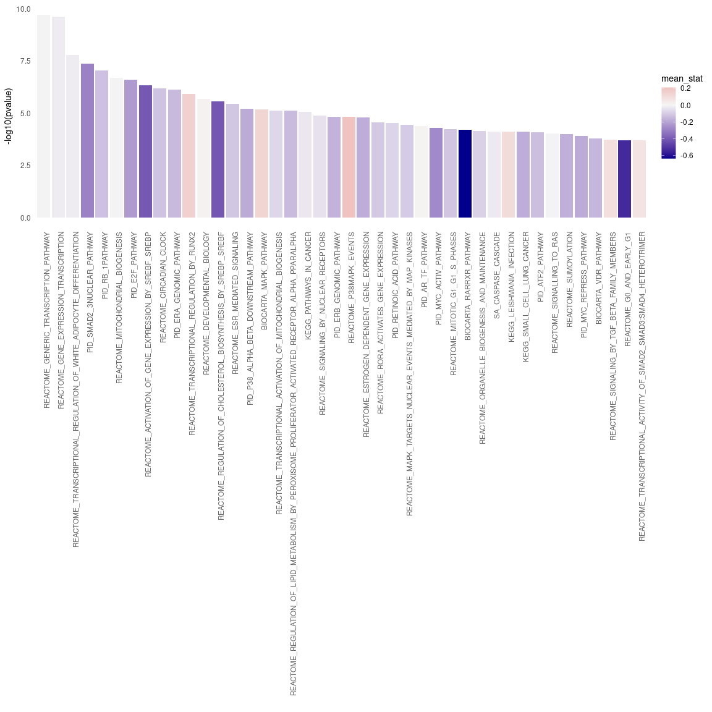

Analysis of CARNIVAL results
================
Alberto Valdeolivas: <alberto.valdeolivas@bioquant.uni-heidelberg.de>;
Date:
16/07/2020

### License Info

This program is free software: you can redistribute it and/or modify it
under the terms of the GNU General Public License as published by the
Free Software Foundation, either version 3 of the License, or (at your
option) any later version.

This program is distributed in the hope that it will be useful, but
WITHOUT ANY WARRANTY; without even the implied warranty of
MERCHANTABILITY or FITNESS FOR A PARTICULAR PURPOSE. See the GNU General
Public License for more details.

Please check <http://www.gnu.org/licenses/>.

## Introduction

The present script takes the CARNIVAL results inferred from
transcriptomics data from intestinal organoids treated with Sars-CoV-2
for 60 hours and makes some enrichment analysis and clustering.

The original transcriptomic dataset is coming from the following
publication: [Lamers et
al. 2020](https://science.sciencemag.org/content/369/6499/50).

The differential expression analysis was conducted by Martina Poletti
(<Martina.Poletti@earlham.ac.uk>)

## Getting Ready

### Libraries and functions

We first load the required libraries and some important functions to
analyse CARNiVAL output.

``` r
library(readr)
library(fgsea)
library(dplyr)
library(ggplot2)
library(piano)
library(tidyr)
library(ggsci)
library(igraph)
library(gprofiler2)
library(plotly)

## Function to extract the nodes that appear in CARNIVAL network and the 
## background genes (all genes present in the prior knowledge network).
## It returns a list with two objects: the success and the background genes.
extractCARNIVALnodes <- function(CarnivalResults){

    CarnivalNetwork <- 
        as.data.frame(CarnivalResults$weightedSIF, stringsAsFactors = FALSE)
    
    colnames(CarnivalNetwork) <- c("source", "sign", "target", "Weight")

    ## We define the set of nodes interesting for our condition
    sucesses <- unique(c(gsub("_.*","",CarnivalNetwork$source), 
        gsub("_.*","",CarnivalNetwork$target)))

    CarnivalAttributes <- as.data.frame(CarnivalResults$nodesAttributes, 
        stringsAsFactors = FALSE)

    ## We define the background as all the genes in our prior knowledge network.
    bg <- unique(gsub("_.*","",CarnivalAttributes$Node))     
    
    return(list(sucesses = sucesses, bg= bg))
}

### Function to print a barplot with the enriched pathways.
BarplotEnrichment <- function(PathwaysSelect, Interesting_pathways){ 
    
    p <- ggplot(PathwaysSelect, aes(x = reorder(pathway, pvalue), 
            y = -log10(pvalue))) + 
        geom_bar(aes(fill = mean_stat), stat = "identity") +
        scale_fill_gradient2(low = "darkblue", high = "indianred", 
            mid = "whitesmoke", midpoint = 0) + 
        theme_minimal() +
        theme(axis.text.x = element_text(angle = 90, hjust = 1, 
            colour = ifelse(levels(reorder(PathwaysSelect$pathway, 
                PathwaysSelect$pvalue)) %in% Interesting_pathways, 
                "red", "grey40"),
            face = ifelse(levels(reorder(PathwaysSelect$pathway, 
                PathwaysSelect$pvalue)) %in% Interesting_pathways, 
                "bold", "plain")),
        panel.grid.major = element_blank(), 
        panel.grid.minor = element_blank()) + 
        xlab("")
    return(p)
}    
```

### Reading CARNIVAL results

We then read the CARNIVAL results generated in the previous script. We
define two different gene sets in order tor conduct the enrichment. The
first set contains the nodes that appear in the CARNIVAL output and are
therefore relevant in the context of our input transcriptomic data. The
second set contains all the genes in our prior knowledge network which
are used as the backgroud.

``` r
carnival_results_inhibition <- 
    readRDS("Carnival_Results/carnival_results_top50tf_pleitropic_minsize15.rds")
nodes_carnival_inhibition <- extractCARNIVALnodes(carnival_results_inhibition)

carnival_results_activation <- 
    readRDS("Carnival_Results/carnival_results_top50tf_pleitropic_minsize15_activation.rds")
nodes_carnival_activation <- extractCARNIVALnodes(carnival_results_activation)

carnival_results_undefined <- 
    readRDS("Carnival_Results/carnival_results_top50tf_pleitropic_minsize15_undefinedEffect.rds")
nodes_carnival_undefined <- extractCARNIVALnodes(carnival_results_undefined)
```

### Reading Pathway data sets from MSigDB

We downloaded from MSigDB <https://www.gsea-msigdb.org/> the following
dataset: c2.cp.v7.0.symbols.gmt. It contains several pathways from
different resources and the genes that are known to be involved in those
pathways.

``` r
Pathway_signatures <- loadGSC("InputData/c2.cp.v7.0.symbols.gmt")
```

### Reading and formatting statistic from DEG

We read the results from the differential expression analysis. The
statistic of the genes will be mapped later on in the different
significant pathways. Maybe, this is not very informative in this
context. I am going to also check with the Average node activity from
CARNIVAL.

``` r
DEA_results <- read_csv("InputData/Clevers_degs_all.csv") %>%
   dplyr::select(Gene, stat)
```

    ## Parsed with column specification:
    ## cols(
    ##   Gene = col_character(),
    ##   baseMean = col_double(),
    ##   log2FoldChange = col_double(),
    ##   lfcSE = col_double(),
    ##   stat = col_double(),
    ##   pvalue = col_double(),
    ##   padj = col_double()
    ## )

``` r
mean_stat <- unlist(lapply(Pathway_signatures$gsc, function(x, DEA_results) {
    genes_matching <- x[which(x %in% DEA_results$Gene)]
    mean_genes <- dplyr::filter(DEA_results, Gene %in% genes_matching) %>%
        dplyr::pull(stat) %>% mean(na.rm = TRUE)
    return(mean_genes)
}, DEA_results = DEA_results)) %>% 
    as.data.frame() %>% 
    tibble::rownames_to_column(var = "pathway") %>%
    dplyr::rename(mean_stat = ".")

### Trying with Carnival node activity
carnival_avg_node_act <- carnival_results_inhibition$nodesAttributes %>% 
    as.data.frame() %>%
    dplyr::mutate(AvgAct = as.numeric(AvgAct))

mean_stat_carni <- 
    unlist(lapply(Pathway_signatures$gsc, function(x, carnival_avg_node_act) {
    genes_matching <- x[which(x %in% carnival_avg_node_act$Node)]
    mean_genes <- dplyr::filter(carnival_avg_node_act, Node %in% genes_matching) %>%
        dplyr::pull(AvgAct) %>% mean(na.rm = TRUE)
    return(mean_genes)
}, carnival_avg_node_act = carnival_avg_node_act)) %>% 
    as.data.frame() %>% 
    tibble::rownames_to_column(var = "pathway") %>%
    dplyr::rename(mean_stat = ".")
```

### Performing Enrichment Analysis and plotting the Results

Using the Piano R package, we run a gene set analysis (GSA) based on a
list of significant genes (CARNIVAL nodes) and a gene set collection
(background). It uses Fisher’s exact test.

First for CARNIVAL results when we assume that the viral-host proteins
interactions are inhibitory:

``` r
hyper_results_inhibition <- 
    runGSAhyper(genes = nodes_carnival_inhibition$sucesses, 
        # pvalues = rep(0,length(nodes_carnival_inhibition$sucesses)),
        pcutoff = 0.01, 
        universe = nodes_carnival_inhibition$bg, gsc = Pathway_signatures,
        gsSizeLim = c(4,Inf), adjMethod = "fdr")
```

    ## Warning in runGSAhyper(genes = nodes_carnival_inhibition$sucesses, pcutoff
    ## = 0.01, : there are genes in gsc that are not in the universe, these will be
    ## removed before analysis

    ## Analyzing the overrepresentation of 85 genes of interest in 2054 gene sets, using a background of 6811 non-interesting genes.

``` r
enriched_pathways_inhibition <- hyper_results_inhibition$resTab %>% 
    as.data.frame() %>% 
    tibble::rownames_to_column(var = "pathway") %>% 
    as_tibble() %>% 
    dplyr::filter(`Adjusted p-value` <= 0.01) %>% 
    dplyr::inner_join(mean_stat_carni) %>% 
    dplyr::select(pathway, `p-value`, `Adjusted p-value`, mean_stat) %>%
    dplyr::rename(pvalue = `p-value`, AdjPvalu = `Adjusted p-value`) %>% 
    dplyr::mutate(pathway = as.factor(pathway))
```

    ## Joining, by = "pathway"

``` r
interesting_pathways_inhibition <- c()

p_inhibition <- BarplotEnrichment(enriched_pathways_inhibition, 
    interesting_pathways_inhibition)
```

<!-- -->

Then, for CARNIVAL when we assume that the viral-host proteins
interactions are stimulations:

``` r
hyper_results_activation <- 
    runGSAhyper(genes = nodes_carnival_activation$sucesses, 
        # pvalues = rep(0,length(nodes_carnival_activation$sucesses)),
        pcutoff = 0.01, 
        universe = nodes_carnival_activation$bg, gsc = Pathway_signatures,
        gsSizeLim = c(4,Inf), adjMethod = "fdr")
```

    ## Warning in runGSAhyper(genes = nodes_carnival_activation$sucesses, pcutoff
    ## = 0.01, : there are genes in gsc that are not in the universe, these will be
    ## removed before analysis

    ## Analyzing the overrepresentation of 86 genes of interest in 2054 gene sets, using a background of 6810 non-interesting genes.

``` r
enriched_pathways_activation <- hyper_results_activation$resTab %>% 
    as.data.frame() %>% 
    tibble::rownames_to_column(var = "pathway") %>% 
    as_tibble() %>% 
    dplyr::filter(`Adjusted p-value` <= 0.01) %>% 
    dplyr::inner_join(mean_stat_carni) %>% 
    dplyr::select(pathway, `p-value`, `Adjusted p-value`, mean_stat) %>%
    dplyr::rename(pvalue = `p-value`, AdjPvalu = `Adjusted p-value`) %>% 
    dplyr::mutate(pathway = as.factor(pathway))
```

    ## Joining, by = "pathway"

``` r
interesting_pathways_activation <- c()

p_activation <- BarplotEnrichment(enriched_pathways_activation, 
    interesting_pathways_activation)
```

<!-- -->

### Comparing Enrichment between activation and inhibition

Now I compare the enriched pathways that change the most between both
assumptions: host-viral interactions are inhibitory or stimulatory.

``` r
results_activation <-   hyper_results_activation$resTab %>% 
    as.data.frame() %>% 
    tibble::rownames_to_column(var = "pathway") %>% 
    as_tibble() %>% 
    dplyr::mutate(LogpValue_activation = -log(`p-value`), 
        p_value_activation = `p-value`) %>% 
    dplyr::select(pathway, p_value_activation, LogpValue_activation) 

results_inhibition <-   hyper_results_inhibition$resTab %>% 
    as.data.frame() %>% 
    tibble::rownames_to_column(var = "pathway") %>% 
    as_tibble() %>% 
    dplyr::mutate(LogpValue_inhibition = -log(`p-value`), 
        p_value_inhibition = `p-value`) %>% 
    dplyr::select(pathway, p_value_inhibition, LogpValue_inhibition) 

results_join <- 
    dplyr::inner_join(results_activation, results_inhibition) %>% 
    dplyr::filter(p_value_activation < 0.05 | p_value_inhibition < 0.05) %>% 
    dplyr::mutate(diff = LogpValue_activation - LogpValue_inhibition) %>% 
    dplyr::top_n(15, wt = abs(diff)) %>% 
    dplyr::arrange(desc(abs(diff)))
```

    ## Joining, by = "pathway"

``` r
results_join_longer <- results_join %>% 
    dplyr::select(pathway, diff, LogpValue_activation, LogpValue_inhibition) %>% 
    dplyr::rename(activation = "LogpValue_activation", 
        inhibition = "LogpValue_inhibition") %>% 
    pivot_longer(-c(pathway,diff), values_to = "LogPvalue", 
        names_to = "Interaction")  
    
point_plot_activation_vs_inhibtion <- 
    ggplot(results_join_longer, aes(reorder(pathway, abs(diff)), LogPvalue)) + 
    geom_point(aes(color = Interaction), size = 3) + 
    coord_flip() + 
    theme_minimal() + 
    theme(legend.position = "bottom",  legend.justification = "center") +
    scale_color_lancet() +
    theme(axis.text.x = element_text(hjust = 1, size =8.5),
        axis.text.y = element_text(size = 7),
        panel.grid.minor = element_blank()) + 
    xlab("Pathways") + ylab("-Log (p-value)") +
    geom_hline(yintercept = -log(0.05), linetype="dashed", 
                color = "#2F4F4F", size=0.5)
```

``` r
point_plot_activation_vs_inhibtion
```

<!-- -->

### Clustering of CARNIVAL solution and enrichment.

We first convert our CARNIVAL output network into an igraph object.
Then, we perform different types of clustering and select the one with
the largest modularity for further analysis.

``` r
carnival_results_igraph <- carnival_results_undefined$weightedSIF %>%
    as.data.frame() %>% dplyr::select(-Sign) %>% 
    dplyr::rename(weight = "Weight") %>% 
    igraph::graph_from_data_frame(directed = FALSE)

c_edgeBetweeness <- 
    cluster_edge_betweenness(carnival_results_igraph)

c_FastGreedy <- 
    cluster_fast_greedy(carnival_results_igraph, 
    merges = TRUE, 
    modularity = TRUE, 
    membership = TRUE, 
    weights = E(carnival_results_igraph)$weight)

c_Infomap <- 
    cluster_infomap(carnival_results_igraph, 
    e.weights =  E(carnival_results_igraph)$weight, 
    v.weights = NULL, nb.trials = 10, modularity = TRUE)

c_labelProp <- 
    cluster_label_prop(carnival_results_igraph, 
    weights = E(carnival_results_igraph)$weight)

c_leadingEig <- 
    cluster_leading_eigen(carnival_results_igraph, 
    weights = E(carnival_results_igraph)$weight)

c_Louvain<- 
    cluster_louvain(carnival_results_igraph, 
    weights = E(carnival_results_igraph)$weight)

c_walktrap <- 
    cluster_walktrap(carnival_results_igraph, 
    weights = E(carnival_results_igraph)$weight, 
    steps = 4, merges = TRUE, modularity = TRUE, membership = TRUE)

modularity_df <- data.frame(method = c("EdgeBetweeness", "FastGreedy", 
    "Infomap","LabelPropagation","LeadingEigenvector", "Louvain","Walktrap"), 
    modularity = c(max(c_edgeBetweeness$modularity), 
                   max(c_FastGreedy$modularity), 
                   max(c_Infomap$modularity), 
                   max(c_labelProp$modularity),
                   max(c_leadingEig$modularity),
                   max(c_Louvain$modularity),
                   max(c_walktrap$modularity))) %>% 
    dplyr::arrange(desc(modularity))
modularity_df
```

    ##               method modularity
    ## 1         FastGreedy  0.6792753
    ## 2            Louvain  0.6736467
    ## 3   LabelPropagation  0.6441656
    ## 4            Infomap  0.6436640
    ## 5 LeadingEigenvector  0.6427823
    ## 6     EdgeBetweeness  0.6185302
    ## 7           Walktrap  0.6021636

``` r
# karate <- make_graph("Zachary")
# wc <- cluster_walktrap(karate)
# modularity(wc)
# membership(wc)
# plot(wc, karate)
```

We then selected the communities generated by the Fast Greedy method. We
will perform enrichment analysis on them.

``` r
## Number of genes in the different communities. 
table(c_FastGreedy$membership)
```

    ## 
    ##  1  2  3  4  5  6  7  8  9 10 11 12 13 
    ## 16 16 26 15 14 15 13  5  6  5  4  3  3

``` r
## We perform an Enrichment Analysis for each Community: 
n <- length(unique(c_FastGreedy$membership))
gene_communities <- 
    data.frame(Gene = c_FastGreedy$names, Community = c_FastGreedy$membership)
p <- list()

for (i in seq_len(n)){
    current_genes <- dplyr::filter(gene_communities, Community==i) %>%
        dplyr::pull(Gene)
    current_result <- gost(current_genes, user_threshold = 0.01, 
        correction_method = "fdr", custom_bg = nodes_carnival_undefined$bg,
        sources = c("GO","KEGG","REAC","WP")) 
    if (!is.null(current_result)){
        p[[i]] <- gostplot(current_result, capped = FALSE, interactive = TRUE)
    }
}
```

``` r
p[[1]]
```

<!--html_preserve-->

<div id="htmlwidget-454adeaaca99a453a96d" class="plotly html-widget" style="width:672px;height:480px;">

</div>

<script type="application/json" data-for="htmlwidget-454adeaaca99a453a96d">{"x":{"data":[{"x":[97.6540424756591,117.346191100967,117.48801428156,117.516378917678,83.1916236347103,84.9573222330904,163.091258001168,160.467529160202,145.28890325726,124.965641478314,75.8806386751524,119.321078890721,77.7810692950957,138.495572906865,156.290836491744,85.1877849015536,103.855261047078,103.841078729019,81.2238270039854,82.0464014514235,103.872988944653,124.728087650821,89.6268504541077,91.9811152519479,84.1063831495337,156.297927650774,97.6434057371146,85.1062365727128,84.3723016131452,113.116314739787],"y":[3.15083052202543,3.15083052202543,3.15083052202543,3.15083052202543,3.15083052202543,3.15083052202543,3.15083052202543,3.15083052202543,3.15083052202543,3.04364434236726,2.81937365982014,2.72332546657243,2.68794356608198,2.62200692520048,2.57263361550323,2.57263361550323,2.56432891434261,2.46205166973791,2.3986469452975,2.30795035222597,2.24597591128369,2.24569120387301,2.2310601187204,2.22482261412425,2.13143715557201,2.12932768530736,2.11822982458344,2.11822982458344,2.07618091996984,2.05587238169009],"text":["GO:0031328 (1370) <br> positive regulation of cellular biosynthetic process <br> 7.066e-04","GO:0045893 (1076) <br> positive regulation of transcription, DNA-templated <br> 7.066e-04","GO:0045935 (1281) <br> positive regulation of nucleobase-containing compound metabolic process <br> 7.066e-04","GO:0045944 (859) <br> positive regulation of transcription by RNA polymerase II <br> 7.066e-04","GO:0009891 (1386) <br> positive regulation of biosynthetic process <br> 7.066e-04","GO:0010557 (1307) <br> positive regulation of macromolecule biosynthetic process <br> 7.066e-04","GO:1903508 (1133) <br> positive regulation of nucleic acid-templated transcription <br> 7.066e-04","GO:1902680 (1133) <br> positive regulation of RNA biosynthetic process <br> 7.066e-04","GO:0090304 (2586) <br> nucleic acid metabolic process <br> 7.066e-04","GO:0051254 (1173) <br> positive regulation of RNA metabolic process <br> 9.044e-04","GO:0006139 (2778) <br> nucleobase-containing compound metabolic process <br> 1.516e-03","GO:0046483 (2838) <br> heterocycle metabolic process <br> 1.891e-03","GO:0006725 (2870) <br> cellular aromatic compound metabolic process <br> 2.051e-03","GO:0071480 (25) <br> cellular response to gamma radiation <br> 2.388e-03","GO:1901360 (2966) <br> organic cyclic compound metabolic process <br> 2.675e-03","GO:0010628 (1363) <br> positive regulation of gene expression <br> 2.675e-03","GO:0034645 (2485) <br> cellular macromolecule biosynthetic process <br> 2.727e-03","GO:0034641 (3044) <br> cellular nitrogen compound metabolic process <br> 3.451e-03","GO:0009059 (2581) <br> macromolecule biosynthetic process <br> 3.993e-03","GO:0009314 (336) <br> response to radiation <br> 4.921e-03","GO:0034654 (2237) <br> nucleobase-containing compound biosynthetic process <br> 5.676e-03","GO:0051173 (2246) <br> positive regulation of nitrogen compound metabolic process <br> 5.679e-03","GO:0018130 (2261) <br> heterocycle biosynthetic process <br> 5.874e-03","GO:0019438 (2272) <br> aromatic compound biosynthetic process <br> 5.959e-03","GO:0010212 (118) <br> response to ionizing radiation <br> 7.389e-03","GO:1901362 (2331) <br> organic cyclic compound biosynthetic process <br> 7.425e-03","GO:0031325 (2351) <br> positive regulation of cellular metabolic process <br> 7.617e-03","GO:0010604 (2349) <br> positive regulation of macromolecule metabolic process <br> 7.617e-03","GO:0010332 (48) <br> response to gamma radiation <br> 8.391e-03","GO:0043970 (9) <br> histone H3-K9 acetylation <br> 8.793e-03"],"key":["GO:0031328","GO:0045893","GO:0045935","GO:0045944","GO:0009891","GO:0010557","GO:1903508","GO:1902680","GO:0090304","GO:0051254","GO:0006139","GO:0046483","GO:0006725","GO:0071480","GO:1901360","GO:0010628","GO:0034645","GO:0034641","GO:0009059","GO:0009314","GO:0034654","GO:0051173","GO:0018130","GO:0019438","GO:0010212","GO:1901362","GO:0031325","GO:0010604","GO:0010332","GO:0043970"],"type":"scatter","mode":"markers","marker":{"autocolorscale":false,"color":"rgba(255,153,0,1)","opacity":0.8,"size":[20.7967508034131,20.3923156811561,20.685262280693,20.0061313625006,20.8159490868851,20.7186903148685,20.479561471916,20.479561471916,21.8171776209387,20.5379488158429,21.9286145068428,21.9617306849234,21.9790833915444,11.7892933939482,22.029908545074,20.7882740568421,21.7548893738866,22.0699073746755,21.8141567063451,18.28646150946,21.5894643533189,21.5958101326968,21.6063251606055,21.6139880315423,16.08934583854,21.6544114742956,21.6678621773207,21.6665227200288,13.8237201791417,6.35476068515554],"symbol":"circle","line":{"width":1.88976377952756,"color":"rgba(255,153,0,1)"}},"hoveron":"points","set":"SharedDataac447074","name":"GO:BP","legendgroup":"GO:BP","showlegend":true,"xaxis":"x","yaxis":"y","hoverinfo":"text","_isNestedKey":false,"frame":null},{"x":[53.9741333530773,49.9136644552616,58.481431142705,56.3997759086283,53.9528557868005,50.0413298529222,49.8533780174774,48.9632664948995,48.9029800571153,60.208460272169,49.952673326769,57.4069140457285,62.939081277687,49.1476720692981,58.2154615642455,63.0312840648863,56.3926833865361],"y":[5.10340834028713,4.64682675553111,4.54040862191054,4.54040862191054,4.54040862191054,3.71239931439543,3.67151594178268,3.0493208694242,2.8805501741606,2.74137667893418,2.61567878813703,2.57392730443405,2.36767452206125,2.36767452206125,2.28842172088498,2.17291752406444,2.09373137361839],"text":["GO:0031981 (2473) <br> nuclear lumen <br> 7.881e-06","GO:0005654 (2208) <br> nucleoplasm <br> 2.255e-05","GO:0070013 (2964) <br> intracellular organelle lumen <br> 2.881e-05","GO:0043233 (2964) <br> organelle lumen <br> 2.881e-05","GO:0031974 (2964) <br> membrane-enclosed lumen <br> 2.881e-05","GO:0005694 (972) <br> chromosome <br> 1.939e-04","GO:0005634 (3429) <br> nucleus <br> 2.131e-04","GO:0000307 (35) <br> cyclin-dependent protein kinase holoenzyme complex <br> 8.926e-04","GO:0000228 (748) <br> nuclear chromosome <br> 1.317e-03","GO:0090575 (126) <br> RNA polymerase II transcription factor complex <br> 1.814e-03","GO:0005667 (263) <br> transcription factor complex <br> 2.423e-03","GO:0044798 (146) <br> nuclear transcription factor complex <br> 2.667e-03","GO:1902554 (71) <br> serine/threonine protein kinase complex <br> 4.289e-03","GO:0000785 (700) <br> chromatin <br> 4.289e-03","GO:0061695 (184) <br> transferase complex, transferring phosphorus-containing groups <br> 5.147e-03","GO:1902911 (87) <br> protein kinase complex <br> 6.716e-03","GO:0043231 (4546) <br> intracellular membrane-bounded organelle <br> 8.059e-03"],"key":["GO:0031981","GO:0005654","GO:0070013","GO:0043233","GO:0031974","GO:0005694","GO:0005634","GO:0000307","GO:0000228","GO:0090575","GO:0005667","GO:0044798","GO:1902554","GO:0000785","GO:0061695","GO:1902911","GO:0043231"],"type":"scatter","mode":"markers","marker":{"autocolorscale":false,"color":"rgba(16,150,24,1)","opacity":0.8,"size":[21.7473063940351,21.5688261409375,22.028867987483,22.028867987483,22.028867987483,20.2191530048176,22.2523118547381,12.8955335967564,19.7642676453923,16.2384645093242,17.8030333178372,16.5670328992804,14.8668263833707,19.6470286235531,17.0665656647035,15.3713803357045,22.6771653543307],"symbol":"circle","line":{"width":1.88976377952756,"color":"rgba(16,150,24,1)"}},"hoveron":"points","set":"SharedDataac447074","name":"GO:CC","legendgroup":"GO:CC","showlegend":true,"xaxis":"x","yaxis":"y","hoverinfo":"text","_isNestedKey":false,"frame":null},{"x":[2.76588313063071,14.8533627247052,43.7229018432016,3.475034177511,2.46449393570659,37.4610980992487,27.323783884095,37.3795457288575,2.91125909524117,43.6307122071072,2.87934729813156,3.54594928219902,3.47148842227659,2.67014773930187,26.5153516906515,9.15533406302209],"y":[2.75506080124182,2.63648267773087,2.63648267773087,2.63648267773087,2.39318758176547,2.39318758176547,2.39318758176547,2.39318758176547,2.39318758176547,2.39318758176547,2.39318758176547,2.39318758176547,2.39318758176547,2.39318758176547,2.29637698980539,2.28622826381737],"text":["GO:0001103 (21) <br> RNA polymerase II repressing transcription factor binding <br> 1.758e-03","GO:0016538 (36) <br> cyclin-dependent protein serine/threonine kinase regulator activity <br> 2.309e-03","GO:0140110 (931) <br> transcription regulator activity <br> 2.309e-03","GO:0003677 (1175) <br> DNA binding <br> 2.309e-03","GO:0000981 (584) <br> DNA-binding transcription factor activity, RNA polymerase II-specific <br> 4.044e-03","GO:0070577 (12) <br> lysine-acetylated histone binding <br> 4.044e-03","GO:0044212 (617) <br> transcription regulatory region DNA binding <br> 4.044e-03","GO:0070491 (52) <br> repressing transcription factor binding <br> 4.044e-03","GO:0001228 (296) <br> DNA-binding transcription activator activity, RNA polymerase II-specific <br> 4.044e-03","GO:0140033 (12) <br> acetylation-dependent protein binding <br> 4.044e-03","GO:0001216 (298) <br> DNA-binding transcription activator activity <br> 4.044e-03","GO:0003700 (654) <br> DNA-binding transcription factor activity <br> 4.044e-03","GO:0003676 (1780) <br> nucleic acid binding <br> 4.044e-03","GO:0001067 (618) <br> regulatory region nucleic acid binding <br> 4.044e-03","GO:0043565 (707) <br> sequence-specific DNA binding <br> 5.054e-03","GO:0008134 (504) <br> transcription factor binding <br> 5.173e-03"],"key":["GO:0001103","GO:0016538","GO:0140110","GO:0003677","GO:0000981","GO:0070577","GO:0044212","GO:0070491","GO:0001228","GO:0140033","GO:0001216","GO:0003700","GO:0003676","GO:0001067","GO:0043565","GO:0008134"],"type":"scatter","mode":"markers","marker":{"autocolorscale":false,"color":"rgba(220,57,18,1)","opacity":0.8,"size":[11.151047384802,12.9821217424243,20.1451841566077,20.5408104373041,19.3222495496302,8.55759111444933,19.4214969561027,14.0456195744344,18.0383606837378,8.55759111444933,18.051650201566,19.5259665621791,21.224492417907,19.4244113725252,19.664673066391,19.0530675541184],"symbol":"circle","line":{"width":1.88976377952756,"color":"rgba(220,57,18,1)"}},"hoveron":"points","set":"SharedDataac447074","name":"GO:MF","legendgroup":"GO:MF","showlegend":true,"xaxis":"x","yaxis":"y","hoverinfo":"text","_isNestedKey":false,"frame":null},{"x":[182.239991628598,182.264856009363,181.607725946299,182.261303954968,182.250647791783],"y":[3.7554827358525,3.20949337104643,2.497035528258,2.19702198821343,2.12295232229782],"text":["KEGG:05166 (190) <br> Human T-cell leukemia virus 1 infection <br> 1.756e-04","KEGG:05203 (153) <br> Viral carcinogenesis <br> 6.173e-04","KEGG:04110 (121) <br> Cell cycle <br> 3.184e-03","KEGG:05202 (156) <br> Transcriptional misregulation in cancer <br> 6.353e-03","KEGG:05169 (173) <br> Epstein-Barr virus infection <br> 7.534e-03"],"key":["KEGG:05166","KEGG:05203","KEGG:04110","KEGG:05202","KEGG:05169"],"type":"scatter","mode":"markers","marker":{"autocolorscale":false,"color":"rgba(221,68,119,1)","opacity":0.8,"size":[17.1343816687948,16.6697234366746,16.1466301304433,16.7120638003586,16.9353049929468],"symbol":"circle","line":{"width":1.88976377952756,"color":"rgba(221,68,119,1)"}},"hoveron":"points","set":"SharedDataac447074","name":"KEGG","legendgroup":"KEGG","showlegend":true,"xaxis":"x","yaxis":"y","hoverinfo":"text","_isNestedKey":false,"frame":null},{"x":[191.940079966452,189.354324807968,189.361418786455],"y":[2.49374385991568,2.43113644521253,2.2712365587589],"text":["REAC:R-HSA-73857 (774) <br> RNA Polymerase II Transcription <br> 3.208e-03","REAC:R-HSA-74160 (857) <br> Gene expression (Transcription) <br> 3.706e-03","REAC:R-HSA-212436 (711) <br> Generic Transcription Pathway <br> 5.355e-03"],"key":["REAC:R-HSA-73857","REAC:R-HSA-74160","REAC:R-HSA-212436"],"type":"scatter","mode":"markers","marker":{"autocolorscale":false,"color":"rgba(51,102,204,1)","opacity":0.8,"size":[19.824333894178,20.0020866303775,19.6746686338834],"symbol":"circle","line":{"width":1.88976377952756,"color":"rgba(51,102,204,1)"}},"hoveron":"points","set":"SharedDataac447074","name":"REAC","legendgroup":"REAC","showlegend":true,"xaxis":"x","yaxis":"y","hoverinfo":"text","_isNestedKey":false,"frame":null},{"x":[198.259641384224,198.426573139344,199.243473217594,198.696505339114],"y":[2.13815742801334,2.13815742801334,2.13815742801334,2.13815742801334],"text":["WP:WP1991 (10) <br> SRF and miRs in Smooth Muscle Differentiation and Proliferation <br> 7.275e-03","WP:WP3611 (50) <br> Photodynamic therapy-induced AP-1 survival signaling. <br> 7.275e-03","WP:WP179 (117) <br> Cell Cycle <br> 7.275e-03","WP:WP3875 (8) <br> ATR Signaling <br> 7.275e-03"],"key":["WP:WP1991","WP:WP3611","WP:WP179","WP:WP3875"],"type":"scatter","mode":"markers","marker":{"autocolorscale":false,"color":"rgba(0,153,198,1)","opacity":0.8,"size":[7.32412850308346,13.9374951586701,16.0698663642715,3.77952755905512],"symbol":"circle","line":{"width":1.88976377952756,"color":"rgba(0,153,198,1)"}},"hoveron":"points","set":"SharedDataac447074","name":"WP","legendgroup":"WP","showlegend":true,"xaxis":"x","yaxis":"y","hoverinfo":"text","_isNestedKey":false,"frame":null},{"x":[2,45.2121190416503],"y":[-1,-1],"text":"","type":"scatter","mode":"lines","line":{"width":11.3385826771654,"color":"rgba(220,57,18,1)","dash":"solid"},"hoveron":"points","showlegend":false,"xaxis":"x","yaxis":"y","hoverinfo":"text","frame":null},{"x":[48.7575833542241,64.5384450094904],"y":[-1,-1],"text":"","type":"scatter","mode":"lines","line":{"width":11.3385826771654,"color":"rgba(16,150,24,1)","dash":"solid"},"hoveron":"points","showlegend":false,"xaxis":"x","yaxis":"y","hoverinfo":"text","frame":null},{"x":[68.0839093220642,177.20266447015],"y":[-1,-1],"text":"","type":"scatter","mode":"lines","line":{"width":11.3385826771654,"color":"rgba(255,153,0,1)","dash":"solid"},"hoveron":"points","showlegend":false,"xaxis":"x","yaxis":"y","hoverinfo":"text","frame":null},{"x":[180.748128782724,182.659134047201],"y":[-1,-1],"text":"","type":"scatter","mode":"lines","line":{"width":11.3385826771654,"color":"rgba(221,68,119,1)","dash":"solid"},"hoveron":"points","showlegend":false,"xaxis":"x","yaxis":"y","hoverinfo":"text","frame":null},{"x":[186.204598359775,194.451348350822],"y":[-1,-1],"text":"","type":"scatter","mode":"lines","line":{"width":11.3385826771654,"color":"rgba(51,102,204,1)","dash":"solid"},"hoveron":"points","showlegend":false,"xaxis":"x","yaxis":"y","hoverinfo":"text","frame":null},{"x":[197.996812663396,200.003545464313],"y":[-1,-1],"text":"","type":"scatter","mode":"lines","line":{"width":11.3385826771654,"color":"rgba(0,153,198,1)","dash":"solid"},"hoveron":"points","showlegend":false,"xaxis":"x","yaxis":"y","hoverinfo":"text","frame":null}],"layout":{"margin":{"t":29.2835201328352,"r":6.6417600664176,"b":55.8781661388202,"l":66.8825238688253},"plot_bgcolor":"rgba(255,255,255,1)","paper_bgcolor":"rgba(255,255,255,1)","font":{"color":"rgba(0,0,0,1)","family":"","size":14.6118721461187},"xaxis":{"domain":[0,1],"automargin":true,"type":"linear","autorange":false,"range":[0,210],"tickmode":"array","ticktext":["GO:MF","GO:CC","GO:BP","KEGG","REAC","WP"],"tickvals":[23.6060595208251,56.6480141818573,122.643286896107,181.703631414963,190.327973355299,199.000179063854],"categoryorder":"array","categoryarray":["GO:MF","GO:CC","GO:BP","KEGG","REAC","WP"],"nticks":null,"ticks":"","tickcolor":null,"ticklen":3.65296803652968,"tickwidth":0,"showticklabels":true,"tickfont":{"color":"rgba(77,77,77,1)","family":"","size":10.6268161062682},"tickangle":-45,"showline":true,"linecolor":"rgba(190,190,190,1)","linewidth":0.132835201328352,"showgrid":false,"gridcolor":null,"gridwidth":0,"zeroline":false,"anchor":"y","title":"","hoverformat":".2f"},"yaxis":{"domain":[0,1],"automargin":true,"type":"linear","autorange":false,"range":[-1,11],"tickmode":"array","ticktext":["0.0","2.5","5.0","7.5","10.0"],"tickvals":[0,2.5,5,7.5,10],"categoryorder":"array","categoryarray":["0.0","2.5","5.0","7.5","10.0"],"nticks":null,"ticks":"outside","tickcolor":"rgba(190,190,190,1)","ticklen":3.65296803652968,"tickwidth":0.66417600664176,"showticklabels":true,"tickfont":{"color":"rgba(77,77,77,1)","family":"","size":11.689497716895},"tickangle":-0,"showline":true,"linecolor":"rgba(190,190,190,1)","linewidth":0.66417600664176,"showgrid":false,"gridcolor":null,"gridwidth":0,"zeroline":false,"anchor":"x","title":"","hoverformat":".2f"},"annotations":[{"text":"-log10(p-adj)","x":-0.0375822807329657,"y":0.5,"showarrow":false,"ax":0,"ay":0,"font":{"color":"rgba(0,0,0,1)","family":"","size":13.2835201328352},"xref":"paper","yref":"paper","textangle":-90,"xanchor":"right","yanchor":"center","annotationType":"axis"},{"text":"query_1","x":0.5,"y":1,"showarrow":false,"ax":0,"ay":0,"font":{"color":"rgba(169,169,169,1)","family":"","size":13.2835201328352},"xref":"paper","yref":"paper","textangle":-0,"xanchor":"center","yanchor":"bottom"}],"shapes":[{"type":"rect","fillcolor":null,"line":{"color":null,"width":0,"linetype":[]},"yref":"paper","xref":"paper","x0":0,"x1":1,"y0":0,"y1":1},{"type":"rect","fillcolor":null,"line":{"color":null,"width":0,"linetype":[]},"yref":"paper","xref":"paper","x0":0,"x1":1,"y0":0,"y1":24.9730178497302,"yanchor":1,"ysizemode":"pixel"}],"showlegend":false,"legend":{"bgcolor":"rgba(255,255,255,1)","bordercolor":"transparent","borderwidth":1.88976377952756,"font":{"color":"rgba(0,0,0,1)","family":"","size":11.689497716895}},"hovermode":"closest","barmode":"relative","dragmode":"zoom"},"config":{"doubleClick":"reset","showSendToCloud":false},"source":"A","attrs":{"2df06313fb7a":{"colour":{},"size":{},"alpha":{},"key":{},"x":{},"y":{},"text":{},"type":"scatter"},"2df05d9e9673":{"x":{},"xend":{},"y":{},"yend":{}},"2df05bbaeaad":{"x":{},"xend":{},"y":{},"yend":{}},"2df068bb8645":{"x":{},"xend":{},"y":{},"yend":{}},"2df01a60bcf7":{"x":{},"xend":{},"y":{},"yend":{}},"2df03f95bb26":{"x":{},"xend":{},"y":{},"yend":{}},"2df056602d95":{"x":{},"xend":{},"y":{},"yend":{}}},"cur_data":"2df06313fb7a","visdat":{"2df06313fb7a":["function (y) ","x"],"2df05d9e9673":["function (y) ","x"],"2df05bbaeaad":["function (y) ","x"],"2df068bb8645":["function (y) ","x"],"2df01a60bcf7":["function (y) ","x"],"2df03f95bb26":["function (y) ","x"],"2df056602d95":["function (y) ","x"]},"highlight":{"on":"plotly_click","off":"plotly_doubleclick","persistent":false,"dynamic":false,"color":null,"selectize":false,"defaultValues":null,"opacityDim":0.2,"selected":{"opacity":1},"debounce":0,"ctGroups":["SharedDataac447074"]},"shinyEvents":["plotly_hover","plotly_click","plotly_selected","plotly_relayout","plotly_brushed","plotly_brushing","plotly_clickannotation","plotly_doubleclick","plotly_deselect","plotly_afterplot","plotly_sunburstclick"],"base_url":"https://plot.ly"},"evals":[],"jsHooks":[]}</script>

<!--/html_preserve-->

## Session Info Details

    ## R version 4.0.1 (2020-06-06)
    ## Platform: x86_64-pc-linux-gnu (64-bit)
    ## Running under: Ubuntu 19.10
    ## 
    ## Matrix products: default
    ## BLAS:   /usr/lib/x86_64-linux-gnu/openblas/libblas.so.3
    ## LAPACK: /usr/lib/x86_64-linux-gnu/libopenblasp-r0.3.7.so
    ## 
    ## locale:
    ##  [1] LC_CTYPE=en_GB.UTF-8       LC_NUMERIC=C              
    ##  [3] LC_TIME=en_GB.UTF-8        LC_COLLATE=en_GB.UTF-8    
    ##  [5] LC_MONETARY=en_GB.UTF-8    LC_MESSAGES=en_GB.UTF-8   
    ##  [7] LC_PAPER=en_GB.UTF-8       LC_NAME=C                 
    ##  [9] LC_ADDRESS=C               LC_TELEPHONE=C            
    ## [11] LC_MEASUREMENT=en_GB.UTF-8 LC_IDENTIFICATION=C       
    ## 
    ## attached base packages:
    ## [1] stats     graphics  grDevices utils     datasets  methods   base     
    ## 
    ## other attached packages:
    ##  [1] plotly_4.9.2.1   gprofiler2_0.1.9 igraph_1.2.5     ggsci_2.9       
    ##  [5] tidyr_1.1.0      piano_2.4.0      ggplot2_3.3.1    dplyr_1.0.0     
    ##  [9] fgsea_1.14.0     readr_1.3.1     
    ## 
    ## loaded via a namespace (and not attached):
    ##  [1] Biobase_2.48.0       httr_1.4.1           viridisLite_0.3.0   
    ##  [4] jsonlite_1.6.1       gtools_3.8.2         shiny_1.4.0.2       
    ##  [7] yaml_2.2.1           slam_0.1-47          pillar_1.4.4        
    ## [10] lattice_0.20-41      glue_1.4.1           limma_3.44.3        
    ## [13] digest_0.6.25        promises_1.1.1       colorspace_1.4-1    
    ## [16] htmltools_0.4.0      httpuv_1.5.4         Matrix_1.2-18       
    ## [19] pkgconfig_2.0.3      purrr_0.3.4          xtable_1.8-4        
    ## [22] relations_0.6-9      scales_1.1.1         gdata_2.18.0        
    ## [25] later_1.1.0.1        BiocParallel_1.22.0  tibble_3.0.1        
    ## [28] farver_2.0.3         generics_0.0.2       ellipsis_0.3.1      
    ## [31] DT_0.13              withr_2.2.0          shinyjs_1.1         
    ## [34] lazyeval_0.2.2       BiocGenerics_0.34.0  magrittr_1.5        
    ## [37] crayon_1.3.4         mime_0.9             evaluate_0.14       
    ## [40] gplots_3.0.3         Cairo_1.5-12         shinydashboard_0.7.1
    ## [43] tools_4.0.1          data.table_1.12.8    hms_0.5.3           
    ## [46] lifecycle_0.2.0      stringr_1.4.0        munsell_0.5.0       
    ## [49] cluster_2.1.0        compiler_4.0.1       caTools_1.18.0      
    ## [52] rlang_0.4.6          RCurl_1.98-1.2       grid_4.0.1          
    ## [55] marray_1.66.0        htmlwidgets_1.5.1    visNetwork_2.0.9    
    ## [58] crosstalk_1.1.0.1    labeling_0.3         bitops_1.0-6        
    ## [61] rmarkdown_2.2        gtable_0.3.0         sets_1.0-18         
    ## [64] R6_2.4.1             gridExtra_2.3        knitr_1.28          
    ## [67] fastmap_1.0.1        fastmatch_1.1-0      KernSmooth_2.23-17  
    ## [70] stringi_1.4.6        parallel_4.0.1       Rcpp_1.0.4.6        
    ## [73] vctrs_0.3.1          tidyselect_1.1.0     xfun_0.14
